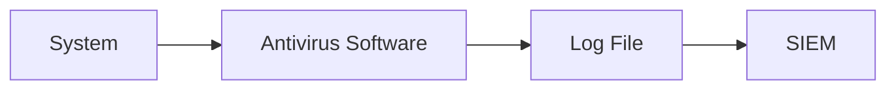
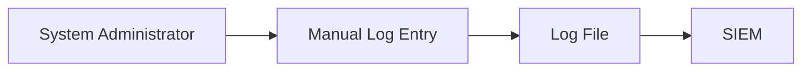

## Defining Key Security Events to Log and Monitor

### Importance of Logging and Monitoring

Logging and monitoring are critical components of a robust security infrastructure. They enable organizations to detect, respond to, and mitigate security incidents effectively. Without sufficient logging, it becomes nearly impossible to reconstruct the sequence of events during an attack, which is crucial for forensic analysis and incident response.

#### Why Logging Matters

Logs provide a detailed record of activities within a system, including user actions, system events, and application behavior. This data is essential for several reasons:

1. **Incident Response**: Logs help identify the root cause of security incidents and the steps taken by attackers.
2. **Compliance**: Many regulatory frameworks require organizations to maintain logs for audit purposes.
3. **Forensic Analysis**: Detailed logs are necessary for conducting thorough forensic investigations.
4. **Trend Analysis**: Logs can reveal patterns and trends that indicate potential vulnerabilities or ongoing threats.

### Protecting Logs from Tampering

One of the most significant challenges in maintaining effective logs is ensuring they remain intact and untampered. Attackers often attempt to cover their tracks by deleting or modifying logs, making it difficult to trace their actions.

#### How to Protect Logs

To safeguard logs against tampering, consider the following strategies:

1. **Read-Only Access**: Ensure that logs are stored in a read-only format to prevent unauthorized modifications.
2. **Immutable Storage**: Use immutable storage solutions that prevent log entries from being altered once written.
3. **Encryption**: Encrypt logs to protect sensitive information and ensure integrity.
4. **Regular Backups**: Maintain regular backups of logs in a secure location to prevent data loss due to accidental deletion or corruption.

#### Real-World Example: Equifax Breach

In the Equifax breach of 2017, attackers exploited a vulnerability in Apache Struts to gain access to the company's systems. One of the key issues was the lack of proper logging and monitoring, which allowed the attackers to move laterally through the network without being detected. This highlights the importance of comprehensive logging and monitoring practices.

### Sources of Log Information

There are numerous sources of log information, ranging from highly automated systems to manual processes. Understanding these sources is crucial for effective log management.

#### Automated Systems

Automated systems such as Host Intrusion Detection Systems (HIDS) and Antivirus Software generate logs automatically, providing real-time alerts and event records.

##### Host Intrusion Detection System (HIDS)

A HIDS monitors system activity and network traffic to detect suspicious behavior indicative of an intrusion. It generates logs that can be analyzed to identify potential security incidents.

```mermaid
graph LR
    A[Host] --> B[HIDS]
    B --> C[Log File]
    C --> D[Security Information and Event Management (SIEM)]
```

##### Antivirus Software

Antivirus software scans files and directories for malicious code and generates logs detailing its findings. These logs can be used to track the spread of malware and identify infected systems.



#### Manual Processes

Manual processes involve human intervention to generate logs, such as system administrators manually recording changes or security personnel documenting security-related events.

##### Manual Logging

System administrators often manually log changes made to critical systems, such as updates to configuration files or changes to user permissions. These logs can be invaluable during forensic investigations.



### Indicators of Compromise (IoCs)

Indicators of Compromise (IoCs) are specific pieces of evidence that suggest a system has been compromised. Identifying and tracking IoCs is crucial for detecting and responding to security incidents.

#### What Are IoCs?

IoCs can include various types of data, such as IP addresses, domain names, file hashes, and unusual system behavior. By monitoring these indicators, organizations can quickly identify potential security incidents.

##### Types of IoCs

1. **IP Addresses**: Known malicious IP addresses used by attackers.
2. **Domain Names**: Domains associated with phishing or malware distribution.
3. **File Hashes**: Hash values of known malicious files.
4. **Behavioral Patterns**: Unusual system behavior, such as unexpected network traffic or unauthorized access attempts.

#### Real-World Example: SolarWinds Supply Chain Attack

In the SolarWinds supply chain attack of 2020, attackers compromised the SolarWinds Orion software, which was then distributed to thousands of customers. IoCs included specific IP addresses and domain names used by the attackers. By monitoring these IoCs, affected organizations were able to detect and respond to the attack.

### How to Detect and Respond to IoCs

Detecting and responding to IoCs requires a combination of automated tools and manual processes. Security Information and Event Management (SIEM) systems play a crucial role in this process.

#### Security Information and Event Management (SIEM)

SIEM systems collect and analyze log data from various sources to identify potential security incidents. They can correlate events across multiple systems and generate alerts based on predefined rules.

##### SIEM Configuration Example

Here is an example of configuring a SIEM system to detect IoCs:

```json
{
  "rules": [
    {
      "name": "Suspicious IP Address",
      "description": "Alert on traffic from known malicious IP address",
      "condition": "source_ip == '192.168.1.1'",
      "action": "generate_alert"
    },
    {
      "name": "Malicious Domain",
      "description": "Alert on DNS queries to known malicious domain",
      "condition": "dns_query == 'maliciousdomain.com'",
      "action": "generate_alert"
    }
  ]
}
```

#### Real-Time Monitoring

Real-time monitoring involves continuously analyzing log data to detect IoCs as they occur. This can be achieved using tools like SIEM systems or custom scripts.

##### Real-Time Monitoring Script Example

Here is an example of a Python script that monitors log files for IoCs:

```python
import re

# Define IoCs
ip_ioc = '192.168.1.1'
domain_ioc = 'maliciousdomain.com'

# Function to check for IoCs in log line
def check_iocs(log_line):
    if re.search(ip_ioc, log_line):
        print(f"Suspicious IP Address Detected: {log_line}")
    elif re.search(domain_ioc, log_line):
        print(f"Suspicious Domain Detected: {log_line}")

# Monitor log file
with open('/var/log/syslog', 'r') as f:
    for line in f:
        check_iocs(line)
```

### How to Prevent and Defend Against IoCs

Preventing and defending against IoCs involves a combination of proactive measures and reactive responses. Here are some strategies to consider:

#### Proactive Measures

1. **Patch Management**: Regularly update systems and applications to patch known vulnerabilities.
2. **Network Segmentation**: Segment networks to limit the spread of attacks.
3. **User Education**: Educate users about phishing and other social engineering tactics.

#### Reactive Responses

1. **Incident Response Plan**: Develop and maintain an incident response plan to guide the organization's response to security incidents.
2. **Isolation**: Isolate compromised systems to prevent further damage.
3. **Remediation**: Remediate the underlying vulnerabilities that led to the compromise.

#### Secure Coding Practices

Secure coding practices can help prevent the introduction of vulnerabilities that can be exploited by attackers. Here is an example of a vulnerable code snippet and its secure counterpart:

##### Vulnerable Code

```python
import subprocess

def execute_command(command):
    subprocess.run(command, shell=True)
```

##### Secure Code

```python
import subprocess

def execute_command(command):
    subprocess.run(command.split(), check=True)
```

### Conclusion

Effective logging and monitoring are essential for detecting and responding to security incidents. By protecting logs from tampering, identifying IoCs, and implementing proactive and reactive measures, organizations can significantly enhance their security posture.

### Practice Labs

For hands-on practice with logging and monitoring, consider the following labs:

- **PortSwigger Web Security Academy**: Offers interactive labs on web security, including logging and monitoring.
- **OWASP Juice Shop**: A deliberately insecure web application for practicing security testing and logging.
- **DVWA (Damn Vulnerable Web Application)**: Another intentionally vulnerable web application for learning security concepts.

These labs provide practical experience in identifying and responding to security incidents through effective logging and monitoring practices.

---
<!-- nav -->
[[01-Introduction to Indicators of Compromise (IOCs)|Introduction to Indicators of Compromise (IOCs)]] | [[DevSecOps/DevSecOps Bootcamp/08-Logging & Incident Response/01-Defining Key Security Events to Log and Monitor/05-Indicators of Compromise IOC/00-Overview|Overview]] | [[03-Understanding Logs as the Cyber Crime Scene|Understanding Logs as the Cyber Crime Scene]]
