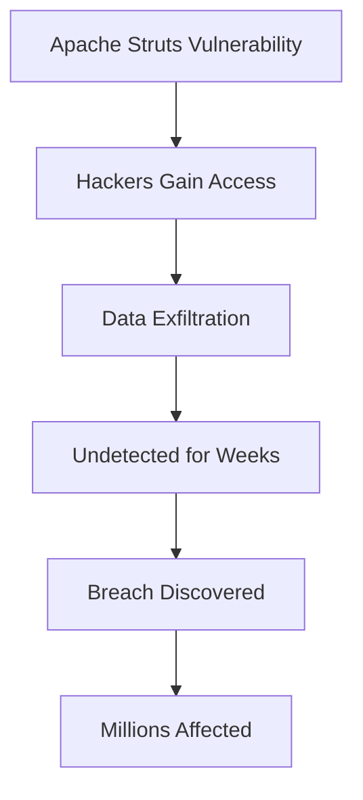

## Understanding Logs as the Cyber Crime Scene

When discussing incident response in the context of DevSecOps, one of the critical aspects is the role of logging and monitoring. Logs serve as the primary source of evidence in the event of a cyber attack, much like a physical crime scene serves as the evidence in traditional crimes. This section will delve into the importance of logs, their role in incident response, and how to effectively log and monitor key security events.

### Importance of Logging

Logs are records of events that occur within a system. They provide a detailed history of actions taken, errors encountered, and other significant occurrences. In the context of cybersecurity, logs are crucial because they can reveal patterns and anomalies that indicate potential security breaches or malicious activities.

#### Why Logs Matter

- **Evidence Collection**: Logs are the primary source of evidence for forensic analysis and legal proceedings. Without proper logging, it becomes extremely difficult to trace the steps of an attacker or to build a case against them.
- **Incident Response**: Logs enable rapid identification and response to security incidents. By analyzing logs, security teams can quickly identify the scope and impact of an attack, allowing for timely mitigation.
- **Compliance**: Many regulatory frameworks require organizations to maintain comprehensive logs for audit purposes. Failure to comply can result in severe penalties.

### Real-World Example: Equifax Data Breach

The Equifax data breach in 2017 is a prime example of the importance of logging and monitoring. Hackers exploited a vulnerability in Apache Struts, gaining access to sensitive personal information of millions of individuals. One of the reasons the breach went undetected for several weeks was due to inadequate logging and monitoring practices. Had Equifax maintained robust logging mechanisms, the breach could have been detected earlier, potentially reducing the scale of the damage.



### Key Security Events to Log

To effectively use logs as a crime scene, it is essential to log specific types of events that are indicative of security issues. These events are often referred to as Indicators of Compromise (IoCs).

#### Common IoCs

- **Failed Login Attempts**: Multiple failed login attempts from the same IP address can indicate a brute-force attack.
- **Unusual Network Traffic**: Unusual outbound traffic or connections to known malicious IPs can signal a compromised system.
- **File Changes**: Unauthorized changes to critical files or directories can indicate malware activity.
- **Process Creation**: Unexpected process creation, especially those resembling known malicious processes, can be a sign of an intrusion.
- **Registry Modifications**: Changes to the Windows registry, particularly in areas related to persistence mechanisms, can indicate a compromise.

### Example: Failed Login Attempts

Consider a scenario where an attacker is attempting to brute-force a user's password. The following is an example of a log entry indicating multiple failed login attempts:

```plaintext
2023-10-01T12:00:00Z | Failed login attempt for user 'admin' from IP 192.168.1.100
2023-10-01T12:01:00Z | Failed login attempt for user 'admin' from IP 192.168.1.100
2023-10-01T12:02:00Z | Failed login attempt for user 'admin' from IP 192.168.1.100
```

#### Detection and Prevention

**Detection**:
- **Log Analysis Tools**: Use tools like Splunk, ELK Stack (Elasticsearch, Logstash, Kibana), or Graylog to analyze logs for patterns indicative of security threats.
- **SIEM Solutions**: Security Information and Event Management (SIEM) systems can correlate events across multiple sources to identify potential threats.

**Prevention**:
- **Account Lockout Policies**: Implement policies that lock accounts after a certain number of failed login attempts.
- **Multi-Factor Authentication (MFA)**: Require users to provide additional authentication factors beyond just a password.

### Secure Coding Practices

To ensure that logs are both useful and secure, it is important to follow best practices in logging.

#### Vulnerable Code Example

Consider a simple web application that logs user input without proper validation:

```python
def login(username, password):
    # Log the username and password
    print(f"User {username} attempted to log in with password {password}")
    # Check credentials
    if check_credentials(username, password):
        return True
    else:
        return False
```

#### Secure Code Example

A more secure approach would involve logging only necessary information and ensuring that sensitive data is not logged:

```python
def login(username, password):
    # Log only the username and the fact that a login attempt was made
    print(f"User {username} attempted to log in")
    # Check credentials
    if check_credentials(username, password):
        return True
    else:
        return False
```

### Configuration Hardening

In addition to secure coding practices, it is important to harden the logging configuration to prevent unauthorized access to log files.

#### Example: Nginx Configuration

Here is an example of an Nginx configuration that ensures logs are securely stored:

```nginx
http {
    log_format main '$remote_addr - $remote_user [$time_local] "$request" '
                    '$status $body_bytes_sent "$http_referer" '
                    '"$http_user_agent" "$http_x_forwarded_for"';
    access_log /var/log/nginx/access.log main;
    error_log /var/log/nginx/error.log warn;

    server {
        listen 80;
        server_name example.com;

        location / {
            proxy_pass http://backend;
            proxy_set_header Host $host;
            proxy_set_header X-Real-IP $remote_addr;
        }
    }
}
```

#### Explanation of Headers

- **$remote_addr**: The IP address of the client making the request.
- **$remote_user**: The authenticated user making the request.
- **$time_local**: The time the request was received, in the local timezone.
- **$request**: The request line (method and URI).
- **$status**: The HTTP status code returned by the server.
- **$body_bytes_sent**: The number of bytes sent in the response body.
- **$http_referer**: The referring page.
- **$http_user_agent**: The user agent string.
- **$http_x_forwarded_for**: The IP address of the client, as provided by a proxy server.

### How to Prevent / Defend

#### Detection

- **Regular Audits**: Conduct regular audits of log files to identify unusual patterns.
- **Automated Alerts**: Set up automated alerts for suspicious activities, such as multiple failed login attempts.

#### Prevention

- **Secure Storage**: Ensure that log files are stored securely and are accessible only to authorized personnel.
- **Encryption**: Encrypt log files to protect sensitive information.
- **Retention Policies**: Implement retention policies to manage the lifecycle of log files, ensuring that they are retained for the required period but not indefinitely.

### Conclusion

Logs are the primary source of evidence in the event of a cyber attack, serving as the digital equivalent of a crime scene. By logging key security events and monitoring for indicators of compromise, organizations can enhance their ability to detect and respond to security incidents. Proper logging and monitoring practices are essential for effective incident response and compliance with regulatory requirements.

### Practice Labs

For hands-on experience with logging and monitoring, consider the following labs:

- **PortSwigger Web Security Academy**: Offers modules on logging and monitoring for web applications.
- **OWASP Juice Shop**: Provides a vulnerable web application for practicing logging and monitoring techniques.
- **DVWA (Damn Vulnerable Web Application)**: Another vulnerable web application for learning about logging and monitoring.

By engaging with these labs, you can gain practical experience in identifying and responding to security incidents through effective logging and monitoring practices.

---
<!-- nav -->
[[DevSecOps/DevSecOps Bootcamp/08-Logging & Incident Response/01-Defining Key Security Events to Log and Monitor/05-Indicators of Compromise IOC/02-Defining Key Security Events to Log and Monitor|Defining Key Security Events to Log and Monitor]] | [[DevSecOps/DevSecOps Bootcamp/08-Logging & Incident Response/01-Defining Key Security Events to Log and Monitor/05-Indicators of Compromise IOC/00-Overview|Overview]] | [[DevSecOps/DevSecOps Bootcamp/08-Logging & Incident Response/01-Defining Key Security Events to Log and Monitor/05-Indicators of Compromise IOC/04-Practice Questions & Answers|Practice Questions & Answers]]
