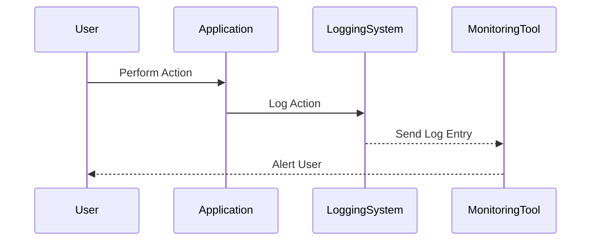

## Regulatory Logging Requirements

When implementing a logging process, it's crucial to understand the regulatory requirements that might dictate what you need to log. These requirements vary based on the industry and the specific regulations governing it. For instance, in the financial sector, particularly in the payment card industry, the Payment Card Industry Data Security Standard (PCI DSS) mandates certain logging activities to ensure compliance.

### PCI DSS Compliance

The PCI DSS is a set of security standards designed to ensure that all companies that accept, process, store, or transmit credit card information maintain a secure environment. One of the key aspects of PCI DSS compliance is logging and monitoring. Here are some of the mandatory events that must be captured according to PCI DSS:

- **User Access to Card Data**: All individual user accesses to cardholder data must be logged. This includes both successful and failed attempts.
- **Stopping or Pausing Audit Logs**: Any action that stops or pauses audit logs must be recorded. This helps in detecting any attempts to tamper with the logging system itself.

#### Example of PCI DSS Compliance

Consider a scenario where a company processes credit card transactions. The following is an example of a log entry that captures user access to card data:

```plaintext
2023-10-01T12:00:00Z | User: john.doe@example.com | Action: Access Card Data | Result: Success | IP Address: 192.168.1.100
```

This log entry provides critical information about who accessed the card data, when the access occurred, and from which IP address. This level of detail is essential for compliance and forensic analysis.

### ISO 27001 Information Security Standard

Another widely recognized standard is ISO 27001, which outlines the requirements for establishing, implementing, maintaining, and continually improving an information security management system (ISMS). According to ISO 27001, organizations must record various types of events, including:

- **User Activity**: Recording actions performed by users, such as login attempts, file accesses, and application usage.
- **Exceptions**: Logging any unexpected behavior or errors that occur within the system.
- **False and Information Security Events**: Capturing any security-related incidents, including unauthorized access attempts and security breaches.
- **Admin Logs**: Recording administrative activities, such as system administrator actions and system operator activities.

#### Example of ISO 27001 Compliance

Here is an example of a log entry that captures user activity:

```plaintext
2023-10-01T12:05:00Z | User: jane.smith@example.com | Action: Login Attempt | Result: Failure | IP Address: 192.168.1.101
```

This log entry records a failed login attempt, which is crucial for detecting potential security threats.

### Recommended Log Data

In addition to regulatory requirements, there are several types of log data that are generally recommended to be captured in a robust logging solution. These include:

- **User Identification**: Capturing the identity of the user performing an action, whether through a user account or other identifying information.
- **Action Details**: Recording the specific actions taken by the user, such as file accesses, application usage, and administrative tasks.
- **Timestamps**: Including precise timestamps for each log entry to facilitate chronological analysis.
- **IP Addresses**: Recording the IP addresses from which actions were performed to trace the origin of activities.

#### Example of Recommended Log Data

Here is an example of a comprehensive log entry that captures user identification, action details, timestamps, and IP addresses:

```plaintext
2023-10-01T12:10:00Z | User: alice.brown@example.com | Action: File Access | File: /var/log/system.log | Result: Success | IP Address: 192.168.1.102
```

This log entry provides detailed information about a user accessing a specific file, which can be invaluable for forensic analysis and compliance.

### How to Prevent / Defend

To ensure that your logging solution is robust and effective, consider the following preventive measures:

- **Centralized Logging**: Implement a centralized logging system to aggregate logs from various sources. This allows for easier monitoring and analysis.
- **Real-time Monitoring**: Use tools that provide real-time monitoring capabilities to detect and respond to suspicious activities promptly.
- **Access Controls**: Ensure that only authorized personnel have access to the logging system to prevent tampering.
- **Regular Audits**: Conduct regular audits of the logging system to verify compliance and identify any gaps in logging coverage.

#### Secure Coding Fixes

Here is an example of how to implement secure coding practices to ensure proper logging:

**Vulnerable Code:**

```python
def access_file(user, filename):
    try:
        with open(filename, 'r') as file:
            return file.read()
    except Exception as e:
        print(f"Error accessing {filename}: {str(e)}")
```

**Secure Code:**

```python
import logging

# Configure logging
logging.basicConfig(level=logging.INFO, format='%(asctime)s - %(levelname)s - %(message)s')

def access_file(user, filename):
    try:
        with open(filename, 'r') as file:
            logging.info(f"User {user} accessed file {filename}")
            return file.read()
    except Exception as e:
        logging.error(f"Error accessing {filename} by user {user}: {str(e)}")
```

In the secure code example, logging statements are added to capture user actions and any errors that occur. This ensures that all critical events are recorded and can be reviewed later.

### Real-World Examples

Recent breaches and vulnerabilities often highlight the importance of proper logging and monitoring. For example, the SolarWinds supply chain attack in 2020 demonstrated the value of comprehensive logging and monitoring. In this case, attackers gained access to SolarWinds' systems and deployed malware that was then distributed to SolarWinds customers. Proper logging and monitoring could have helped detect the initial breach and subsequent malicious activities.

### Mermaid Diagrams

To illustrate the flow of logging and monitoring, consider the following mermaid diagram:



This diagram shows the sequence of events when a user performs an action, which is logged by the application and sent to the logging system. The monitoring tool then alerts the user if any suspicious activity is detected.

### Conclusion

Implementing a robust logging solution is crucial for ensuring compliance with regulatory requirements and maintaining the security of your systems. By capturing the right log data and implementing proper monitoring and preventive measures, you can effectively detect and respond to security threats. Always ensure that your logging system is configured to capture all critical events and that you regularly review and audit the logs to maintain a secure environment.

### Practice Labs

For hands-on experience with logging and monitoring, consider the following practice labs:

- **PortSwigger Web Security Academy**: Offers modules on logging and monitoring for web applications.
- **OWASP Juice Shop**: Provides a vulnerable web application to practice logging and monitoring techniques.
- **DVWA (Damn Vulnerable Web Application)**: Another vulnerable web application to practice logging and monitoring.

These labs provide practical scenarios to apply the concepts learned and gain hands-on experience with logging and monitoring in a controlled environment.

---
<!-- nav -->
[[DevSecOps/DevSecOps Bootcamp/08-Logging & Incident Response/01-Defining Key Security Events to Log and Monitor/06-Key Log Data/00-Overview|Overview]] | [[02-Timestamping and Synchronization|Timestamping and Synchronization]]
