## Timestamping and Synchronization

### Importance of Timestamping

Timestamping is a critical component of logging and monitoring security events. It provides a precise record of when an event occurred, which is essential for correlating different events, identifying patterns, and conducting forensic analysis. Without accurate timestamps, it becomes extremely difficult to understand the sequence of events leading up to a security incident.

#### Why Timestamping Matters

- **Event Correlation**: Accurate timestamps allow security analysts to correlate events across different systems and logs. This is crucial for identifying the timeline of an attack and understanding the steps taken by an attacker.
- **Forensic Analysis**: In the event of a security breach, timestamps help in reconstructing the sequence of events. This is vital for determining the scope of the breach and identifying the vulnerabilities exploited.
- **Incident Response**: Timely and accurate timestamps enable faster identification and response to security incidents. This can significantly reduce the damage caused by an attack.

### Clock Synchronization

To ensure that timestamps are accurate and consistent across different systems, it is essential to synchronize clocks to a common time source. This is typically achieved using Network Time Protocol (NTP) or Precision Time Protocol (PTP).

#### How Clock Synchronization Works

- **Network Time Protocol (NTP)**: NTP is a widely used protocol for synchronizing the clocks of computer systems over a network. It uses a hierarchical system of time servers, with each level providing more accurate time than the previous one.
- **Precision Time Protocol (PTP)**: PTP is a more precise alternative to NTP, designed for applications requiring high accuracy, such as financial trading systems and industrial automation.

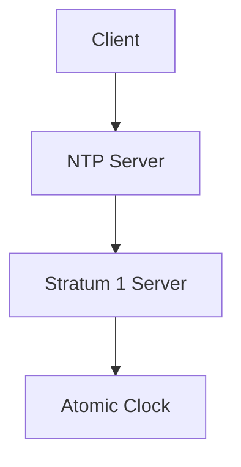

#### Real-World Example: Time Skew in Security Logs

In a real-world scenario, consider a security incident where the clocks on different systems were not synchronized. This led to discrepancies in the timestamps of security logs, making it difficult to correlate events and identify the sequence of actions taken by the attacker. This example highlights the importance of maintaining synchronized clocks across all systems.

### Capturing Activity Details

### What the Activity Was

Capturing the details of the activity is crucial for understanding the nature of the event. This includes recording actions such as file deletions, file copies, and website visits. Each of these actions can provide valuable insights into the behavior of both legitimate users and potential attackers.

#### File Deletions

File deletions are a common action that can indicate malicious activity. An attacker might delete files to cover their tracks or to cause disruption. Recording the details of file deletions helps in identifying such actions.

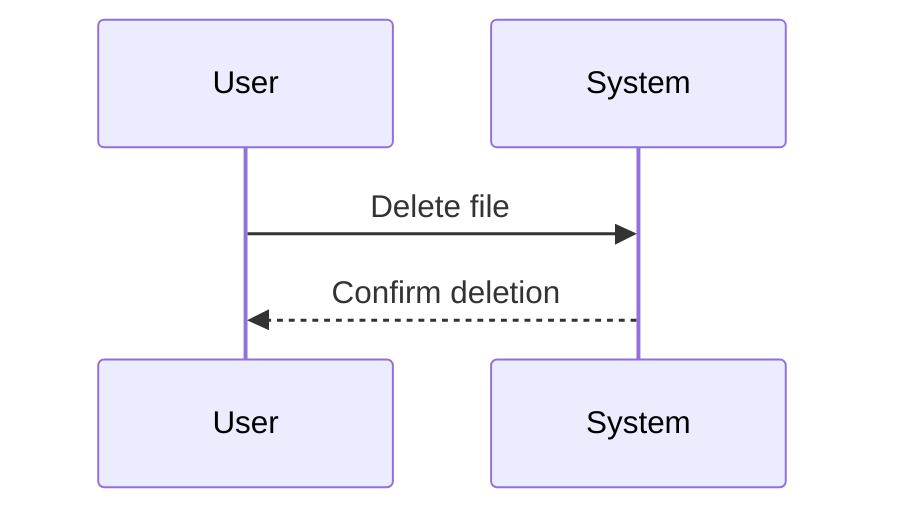

#### File Copies

File copies can also be indicative of malicious activity. An attacker might copy sensitive files to exfiltrate them. Recording the details of file copies helps in identifying such actions.

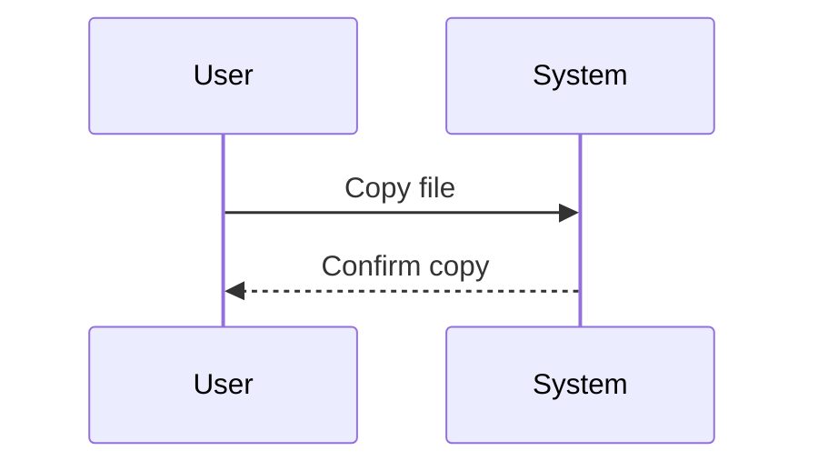

#### Website Visits

Website visits can provide insights into the browsing behavior of users. Recording the details of website visits helps in identifying potential phishing attempts or visits to malicious websites.

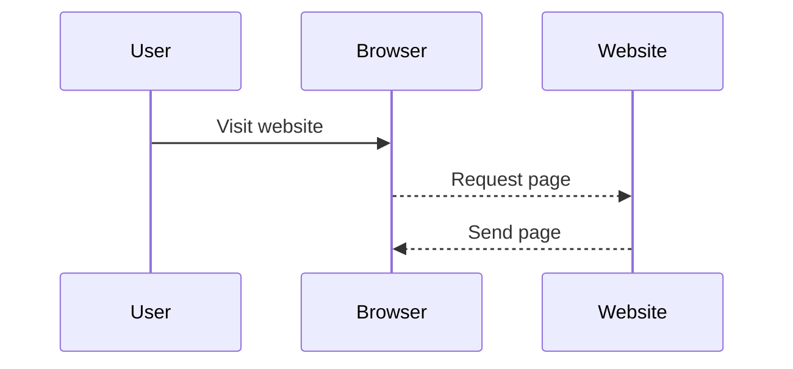

### Where the Activity Occurred

Capturing the source of the activity is equally important. This includes recording the source IP address, which can help in identifying the origin of the activity and tracing back to the user or system responsible.

#### Source IP Address

The source IP address is a key piece of information that can help in identifying the origin of the activity. Recording the source IP address helps in tracing back to the user or system responsible for the activity.

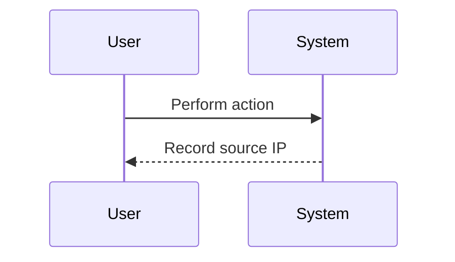

### Before and After Data

Capturing the before and after data of any transaction is crucial for understanding the changes made and identifying potential malicious activity. This is particularly important for detecting and preventing data tampering.

#### Before and After Data

Recording the before and after data of any transaction helps in understanding the changes made and identifying potential malicious activity. This is particularly important for detecting and preventing data tampering.

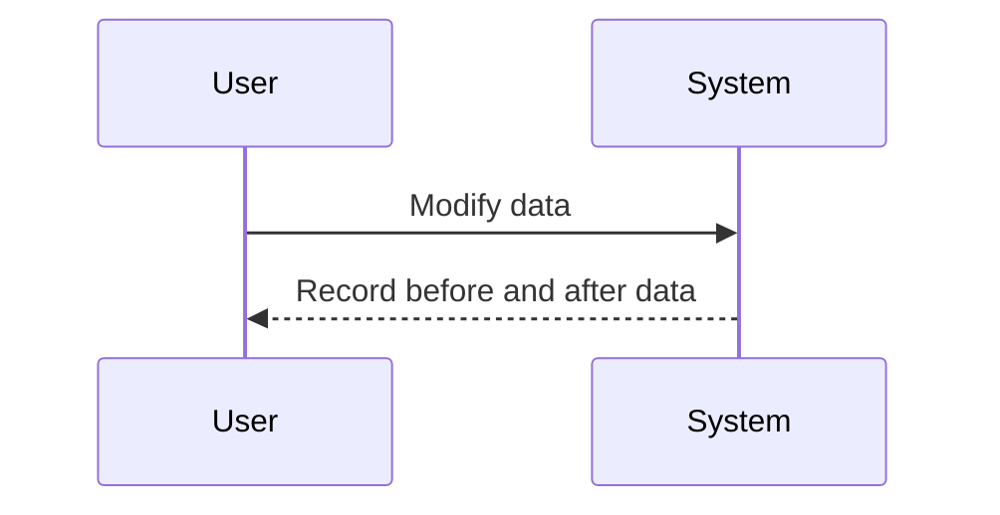

### Real-World Example: Data Tampering

Consider a real-world scenario where an attacker modifies sensitive data to cover their tracks. By capturing the before and after data of the transaction, it becomes possible to identify the changes made and trace back to the attacker.

### How to Prevent / Defend

### Detection

Detecting security events requires a combination of logging, monitoring, and alerting mechanisms. This includes setting up log management systems, configuring alerts for suspicious activity, and regularly reviewing logs for anomalies.

#### Log Management Systems

Log management systems collect, store, and analyze logs from various sources. They provide centralized visibility into security events and help in identifying patterns and anomalies.

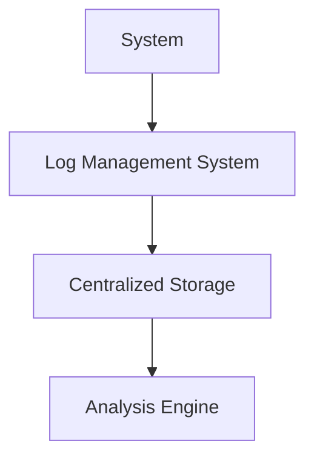

#### Configuring Alerts

Configuring alerts for suspicious activity is crucial for timely detection of security events. This includes setting up rules for specific types of activity, such as file deletions or modifications, and triggering alerts when these rules are violated.

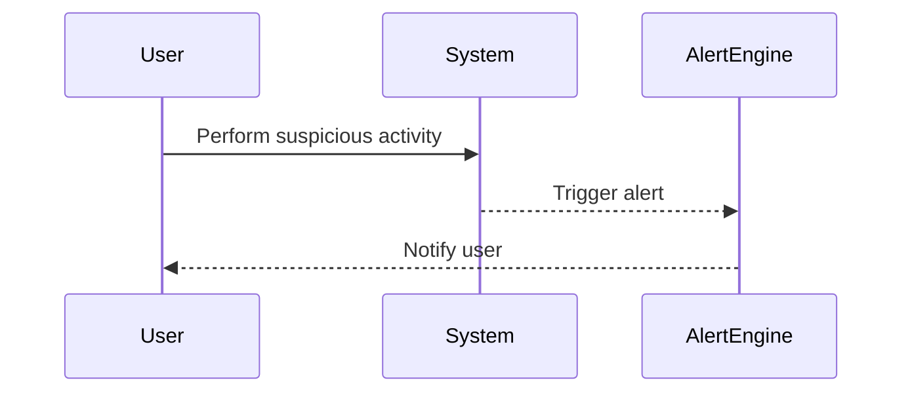

### Prevention

Preventing security events requires a combination of access controls, encryption, and regular audits. This includes implementing least privilege principles, encrypting sensitive data, and conducting regular security assessments.

#### Access Controls

Implementing access controls is crucial for preventing unauthorized access to sensitive data. This includes implementing least privilege principles, where users are granted only the minimum permissions necessary to perform their tasks.

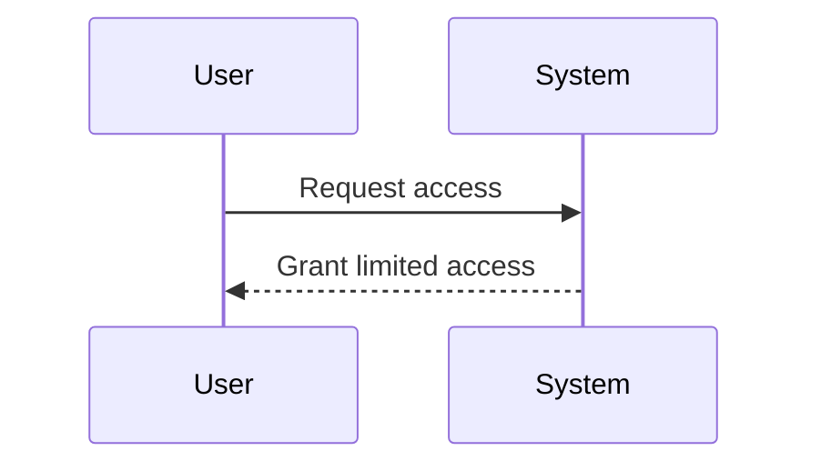

#### Encryption

Encrypting sensitive data is crucial for protecting it from unauthorized access. This includes encrypting data at rest and in transit, using strong encryption algorithms and keys.

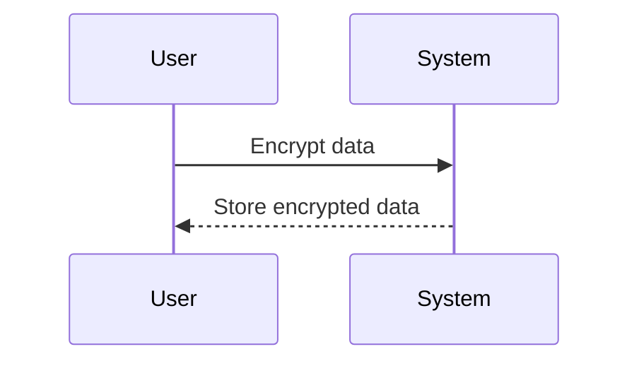

#### Regular Audits

Conducting regular security assessments is crucial for identifying and addressing vulnerabilities. This includes conducting regular penetration tests, vulnerability scans, and compliance audits.

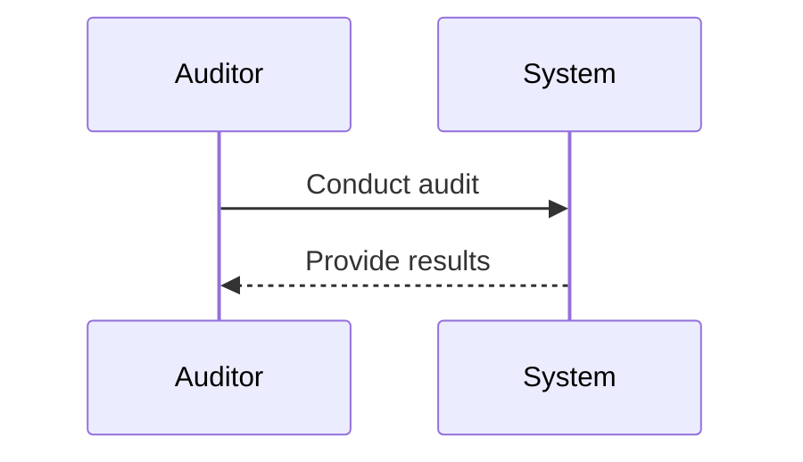

### Secure Coding Fixes

Secure coding practices are crucial for preventing security vulnerabilities. This includes implementing input validation, error handling, and secure coding standards.

#### Input Validation

Input validation is crucial for preventing injection attacks. This includes validating user inputs to ensure they meet expected formats and constraints.

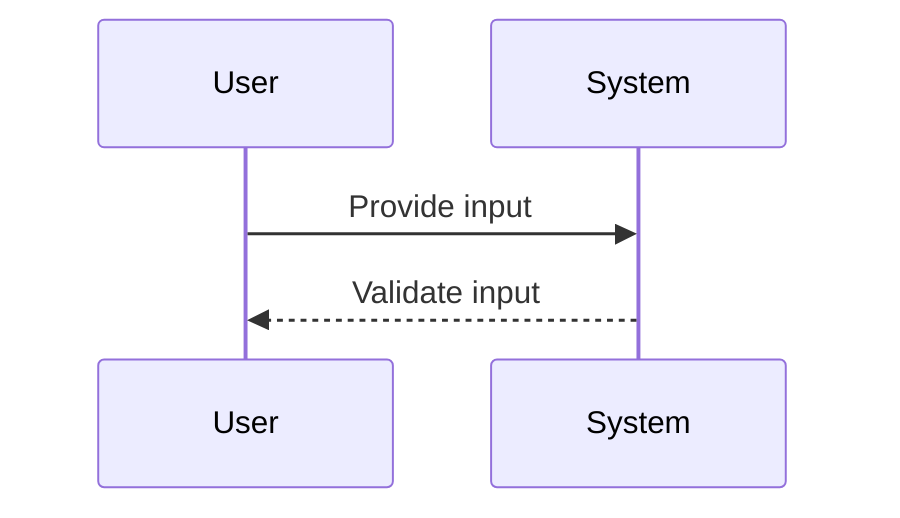

#### Error Handling

Proper error handling is crucial for preventing information leakage. This includes handling errors gracefully and avoiding revealing sensitive information in error messages.

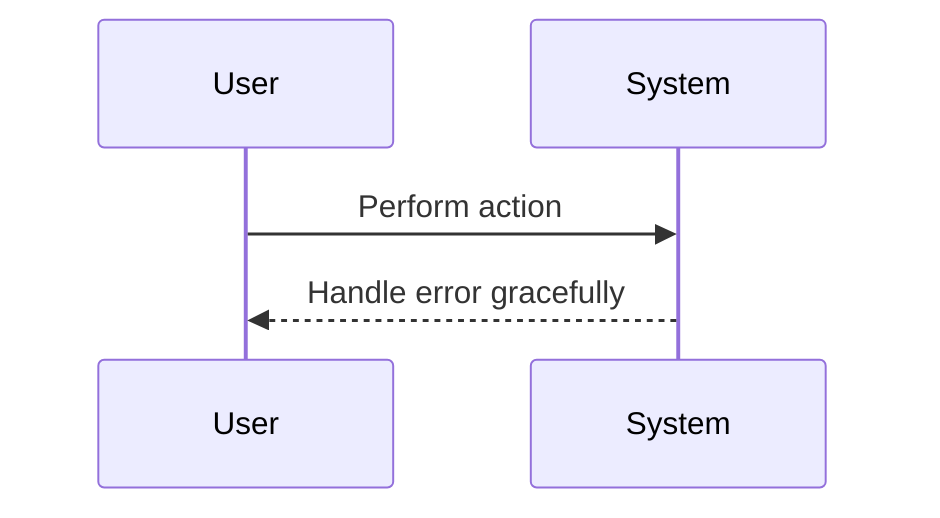

#### Secure Coding Standards

Following secure coding standards is crucial for preventing security vulnerabilities. This includes adhering to established coding guidelines and best practices.

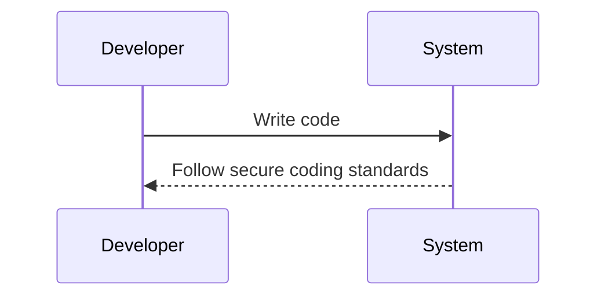

### Configuration Hardening

Configuration hardening is crucial for securing systems against attacks. This includes disabling unnecessary services, configuring firewalls, and implementing intrusion detection systems.

#### Disabling Unnecessary Services

Disabling unnecessary services is crucial for reducing the attack surface. This includes disabling unused services and ports to minimize the risk of exploitation.

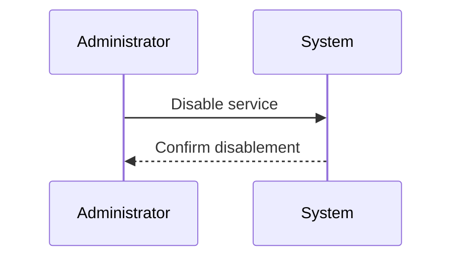

#### Configuring Firewalls

Configuring firewalls is crucial for controlling network traffic and preventing unauthorized access. This includes setting up firewall rules to allow only necessary traffic and block suspicious activity.

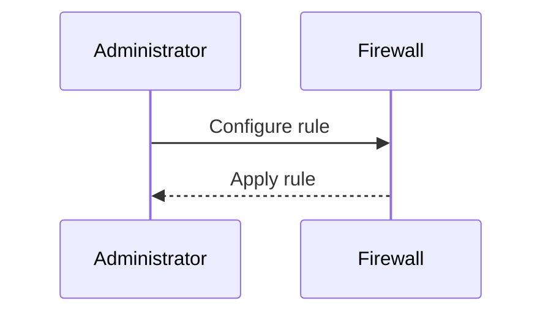

#### Implementing Intrusion Detection Systems

Implementing intrusion detection systems is crucial for detecting and responding to security incidents. This includes setting up intrusion detection systems to monitor network traffic and alert on suspicious activity.

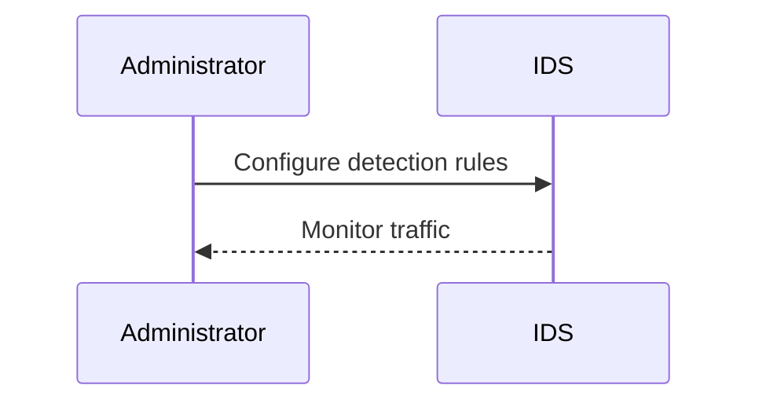

### Conclusion

Logging and monitoring security events is a critical aspect of DevSecOps. By capturing detailed information about the activity, including timestamps, source IP addresses, and before and after data, it becomes possible to identify and respond to security incidents effectively. Implementing secure coding practices, configuration hardening, and regular audits is crucial for preventing security vulnerabilities and ensuring the security of systems.

---
<!-- nav -->
[[01-Regulatory Logging Requirements|Regulatory Logging Requirements]] | [[DevSecOps/DevSecOps Bootcamp/08-Logging & Incident Response/01-Defining Key Security Events to Log and Monitor/06-Key Log Data/00-Overview|Overview]] | [[DevSecOps/DevSecOps Bootcamp/08-Logging & Incident Response/01-Defining Key Security Events to Log and Monitor/06-Key Log Data/03-Practice Questions & Answers|Practice Questions & Answers]]
