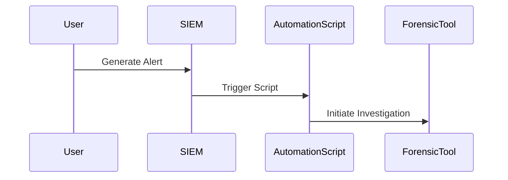
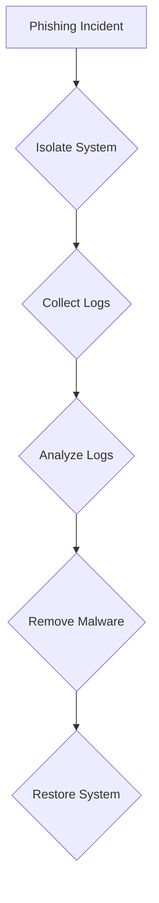
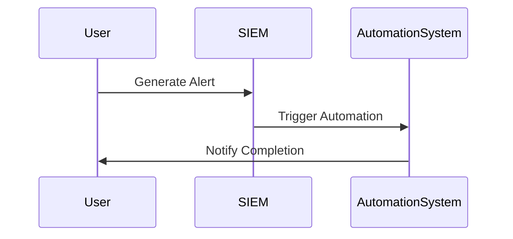
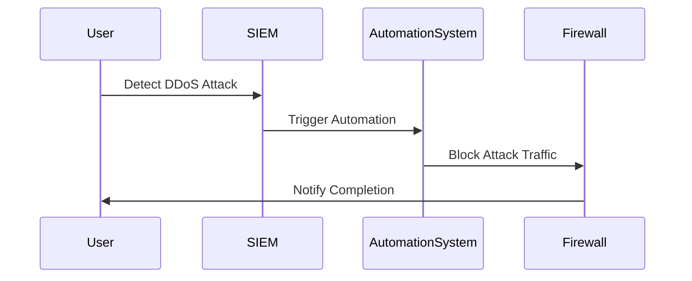
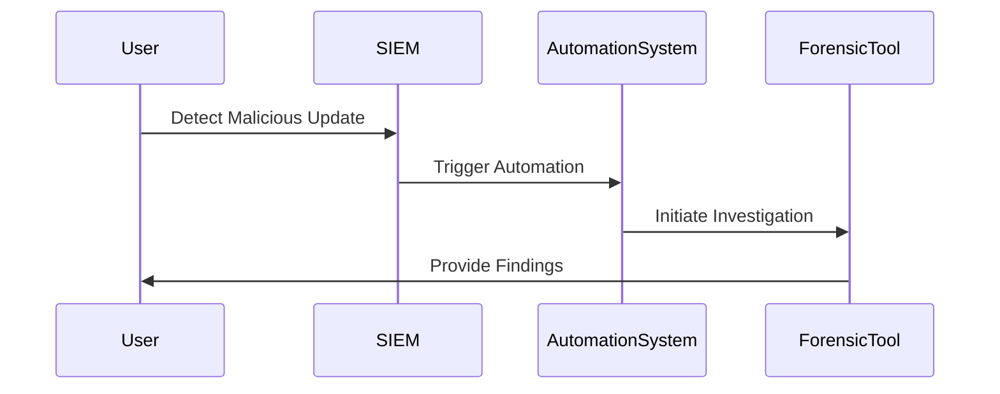
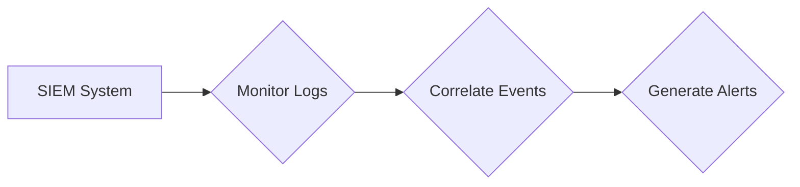
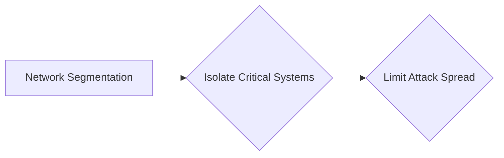
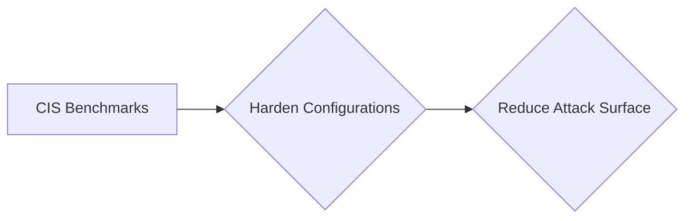

## Introduction to Incident Response Context in DevSecOps

Incident response is a critical component of cybersecurity, particularly in the context of DevSecOps. The goal of incident response is to manage and mitigate the impact of security incidents effectively. In traditional Security Operations Center (SOC) environments, analysts face numerous challenges such as managing an overwhelming number of alerts, dealing with high staff turnover, and addressing skills shortages. DevSecOps offers a framework to address these issues through automation, standardized processes, and continuous integration of security practices.

### Understanding the Typical Incident Response Process

The typical incident response process involves several key steps:

1. **Preparation**: Establishing policies, procedures, and tools to handle incidents.
2. **Detection and Analysis**: Identifying and analyzing potential security incidents.
3. **Containment**: Limiting the scope and impact of the incident.
4. **Eradication**: Removing the root cause of the incident.
5. **Recovery**: Restoring systems to normal operations.
6. **Lessons Learned**: Documenting the incident and improving future response efforts.

#### Challenges in Traditional SOC Environments

Traditional SOC environments face significant challenges:

- **High Volume of Alerts**: Large organizations can generate millions of alerts daily, making it difficult for analysts to manage and respond effectively.
- **Staff Turnover**: High turnover rates can lead to loss of institutional knowledge and expertise.
- **Skills Shortages**: Finding skilled analysts is challenging, leading to gaps in coverage and response capabilities.
- **Alert Fatigue**: Analysts can become desensitized to alerts, leading to missed incidents.
- **Slow Response Times**: Manual processes can result in delayed responses, allowing attackers to cause significant damage.

### How DevSecOps Can Assist in Incident Response

DevSecOps integrates security practices into the software development lifecycle, enabling faster and more consistent incident response. Here’s how DevSecOps addresses the challenges faced by traditional SOC environments:

#### Automation of Incident Response

Automation is a cornerstone of DevSecOps. By automating the incident response process, organizations can handle a higher volume of alerts more efficiently. Automated tools can perform initial analysis, containment, and even eradication steps, reducing the burden on human analysts.

**Example:**
Consider a scenario where an organization uses a Security Information and Event Management (SIEM) system integrated with automated response scripts. When an alert is generated, the SIEM system triggers a script to automatically isolate the affected system and initiate a forensic investigation.



#### Persistent Knowledge and Response in Code

By codifying the knowledge and response procedures within code, DevSecOps ensures that institutional knowledge is not lost due to staff turnover. This approach also standardizes the response process, ensuring consistency across different incidents.

**Example:**
An organization might have a set of predefined playbooks written in a scripting language like Python. These playbooks contain the steps required to handle specific types of incidents.

```python
# Example playbook for handling a malware infection
def handle_malware_infection(system_id):
    isolate_system(system_id)
    collect_logs(system_id)
    analyze_logs(system_id)
    remove_malware(system_id)
    restore_system(system_id)

def isolate_system(system_id):
    # Code to isolate the system
    pass

def collect_logs(system_id):
    # Code to collect logs
    pass

def analyze_logs(system_id):
    # Code to analyze logs
    pass

def remove_malware(system_id):
    # Code to remove malware
    pass

def restore_system(system_id):
    # Code to restore the system
    pass
```

#### Minimizing the Impact of Skills Shortages

Codifying responses within a DevSecOps environment helps minimize the impact of skills shortages. New analysts can quickly learn and apply the established procedures without needing extensive training.

**Example:**
A new analyst can follow a predefined playbook to handle a phishing incident, reducing the learning curve and ensuring consistent response quality.



#### Eliminating Alert Fatigue

Automated incident response eliminates the issue of alert fatigue. Machines do not get tired, ensuring that all alerts are addressed promptly.

**Example:**
An automated system can handle repetitive tasks, such as isolating systems and collecting logs, freeing up human analysts to focus on more complex issues.



#### Faster and More Consistent Responses

DevSecOps enables faster and more consistent incident response compared to manual processes. Automated tools can respond to incidents in seconds, significantly reducing the window of opportunity for attackers.

**Example:**
An automated system can detect and respond to a DDoS attack in real-time, minimizing the impact on the organization.



### Real-World Examples and Recent Breaches

Recent breaches highlight the importance of effective incident response. For instance, the SolarWinds breach in 2020 demonstrated the need for robust incident response capabilities.

**SolarWinds Breach (CVE-2020-1014):**
In this breach, attackers compromised SolarWinds’ software update mechanism, allowing them to distribute malicious updates to thousands of customers. Effective incident response would have involved automated detection and isolation of affected systems, followed by a thorough forensic investigation.



### How to Prevent / Defend

To prevent and defend against security incidents, organizations should implement the following measures:

#### Detection

Implement robust monitoring and logging mechanisms to detect potential security incidents. Use tools like SIEM systems to correlate and analyze logs from various sources.

**Example:**
Configure a SIEM system to monitor for unusual activity patterns indicative of a security incident.



#### Prevention

Implement preventive measures such as network segmentation, access controls, and regular security audits to reduce the likelihood of security incidents.

**Example:**
Use network segmentation to isolate critical systems, limiting the spread of potential attacks.



#### Secure Coding Fixes

Ensure that security practices are integrated into the software development lifecycle. Implement secure coding practices to prevent vulnerabilities.

**Example:**
Compare a vulnerable code snippet with a secure version.

```python
# Vulnerable code
def login(username, password):
    if username == "admin" and password == "password":
        return True
    else:
        return False

# Secure code
import hashlib

def login(username, password):
    hashed_password = hashlib.sha256(password.encode()).hexdigest()
    if username == "admin" and hashed_password == "hashed_password":
        return True
    else:
        return False
```

#### Configuration Hardening

Harden configurations to reduce the attack surface. Use tools like CIS benchmarks to ensure compliance with best practices.

**Example:**
Apply CIS benchmarks to harden server configurations.



### Conclusion

DevSecOps offers significant benefits in managing the incident response process. By leveraging automation, persistent knowledge, and standardized procedures, organizations can address the challenges faced by traditional SOC environments. Implementing robust detection, prevention, and secure coding practices is essential to effectively respond to security incidents and protect organizational assets.

### Hands-On Labs

For hands-on practice in DevSecOps and incident response, consider the following labs:

- **PortSwigger Web Security Academy**: Offers interactive labs to practice web application security.
- **OWASP Juice Shop**: A deliberately insecure web application for practicing security testing.
- **DVWA (Damn Vulnerable Web Application)**: Another web application for practicing security testing.
- **WebGoat**: An interactive web application for learning about web application security.

These labs provide practical experience in applying DevSecOps principles to real-world scenarios, enhancing your ability to manage and respond to security incidents effectively.

---
<!-- nav -->
[[DevSecOps/DevSecOps Bootcamp/08-Logging & Incident Response/02-Establishing Your Incident Response Context/01-Benefits of DevSecOps/00-Overview|Overview]] | [[02-Knowledge of Applications and Incident Response Context|Knowledge of Applications and Incident Response Context]]
