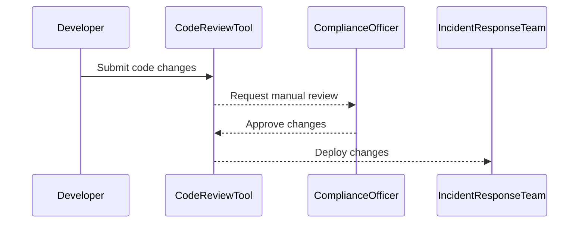

## Knowledge of Applications and Incident Response Context

In the realm of DevSecOps, one of the most critical aspects is ensuring that the Security Operations Center (SOC) teams have a deep understanding of the applications they are monitoring. This understanding is crucial because it directly impacts the effectiveness of incident response. Often, SOC teams operate in isolation from the development teams, leading to a lack of comprehensive knowledge about the applications and their underlying architecture. This can result in misinterpretation of alerts and delayed response times, which can be detrimental to the overall security posture of an organization.

### Importance of Collaboration Between SOC and Development Teams

By integrating DevSecOps principles, there is a requirement for SOC teams to work closely with both development and operations teams. This collaboration ensures that the knowledge of the application's architecture, dependencies, and potential vulnerabilities is transferred into the automated incident response processes. This transfer of knowledge is essential for several reasons:

1. **Contextual Understanding**: Developers have intimate knowledge of the application’s design, codebase, and potential weaknesses. This knowledge can help SOC teams interpret alerts more accurately and respond more effectively.
   
2. **Automation**: With a better understanding of the application, SOC teams can automate incident response workflows more efficiently. This automation reduces the time taken to identify and mitigate threats, thereby improving the overall security posture.

3. **Continuous Improvement**: Collaboration between SOC and development teams allows for continuous feedback loops. Developers can incorporate security best practices into the code, and SOC teams can refine their incident response strategies based on real-world scenarios.

### Challenges in Implementing DevSecOps

While the benefits of DevSecOps are significant, there are several challenges that organizations must address to successfully implement these principles:

#### Coding Skills in Incident Response Teams

One of the primary challenges is the need for incident response teams to possess coding skills. In traditional SOC environments, analysts might rely heavily on predefined rules and alerts. However, in a DevSecOps environment, incident response teams must be able to write scripts, automate tasks, and integrate with various tools and platforms. This requires a shift in skill sets and training.

**Example**: Consider a scenario where an organization uses a custom script to monitor for unusual activity in a database. Without coding skills, the incident response team would struggle to modify or extend this script to handle new types of threats.

```python
# Example of a simple Python script for monitoring database activity
import psycopg2
import logging

def monitor_database_activity():
    conn = psycopg2.connect("dbname='mydatabase' user='username' password='password' host='localhost'")
    cur = conn.cursor()
    cur.execute("SELECT * FROM activity_log WHERE timestamp > NOW() - INTERVAL '1 hour';")
    rows = cur.fetchall()
    for row in rows:
        logging.warning(f"Unusual activity detected: {row}")
    cur.close()
    conn.close()

if __name__ == "__main__":
    monitor_database_activity()
```

#### Developing Everything as Code

Another challenge is the need to develop everything as code. This includes compliance checks, security policies, and incident response procedures. By treating these elements as code, organizations can leverage version control systems, continuous integration/continuous deployment (CI/CD) pipelines, and automated testing.

**Example**: An organization might use a configuration management tool like Ansible to define and enforce security policies across its infrastructure.

```yaml
# Example Ansible playbook for enforcing security policies
---
- name: Enforce security policies
  hosts: all
  become: yes
  tasks:
    - name: Ensure SSH is configured securely
      ansible.builtin.lineinfile:
        path: /etc/ssh/sshd_config
        regexp: '^PermitRootLogin'
        line: 'PermitRootLogin no'
        state: present
    - name: Ensure firewall is enabled
      ansible.posix.firewalld:
        state: enabled
        permanent: yes
```

#### Regulatory Requirements

Organizations must also consider regulatory requirements that may mandate human intervention or require code reviews. For instance, certain industries such as finance and healthcare have strict regulations that require manual oversight of security-related activities.

**Example**: In the financial sector, regulations like GDPR and PCI DSS may require that certain security controls be manually reviewed and approved. This means that even in a DevSecOps environment, there may be instances where human intervention is necessary.

### How to Prevent / Defend

To successfully implement DevSecOps principles and overcome the associated challenges, organizations should focus on the following strategies:

#### Training and Skill Development

Invest in training programs to upskill incident response teams in coding and automation. This can include workshops, online courses, and hands-on labs.

**Example**: Organizations can use platforms like Pluralsight or Udemy to provide training on scripting languages like Python and automation tools like Ansible.

#### Automation and Integration

Develop and maintain a robust automation framework that integrates with various tools and platforms. This framework should include scripts, playbooks, and workflows that can be easily modified and extended.

**Example**: Use a CI/CD pipeline to automatically test and deploy security policies and incident response scripts.

```yaml
# Example Jenkinsfile for CI/CD pipeline
pipeline {
    agent any
    stages {
        stage('Build') {
            steps {
                sh 'make build'
            }
        }
        stage('Test') {
            steps {
                sh 'make test'
            }
        }
        stage('Deploy') {
            steps {
                sh 'make deploy'
            }
        }
    }
}
```

#### Compliance and Regulatory Adherence

Ensure that all security policies and incident response procedures comply with relevant regulations. This may involve manual reviews and approvals as required by law.

**Example**: Implement a code review process that includes both automated checks and manual reviews by compliance officers.



### Real-World Examples

#### Recent Breaches and CVEs

Several recent breaches highlight the importance of having a well-integrated DevSecOps approach. For example, the SolarWinds breach in 2020 demonstrated the risks of supply chain attacks and the need for continuous monitoring and rapid response.

**Example**: In the SolarWinds breach, attackers compromised the update mechanism of SolarWinds Orion software, allowing them to install backdoors in customer networks. A robust DevSecOps approach would have included continuous monitoring of the software supply chain and rapid incident response capabilities.

#### Case Study: Equifax Data Breach

The Equifax data breach in 2017 exposed sensitive information of millions of customers due to a vulnerability in their web application. This breach underscores the importance of having a deep understanding of the application and its dependencies.

**Example**: In the Equifax breach, attackers exploited a vulnerability in the Apache Struts framework used by Equifax. A DevSecOps approach would have included regular security assessments of third-party components and automated incident response workflows to quickly patch and mitigate vulnerabilities.

### Conclusion

Implementing DevSecOps principles requires a deep understanding of the application and close collaboration between SOC, development, and operations teams. While there are challenges such as the need for coding skills and adherence to regulatory requirements, these can be addressed through training, automation, and compliance-focused processes. By adopting a DevSecOps approach, organizations can improve their incident response capabilities and enhance their overall security posture.

### Practice Labs

For hands-on experience with DevSecOps principles, consider the following well-known labs:

- **PortSwigger Web Security Academy**: Offers interactive labs to practice web application security.
- **OWASP Juice Shop**: A deliberately insecure web application for learning web security.
- **DVWA (Damn Vulnerable Web Application)**: A PHP/MySQL web application that demonstrates web application vulnerabilities.
- **WebGoat**: An interactive, gamified training application for learning web security.

These labs provide practical experience in developing and maintaining a robust DevSecOps environment.

---
<!-- nav -->
[[01-Introduction to Incident Response Context in DevSecOps|Introduction to Incident Response Context in DevSecOps]] | [[DevSecOps/DevSecOps Bootcamp/08-Logging & Incident Response/02-Establishing Your Incident Response Context/01-Benefits of DevSecOps/00-Overview|Overview]] | [[DevSecOps/DevSecOps Bootcamp/08-Logging & Incident Response/02-Establishing Your Incident Response Context/01-Benefits of DevSecOps/03-Practice Questions & Answers|Practice Questions & Answers]]
