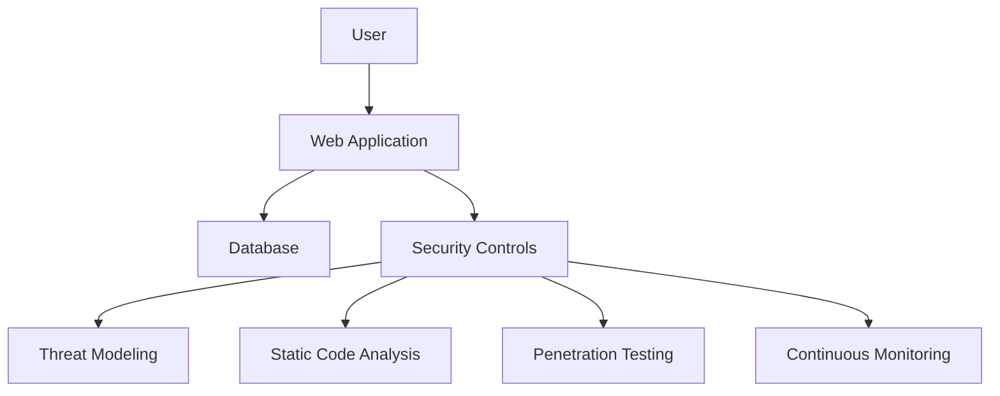

## Introduction to DevSecOps

### What is DevSecOps?

DevSecOps is an approach to software development that integrates security practices into the entire DevOps lifecycle. This methodology aims to ensure that security is not an afterthought but is embedded throughout the development, testing, and deployment processes. The primary goal of DevSecOps is to enable teams to deliver secure software faster and more efficiently.

### Key Concepts

#### Incorporating Security in Agile and DevOps Practices

The DevSecOps concept is centered around integrating security into the Agile and DevOps practices. Traditionally, security was often treated as a separate phase, typically occurring late in the development cycle. However, this approach can lead to significant delays and increased costs. By incorporating security from the beginning, teams can identify and mitigate risks earlier, leading to more secure and reliable software.

#### Mindset Shift

Shannon Litz, a recognized expert in the DevSecOps space, emphasizes the importance of a mindset shift where everyone is responsible for security. This means that security is not solely the responsibility of a dedicated security team but is shared across all members of the development and operations teams. The goal is to distribute security decisions at speed and scale to those who have the highest level of context, ensuring that security measures are both effective and timely.

### The DevSecOps Manifesto

The DevSecOps Manifesto outlines several principles that guide the integration of security into the DevOps lifecycle. These principles emphasize collaboration, inclusion, and proactive security measures. Here are some key attributes of the DevSecOps Manifesto:

- **Engagement**: Instead of having a security team that says "no," the focus is on engagement and collaboration. Teams should work together to understand and address security concerns.
- **Inclusion**: Security is not an isolated function but is integrated into the development and operations processes. Everyone is responsible for security.
- **Proactive Measures**: Security should be built into the process and product from the start, rather than being added as an afterthought.

### Importance of Establishing Security Incident Response Context

Establishing a robust incident response context is crucial in the DevSecOps framework. This involves defining clear roles, responsibilities, and procedures for handling security incidents. A well-defined incident response plan ensures that teams can quickly and effectively respond to security threats, minimizing potential damage.

### Real-World Examples

Recent breaches and vulnerabilities highlight the importance of DevSecOps. For instance, the SolarWinds breach (CVE-2020-1014) demonstrated the critical nature of integrating security into the development and deployment processes. In this case, attackers exploited a vulnerability in the SolarWinds Orion platform, allowing them to compromise numerous organizations. This breach underscores the need for continuous monitoring, proactive security measures, and a collaborative approach to security.

### Background Theory

#### Development Lifecycle Integration

In the traditional software development lifecycle, security was often treated as a separate phase, typically occurring late in the development cycle. This approach can lead to significant delays and increased costs. By integrating security into the development lifecycle, teams can identify and mitigate risks earlier, leading to more secure and reliable software.

#### Agile and DevOps Practices

Agile methodologies emphasize iterative development, continuous feedback, and collaboration. DevOps extends these principles by focusing on the collaboration between development and operations teams. By integrating security into these practices, teams can ensure that security is not an afterthought but is embedded throughout the development, testing, and deployment processes.

### Detailed Example: Integrating Security into the Development Lifecycle

Let's consider a detailed example of how security can be integrated into the development lifecycle using a hypothetical web application.

#### Step-by-Step Mechanics

1. **Requirement Analysis**:
    - Identify security requirements early in the development process.
    - Define security goals and objectives.
    - Ensure that security is a core component of the project.

2. **Design Phase**:
    - Implement secure coding practices.
    - Use threat modeling to identify potential security risks.
    - Design the architecture with security in mind.

3. **Development Phase**:
    - Use static code analysis tools to identify security vulnerabilities.
    - Implement automated security testing.
    - Conduct regular code reviews to identify and fix security issues.

4. **Testing Phase**:
    - Perform dynamic security testing.
    - Use penetration testing to simulate real-world attacks.
    - Validate that security controls are functioning as intended.

5. **Deployment Phase**:
    - Implement continuous monitoring to detect and respond to security incidents.
    - Use automated deployment tools to ensure consistency and security.
    - Regularly update and patch systems to address known vulnerabilities.

#### Code Example

Here is a sample code snippet demonstrating secure coding practices:

```python
# Vulnerable code
def login(username, password):
    if username == "admin" and password == "password":
        return True
    else:
        return False

# Secure code
import hashlib

def login_secure(username, password):
    stored_password_hash = "5f4dcc3b5aa765d61d8327deb882cf99"  # Hash of "password"
    input_password_hash = hashlib.md5(password.encode()).hexdigest()
    if username == "admin" and input_password_hash == stored_password_hash:
        return True
    else:
        return False
```

### Mermaid Diagrams

#### Architecture Diagram

A mermaid diagram can help visualize the architecture of a secure web application:



### Common Pitfalls and How to Avoid Them

#### Common Pitfalls

1. **Ignoring Security Early in the Development Process**:
    - Failing to integrate security from the beginning can lead to significant delays and increased costs.
    - Solution: Integrate security into the requirement analysis and design phases.

2. **Relying Solely on Manual Processes**:
    - Manual processes can be error-prone and time-consuming.
    - Solution: Automate security testing and deployment processes.

3. **Neglecting Continuous Monitoring**:
    - Failing to continuously monitor systems can result in missed security incidents.
    - Solution: Implement continuous monitoring and incident response plans.

### How to Prevent / Defend

#### Detection

Implement continuous monitoring tools to detect security incidents in real-time. Tools like Splunk, ELK Stack, and AWS CloudTrail can provide comprehensive visibility into system activity.

#### Prevention

1. **Secure Coding Practices**:
    - Use static code analysis tools to identify and fix security vulnerabilities.
    - Conduct regular code reviews to ensure adherence to secure coding standards.

2. **Automated Security Testing**:
    - Implement automated security testing as part of the continuous integration/continuous deployment (CI/CD) pipeline.
    - Use tools like OWASP ZAP, Burp Suite, and SonarQube for automated security testing.

3. **Incident Response Plan**:
    - Develop a comprehensive incident response plan that includes clear roles, responsibilities, and procedures.
    - Regularly test and update the incident response plan to ensure effectiveness.

#### Secure-Coding Fixes

Here is a comparison of vulnerable and secure code:

```python
# Vulnerable code
def login(username, password):
    if username == "admin" and password == "password":
        return True
    else:
        return False

# Secure code
import hashlib

def login_secure(username, password):
    stored_password_hash = "5f4dcc3b5aa765d61d8327deb882cf99"  # Hash of "password"
    input_password_hash = hashlib.md5(password.encode()).hexdigest()
    if username == "admin" and input_password_hash == stored_password_hash:
        return True
    else:
        return False
```

### Configuration Hardening

#### Example: Nginx Configuration

Here is an example of a hardened Nginx configuration:

```nginx
server {
    listen 80;
    server_name example.com;

    location / {
        root /var/www/html;
        index index.html index.htm;
    }

    # Disable directory listing
    autoindex off;

    # Enable security headers
    add_header Content-Security-Policy "default-src 'self'";
    add_header X-Content-Type-Options nosniff;
    add_header X-Frame-Options DENY;
    add_header X-XSS-Protection "1; mode=block";
}
```

### Hands-On Labs

For hands-on practice in DevSecOps, consider the following labs:

- **PortSwigger Web Security Academy**: Offers interactive labs to learn web security concepts.
- **OWASP Juice Shop**: A deliberately insecure web application for practicing web security skills.
- **DVWA (Damn Vulnerable Web Application)**: A PHP/MySQL web application that is riddled with vulnerabilities for educational purposes.
- **WebGoat**: An interactive training application designed to teach web application security lessons.

These labs provide practical experience in integrating security into the development and deployment processes, helping to reinforce the theoretical concepts covered in this chapter.

### Conclusion

DevSecOps is a critical approach to ensuring that security is integrated into the entire software development lifecycle. By adopting the principles outlined in the DevSecOps Manifesto and implementing robust incident response plans, teams can deliver secure software faster and more efficiently. Through continuous monitoring, automated security testing, and secure coding practices, organizations can significantly reduce the risk of security breaches and ensure the integrity of their applications.

---
<!-- nav -->
[[DevSecOps/DevSecOps Bootcamp/08-Logging & Incident Response/02-Establishing Your Incident Response Context/02-Defining DevSecOps/00-Overview|Overview]] | [[DevSecOps/DevSecOps Bootcamp/08-Logging & Incident Response/02-Establishing Your Incident Response Context/02-Defining DevSecOps/02-Practice Questions & Answers|Practice Questions & Answers]]
