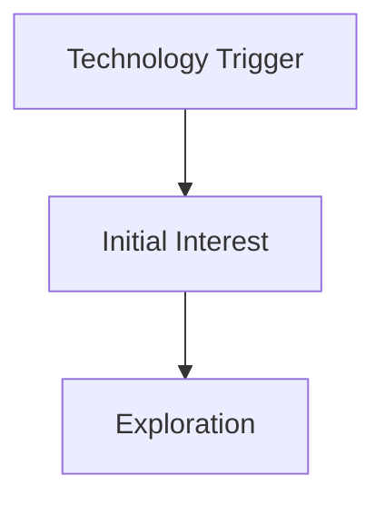
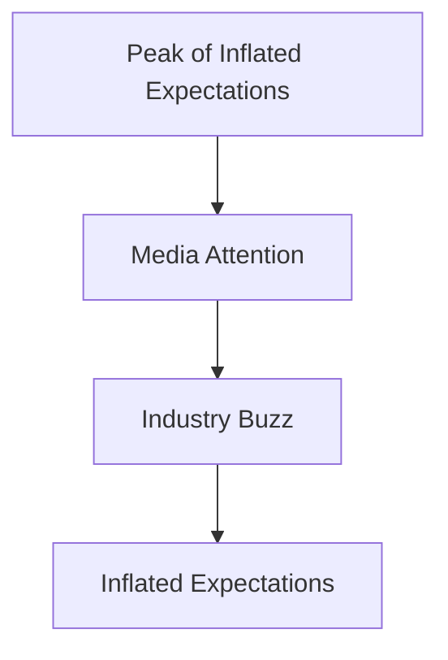
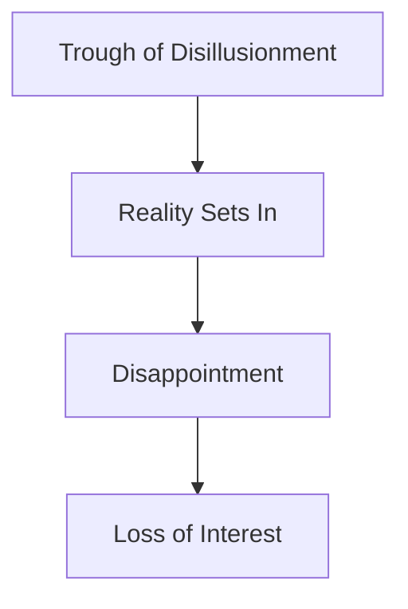
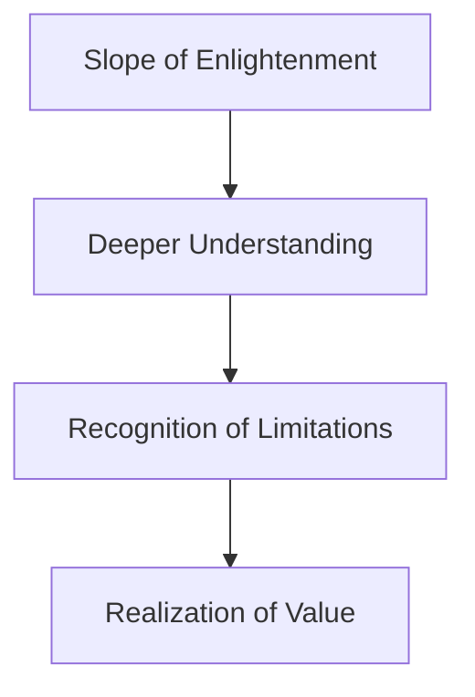
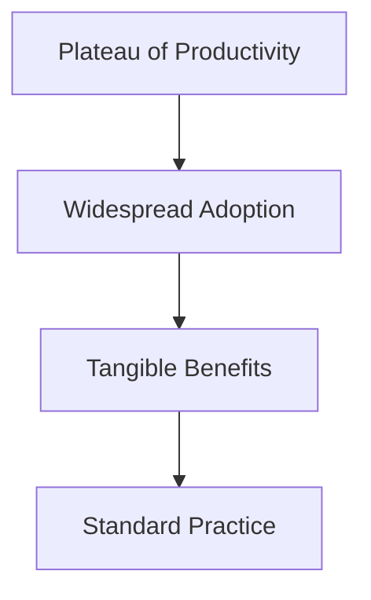

## Introduction to Gartner’s Hype Cycle

Gartner’s Hype Cycle is a widely recognized framework used to describe the maturity, adoption, and business application of specific technologies. This model helps organizations understand the lifecycle of emerging technologies and their potential impact on business processes. The Hype Cycle is particularly useful in the context of DevSecOps, where continuous integration and delivery of secure software are paramount. By understanding the phases of the Hype Cycle, organizations can better plan their adoption of new technologies and ensure they align with their business goals.

### What is Gartner’s Hype Cycle?

Gartner defines the Hype Cycle as a methodology that provides a view of how a technology or application will evolve over time. This framework is designed to help organizations manage the deployment of new technologies within the context of their specific business goals. The Hype Cycle is represented graphically, with two primary axes:

- **Expectation Axis**: This axis measures the level of interest, media attention, and expectations surrounding a technology.
- **Time Axis**: This axis represents the timeline over which the technology evolves from initial introduction to widespread adoption.

The Hype Cycle consists of five distinct phases:

1. **Technology Trigger**: A new technology or process is introduced, generating initial interest and excitement.
2. **Peak of Inflated Expectations**: Media attention and industry buzz reach a high point, leading to inflated expectations.
3. **Trough of Disillusionment**: Reality sets in, and the technology fails to meet the inflated expectations, leading to disappointment.
4. **Slope of Enlightenment**: Organizations begin to understand the true potential and limitations of the technology.
5. **Plateau of Productivity**: The technology reaches mainstream adoption and delivers tangible benefits.

### Relevance to DevSecOps

In the context of DevSecOps, the Hype Cycle is particularly relevant because it helps organizations navigate the adoption of new security tools and practices. DevSecOps emphasizes integrating security throughout the software development lifecycle, and the Hype Cycle can guide organizations through the stages of adopting new security technologies.

#### Example: Microservices and DevSecOps

Microservices architecture is a prime example of a technology that has gone through the Hype Cycle. Initially, microservices were seen as a revolutionary approach to building scalable and resilient applications. However, as organizations began implementing microservices, they encountered challenges related to complexity, security, and operational overhead.

Let’s explore how the Hype Cycle applies to microservices in the context of DevSecOps:

1. **Technology Trigger**: The introduction of microservices sparked significant interest among developers and organizations looking to improve scalability and agility.
2. **Peak of Inflated Expectations**: Media coverage and industry discussions led to inflated expectations about the benefits of microservices, including faster development cycles and improved fault isolation.
3. **Trough of Disillusionment**: As organizations implemented microservices, they faced challenges such as increased complexity, security vulnerabilities, and the need for robust monitoring and management tools.
4. **Slope of Enlightenment**: Organizations began to understand the true potential and limitations of microservices. They realized the importance of implementing security practices such as container scanning, network segmentation, and automated testing.
5. **Plateau of Productivity**: Microservices became a widely adopted architectural style, with organizations successfully integrating security practices throughout the development lifecycle.

### Detailed Phases of the Hype Cycle

#### Technology Trigger

The Technology Trigger phase marks the initial introduction of a new technology or process. This phase is characterized by innovation and excitement, as stakeholders begin to explore the potential benefits of the new technology.

**Example: Serverless Computing**

Serverless computing is an example of a technology that was initially introduced as a way to simplify application development and reduce operational overhead. During the Technology Trigger phase, organizations began experimenting with serverless platforms like AWS Lambda and Azure Functions.



#### Peak of Inflated Expectations

The Peak of Inflated Expectations phase is marked by significant media attention and industry buzz. Stakeholders become excited about the potential benefits of the new technology, leading to inflated expectations.

**Example: Artificial Intelligence (AI)**

Artificial Intelligence (AI) is a technology that has experienced a peak of inflated expectations. During this phase, media coverage and industry discussions led to high expectations about the transformative potential of AI in various domains, including healthcare, finance, and cybersecurity.



#### Trough of Disillusionment

The Trough of Disillusionment phase occurs when reality sets in, and the new technology fails to meet the inflated expectations. Stakeholders become disappointed and may lose interest in the technology.

**Example: Blockchain**

Blockchain technology is an example that has experienced a trough of disillusionment. After initial excitement and high expectations, many organizations found that blockchain did not deliver the promised benefits in terms of efficiency and security. This led to disappointment and a decline in interest.

```mer


#### Slope of Enlightenment

The Slope of Enlightenment phase is characterized by a deeper understanding of the technology and its true potential. Stakeholders begin to recognize the limitations and challenges associated with the technology, but also its value.

**Example: Containerization**

Containerization is a technology that has reached the Slope of Enlightenment. Organizations have come to understand the benefits of containerization, such as improved portability and consistency, but also the challenges related to security and management. Tools like Docker and Kubernetes have emerged to address these challenges.



#### Plateau of Productivity

The Plateau of Productivity phase is marked by widespread adoption and the realization of tangible benefits. The technology becomes a standard part of the organizational landscape, delivering consistent value.

**Example: Continuous Integration/Continuous Deployment (CI/CD)**

Continuous Integration/Continuous Deployment (CI/CD) is a practice that has reached the Plateau of Productivity. Organizations have successfully integrated CI/CD pipelines into their development workflows, leading to faster and more reliable software releases.



### Applying the Hype Cycle to DevSecOps

In the context of DevSecOps, the Hype Cycle can guide organizations through the adoption of new security technologies and practices. By understanding the different phases of the Hype Cycle, organizations can better plan their adoption of new technologies and ensure they align with their business goals.

#### Example: Container Security

Container security is an area where the Hype Cycle can be particularly useful. Initially, containerization was seen as a way to improve portability and consistency, but it also introduced new security challenges. By understanding the different phases of the Hype Cycle, organizations can better plan their adoption of container security practices.

1. **Technology Trigger**: The introduction of containerization sparked interest in improving portability and consistency.
2. **Peak of Inflated Expectations**: Media coverage and industry discussions led to high expectations about the benefits of containerization.
3. **Trough of Disillusionment**: Organizations faced challenges related to security and management, leading to disappointment.
4. **Slope of Enlightenment**: Organizations began to understand the true potential and limitations of containerization, recognizing the need for robust security practices.
5. **Plateau of Productivity**: Containerization became a standard part of the organizational landscape, with organizations successfully integrating container security practices.

### How to Prevent / Defend

Understanding the Hype Cycle can help organizations avoid common pitfalls associated with the adoption of new technologies. By recognizing the different phases of the Hype Cycle, organizations can better plan their adoption of new technologies and ensure they align with their business goals.

#### Example: Avoiding Disappointment with New Technologies

To avoid disappointment with new technologies, organizations should:

1. **Conduct Thorough Research**: Before adopting a new technology, conduct thorough research to understand its potential benefits and limitations.
2. **Pilot Projects**: Implement pilot projects to test the new technology in a controlled environment before full-scale adoption.
3. **Security Practices**: Integrate robust security practices throughout the development lifecycle to address potential security challenges.
4. **Continuous Monitoring**: Continuously monitor the adoption of new technologies to ensure they align with business goals and deliver tangible benefits.

### Conclusion

Gartner’s Hype Cycle is a valuable framework for understanding the lifecycle of emerging technologies and their potential impact on business processes. By applying the Hype Cycle to DevSecOps, organizations can better plan their adoption of new security technologies and practices, ensuring they align with their business goals. Understanding the different phases of the Hype Cycle can help organizations avoid common pitfalls and achieve tangible benefits from the adoption of new technologies.

### Practice Labs

For hands-on experience with DevSecOps and the Hype Cycle, consider the following practice labs:

- **PortSwigger Web Security Academy**: Offers practical exercises and challenges to learn about web security and DevSecOps practices.
- **OWASP Juice Shop**: A deliberately insecure web application to practice security testing and DevSecOps principles.
- **DVWA (Damn Vulnerable Web Application)**: A PHP/MySQL web application that demonstrates common web application vulnerabilities.
- **WebGoat**: An interactive training application to teach web application security lessons.

These labs provide real-world scenarios and challenges to help you apply the concepts learned in this chapter.

---
<!-- nav -->
[[DevSecOps/DevSecOps Bootcamp/08-Logging & Incident Response/02-Establishing Your Incident Response Context/03-Gartner Hype Cycle/00-Overview|Overview]] | [[02-Introduction to the Gartner Hype Cycle|Introduction to the Gartner Hype Cycle]]
