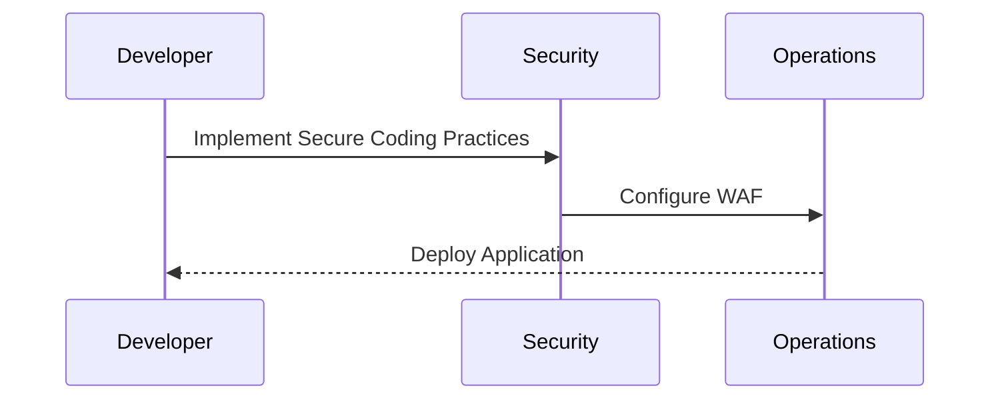
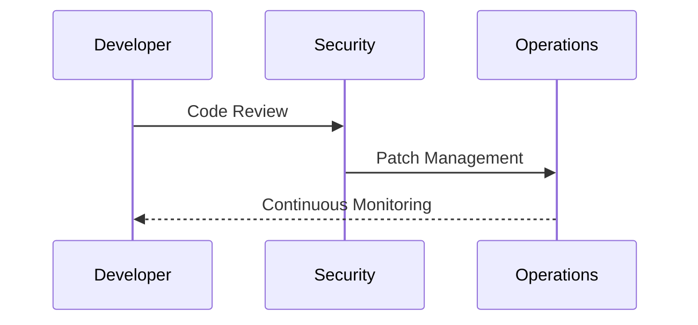

## DevSecOps in the Gartner Hype Cycle

In the context of DevSecOps, understanding where it sits on the Gartner Hype Cycle is crucial for organizations looking to adopt and implement this approach effectively.

### Current Status of DevSecOps

According to the Gartner Hype Cycle for Agile and DevOps in 2020, DevSecOps is at a 20 to 50% mainstream adoption rate. This places it well on its way up the slope of enlightenment.

#### Implications for Organizations

- **Opportunity to Get in Early**: With full mainstream adoption not yet achieved, organizations have the opportunity to get in early and establish themselves as leaders in the field.
- **Career Advancement**: Learning about DevSecOps and incident response can significantly enhance career prospects and potentially boost income due to new skills acquired.
- **Skill Satisfaction**: Regardless of career advancement, the satisfaction of learning a new skill is a significant benefit.

### Real-World Examples of DevSecOps Adoption

Several recent real-world examples illustrate the practical application of DevSecOps principles:

#### Example 1: Capital One Data Breach (CVE-2019-11510)

In 2019, Capital One experienced a data breach that exposed sensitive customer information. The breach was attributed to a misconfigured web application firewall (WAF) and inadequate security practices. This incident highlights the importance of integrating security into the development process from the outset.

#### Example 2: Equifax Data Breach (CVE-2017-5638)

In 2017, Equifax suffered a massive data breach that exposed personal information of millions of customers. The breach was caused by a vulnerability in Apache Struts, which was not patched in a timely manner. This incident underscores the need for continuous monitoring and patch management in a DevSecOps environment.

### How to Prevent / Defend Against DevSecOps Risks

To effectively prevent and defend against risks associated with DevSecOps, organizations should implement the following measures:

#### Secure Coding Practices

Secure coding practices are essential to prevent vulnerabilities from being introduced into the codebase. This includes:

- **Code Reviews**: Regularly review code for security vulnerabilities.
- **Static Analysis Tools**: Use tools like SonarQube or Fortify to scan code for security issues.
- **Dynamic Analysis Tools**: Use tools like Burp Suite or ZAP to test applications for runtime vulnerabilities.

#### Continuous Monitoring and Patch Management

Continuous monitoring and patch management are critical to maintaining the security of applications and infrastructure.

- **Continuous Integration/Continuous Deployment (CI/CD)**: Automate the build, test, and deployment processes to ensure consistency and reduce human error.
- **Patch Management**: Regularly update and patch systems to address known vulnerabilities.
- **Monitoring Tools**: Use tools like Splunk or ELK Stack to monitor system logs and detect anomalies.

#### Incident Response Planning

Incident response planning is crucial to ensure that organizations can respond effectively to security incidents.

- **Incident Response Plan**: Develop a comprehensive incident response plan that outlines roles, responsibilities, and procedures.
- **Regular Drills**: Conduct regular drills to test the effectiveness of the incident response plan.
- **Post-Incident Review**: After an incident, conduct a post-incident review to identify lessons learned and areas for improvement.

### Conclusion

Understanding where DevSecOps sits on the Gartner Hype Cycle is crucial for organizations looking to adopt and implement this approach effectively. By navigating through the trough of disillusionment and moving towards the slope of enlightenment, organizations can establish a solid foundation for future success. The plateau of productivity represents widespread adoption and standardization, ensuring the continued relevance and effectiveness of DevSecOps.

### Practice Labs

For hands-on experience with DevSecOps and incident response, consider the following well-known labs:

- **PortSwigger Web Security Academy**: Offers interactive labs to learn about web security and incident response.
- **OWASP Juice Shop**: A deliberately insecure web application for practicing web security skills.
- **DVWA (Damn Vulnerable Web Application)**: A PHP/MySQL web application that is riddled with vulnerabilities for educational purposes.
- **WebGoat**: An interactive, gamified training application for learning about web security.

By engaging in these labs, you can gain practical experience and deepen your understanding of DevSecOps principles and incident response techniques.

---
<!-- nav -->
[[02-Introduction to the Gartner Hype Cycle|Introduction to the Gartner Hype Cycle]] | [[DevSecOps/DevSecOps Bootcamp/08-Logging & Incident Response/02-Establishing Your Incident Response Context/03-Gartner Hype Cycle/00-Overview|Overview]] | [[DevSecOps/DevSecOps Bootcamp/08-Logging & Incident Response/02-Establishing Your Incident Response Context/03-Gartner Hype Cycle/04-Establishing Your Incident Response Context|Establishing Your Incident Response Context]]
