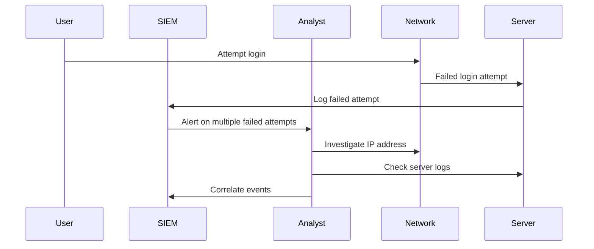

## Establishing Your Incident Response Context

### Introduction to Incident Response

Incident response is a critical component of DevSecOps, ensuring that organizations can quickly and effectively respond to security incidents. This process involves identifying, analyzing, containing, eradicating, and recovering from security breaches. The goal is to minimize damage, reduce recovery time, and prevent future incidents.

### Learning New Skills for Incident Response

To effectively manage incident response, teams must continuously learn and adapt to new threats and technologies. This involves acquiring new skills and knowledge, such as understanding different types of attacks, mastering tools for incident detection and response, and staying updated with the latest security practices.

#### Background Theory

Incident response is typically guided by a structured framework, such as the NIST Cybersecurity Framework or the SANS Institute’s Incident Handling Process. These frameworks provide a systematic approach to handling security incidents, covering phases like preparation, identification, containment, eradication, recovery, and post-incident activities.

### Real-World Examples

Recent high-profile breaches highlight the importance of effective incident response:

- **SolarWinds Supply Chain Attack (CVE-2020-16145)**: This sophisticated supply chain attack compromised SolarWinds Orion software, leading to widespread breaches across various organizations. The attackers used a backdoor to gain unauthorized access to systems. Effective incident response would have involved monitoring for unusual activity, isolating affected systems, and conducting a thorough investigation to identify the root cause.

- **Colonial Pipeline Ransomware Attack (May 2021)**: This ransomware attack disrupted fuel supplies across the eastern United States. The attackers exploited a leaked password to gain access to the network. Incident response included isolating affected systems, restoring backups, and working with law enforcement to trace the attackers.

### Tools and Techniques

Effective incident response requires a combination of tools and techniques:

- **SIEM (Security Information and Event Management) Systems**: SIEM tools aggregate and analyze log data from various sources to detect anomalies and potential security incidents. They provide real-time alerts and historical analysis capabilities.

- **Network Monitoring Tools**: Tools like Wireshark and tcpdump help capture and analyze network traffic to identify suspicious patterns.

- **Forensic Analysis Tools**: Tools like Volatility and Autopsy assist in forensic analysis of memory dumps and disk images to uncover evidence of an attack.

### Example: Using SIEM for Incident Detection

Consider a scenario where a SIEM system detects an unusual number of failed login attempts from a specific IP address. The following steps outline the incident response process:



#### Full HTTP Request and Response Example

Here is an example of a full HTTP request and response for accessing a server log:

```http
GET /logs/server.log HTTP/1.1
Host: example.com
Authorization: Bearer <token>
Accept: application/json

HTTP/1.1 200 OK
Date: Mon, 20 Mar 2023 12:00:00 GMT
Content-Type: application/json
Content-Length: 1234

{
  "log": [
    {
      "timestamp": "2023-03-20T12:00:00Z",
      "event": "Failed login attempt",
      "ip_address": "192.168.1.1"
    },
    ...
  ]
}
```

### How to Prevent / Defend

#### Vulnerable Code Example

Consider a web application that does not properly handle failed login attempts:

```python
# Vulnerable code
def login(username, password):
    user = get_user_by_username(username)
    if user and user.password == password:
        return True
    else:
        return False
```

#### Secure Code Example

A more secure approach involves rate-limiting login attempts and logging failed attempts:

```python
# Secure code
import time

login_attempts = {}

def login(username, password):
    if username in login_attempts and time.time() - login_attempts[username] < 60:
        raise Exception("Too many login attempts")
    
    user = get_user_by_username(username)
    if user and user.password == password:
        return True
    else:
        login_attempts[username] = time.time()
        log_failed_attempt(username)
        return False
```

### Hands-On Labs

For practical experience in incident response, consider the following labs:

- **PortSwigger Web Security Academy**: Offers interactive labs to practice detecting and responding to web application vulnerabilities.
- **OWASP Juice Shop**: A deliberately insecure web application for practicing security testing and incident response.
- **DVWA (Damn Vulnerable Web Application)**: Another intentionally vulnerable web application for learning security concepts.

By continuously learning new skills and applying them through practical exercises, teams can enhance their ability to respond effectively to security incidents.

---
<!-- nav -->
[[03-DevSecOps in the Gartner Hype Cycle|DevSecOps in the Gartner Hype Cycle]] | [[DevSecOps/DevSecOps Bootcamp/08-Logging & Incident Response/02-Establishing Your Incident Response Context/03-Gartner Hype Cycle/00-Overview|Overview]] | [[DevSecOps/DevSecOps Bootcamp/08-Logging & Incident Response/02-Establishing Your Incident Response Context/03-Gartner Hype Cycle/05-Practice Questions & Answers|Practice Questions & Answers]]
