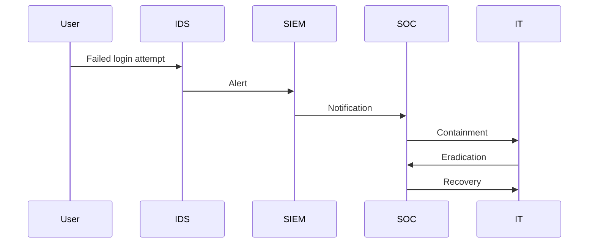

## Security Incident Management

Security incident management is the process of monitoring and detecting security events on a computer or computer network and executing proper responses to those events. This is a specialized form of incident management focused specifically on security events and incidents.

### Definition and Purpose

**Definition**: According to Wikipedia, security incident management is defined as the monitoring and detection of security events on a computer or computer network and the execution of proper responses to those events.

**Purpose**: The primary purpose of security incident management is to develop a well-understood and predictable response to damaging events and computer intrusions. This ensures that organizations can quickly identify and mitigate security threats, minimizing the impact on their operations.

### Similarities and Differences with General Incident Management

Security incident management is similar to general incident management in that both aim to ensure that systems and networks operate effectively and perform well. However, security incident management has a specific focus on security events and incidents, ensuring that proper responses are executed to any alerts and events that occur.

### Components of Security Incident Management

#### Monitoring and Detection

Monitoring involves continuously observing systems and networks for signs of security events. Detection involves identifying and analyzing these events to determine whether they pose a threat.

**Tools and Techniques**:
- **Intrusion Detection Systems (IDS)**: IDS tools monitor network traffic and system logs for suspicious activity. They can be configured to alert administrators when certain patterns are detected.
- **Security Information and Event Management (SIEM)**: SIEM solutions aggregate and analyze log data from various sources to detect security events. They provide real-time visibility into security threats and help prioritize responses.

**Example Configuration**:
```json
{
  "rules": [
    {
      "name": "Failed Login Attempts",
      "description": "Detects multiple failed login attempts within a short time frame.",
      "pattern": "failed_login_attempts > 5",
      "action": "alert"
    },
    {
      "name": "Unusual Network Traffic",
      "description": "Detects unusual network traffic patterns.",
      "pattern": "network_traffic > 100MB",
      "action": "investigate"
    }
  ]
}
```

#### Response Execution

Response execution involves taking appropriate actions to mitigate the identified security event. This includes containment, eradication, and recovery.

**Steps**:
1. **Containment**: Isolate affected systems to prevent further damage.
2. **Eradication**: Remove the threat and restore systems to a secure state.
3. **Recovery**: Restore normal operations and implement preventive measures to avoid future incidents.

**Example Workflow**:


### Real-World Examples

#### Equifax Breach (2017)

**Incident**: Equifax, a consumer credit reporting agency, suffered a massive data breach that exposed personal information of over 143 million people.

**Cause**: Attackers exploited a vulnerability in Apache Struts (CVE-2017-5638) to gain unauthorized access to sensitive data.

**Impact**: Financial penalties, loss of customer trust, and reputational damage.

**Response**: Equifax implemented stronger security measures, including encryption, access controls, and regular security audits.

#### Target Breach (2013)

**Incident**: Target, a retail corporation, experienced a data breach that resulted in the theft of credit card data.

**Cause**: Attackers installed malware on point-of-sale systems to capture credit card data.

**Impact**: Financial losses, legal issues, and reputational damage.

**Response**: Target enhanced its security posture by implementing intrusion detection systems, digital signatures, and regular audits.

#### WannaCry Ransomware Attack (2017)

**Incident**: The WannaCry ransomware attack affected hundreds of thousands of computers worldwide, causing significant disruptions.

**Cause**: Attackers exploited a vulnerability in Microsoft Windows (EternalBlue) to spread ransomware.

**Impact**: Widespread disruption, financial losses, and reputational damage.

**Response**: Organizations updated their software, implemented redundancy, and developed disaster recovery plans to maintain system availability.

### How to Prevent / Defend

#### Detection

**Tools and Techniques**:
- **Intrusion Detection Systems (IDS)**: Monitor network traffic and system logs for suspicious activity.
- **Security Information and Event Management (SIEM)**: Aggregate and analyze log data from various sources to detect security events.

**Example Configuration**:
```json
{
  "rules": [
    {
      "name": "Failed Login Attempts",
      "description": "Detects multiple failed login attempts within a short time frame.",
      "pattern": "failed_login_attempts >  5",
      "action": "alert"
    },
    {
      "name": "Unusual Network Traffic",
      "description": "Detects unusual network traffic patterns.",
      "pattern": "network_traffic > 100MB",
      "action": "investigate"
    }
  ]
}
```

#### Prevention

**Secure Coding Practices**:
- **Input Validation**: Validate all user inputs to prevent injection attacks.
- **Access Controls**: Implement strong access controls to restrict unauthorized access.
- **Encryption**: Use encryption to protect sensitive data.

**Example Vulnerable Code**:
```python
# Vulnerable code
def login(username, password):
    if username == "admin" and password == "password":
        return True
    else:
        return False
```

**Example Secure Code**:
```python
# Secure code
import hashlib

def login(username, hashed_password):
    stored_hashed_password = get_stored_password(username)
    if hashlib.sha256(hashed_password.encode()).hexdigest() == stored_hashed_password:
        return True
    else:
        return False
```

#### Hardening

**Configuration Hardening**:
- **Operating System**: Harden operating systems by disabling unnecessary services and applying security patches.
- **Network Devices**: Configure network devices with strong access controls and encryption.

**Example Configuration**:
```json
{
  "network_devices": [
    {
      "device_name": "Router1",
      "access_control_list": [
        {
          "rule": "deny all",
          "interface": "eth0"
        },
        {
          "rule": "allow ssh",
          "interface": "eth1"
        }
      ]
    }
  ]
}
```

### Practice Labs

For hands-on experience with security incident management, consider the following practice labs:

- **PortSwigger Web Security Academy**: Offers interactive labs to learn about web application security.
- **OWASP Juice Shop**: A deliberately insecure web application to practice security testing.
- **DVWA (Damn Vulnerable Web Application)**: A PHP/MySQL web application with numerous security vulnerabilities.
- **WebGoat**: An interactive training application designed to teach web application security lessons.

These labs provide practical experience in identifying and managing security incidents, helping to develop a well-understood and predictable response to damaging events and computer intrusions.

By thoroughly understanding the CIA triangle and the components of security incident management, organizations can better prepare for and respond to security threats, ensuring the confidentiality, integrity, and availability of their systems and data.

---
<!-- nav -->
[[DevSecOps/DevSecOps Bootcamp/08-Logging & Incident Response/02-Establishing Your Incident Response Context/05-Security Incidents and Management/00-Overview|Overview]] | [[02-The CIA Triangle of Security|The CIA Triangle of Security]]
