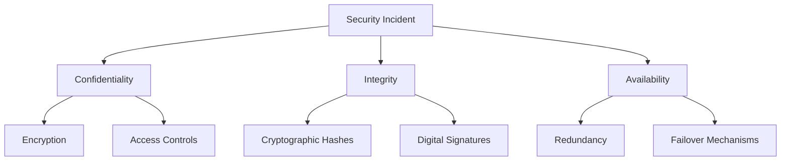

## Understanding Security Incidents in DevSecOps

### Definition of a Security Incident

To effectively integrate incident response into DevSecOps, it is crucial to have a clear understanding of what constitutes a security incident. According to the National Institute of Standards and Technology (NIST), a computer security incident is defined as a violation or imminent threat of violation of computer security policies, acceptable use policies, or standard security practices. This definition encompasses a wide range of scenarios, from unauthorized access to data breaches and malicious activities.

### Simplifying the Concept

While the NIST definition provides a comprehensive overview, it can be helpful to break down the concept into more manageable components. At its core, a security incident involves a breach of trust and integrity within an IT system. To better understand this, let's explore the three main pillars of security: confidentiality, integrity, and availability.

#### Confidentiality

**Definition:** Confidentiality ensures that sensitive information is accessible only to authorized individuals. Unauthorized disclosure of confidential information can lead to significant consequences, including financial loss, reputational damage, and legal liabilities.

**Why It Matters:** In many industries, such as healthcare and finance, maintaining the confidentiality of sensitive data is paramount. A breach of confidentiality can result in severe repercussions, including regulatory penalties and loss of customer trust.

**Real-World Example:** The 2017 Equifax data breach is a prime example of a confidentiality violation. Hackers accessed sensitive personal information of approximately 147 million consumers, leading to widespread panic and significant financial losses for both Equifax and affected individuals.

**How It Works Under the Hood:** Confidentiality is typically enforced through encryption, access controls, and secure communication protocols. Encryption ensures that data is unreadable to unauthorized parties, while access controls restrict who can view or modify sensitive information.

**Common Pitfalls:** One common pitfall is the improper handling of encryption keys. If encryption keys are not securely managed, they can be stolen and used to decrypt sensitive data. Another issue is the lack of proper access controls, which can allow unauthorized users to access confidential information.

**How to Prevent / Defend:**

- **Detection:** Implement monitoring tools to detect unauthorized access attempts and unusual activity patterns.
- **Prevention:** Use strong encryption algorithms and manage encryption keys securely. Implement strict access controls and enforce least privilege principles.
- **Secure Coding Fix:**
  ```python
  # Vulnerable Code
  def get_sensitive_data(user_id):
      return database.query(f"SELECT * FROM sensitive_data WHERE user_id = {user_id}")

  # Secure Code
  def get_sensitive_data(user_id):
      query = "SELECT * FROM sensitive_data WHERE user_id = %s"
      return database.query(query, (user_id,))
  ```

- **Configuration Hardening:**
  ```json
  {
    "security": {
      "encryption": {
        "algorithm": "AES",
        "key_length": 256,
        "key_management": "HSM"
      },
      "access_control": {
        "policy": "least_privilege",
        "audit_logs": true
      }
    }
  }
  ```

#### Integrity

**Definition:** Integrity ensures that data and systems are accurate and have not been tampered with by unauthorized entities. Any unauthorized modification of data or system configurations can compromise the integrity of the system.

**Why It Matters:** Maintaining the integrity of data and systems is essential for ensuring the reliability and trustworthiness of IT infrastructure. Without integrity, the accuracy and consistency of data cannot be guaranteed, leading to potential operational disruptions and financial losses.

**Real-World Example:** The 2017 WannaCry ransomware attack is a notable example of an integrity violation. The malware encrypted files on infected systems, rendering them inaccessible until a ransom was paid. This attack compromised the integrity of numerous organizations' data, causing significant operational disruptions.

**How It Works Under the Hood:** Integrity is typically maintained through cryptographic hashes, digital signatures, and checksums. These mechanisms ensure that data has not been altered during transmission or storage.

**Common Pitfalls:** One common pitfall is the lack of proper validation and verification mechanisms. Without these safeguards, it is difficult to detect unauthorized modifications to data or system configurations.

**How to Prevent / Defend:**

- **Detection:** Implement integrity checks using cryptographic hashes and digital signatures to verify the authenticity and integrity of data.
- **Prevention:** Use secure coding practices to validate input and output data. Implement robust validation mechanisms to detect and prevent unauthorized modifications.
- **Secure Coding Fix:**
  ```python
  # Vulnerable Code
  def update_user_data(user_id, new_data):
      database.execute(f"UPDATE users SET data = '{new_data}' WHERE id = {user_id}")

  # Secure Code
  def update_user_data(user_id, new_data):
      query = "UPDATE users SET data = %s WHERE id = %s"
      database.execute(query, (new_data, user_id))
  ```

- **Configuration Hardening:**
  ```json
  {
    "security": {
      "integrity": {
        "hash_algorithm": "SHA-256",
        "digital_signatures": true,
        "validation_mechanisms": ["input_validation", "output_validation"]
      }
    }
  }
  ```

#### Availability

**Definition:** Availability ensures that systems and services are accessible and operational when needed. Downtime or unavailability can lead to significant business disruptions and financial losses.

**Why It Matters:** Ensuring the availability of critical systems and services is essential for maintaining business continuity. Unavailability can result in lost revenue, customer dissatisfaction, and reputational damage.

**Real-World Example:** The 2021 SolarWinds supply chain attack is a prime example of an availability violation. The attackers compromised SolarWinds' software update mechanism, leading to widespread unavailability of critical systems across various organizations.

**How It Works Under the Hood:** Availability is typically ensured through redundancy, failover mechanisms, and disaster recovery plans. These measures help maintain system uptime even in the face of hardware failures or other disruptions.

**Common Pitfalls:** One common pitfall is the lack of proper redundancy and failover mechanisms. Without these safeguards, systems can become unavailable due to hardware failures or other unforeseen events.

**How to Prevent / Defend:**

- **Detection:** Implement monitoring tools to detect system downtime and performance issues. Use log analysis to identify potential availability issues.
- **Prevention:** Implement redundancy and failover mechanisms to ensure system availability. Develop and maintain disaster recovery plans to quickly restore services in case of disruptions.
- **Secure Coding Fix:**
  ```python
  # Vulnerable Code
  def process_request(request):
      try:
          result = database.query(request)
      except Exception as e:
          print(f"Error: {e}")
          return None

  # Secure Code
  def process_request(request):
      try:
          result = database.query(request)
      except Exception as e:
          logging.error(f"Error processing request: {e}")
          return {"status": "error", "message": str(e)}
  ```

- **Configuration Hardening:**
  ```json
  {
    "security": {
      "availability": {
        "redundancy": true,
        "failover_mechanisms": ["load_balancing", "hot_standby"],
        "disaster_recovery": {
          "plan": "active",
          "testing_frequency": "quarterly"
        }
      }
    }
  }
  ```

### Integrating Incident Response into DevSecOps

Now that we have a solid understanding of what constitutes a security incident and the three main pillars of security, let's explore how to integrate incident response into DevSecOps.

#### Incident Response Plan

An effective incident response plan is essential for managing security incidents efficiently. The plan should outline the steps to be taken in the event of a security incident, including:

- **Detection:** Identifying and reporting security incidents.
- **Containment:** Isolating affected systems to prevent further damage.
- **Eradication:** Removing the root cause of the incident.
- **Recovery:** Restoring affected systems to their normal state.
- **Lessons Learned:** Documenting the incident and identifying areas for improvement.

**Real-World Example:** The 2017 Equifax data breach highlighted the importance of having an effective incident response plan. Despite the breach, Equifax's response was criticized for being slow and inadequate, leading to further reputational damage.

**How It Works Under the Hood:** An incident response plan typically involves a combination of automated tools and manual processes. Automated tools can help detect and contain incidents quickly, while manual processes are necessary for eradicating the root cause and recovering affected systems.

**Common Pitfalls:** One common pitfall is the lack of regular testing and updating of the incident response plan. Without regular testing, the plan may not be effective when a real incident occurs.

**How to Prevent / Defend:**

- **Detection:** Implement monitoring tools to detect security incidents. Regularly review logs and alerts to identify potential incidents.
- **Containment:** Use automated tools to isolate affected systems quickly. Develop playbooks for common incident scenarios to ensure consistent and effective containment.
- **Eradication:** Identify and remove the root cause of the incident. Use forensic tools to analyze the incident and determine the extent of the damage.
- **Recovery:** Restore affected systems to their normal state. Develop and maintain backup and recovery procedures to ensure quick restoration.
- **Lessons Learned:** Document the incident and identify areas for improvement. Regularly review and update the incident response plan based on lessons learned.

- **Secure Coding Fix:**
  ```python
  # Vulnerable Code
  def handle_incident(incident):
      print(f"Handling incident: {incident}")

  # Secure Code
  def handle_incident(incident):
      logging.info(f"Handling incident: {incident}")
      # Perform incident handling steps
      # ...
      logging.info("Incident handled successfully")
  ```

- **Configuration Hardening:**
  ```json
  {
    "security": {
      "incident_response": {
        "detection": {
          "tools": ["SIEM", "IDS"],
          "alert_thresholds": {
            "high": 5,
            "medium": 10,
            "low": 20
          }
        },
        "containment": {
          "playbooks": ["network_isolation", "system_shutdown"],
          "automation": true
        },
        "eradication": {
          "forensic_tools": ["volatility", "splunk"],
          "root_cause_analysis": true
        },
        "recovery": {
          "backup_procedures": ["incremental_backups", "full_backups"],
          "restoration_steps": ["restore_from_backup", "manual_restoration"]
        },
        "lessons_learned": {
          "documentation": true,
          "review_frequency": "monthly"
        }
      }
    }
  }
  ```

### Hands-On Labs for Practice

To gain practical experience with incident response in DevSecOps, consider the following hands-on labs:

- **PortSwigger Web Security Academy:** Offers a variety of labs focused on web application security, including incident response scenarios.
- **OWASP Juice Shop:** Provides a vulnerable web application for practicing incident response and security testing.
- **DVWA (Damn Vulnerable Web Application):** Allows you to practice incident response in a controlled environment with various vulnerabilities.
- **WebGoat:** Offers interactive lessons and labs for learning web application security, including incident response scenarios.

By engaging in these hands-on labs, you can apply the theoretical knowledge gained from this chapter to real-world scenarios and improve your skills in incident response and DevSecOps.

### Conclusion

In conclusion, understanding and effectively managing security incidents is a critical component of DevSecOps. By defining what constitutes a security incident and exploring the three main pillars of security—confidentiality, integrity, and availability—you can build a robust incident response plan that helps protect your organization from potential threats. Through regular testing, updating, and continuous improvement, you can ensure that your incident response plan remains effective and up-to-date. By leveraging hands-on labs and practical exercises, you can gain valuable experience and enhance your skills in incident response and DevSecOps.



This diagram illustrates the relationship between a security incident and the three main pillars of security: confidentiality, integrity, and availability. Each pillar is further broken down into specific mechanisms that help maintain the respective aspect of security.

By thoroughly understanding and implementing these concepts, you can effectively integrate incident response into your DevSecOps practices and protect your organization from potential security threats.

---
<!-- nav -->
[[02-The CIA Triangle of Security|The CIA Triangle of Security]] | [[DevSecOps/DevSecOps Bootcamp/08-Logging & Incident Response/02-Establishing Your Incident Response Context/05-Security Incidents and Management/00-Overview|Overview]] | [[DevSecOps/DevSecOps Bootcamp/08-Logging & Incident Response/02-Establishing Your Incident Response Context/05-Security Incidents and Management/04-Practice Questions & Answers|Practice Questions & Answers]]
