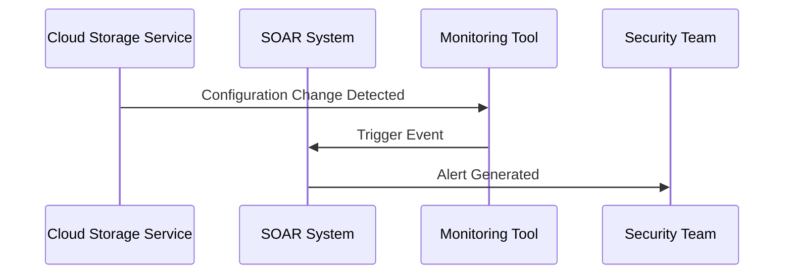
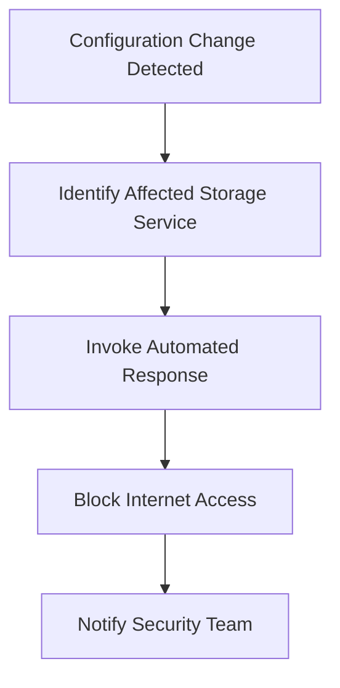
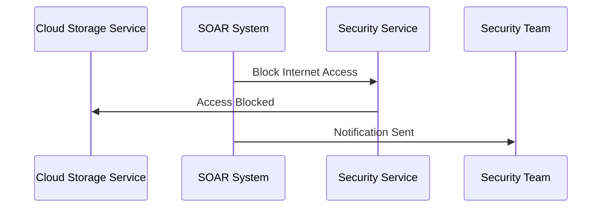
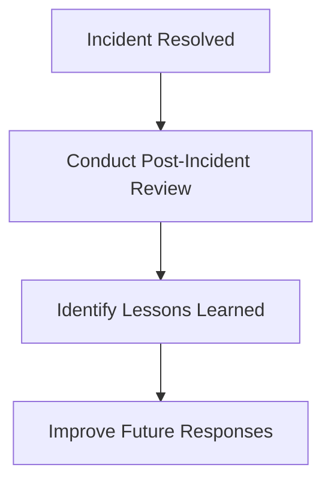

## Introduction to Security Orchestration and Response (SOAR)

Security Orchestration and Response (SOAR) is a comprehensive approach to managing security incidents through automation and integration of various security tools and processes. SOAR systems aim to address the challenges of handling large volumes of security events, reducing the fatigue of security analysts, and ensuring timely and effective responses to threats. This chapter will delve into the details of SOAR, including its components, benefits, and practical applications.

### Components of SOAR

SOAR systems consist of three main components:

1. **Security Orchestration**: This involves integrating and coordinating various security tools and services to create a unified security infrastructure.
2. **Incident Response**: This component focuses on automating the response to security incidents, including detection, analysis, and remediation.
3. **Threat Intelligence**: This involves gathering and analyzing threat data to enhance the organization's security posture.

### Benefits of SOAR

The primary benefits of SOAR include:

- **Reduced Fatigue**: By automating routine tasks, SOAR reduces the workload on security analysts, allowing them to focus on more complex issues.
- **Improved Efficiency**: SOAR systems can process large volumes of security events quickly and accurately, leading to faster incident resolution.
- **Enhanced Collaboration**: SOAR facilitates better communication and coordination among different teams involved in incident response.
- **Scalability**: Predefined scripts and runbooks enable organizations to handle increasing volumes of security events effectively.

### Example Scenario: Cloud Storage Exposure

Let's consider a scenario where a cloud storage service is exposed due to a configuration error. This scenario will help illustrate how SOAR can be used to manage such incidents.

#### Background Theory

Cloud storage services like Amazon S3, Google Cloud Storage, and Azure Blob Storage are widely used for storing and retrieving data. However, misconfigurations can lead to unintended exposure of sensitive data. This can result in data breaches, compliance violations, and reputational damage.

#### Real-World Example

In 2021, a misconfiguration in an Amazon S3 bucket led to the exposure of sensitive data belonging to a major financial institution. This incident highlights the importance of proper configuration management and the need for automated monitoring and response mechanisms.

### SOAR Implementation Steps

To implement SOAR for the cloud storage exposure scenario, follow these steps:

1. **Event Detection**: Identify the security event that triggers the incident response workflow.
2. **Runbook Execution**: Execute predefined scripts or runbooks to address the incident.
3. **Automated Response**: Implement automated actions to mitigate the threat.
4. **Post-Incident Analysis**: Conduct a post-incident review to identify lessons learned and improve future responses.

#### Event Detection

Event detection involves monitoring for changes in the configuration of cloud storage services. This can be achieved using cloud-native tools or third-party security solutions.



#### Runbook Execution

A runbook is a set of predefined instructions that guide the response to a security incident. In this scenario, the runbook would include steps to identify the affected storage service and determine the appropriate response.



#### Automated Response

The automated response involves blocking internet access to the affected storage service. This can be achieved using cloud-native security features or third-party security solutions.



#### Post-Incident Analysis

After the incident is resolved, a post-incident review should be conducted to identify lessons learned and improve future responses.



### Complete Example: Cloud Storage Exposure

Let's walk through a complete example of how SOAR can be used to manage a cloud storage exposure incident.

#### Initial Configuration

Assume we have a cloud storage service configured with public access enabled due to a configuration error.

```yaml
# Cloud Storage Configuration
storage:
  name: my-storage-bucket
  access:
    public: true
```

#### Event Detection

The monitoring tool detects the configuration change and triggers an event.

```http
POST /api/events HTTP/1.1
Host: monitoring-tool.example.com
Content-Type: application/json

{
  "event": {
    "type": "configuration_change",
    "resource": "my-storage-bucket",
    "details": {
      "public_access": true
    }
  }
}
```

#### Runbook Execution

The SOAR system executes the predefined runbook to address the incident.


#### Automated Response

The SOAR system invokes the automated response to block internet access.

```http
PUT /api/storage/my-storage-bucket/access HTTP/1.1
Host: cloud-storage-service.example.com
Content-Type: application/json

{
  "access": {
    "public": false
  }
}
```

#### Post-Incident Analysis

After the incident is resolved, a post-incident review is conducted.


### How to Prevent / Defend

To prevent and defend against cloud storage exposure incidents, follow these steps:

#### Secure Configuration Management

Ensure that cloud storage services are configured securely by default. Use least privilege principles and avoid public access unless absolutely necessary.

```yaml
# Secure Cloud Storage Configuration
storage:
  name: my-storage-bucket
  access:
    public: false
```

#### Automated Monitoring

Implement automated monitoring to detect configuration changes and other security events. Use cloud-native tools or third-party security solutions to monitor for misconfigurations.

```http
GET /api/events?type=configuration_change HTTP/1.1
Host: monitoring-tool.example.com
```

#### Incident Response Playbooks

Develop and maintain incident response playbooks to guide the response to security incidents. Ensure that playbooks are regularly updated and tested.


#### Regular Audits

Conduct regular audits to ensure that cloud storage services are configured securely and that security policies are being followed.

```http
GET /api/audits HTTP/1.1
Host: audit-tool.example.com
```

### Conclusion

SOAR systems provide a powerful framework for managing security incidents through automation and integration. By implementing SOAR, organizations can reduce the workload on security analysts, improve efficiency, and enhance their overall security posture. The example scenario of cloud storage exposure demonstrates how SOAR can be used to detect, respond to, and prevent security incidents.

### Practice Labs

For hands-on experience with SOAR, consider the following practice labs:

- **PortSwigger Web Security Academy**: Offers interactive labs on web security, including incident response scenarios.
- **OWASP Juice Shop**: Provides a vulnerable web application for practicing security testing and incident response.
- **DVWA (Damn Vulnerable Web Application)**: A deliberately insecure web application for learning about web application security.

These labs will help you gain practical experience with SOAR and related security concepts.

---

This chapter provides a comprehensive overview of Security Orchestration and Response (SOAR), including its components, benefits, and practical applications. By understanding and implementing SOAR, organizations can effectively manage security incidents and enhance their overall security posture.

---
<!-- nav -->
[[DevSecOps/DevSecOps Bootcamp/08-Logging & Incident Response/02-Establishing Your Incident Response Context/06-Security Orchestration and Response SOAR/00-Overview|Overview]] | [[02-Establishing Your Incident Response Context Security Orchestration and Response (SOAR)|Establishing Your Incident Response Context Security Orchestration and Response (SOAR)]]
