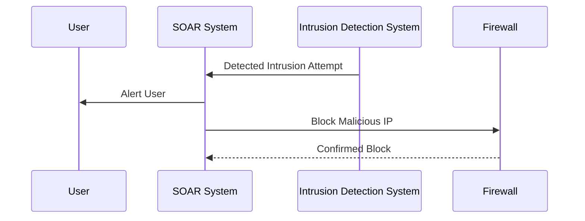
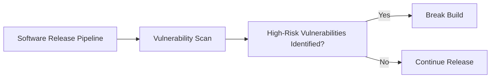

## Establishing Your Incident Response Context: Security Orchestration and Response (SOAR)

### Introduction to SOAR

Security Orchestration and Response (SOAR) is a set of tools and processes designed to help organizations manage cybersecurity incidents more effectively. SOAR solutions automate and streamline incident response processes, ensuring that security teams can respond to threats quickly and efficiently. This is particularly critical in today’s fast-paced threat landscape, where timely response can mean the difference between a minor incident and a major breach.

#### Key Components of SOAR

1. **Incident Management**: Centralized management of security incidents, including triage, investigation, and resolution.
2. **Playbooks**: Predefined workflows that guide the response process, ensuring consistency and efficiency.
3. **Automation**: Automating repetitive tasks to free up human resources for more complex issues.
4. **Integration**: Connecting various security tools and systems to provide a unified view of the security posture.

### Timely Incident Response

One of the primary promises of SOAR is the ability to undertake incident response in a timely manner, potentially around the clock. This is crucial because many cyber attacks occur outside regular business hours, and delays in response can significantly increase the damage caused by an attack.

#### Example: Real-Time Threat Detection

Consider a scenario where a company detects a potential intrusion attempt at 3 AM. Without SOAR, the response might be delayed until the next business day, giving attackers ample time to escalate their access and cause more damage. With SOAR, automated systems can detect the intrusion, initiate a predefined playbook, and take immediate action, such as isolating affected systems or blocking malicious IP addresses.



### Compliance and Automation

Another key area where SOAR can provide significant benefits is in compliance. Many industries have strict regulatory requirements that must be met, such as the Payment Card Industry Data Security Standard (PCI DSS) for the payment card industry. PCI DSS requires organizations to perform regular security scans to identify vulnerabilities.

#### PCI DSS Requirements

PCI DSS mandates that organizations perform both internal and external security scans at least quarterly and after significant changes in the network. These scans are typically conducted manually, which can be time-consuming and error-prone. By integrating these scans into the software release pipeline, organizations can ensure that they are performed consistently and automatically.



### Automated Vulnerability Scanning

Automated vulnerability scanning can be integrated into the software release pipeline using tools like OWASP ZAP, Nessus, or Qualys. These tools can automatically scan the application and infrastructure for known vulnerabilities and report back to the pipeline.

#### Example: Integrating Vulnerability Scanning into CI/CD

Here’s an example of how you might integrate vulnerability scanning into a CI/CD pipeline using Jenkins and OWASP ZAP:

```yaml
# Jenkinsfile
pipeline {
    agent any
    stages {
        stage('Build') {
            steps {
                sh 'mvn clean install'
            }
        }
        stage('Vulnerability Scan') {
            steps {
                script {
                    def zap = load 'path/to/zap-plugin'
                    def scanResult = zap.scan('http://localhost:8080')
                    if (scanResult.contains('High')) {
                        currentBuild.result = 'FAILURE'
                        error('High-risk vulnerabilities found')
                    }
                }
            }
        }
        stage('Deploy') {
            steps {
                sh 'kubectl apply -f deployment.yaml'
            }
        }
    }
}
```

### How to Prevent / Defend

#### Vulnerability Management

To prevent vulnerabilities from being released, organizations should implement robust vulnerability management practices. This includes:

1. **Regular Scans**: Conduct regular vulnerability scans as part of the release pipeline.
2. **Patch Management**: Ensure that all systems are kept up-to-date with the latest security patches.
3. **Secure Coding Practices**: Implement secure coding practices to reduce the likelihood of introducing vulnerabilities in the first place.

#### Secure Code Example

Here’s an example of a vulnerable code snippet and its secure counterpart:

**Vulnerable Code:**
```java
// Vulnerable code
public String getUserInput(String input) {
    return input;
}
```

**Secure Code:**
```java
// Secure code
public String getUserInput(String input) {
    if (input == null || !input.matches("[a-zA-Z0-9]+")) {
        throw new IllegalArgumentException("Invalid input");
    }
    return input;
}
```

### Real-World Examples

#### Recent Breaches

Recent breaches have highlighted the importance of timely and consistent security operations. For example, the Capital One breach in 2019 exposed sensitive data due to misconfigured web servers. Had the organization had robust SOAR capabilities, the misconfiguration might have been detected and remediated more quickly.

#### CVE Examples

CVE-2021-21972 is a recent example of a vulnerability that could have been detected and mitigated through automated scanning. This vulnerability affects Apache Log4j and allows remote code execution. Organizations that integrate vulnerability scanning into their CI/CD pipelines can catch such vulnerabilities before they are deployed.

### Hands-On Labs

For hands-on practice with SOAR and vulnerability management, consider the following labs:

- **PortSwigger Web Security Academy**: Offers interactive labs on web security, including vulnerability scanning and secure coding practices.
- **OWASP Juice Shop**: A deliberately insecure web application for practicing web security skills.
- **CloudGoat**: Provides hands-on labs for learning about cloud security, including SOAR and compliance.

By integrating SOAR into your security operations, you can ensure that your organization is better prepared to handle security incidents and maintain compliance with regulatory requirements.

---
<!-- nav -->
[[01-Introduction to Security Orchestration and Response (SOAR)|Introduction to Security Orchestration and Response (SOAR)]] | [[DevSecOps/DevSecOps Bootcamp/08-Logging & Incident Response/02-Establishing Your Incident Response Context/06-Security Orchestration and Response SOAR/00-Overview|Overview]] | [[DevSecOps/DevSecOps Bootcamp/08-Logging & Incident Response/02-Establishing Your Incident Response Context/06-Security Orchestration and Response SOAR/03-Practice Questions & Answers|Practice Questions & Answers]]
