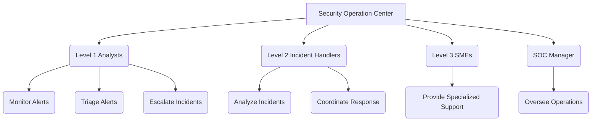
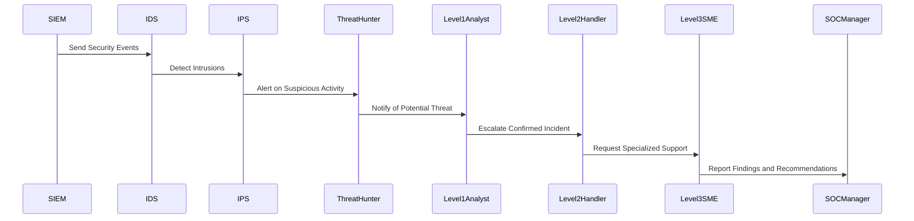
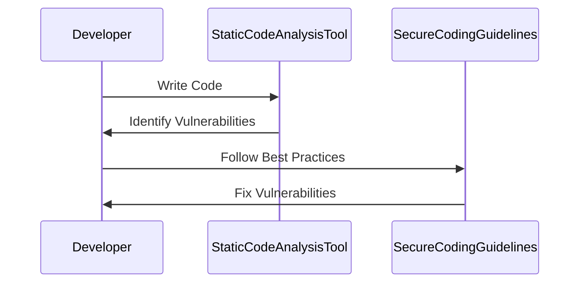
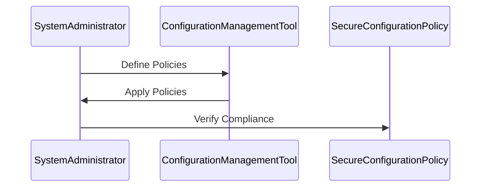

## Understanding the Security Operation Center (SOC)

### What is a Security Operation Center (SOC)?

A Security Operation Center (SOC) is a centralized department within an organization that focuses on monitoring, detecting, analyzing, and responding to cybersecurity incidents. The primary goal of a SOC is to maintain the integrity, confidentiality, and availability of an organization's IT infrastructure and data. SOCs are typically staffed with trained security professionals who work around the clock to ensure continuous protection against cyber threats.

### Why is a SOC Important?

SOCs are crucial because they provide a dedicated team to handle security-related tasks, which can be overwhelming for regular IT staff. By having a specialized team, organizations can respond more effectively to security incidents, reducing the potential damage and downtime caused by cyber attacks. Additionally, SOCs help in maintaining compliance with regulatory requirements and industry standards.

### How Does a SOC Work?

A typical SOC operates on a tiered structure, with different levels of analysts handling various aspects of security operations:

- **Level 1 Analysts**: These analysts are the first line of defense. They monitor security alerts and events, triage them, and determine whether escalation is necessary.
- **Level 2 Incident Handlers**: These handlers deal with confirmed incidents. They perform in-depth analysis and coordinate the response to mitigate the threat.
- **Level 3 Subject Matter Experts (SMEs)**: These experts provide specialized knowledge and support during complex incidents. They may include threat hunters, malware analysts, or forensic specialists.
- **SOC Managers**: These managers oversee the entire SOC operation, ensuring that processes are followed and resources are allocated effectively.

### Real-World Example: Equifax Breach

The Equifax breach in 2017 is a notable example of the importance of a SOC. Equifax, a major credit reporting agency, suffered a massive data breach that exposed sensitive personal information of over 143 million consumers. One of the key issues was the lack of proper monitoring and response mechanisms. Had Equifax had a robust SOC in place, the breach might have been detected and mitigated earlier, reducing the extent of the damage.

### Mermaid Diagram: SOC Structure



### Automating Activities in DevSecOps

One of the core principles of DevSecOps is to automate as many activities as possible. This includes automating the processes handled by the SOC. Automation can significantly enhance the efficiency and effectiveness of security operations by reducing human error and enabling faster response times.

### Role of Each SOC Member

#### Level 1 SOC Analyst

**What They Do:**
- Monitor and triage security alerts.
- Determine if escalation is necessary.
- Prepare new cases for escalation.

**Why It Matters:**
- Level 1 analysts are the first to detect potential threats, making them critical in the early stages of incident response.
- Their ability to quickly triage alerts helps in prioritizing incidents and allocating resources effectively.

**How It Works:**
- Level 1 analysts use security information and event management (SIEM) tools to monitor logs and alerts.
- They apply predefined rules and thresholds to identify suspicious activity.
- Once an alert is identified, they assess its severity and decide whether to escalate it to a higher level.

**Real-World Example:**
Consider a scenario where a Level 1 analyst detects a series of failed login attempts from a suspicious IP address. Using SIEM tools, they can correlate this with other security events and determine if it warrants further investigation.

#### Level 2 Incident Handler

**What They Do:**
- Handle confirmed incident cases.
- Perform deep analysis into the incident.
- Coordinate the response to mitigate the threat.

**Why It Matters:**
- Incident handlers are responsible for investigating and resolving confirmed security incidents.
- Their expertise is crucial in understanding the scope and impact of an incident and in developing effective mitigation strategies.

**How It Works:**
- Incident handlers use forensic tools and techniques to analyze the incident.
- They collaborate with other teams (e.g., IT, legal) to gather additional information and coordinate the response.
- Once the incident is resolved, they document the findings and recommend preventive measures.

**Real-World Example:**
In the case of the Equifax breach, Level 2 incident handlers would have been responsible for analyzing the nature of the attack, identifying the vulnerabilities exploited, and coordinating the response to contain the threat.

#### Level 3 Subject Matter Expert (SME)

**What They Do:**
- Provide specialized knowledge and support during complex incidents.
- May include threat hunters, malware analysts, or forensic specialists.

**Why It Matters:**
- SMEs bring specialized skills and knowledge to the incident response process.
- Their expertise is invaluable in handling complex and sophisticated threats.

**How It Works:**
- SMEs are called upon when the incident requires specialized knowledge or tools.
- They work closely with incident handlers to provide insights and recommendations.
- After the incident is resolved, they contribute to the post-mortem analysis and recommend improvements.

**Real-World Example:**
During a ransomware attack, a Level 3 SME specializing in malware analysis would be involved in identifying the type of ransomware, determining its capabilities, and recommending steps to decrypt affected systems.

#### SOC Manager

**What They Do:**
- Oversee the entire SOC operation.
- Ensure that processes are followed and resources are allocated effectively.

**Why It Matters:**
- SOC managers are responsible for the overall performance and efficiency of the SOC.
- Their leadership is crucial in maintaining a high level of security and ensuring that the SOC operates smoothly.

**How It Works:**
- SOC managers set goals and objectives for the SOC.
- They allocate resources and personnel based on the organization's needs.
- They monitor the performance of SOC members and provide feedback and training as needed.

**Real-World Example:**
In a large organization, the SOC manager would be responsible for ensuring that the SOC operates 24/7 and that all security incidents are handled promptly and effectively.

### How to Prevent / Defend

#### Detection

**Tools and Techniques:**
- **SIEM Tools**: Security Information and Event Management (SIEM) tools like Splunk, IBM QRadar, and LogRhythm are used to collect, analyze, and correlate security events from various sources.
- **IDS/IPS**: Intrusion Detection Systems (IDS) and Intrusion Prevention Systems (IPS) like Snort and Suricata help in detecting and preventing malicious activities.
- **Threat Hunting**: Proactive threat hunting using tools like OSQuery and Graylog helps in identifying and mitigating threats before they cause significant damage.

**Example:**


#### Prevention

**Secure Coding Practices:**
- Implement secure coding practices to prevent common vulnerabilities such as SQL injection, cross-site scripting (XSS), and buffer overflows.
- Use static code analysis tools like SonarQube and Fortify to identify and fix security issues in code.

**Example:**


**Configuration Hardening:**
- Harden system configurations to reduce the attack surface.
- Use tools like Ansible and Puppet to automate the deployment and maintenance of secure configurations.

**Example:**


#### Secure-Coding Fixes

**Vulnerable Pattern:**
```python
# Vulnerable code: SQL Injection
query = "SELECT * FROM users WHERE username = '" + username + "'"
cursor.execute(query)
```

**Fixed Pattern:**
```python
# Fixed code: Parameterized Query
query = "SELECT * FROM users WHERE username = %s"
cursor.execute(query, (username,))
```

**Explanation:**
The vulnerable pattern uses string concatenation to build a SQL query, which can lead to SQL injection attacks. The fixed pattern uses parameterized queries, which prevent SQL injection by treating user input as data rather than executable code.

### Conclusion

Integrating incident response into DevSecOps requires a comprehensive understanding of the roles and responsibilities within a Security Operation Center (SOC). By automating activities and leveraging specialized tools and techniques, organizations can enhance their security posture and respond more effectively to cyber threats. The key is to maintain a proactive approach, continuously monitor and analyze security events, and implement robust preventive measures to minimize the risk of security incidents.

### Practice Labs

For hands-on experience with incident response in DevSecOps, consider the following practice labs:

- **PortSwigger Web Security Academy**: Offers interactive labs to learn about web application security and incident response.
- **OWASP Juice Shop**: A deliberately insecure web application for practicing web security skills.
- **DVWA (Damn Vulnerable Web Application)**: Another intentionally vulnerable web application for learning and testing security concepts.
- **WebGoat**: An interactive training application designed to teach web application security lessons.

These labs provide practical scenarios to apply the concepts learned in this chapter and gain hands-on experience with incident response in a DevSecOps environment.

---
<!-- nav -->
[[01-Establishing Your Incident Response Context|Establishing Your Incident Response Context]] | [[DevSecOps/DevSecOps Bootcamp/08-Logging & Incident Response/02-Establishing Your Incident Response Context/07-Typical Incident Response Process/00-Overview|Overview]] | [[DevSecOps/DevSecOps Bootcamp/08-Logging & Incident Response/02-Establishing Your Incident Response Context/07-Typical Incident Response Process/03-Practice Questions & Answers|Practice Questions & Answers]]
