## Introduction to DevSecOps and Incident Response

In the realm of modern software development, DevSecOps stands as a pivotal approach that integrates security practices into the DevOps lifecycle. This integration ensures that security is not an afterthought but a core component of the development process. The primary goal of DevSecOps is to embed security throughout the entire software development lifecycle (SDLC), from planning and coding to testing and deployment. This holistic approach aims to reduce vulnerabilities and enhance the overall security posture of applications and systems.

### What is DevSecOps?

DevSecOps is a methodology that combines the principles of DevOps with security practices. Traditionally, security was often treated as a separate phase, typically occurring late in the development cycle. However, this approach often led to delays, increased costs, and missed opportunities to address security issues early on. DevSecOps seeks to bridge this gap by incorporating security into every stage of the SDLC, ensuring that security is a shared responsibility among all team members.

#### Why DevSecOps Matters

The importance of DevSecOps cannot be overstated, especially in today’s fast-paced and highly interconnected digital landscape. Here are some key reasons why DevSecOps is crucial:

1. **Early Detection and Mitigation**: By integrating security practices early in the development process, teams can identify and mitigate vulnerabilities before they become critical issues.
   
2. **Continuous Improvement**: DevSecOps promotes a culture of continuous improvement, where security is constantly evaluated and enhanced through automated testing and monitoring.
   
3. **Reduced Costs**: Addressing security issues early in the development cycle is generally less costly than fixing them later. This reduces the overall cost of maintaining secure applications.
   
4. **Enhanced Collaboration**: DevSecOps fosters collaboration between developers, operations teams, and security professionals, leading to more effective and efficient security practices.

### DevSecOps in Incident Response

One of the key areas where DevSecOps shines is in incident response. Incident response refers to the processes and procedures used to manage and respond to security incidents, such as data breaches, malware infections, or unauthorized access. In a DevSecOps environment, incident response is not just a reactive process but an integral part of the overall security strategy.

#### Automation and Consistency in Incident Response

Automation plays a crucial role in incident response within a DevSecOps framework. By automating certain aspects of the incident response process, organizations can ensure consistency and speed in their response efforts. This includes:

- **Automated Detection**: Tools like intrusion detection systems (IDS) and security information and event management (SIEM) systems can automatically detect and alert on potential security incidents.
  
- **Automated Response**: Once an incident is detected, automated scripts and playbooks can be triggered to initiate predefined response actions, such as isolating affected systems or blocking malicious IP addresses.

- **Consistent Procedures**: Automated workflows ensure that incident response procedures are consistently followed, reducing the likelihood of human error and ensuring that all necessary steps are taken.

### Real-World Examples of DevSecOps in Incident Response

To better understand the practical application of DevSecOps in incident response, let’s look at some recent real-world examples:

#### Example 1: Capital One Data Breach (CVE-2019-11510)

In July 2019, Capital One announced a data breach that exposed sensitive information of approximately 100 million customers. The breach was caused by a misconfigured web application firewall (WAF) that allowed unauthorized access to the company’s servers.

**What Went Wrong:**
- **Configuration Error**: The WAF was improperly configured, allowing an attacker to exploit a vulnerability in the system.
- **Lack of Monitoring**: There was insufficient monitoring in place to detect the unauthorized access promptly.

**How DevSecOps Could Have Helped:**
- **Automated Configuration Management**: Using tools like Ansible or Terraform to manage infrastructure configurations would have ensured that the WAF was correctly configured.
- **Continuous Monitoring**: Implementing continuous monitoring using SIEM tools would have alerted Capital One to the unauthorized access in real-time.

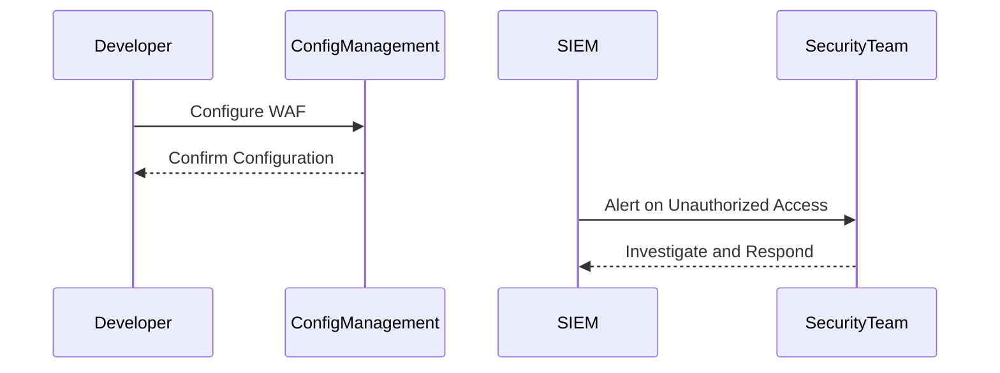

#### Example 2: Equifax Data Breach (CVE-2017-5638)

In September 2017, Equifax announced a data breach that exposed personal information of approximately 143 million consumers. The breach was caused by a vulnerability in Apache Struts, which was exploited by attackers to gain unauthorized access to the company’s systems.

**What Went Wrong:**
- **Vulnerability Exploitation**: The Apache Struts vulnerability was not patched in a timely manner, allowing attackers to exploit it.
- **Insufficient Patch Management**: There was a lack of proper patch management and monitoring to ensure that critical vulnerabilities were addressed.

**How DevSecOps Could Have Helped:**
- **Automated Vulnerability Scanning**: Regularly scanning for vulnerabilities using tools like Nessus or Qualys would have identified the Apache Struts vulnerability.
- **Continuous Patch Management**: Implementing a continuous patch management process using tools like Ansible or Puppet would have ensured that critical vulnerabilities were patched promptly.

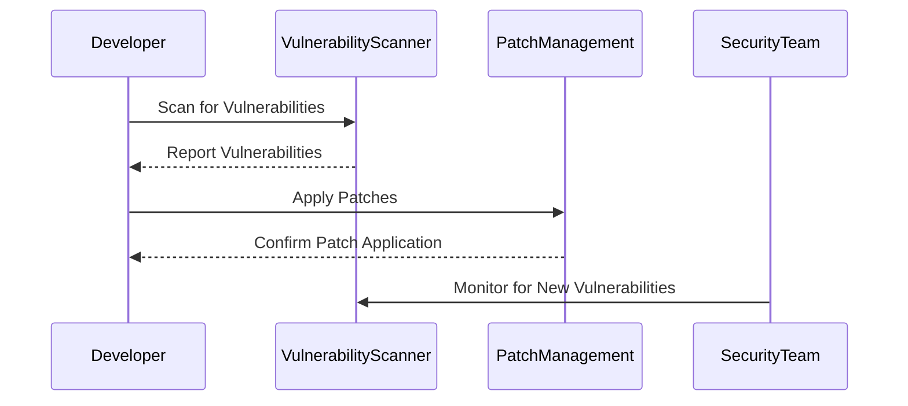

### Establishing Your Incident Response Workflow

Now that we have covered the importance of DevSecOps in incident response and seen some real-world examples, let’s delve into establishing your incident response workflow. This involves several key steps:

1. **Incident Detection**: Implementing tools and processes to detect potential security incidents.
2. **Incident Analysis**: Analyzing the incident to determine its scope and impact.
3. **Incident Containment**: Taking steps to contain the incident and prevent further damage.
4. **Incident Eradication**: Removing the root cause of the incident.
5. **Incident Recovery**: Restoring systems to normal operation.
6. **Incident Reporting**: Documenting the incident and the response actions taken.

#### Step-by-Step Incident Response Workflow

Let’s break down each step in detail:

##### 1. Incident Detection

**Tools and Techniques:**
- **Intrusion Detection Systems (IDS)**: Tools like Snort or Suricata can detect and alert on suspicious network activity.
- **Security Information and Event Management (SIEM)**: Platforms like Splunk or IBM QRadar can aggregate and analyze logs from various sources to detect anomalies.

**Example:**
Consider a scenario where an IDS detects unusual traffic patterns indicative of a potential DDoS attack.

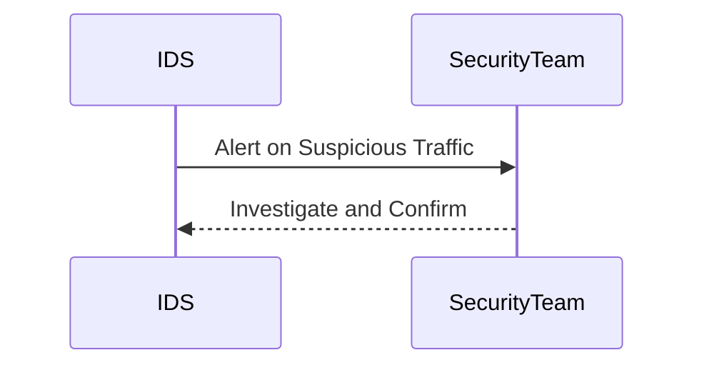

##### 2. Incident Analysis

**Tools and Techniques:**
- **Log Analysis**: Analyzing logs from various sources to understand the nature and extent of the incident.
- **Network Forensics**: Tools like Wireshark can capture and analyze network traffic to identify the source of the incident.

**Example:**
Once the IDS alerts the security team, they can use log analysis tools to trace the origin of the suspicious traffic.

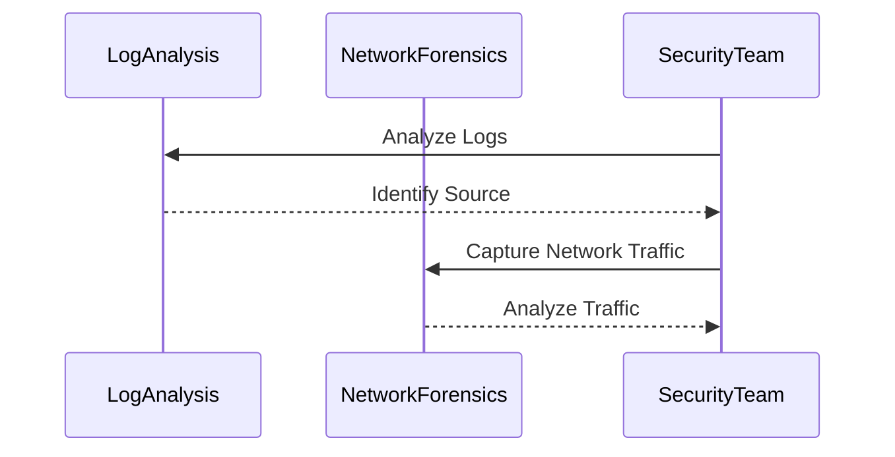

##### 3. Incident Containment

**Tools and Techniques:**
- **Firewall Rules**: Modifying firewall rules to block traffic from the source of the incident.
- **Isolation**: Isolating affected systems to prevent further damage.

**Example:**
Based on the analysis, the security team can modify firewall rules to block traffic from the identified source.

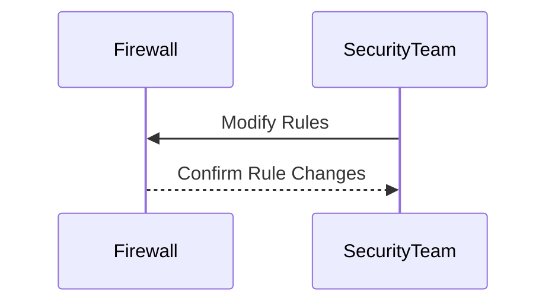

##### 4. Incident Eradication

**Tools and Techniques:**
- **Root Cause Analysis**: Identifying and addressing the root cause of the incident.
- **Patching Vulnerabilities**: Applying patches to fix any underlying vulnerabilities.

**Example:**
After containing the incident, the security team can perform a root cause analysis to identify and address the underlying issue.

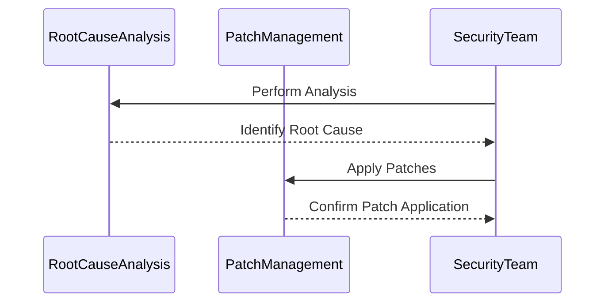

##### 5. Incident Recovery

**Tools and Techniques:**
- **System Restoration**: Restoring systems to their normal operational state.
- **Data Recovery**: Recovering any lost or corrupted data.

**Example:**
Once the root cause is addressed, the security team can restore systems to their normal operational state.

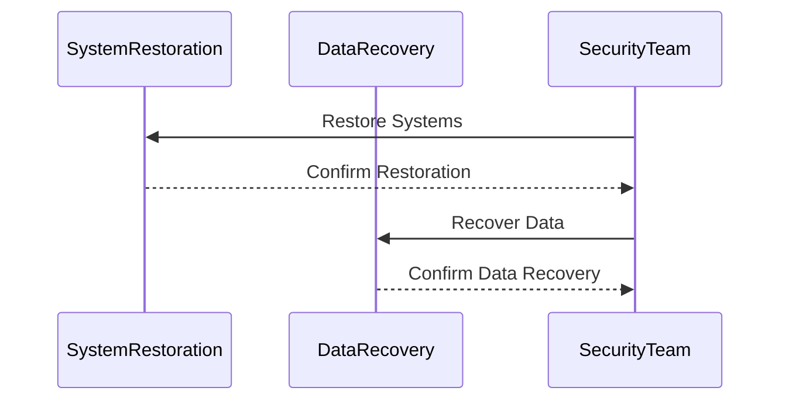

##### 6. Incident Reporting

**Tools and Techniques:**
- **Documentation**: Documenting the incident and the response actions taken.
- **Post-Incident Review**: Conducting a post-incident review to identify lessons learned and areas for improvement.

**Example:**
Finally, the security team can document the incident and conduct a post-incident review to identify lessons learned.

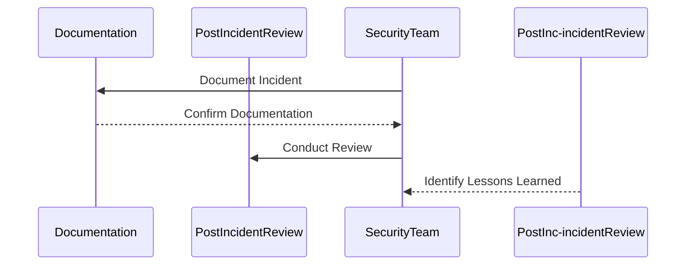

### How to Prevent / Defend Against Incidents

To effectively prevent and defend against security incidents, it is essential to implement a comprehensive set of security measures. Here are some key strategies:

#### Secure Coding Practices

Secure coding practices are fundamental to preventing security incidents. This includes:

- **Input Validation**: Validating user inputs to prevent injection attacks.
- **Error Handling**: Properly handling errors to avoid exposing sensitive information.
- **Authentication and Authorization**: Implementing strong authentication mechanisms and enforcing least privilege access.

**Example:**
Consider a web application that accepts user input. Without proper validation, an attacker could inject malicious SQL commands.

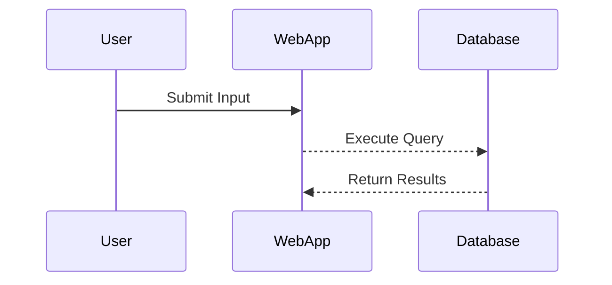

**Vulnerable Code:**
```python
# Vulnerable code
query = f"SELECT * FROM users WHERE username='{username}' AND password='{password}'"
cursor.execute(query)
```

**Secure Code:**
```python
# Secure code
query = "SELECT * FROM users WHERE username=%s AND password=%s"
cursor.execute(query, (username, password))
```

#### Continuous Monitoring and Logging

Continuous monitoring and logging are crucial for detecting and responding to security incidents. This includes:

- **Real-Time Monitoring**: Using tools like SIEM to monitor network and system activity in real-time.
- **Centralized Logging**: Collecting and analyzing logs from various sources to identify anomalies.

**Example:**
Consider a scenario where a SIEM tool is used to monitor network activity and detect suspicious behavior.

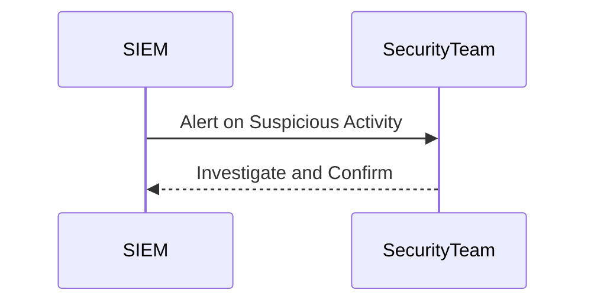

#### Regular Patch Management

Regular patch management is essential for keeping systems secure. This includes:

- **Automated Patching**: Using tools like Ansible or Puppet to automate the patching process.
- **Vulnerability Scanning**: Regularly scanning systems for vulnerabilities and applying patches promptly.

**Example:**
Consider a scenario where a vulnerability scanner identifies a critical vulnerability in a system.

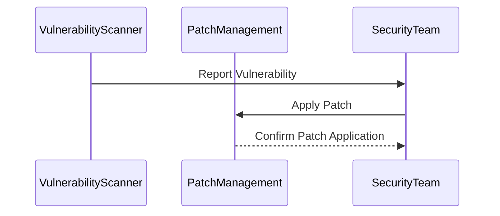

### Conclusion

Establishing your incident response context within a DevSecOps framework is crucial for ensuring the security and resilience of your systems. By integrating security practices into every stage of the SDLC and leveraging automation and consistency in incident response, you can significantly reduce the risk of security incidents and improve your overall security posture.

### Practice Labs

For hands-on experience with DevSecOps and incident response, consider the following practice labs:

- **PortSwigger Web Security Academy**: Offers interactive labs to practice web application security techniques.
- **OWASP Juice Shop**: A deliberately insecure web application for practicing web security skills.
- **DVWA (Damn Vulnerable Web Application)**: A PHP/MySQL web application that demonstrates web application vulnerabilities.
- **WebGoat**: An interactive, gamified training application for learning about web application security.

These labs provide practical experience in identifying and mitigating security vulnerabilities, which is essential for mastering DevSecOps principles and incident response techniques.

---
<!-- nav -->
[[DevSecOps/DevSecOps Bootcamp/08-Logging & Incident Response/02-Establishing Your Incident Response Context/08-Case Study and Module Summary/00-Overview|Overview]] | [[02-Introduction to Incident Response Context in DevSecOps|Introduction to Incident Response Context in DevSecOps]]
