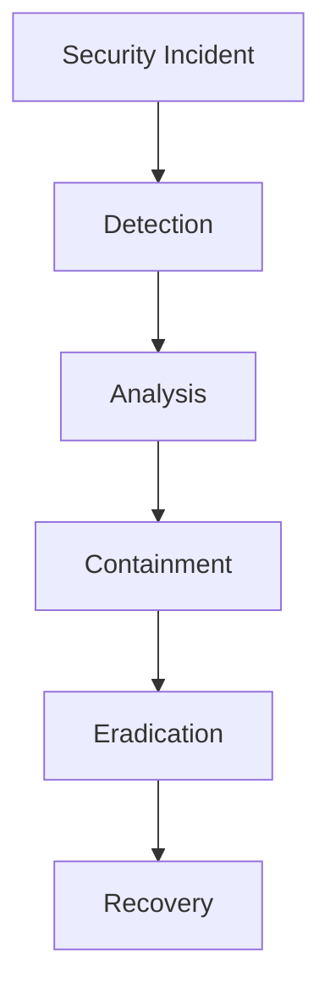
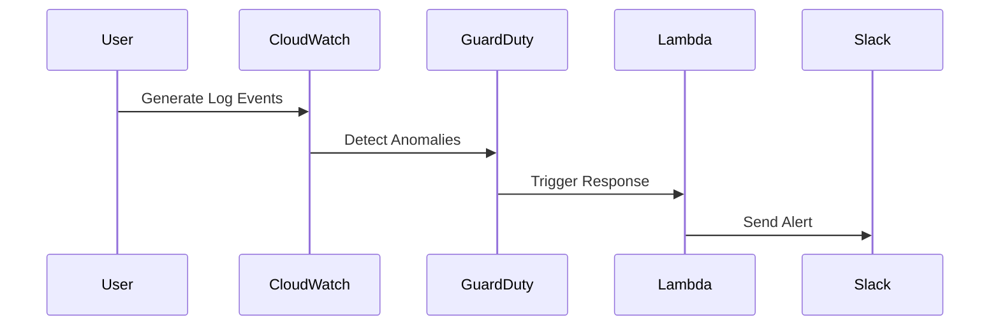

## Introduction to Incident Response Context in DevSecOps

In the realm of DevSecOps, establishing a robust incident response context is crucial for ensuring that security incidents are detected, analyzed, and resolved efficiently. This chapter delves into the intricacies of setting up an incident response framework using a case study approach. We will use a fictitious company called Wired Brain Coffee, an online coffee retailer that leverages AWS Cloud services. The primary focus will be on Bob, a developer who specializes in security within a small development team. Through this case study, we will explore how to configure security incident detection and automate the response process using DevSecOps practices.

### Understanding the Importance of Incident Response

Incident response is the process of managing and resolving security incidents in a structured manner. It involves detecting, analyzing, containing, eradicating, and recovering from security breaches. The goal is to minimize the impact of security incidents on the organization and ensure business continuity.

#### Why Incident Response Matters

- **Minimizing Damage**: Quick detection and response can significantly reduce the damage caused by security incidents.
- **Business Continuity**: Ensuring that critical operations continue despite security breaches.
- **Compliance**: Meeting regulatory requirements and avoiding legal penalties.
- **Reputation Management**: Maintaining trust with customers and stakeholders.

### Traditional Incident Response vs. DevSecOps

Traditional incident response typically involves a Security Operations Center (SOC) where dedicated teams handle security incidents. However, in a DevSecOps environment, security is integrated into the entire software development lifecycle, making it everyone's responsibility.

#### Traditional SOC Environment

A traditional SOC environment includes:

- **Monitoring Tools**: Tools like SIEM (Security Information and Event Management) systems.
- **Incident Handling Teams**: Dedicated teams for handling security incidents.
- **Playbooks**: Standardized procedures for responding to different types of incidents.



#### Benefits of DevSecOps in Incident Response

- **Automation**: Automating the detection and response processes reduces human error and speeds up the resolution.
- **Integration**: Integrating security into the CI/CD pipeline ensures continuous monitoring and immediate action.
- **Collaboration**: Encourages collaboration between developers, security teams, and operations, leading to a more holistic approach.

### Case Study: Wired Brain Coffee

Wired Brain Coffee is an online coffee retailer with a small development team. They use AWS Cloud services and rely heavily on automation and DevSecOps practices. Bob, the security-focused developer, plays a key role in setting up the incident response framework.

#### Setting Up Detection and Response

To establish a robust incident response context, we need to configure detection mechanisms and automate the response process. This involves using AWS services such as CloudWatch, GuardDuty, and Lambda functions.

##### Step 1: Configuring CloudWatch Logs

CloudWatch Logs can be used to monitor application logs and system events. By setting up log groups and log streams, we can capture relevant data for analysis.

```yaml
# CloudFormation Template for CloudWatch Log Group
Resources:
  MyLogGroup:
    Type: 'AWS::Logs::LogGroup'
    Properties:
      LogGroupName: '/aws/lambda/myLambdaFunction'
      RetentionInDays: 30
```

##### Step 2: Setting Up GuardDuty

GuardDuty is an intelligent threat detection service that continuously monitors for malicious activity and unauthorized behavior. It provides alerts based on suspicious activities.

```yaml
# CloudFormation Template for GuardDuty
Resources:
  MyGuardDutyDetector:
    Type: 'AWS::GuardDuty::Detector'
    Properties:
      Enable: true
```

##### Step 3: Automating Response with Lambda Functions

Lambda functions can be triggered by CloudWatch events or GuardDuty findings to automatically respond to security incidents.

```python
# Example Lambda Function to Respond to Security Incidents
import boto3

def lambda_handler(event, context):
    # Extract details from the event
    finding = event['detail']['findings'][0]
    
    # Take appropriate action based on the finding
    if finding['severity'] > 7:
        # Example action: Send alert to Slack
        send_slack_alert(finding)
        
    return {
        'statusCode': 200,
        'body': 'Incident handled successfully'
    }
```

### Real-World Examples and Recent Breaches

Understanding recent breaches and CVEs helps in identifying potential vulnerabilities and improving incident response strategies.

#### Example: Capital One Data Breach (CVE-2019-11510)

In 2019, Capital One suffered a data breach due to misconfigured AWS S3 buckets. This highlights the importance of proper configuration and monitoring of cloud resources.

```http
HTTP/1.1 200 OK
Content-Type: application/json
X-Amz-Id-2: <unique-id>
X-Amz-Request-Id: <request-id>

{
  "message": "Data breach detected",
  "details": {
    "bucketName": "capitalone-data",
    "access": "public"
  }
}
```

#### How to Prevent / Defend

- **Secure Configuration**: Ensure that cloud resources are configured securely with least privilege access.
- **Monitoring**: Use tools like CloudWatch and GuardDuty to monitor for suspicious activities.
- **Automated Responses**: Set up Lambda functions to automatically respond to security incidents.



### Common Pitfalls and Best Practices

#### Common Pitfalls

- **Ignoring Alerts**: Overlooking or ignoring security alerts can lead to missed opportunities for early intervention.
- **Manual Processes**: Relying too much on manual processes can introduce delays and human errors.
- **Configuration Drift**: Changes in configurations can lead to security vulnerabilities if not monitored properly.

#### Best Practices

- **Continuous Monitoring**: Implement continuous monitoring to detect and respond to security incidents in real-time.
- **Automated Responses**: Automate responses to security incidents to reduce human intervention and speed up resolution.
- **Regular Audits**: Conduct regular audits to ensure compliance and identify potential vulnerabilities.

### Hands-On Labs

For practical experience, consider the following labs:

- **PortSwigger Web Security Academy**: Offers hands-on labs for web application security.
- **OWASP Juice Shop**: A deliberately insecure web application for practicing security skills.
- **DVWA (Damn Vulnerable Web Application)**: A PHP/MySQL web application that is riddled with vulnerabilities.

These labs provide a controlled environment to practice and improve incident response skills.

### Conclusion

Establishing a robust incident response context in a DevSecOps environment is essential for ensuring the security and integrity of applications and systems. By leveraging tools like CloudWatch, GuardDuty, and Lambda functions, we can automate the detection and response processes, reducing the impact of security incidents. Through the case study of Wired Brain Coffee, we have explored the practical steps involved in setting up an incident response framework and the importance of continuous monitoring and automated responses.

By following the best practices and learning from real-world examples, organizations can enhance their incident response capabilities and protect against potential security threats.

---
<!-- nav -->
[[01-Introduction to DevSecOps and Incident Response|Introduction to DevSecOps and Incident Response]] | [[DevSecOps/DevSecOps Bootcamp/08-Logging & Incident Response/02-Establishing Your Incident Response Context/08-Case Study and Module Summary/00-Overview|Overview]] | [[DevSecOps/DevSecOps Bootcamp/08-Logging & Incident Response/02-Establishing Your Incident Response Context/08-Case Study and Module Summary/03-Practice Questions & Answers|Practice Questions & Answers]]
