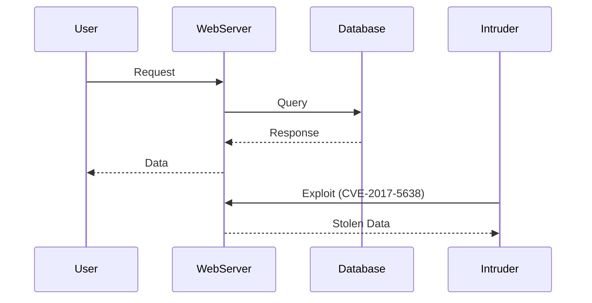
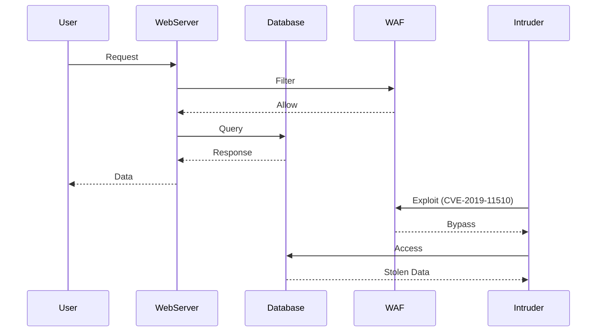

## Establishing Your Incident Response Context

### Introduction to Incident Response

Incident response is a critical component of any organization’s cybersecurity strategy. It involves the processes and procedures used to manage and mitigate the effects of a security breach or cyberattack. The goal is to minimize damage, restore normal operations, and prevent future incidents. In today’s digital landscape, where cyber threats are increasingly sophisticated and frequent, having a robust incident response plan is essential.

### The NIST Cybersecurity Framework

The National Institute of Standards and Technology (NIST) Cybersecurity Framework provides a set of guidelines and best practices for managing cybersecurity risks. While many organizations claim to follow the NIST framework, it is crucial to understand its components and how they apply to incident response.

#### Components of the NIST Framework

The NIST Cybersecurity Framework consists of five core functions:

1. **Identify**: Develop an organizational understanding to manage cybersecurity risk to systems, people, assets, data, and capabilities.
2. **Protect**: Develop and implement the appropriate safeguards to ensure delivery of critical services.
3. **Detect**: Develop and implement the appropriate activities to identify the occurrence of a cybersecurity event.
4. **Respond**: Develop and implement the appropriate activities to take action regarding a detected cybersecurity event.
5. **Recover**: Develop and implement the appropriate activities to maintain plans for resilience and to restore any capabilities or services that were impaired due to a cybersecurity event.

#### Focus on Detection and Response

In the context of incident response, the **Detect** and **Respond** functions are particularly relevant. These functions involve identifying potential security incidents and taking appropriate actions to mitigate their impact.

### The Importance of Incident Response

The importance of incident response cannot be overstated. According to a statement made by a director in the FBI back in 2012, there are only two types of companies: those that have been hacked and those that will be. This underscores the inevitability of cyberattacks and the necessity of being prepared to handle them effectively.

### Integrating Incident Response with DevSecOps

Given the inevitability of cyberattacks, integrating incident response into the DevSecOps pipeline is a strategic move. DevSecOps is a software development practice that emphasizes security throughout the entire software development lifecycle, from design and development to deployment and maintenance. By incorporating incident response into this pipeline, organizations can ensure that security is a continuous process rather than an afterthought.

### What is a Security Incident?

A security incident is any event that violates an organization’s security policies, compromises the integrity, confidentiality, or availability of information, or represents a threat to the organization’s assets. Examples of security incidents include unauthorized access, data breaches, malware infections, and denial-of-service attacks.

### Requirements for Incident Management

Effective incident management requires a structured approach. Key elements include:

1. **Incident Detection**: Identifying potential security incidents through monitoring tools and logs.
2. **Incident Analysis**: Determining the nature and scope of the incident.
3. **Incident Containment**: Limiting the spread of the incident to prevent further damage.
4. **Incident Eradication**: Removing the root cause of the incident.
5. **Incident Recovery**: Restoring affected systems and services to normal operation.
6. **Incident Reporting**: Documenting the incident and the steps taken to resolve it.

### Understanding DevSecOps

DevSecOps is a methodology that integrates security practices into the DevOps pipeline. This ensures that security is not an afterthought but is considered at every stage of the software development lifecycle. Key aspects of DevSecOps include:

1. **Continuous Integration and Continuous Deployment (CI/CD)**: Automating the build, test, and deployment processes to ensure that security checks are performed continuously.
2. **Automated Security Testing**: Using tools like static application security testing (SAST) and dynamic application security testing (DAST) to identify vulnerabilities.
3. **Security as Code**: Writing security policies and configurations as code to ensure consistency and enforce security best practices.
4. **Security Training and Awareness**: Educating developers and other stakeholders about security best practices and the importance of security in the development process.

### Handling Security Incidents

Handling security incidents effectively requires a combination of technical skills, process adherence, and communication. Here are some key steps in the incident handling process:

1. **Detection**: Use monitoring tools and logs to detect potential security incidents.
2. **Analysis**: Analyze the incident to determine its nature and scope.
3. **Containment**: Isolate affected systems to prevent further damage.
4. **Eradication**: Remove the root cause of the incident.
5. **Recovery**: Restore affected systems and services to normal operation.
6. **Reporting**: Document the incident and the steps taken to resolve it.

### Real-World Examples

To illustrate the importance of incident response, consider the following real-world examples:

#### Example 1: Equifax Data Breach (CVE-2017-5638)

In 2017, Equifax suffered a massive data breach that exposed sensitive personal information of millions of customers. The breach occurred due to a vulnerability in Apache Struts, a popular web application framework. The lack of proper incident response led to significant financial and reputational damage for Equifax.



#### Example 2: Capital One Data Breach (CVE-2019-11510)

In 2019, Capital One experienced a data breach that exposed the personal information of over 100 million customers. The breach occurred due to a misconfigured web application firewall (WAF) that allowed unauthorized access to sensitive data. The lack of proper incident response contributed to the severity of the breach.



### How to Prevent / Defend Against Security Incidents

Preventing and defending against security incidents requires a multi-faceted approach. Here are some key strategies:

1. **Implement Strong Access Controls**: Ensure that only authorized personnel have access to sensitive systems and data.
2. **Use Monitoring Tools**: Implement monitoring tools to detect potential security incidents in real-time.
3. **Perform Regular Security Audits**: Conduct regular security audits to identify and address vulnerabilities.
4. **Educate Employees**: Provide security training and awareness programs to educate employees about security best practices.
5. **Develop an Incident Response Plan**: Create a detailed incident response plan that outlines the steps to be taken in the event of a security incident.

### Secure Coding Practices

Secure coding practices are essential for preventing security incidents. Here are some key secure coding practices:

1. **Input Validation**: Validate all user inputs to prevent injection attacks.
2. **Error Handling**: Handle errors gracefully to prevent information leakage.
3. **Authentication and Authorization**: Implement strong authentication and authorization mechanisms to prevent unauthorized access.
4. **Data Encryption**: Encrypt sensitive data to protect it from unauthorized access.
5. **Code Reviews**: Perform regular code reviews to identify and address security vulnerabilities.

### Example of Vulnerable vs. Secure Code

Consider the following example of a vulnerable code snippet and its secure counterpart:

#### Vulnerable Code

```python
def login(username, password):
    if username == "admin" and password == "password":
        return True
    else:
        return False
```

#### Secure Code

```python
import hashlib

def hash_password(password):
    return hashlib.sha256(password.encode()).hexdigest()

def login(username, hashed_password):
    stored_hashed_password = get_stored_password(username)
    if hashed_password == stored_hashed_password:
        return True
    else:
        return False
```

### Configuration Hardening

Configuration hardening is another critical aspect of preventing security incidents. Here are some key configuration hardening practices:

1. **Disable Unnecessary Services**: Disable unnecessary services and ports to reduce the attack surface.
2. **Enable Security Features**: Enable security features such as firewalls, intrusion detection systems (IDS), and intrusion prevention systems (IPS).
3. **Use Strong Encryption**: Use strong encryption algorithms and protocols to protect sensitive data.
4. **Regularly Update Software**: Keep all software up-to-date with the latest security patches and updates.
5. **Implement Least Privilege Principle**: Grant users the minimum level of access necessary to perform their job functions.

### Detection and Prevention Strategies

Detection and prevention strategies are essential for effective incident response. Here are some key strategies:

1. **Monitoring Tools**: Use monitoring tools such as SIEM (Security Information and Event Management) systems to detect potential security incidents in real-time.
2. **Log Analysis**: Analyze logs to identify patterns and anomalies that may indicate a security incident.
3. **Threat Intelligence**: Use threat intelligence feeds to stay informed about the latest threats and vulnerabilities.
4. **Penetration Testing**: Conduct regular penetration testing to identify and address vulnerabilities.
5. **Incident Response Drills**: Conduct regular incident response drills to ensure that the incident response team is prepared to handle security incidents.

### Conclusion

Establishing your incident response context is a critical step in ensuring the security of your organization. By understanding the components of the NIST Cybersecurity Framework, the importance of incident response, and the requirements for incident management, you can develop a robust incident response plan that integrates seamlessly with the DevSecOps pipeline. By implementing secure coding practices, configuration hardening, and detection and prevention strategies, you can minimize the risk of security incidents and ensure the continued operation of your systems and services.

### Practice Labs

For hands-on experience with incident response and DevSecOps, consider the following practice labs:

- **PortSwigger Web Security Academy**: Offers a comprehensive set of labs for learning web security concepts and techniques.
- **OWASP Juice Shop**: A deliberately insecure web application for practicing web security skills.
- **DVWA (Damn Vulnerable Web Application)**: A PHP/MySQL web application that is intentionally vulnerable for educational purposes.
- **WebGoat**: An interactive, gamified web security training application.

These labs provide practical experience in identifying and responding to security incidents, as well as integrating security into the DevSecOps pipeline.

---
<!-- nav -->
[[DevSecOps/DevSecOps Bootcamp/08-Logging & Incident Response/02-Establishing Your Incident Response Context/Incident Response Lifecycle/03-Actions Taken|Actions Taken]] | [[DevSecOps/DevSecOps Bootcamp/08-Logging & Incident Response/02-Establishing Your Incident Response Context/Incident Response Lifecycle/00-Overview|Overview]] | [[DevSecOps/DevSecOps Bootcamp/08-Logging & Incident Response/02-Establishing Your Incident Response Context/Incident Response Lifecycle/05-Improvements|Improvements]]
