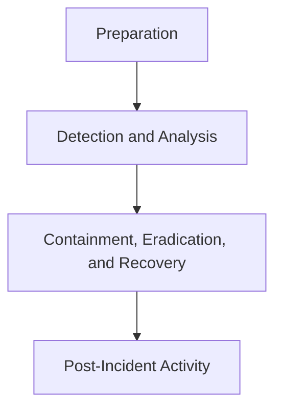
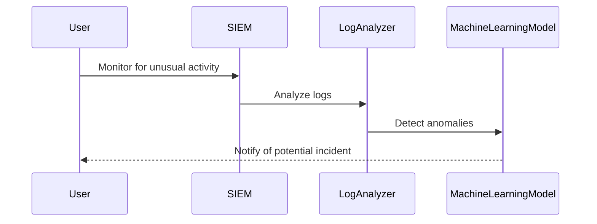
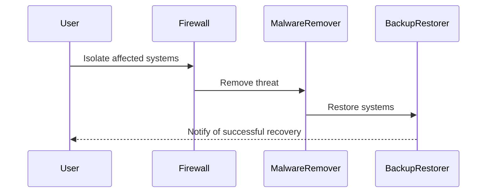

## Improvements

- Real-time anomaly detection
- Automated containment and recovery processes
- Clearer communication protocols
```

### How to Prevent / Defend

#### Detection and Analysis

**Vulnerable Pattern**
```python
# Vulnerable Code
def login(username, password):
    query = f"SELECT * FROM users WHERE username='{username}' AND password='{password}'"
    cursor.execute(query)
    result = cursor.fetchone()
    return result
```

**Secure Code Fix**
```python
# Secure Code
def login(username, password):
    query = "SELECT * FROM users WHERE username=%s AND password=%s"
    cursor.execute(query, (username, password))
    result = cursor.fetchone()
    return result
```

**Detection Mechanisms**
Implement real-time anomaly detection using tools like Splunk or ELK Stack. Monitor for unusual activity and analyze logs to identify patterns that indicate a security incident.

**Prevention Measures**
- Use parameterized queries to prevent SQL injection attacks.
- Implement input validation to ensure that user inputs are safe.
- Use security testing tools like SAST and DAST to detect vulnerabilities.

#### Containment, Eradication, and Recovery

**Vulnerable Pattern**
```bash
# Vulnerable Configuration
iptables -A INPUT -s 192.168.1.100 -j ACCEPT
```

**Secure Configuration**
```bash
# Secure Configuration
iptables -A INPUT -s 192.168.1.100 -j DROP
```

**Containment Mechanisms**
Isolate affected systems using firewall rules and network segmentation. Use automated tools to quickly isolate affected systems and prevent further damage.

**Eradication Mechanisms**
Remove the threat from the environment using automated tools and processes. Use tools like antivirus software and malware removal tools to remove malicious files.

**Recovery Mechanisms**
Restore systems to a secure state using backups and other recovery mechanisms. Use automated recovery processes to quickly restore systems to a secure state.

### Conclusion

Integrating incident response into DevSecOps practices ensures that security is embedded throughout the development lifecycle. By following the traditional incident response lifecycle and focusing on detection and analysis, and containment, eradication, and recovery, organizations can minimize the impact of security incidents and ensure that systems remain secure. Continuous monitoring, real-time detection, and automated processes are crucial in DevSecOps to handle security incidents effectively.

### Practice Labs

For hands-on experience with incident response in DevSecOps, consider the following labs:

- **PortSwigger Web Security Academy**: Offers interactive labs to practice web application security.
- **OWASP Juice Shop**: A deliberately insecure web application for practicing web security.
- **DVWA (Damn Vulnerable Web Application)**: A PHP/MySQL web application that is vulnerable to many types of web application attacks.
- **WebGoat**: An interactive, gamified training application for learning about web application security.

By completing these labs, you can gain practical experience in detecting and responding to security incidents in a DevSecOps environment.

### Diagrams

#### Incident Response Lifecycle Diagram



#### Detection and Analysis Workflow



#### Containment, Eradication, and Recovery Workflow



By following these detailed steps and examples, you can gain a comprehensive understanding of how to integrate incident response into DevSecOps practices effectively.

---
<!-- nav -->
[[DevSecOps/DevSecOps Bootcamp/08-Logging & Incident Response/02-Establishing Your Incident Response Context/Incident Response Lifecycle/04-Establishing Your Incident Response Context|Establishing Your Incident Response Context]] | [[DevSecOps/DevSecOps Bootcamp/08-Logging & Incident Response/02-Establishing Your Incident Response Context/Incident Response Lifecycle/00-Overview|Overview]] | [[DevSecOps/DevSecOps Bootcamp/08-Logging & Incident Response/02-Establishing Your Incident Response Context/Incident Response Lifecycle/06-Lessons Learned|Lessons Learned]]
