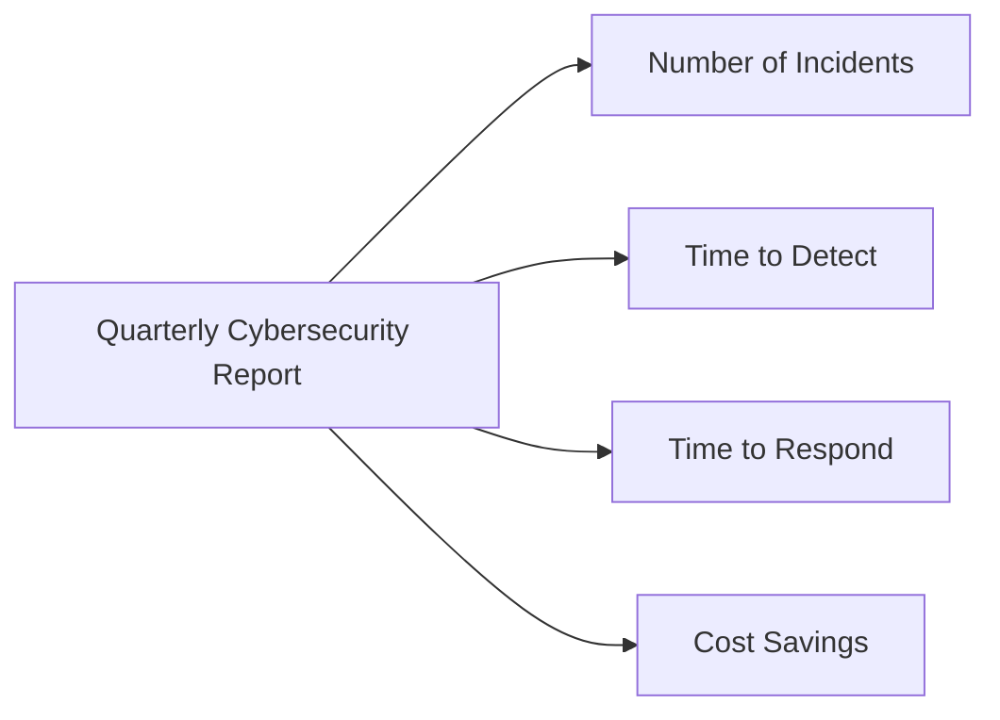

## Introduction to Incident Response Metrics

Incident response metrics are crucial for evaluating the effectiveness of your security measures and providing insights into areas that require improvement. These metrics help in making informed decisions, especially when presenting to executives and stakeholders. In this section, we will delve into the importance of simplifying metrics, the role of automated incident response, and the financial implications of implementing such systems.

### Simplifying Metrics for Executive Briefings

When preparing reports for executives, it is essential to keep the metrics simple and straightforward. Complex data can overwhelm decision-makers, leading to confusion rather than clarity. A well-designed chart can effectively communicate key information about cybersecurity performance.

#### Example Chart for Cybersecurity Reporting

Consider the following chart, which could be used for quarterly cybersecurity reporting:



This chart provides a high-level overview of the most critical aspects of incident response:

- **Number of Incidents**: Tracks the total number of security incidents detected during the quarter.
- **Time to Detect**: Measures the average time taken to identify an incident after it occurs.
- **Time to Respond**: Indicates the average time taken to mitigate the incident once it has been detected.
- **Cost Savings**: Shows the financial benefits achieved through improved incident response processes.

### Integrating Automated Incident Response

Automated incident response systems can significantly enhance the efficiency and effectiveness of your security operations. By automating routine tasks, these systems reduce the burden on human operators and enable faster response times.

#### Financial Impact of Automation

According to the IBM Cost of Data Breach Report 2020, organizations that fully deploy automation in their incident response processes save an average of $3.58 million compared to those without automation. This figure underscores the substantial financial benefits of investing in automated incident response solutions.

### Real-World Examples and Case Studies

To better understand the practical implications of these metrics, let's examine some recent real-world examples and case studies.

#### Example: SolarWinds Supply Chain Attack (CVE-2020-1014)

The SolarWinds supply chain attack, which occurred in December 2020, affected numerous organizations worldwide. This incident highlights the importance of timely detection and response mechanisms.

**Detection Time**: The initial detection of the SolarWinds compromise took several months due to the stealthy nature of the attack. This delay allowed the attackers to gain extensive access to victim networks.

**Response Time**: Once the breach was identified, affected organizations had to quickly respond to contain the damage. Many organizations lacked the necessary automation to rapidly mitigate the threat, leading to prolonged exposure.

**Financial Impact**: The SolarWinds attack resulted in significant financial losses for affected organizations. The lack of automation in incident response contributed to the extended duration of the breach, exacerbating the overall cost.

### Implementing Automated Incident Response

To implement automated incident response effectively, organizations should consider the following steps:

1. **Identify Key Metrics**: Determine the most critical metrics to track, such as incident frequency, detection time, and response time.
2. **Select Appropriate Tools**: Choose tools that support automation, such as SIEM (Security Information and Event Management) systems, SOAR (Security Orchestration, Automation, and Response) platforms, and threat intelligence feeds.
3. **Configure Alerts and Playbooks**: Set up automated alerts and playbooks to streamline incident handling processes.
4. **Train Personnel**: Ensure that security teams are trained to work effectively with automated systems.

#### Example Configuration: SIEM System

Here is an example configuration for a SIEM system:

```yaml
# SIEM Configuration
rules:
  - name: "High Volume of Failed Login Attempts"
    condition: "failed_login_attempts > 100"
    action: "trigger_alert"
  - name: "Unusual Network Traffic"
    condition: "network_traffic_anomaly > 50%"
    action: "trigger_playbook"
```

This configuration sets up rules to trigger alerts and playbooks based on specific conditions, such as high volumes of failed login attempts or unusual network traffic patterns.

### How to Prevent / Defend

To prevent and defend against security incidents, organizations should focus on the following strategies:

1. **Implement Strong Detection Mechanisms**: Use advanced threat detection tools and techniques to identify potential threats promptly.
2. **Automate Response Processes**: Leverage automation to speed up incident response times and reduce human error.
3. **Regularly Review and Update Policies**: Ensure that security policies and procedures are up-to-date and aligned with current threats.
4. **Conduct Regular Training and Drills**: Train security personnel regularly to ensure they are prepared to handle incidents effectively.

#### Vulnerable vs. Secure Code Example

Consider the following example of a vulnerable code snippet and its secure counterpart:

**Vulnerable Code**:
```python
def authenticate_user(username, password):
    user = get_user_from_db(username)
    if user and user.password == password:
        return True
    return False
```

**Secure Code**:
```python
import bcrypt

def authenticate_user(username, password):
    user = get_user_from_db(username)
    if user and bcrypt.checkpw(password.encode('utf-8'), user.password_hash):
        return True
    return False
```

In the secure version, the `bcrypt` library is used to securely hash passwords, preventing plain-text password storage and enhancing security.

### Conclusion

Improving incident response capability through simplified metrics and automated systems is crucial for modern organizations. By tracking key metrics, implementing automation, and regularly reviewing and updating security policies, organizations can significantly enhance their ability to detect and respond to security incidents effectively.

### Practice Labs

For hands-on experience with incident response metrics and automation, consider the following practice labs:

- **PortSwigger Web Security Academy**: Offers modules on incident response and security metrics.
- **OWASP Juice Shop**: Provides a vulnerable web application for practicing incident response scenarios.
- **DVWA (Damn Vulnerable Web Application)**: Allows users to practice incident response in a controlled environment.

By engaging with these labs, you can gain practical experience in implementing and improving incident response capabilities.

---
<!-- nav -->
[[DevSecOps/DevSecOps Bootcamp/08-Logging & Incident Response/03-Improving Your Incident Response Capability/02-Metrics/00-Overview|Overview]] | [[02-Metrics for Incident Response Capability|Metrics for Incident Response Capability]]
