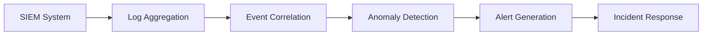
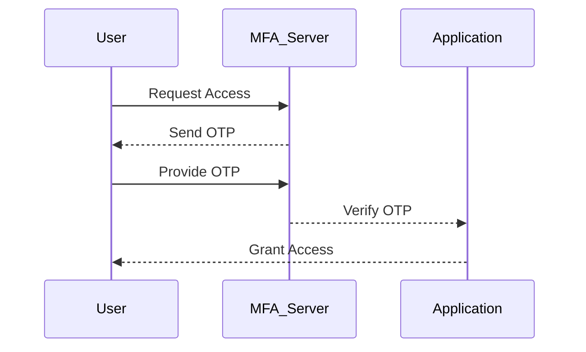

## Understanding Dwell Time and Its Variants

### Definition and Importance

Dwell time is a crucial metric in the field of cybersecurity, particularly within the context of incident response. It refers to the duration between an attacker gaining unauthorized access to a system and the organization becoming aware of the intrusion. This period is significant because it directly impacts the extent of damage that can be inflicted upon the organization. The longer the dwell time, the more opportunities an attacker has to exfiltrate sensitive data, compromise additional systems, or establish persistent backdoors.

However, the definition of dwell time can vary depending on the organizational context. Some organizations define dwell time as the period from the initial intrusion to the moment the organization becomes aware of the breach. Others might define it as the time from the initial intrusion to the point where the attacker is effectively locked out or prevented from further access. Both definitions are valid and can provide valuable insights into the effectiveness of an organization’s security measures and incident response capabilities.

### Variants of Dwell Time

#### Variant 1: Awareness-Based Dwell Time

In this variant, dwell time is measured from the moment an attacker gains access to the system until the organization detects the intrusion. This definition focuses on the speed at which an organization can identify and respond to a security event. The shorter the awareness-based dwell time, the quicker the organization can mitigate potential damage.

#### Variant 2: Lockout-Based Dwell Time

This variant measures the time from the initial intrusion to the point where the attacker is effectively locked out or prevented from further access. This definition emphasizes the effectiveness of the organization’s containment and remediation efforts. A shorter lockout-based dwell time indicates a more robust incident response process.

### Real-World Examples

Recent breaches highlight the importance of understanding and reducing dwell time:

- **Equifax Breach (CVE-2017-5638)**: In 2017, Equifax suffered a massive data breach affecting over 143 million individuals. The attackers exploited a vulnerability in Apache Struts, allowing them to gain unauthorized access to the system. The dwell time was estimated to be around three months, during which the attackers had ample time to exfiltrate sensitive data. This prolonged dwell time significantly exacerbated the impact of the breach.

- **Capital One Breach (CVE-2019-11510)**: In 2019, Capital One experienced a data breach affecting approximately 100 million customers. The attacker exploited a misconfigured web application firewall, gaining unauthorized access to the system. The dwell time was relatively short, estimated to be about one month, but the breach still resulted in significant financial and reputational damage.

### How to Prevent / Defend

#### Detection

To reduce dwell time, organizations should implement robust detection mechanisms:

1. **Security Information and Event Management (SIEM) Systems**: These systems aggregate and analyze log data from various sources to identify suspicious activities. They can help in quickly detecting intrusions and reducing dwell time.

2. **Behavioral Analytics**: By analyzing normal user behavior patterns, organizations can detect anomalies that may indicate an intrusion. Machine learning algorithms can be trained to identify such deviations.

3. **Network Traffic Analysis**: Monitoring network traffic for unusual patterns can help in identifying intrusions. Tools like Snort or Suricata can be used to detect malicious traffic.



#### Prevention

To prevent intrusions and reduce dwell time, organizations should focus on proactive security measures:

1. **Patch Management**: Regularly updating systems and applications to address known vulnerabilities can prevent attackers from exploiting them.

2. **Access Control**: Implementing strict access control policies ensures that only authorized personnel have access to sensitive systems and data.

3. **Multi-Factor Authentication (MFA)**: Requiring users to provide multiple forms of authentication can significantly reduce the risk of unauthorized access.



### Secure Coding Fixes

#### Vulnerable Code Example

Consider a web application that allows users to reset their passwords via email. If the application does not properly validate the email address, an attacker could potentially reset any user's password.

```python
# Vulnerable Code
def reset_password(email):
    user = get_user_by_email(email)
    if user:
        send_reset_link(user.email)
```

#### Secure Code Example

To prevent this vulnerability, the application should validate the email address and ensure that only the intended user can reset their password.

```python
# Secure Code
def reset_password(email):
    user = get_user_by_email(email)
    if user and validate_email(user.email, email):
        send_reset_link(user.email)
```

### Configuration Hardening

#### Vulnerable Configuration Example

Consider an Apache server configuration that allows directory listings, making it easier for attackers to navigate the file structure.

```apache
<Directory "/var/www/html">
    Options Indexes FollowSymLinks
    AllowOverride None
    Require all granted
</Directory>
```

#### Secure Configuration Example

To prevent directory listings, the `Indexes` option should be removed.

```apache
<Directory "/var/www/html">
    Options FollowSymLinks
    AllowOverride None
    Require all granted
</Directory>
```

### Reporting Metrics

One of the simplest yet most effective metrics to report is the number of security incidents. Reducing the number of incidents is a clear indicator of improved security posture. However, simply counting incidents does not provide a complete picture. To gain deeper insights, organizations can use various visualization techniques to represent incident data.

### Radar Chart Representation

A radar chart can be used to visualize the severity of security incidents over time. Each axis represents a different severity level, and the points on the chart represent the number of incidents at each severity level for a given period.

```mermaid
radarChart
title Security Incidents Severity Over Time
label Severity
axis Crit High Med Low Neg
series Q1 [1 2 3 4 5]
series Q2 [4 3 2 1 0]
series Q3 [2 3 4 1 0]
series Q4 [0 1 2 3 4]
```

### Example Scenario

Consider an organization that uses a radar chart to track the severity of security incidents quarterly. The chart shows the following data:

- **Q1**: 1 critical, 2 high, 3 medium, 4 low, 5 negligible incidents.
- **Q2**: 4 critical, 3 high, 2 medium, 1 low, 0 negligible incidents.
- **Q3**: 2 critical, 3 high, 4 medium, 1 low, 0 negligible incidents.
- **Q4**: 0 critical, 1 high, 2 medium, 3 low, 4 negligible incidents.

From this data, it is evident that Q2 was a poor quarter with a high number of critical incidents. However, by Q4, the number of critical incidents had dropped to zero, and most incidents were of lower severity. This trend suggests that the organization’s incident response initiatives are paying off.

### Hands-On Labs

For practical experience in improving incident response capability, consider the following labs:

- **PortSwigger Web Security Academy**: Offers interactive labs to practice identifying and responding to security incidents.
- **OWASP Juice Shop**: Provides a vulnerable web application for practicing incident response and security testing.
- **DVWA (Damn Vulnerable Web Application)**: Another vulnerable web application for hands-on security training.

These labs allow you to apply the concepts learned in a controlled environment, enhancing your skills in incident detection, response, and mitigation.

### Conclusion

Understanding and reducing dwell time is crucial for effective incident response. By implementing robust detection and prevention mechanisms, organizations can significantly reduce the time an attacker spends within their systems. Additionally, reporting and visualizing incident data provides valuable insights into the effectiveness of security measures. Through continuous improvement and regular practice, organizations can enhance their incident response capabilities and protect against cyber threats.

---
<!-- nav -->
[[02-Metrics for Incident Response Capability|Metrics for Incident Response Capability]] | [[DevSecOps/DevSecOps Bootcamp/08-Logging & Incident Response/03-Improving Your Incident Response Capability/02-Metrics/00-Overview|Overview]] | [[DevSecOps/DevSecOps Bootcamp/08-Logging & Incident Response/03-Improving Your Incident Response Capability/02-Metrics/04-Practice Questions & Answers|Practice Questions & Answers]]
