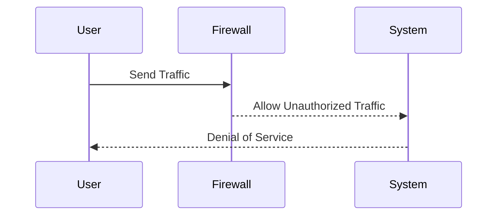
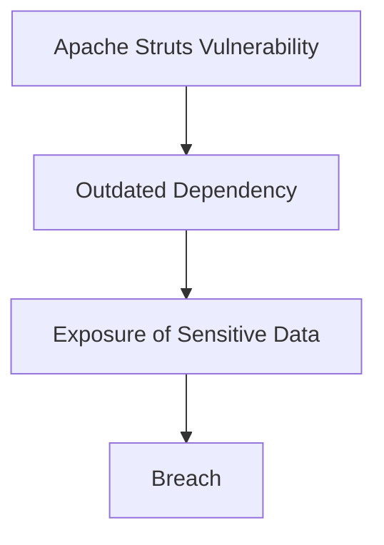
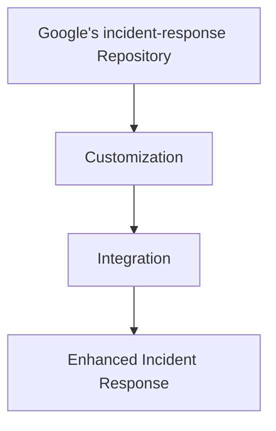

## Shifting Left: Improving Your Incident Response Capability

### Introduction

In the realm of DevSecOps, one of the key principles is shifting left—integrating security practices earlier in the development lifecycle. This approach ensures that security is not an afterthought but a fundamental aspect of the entire process. One critical component of this principle is enhancing your incident response capability. Every time you identify the root cause of an incident, you should leverage this knowledge to improve and mature your pipeline over time. This chapter delves into the various sources of input for improving and tuning your incident response capabilities, including internal and external incidents, open-source libraries, and scripts.

### Learning from Internal Incidents

#### Identifying Root Causes

The first step in improving your incident response capability is to thoroughly analyze internal incidents. When an incident occurs, it is crucial to conduct a post-mortem analysis to identify the root cause. This process involves examining the sequence of events leading up to the incident, understanding the contributing factors, and determining the underlying issues.

**Example:**
Consider a scenario where a production system experiences a denial-of-service (DoS) attack. The post-mortem analysis might reveal that the attack was possible due to a misconfigured firewall rule that allowed unauthorized traffic. By identifying this root cause, you can take corrective actions to prevent similar incidents in the future.



#### Corrective Actions

Once the root cause is identified, you should implement corrective actions to mitigate the issue. This may involve updating configurations, patching vulnerabilities, or modifying processes. Additionally, you should document the findings and share them across the organization to ensure that everyone is aware of the risks and the steps taken to address them.

**Example:**
To prevent future DoS attacks, you could update the firewall rules to block unauthorized traffic. Here is an example of a firewall configuration:

```nginx
server {
    listen 80;
    server_name example.com;

    location / {
        allow 192.168.1.0/24;
        deny all;
        proxy_pass http://backend;
    }
}
```

#### Continuous Improvement

Improving your incident response capability is an ongoing process. Each incident provides an opportunity to learn and refine your practices. By continuously analyzing incidents and implementing corrective actions, you can enhance the maturity and sophistication of your pipeline.

### Learning from External Incidents

#### Analyzing External Incidents

External incidents provide valuable learning opportunities. Many major external incidents have detailed technical reports that include the root cause. These reports can offer insights into common vulnerabilities and effective mitigation strategies.

**Real-World Example:**
One notable example is the Equifax breach in 2017, where a vulnerability in Apache Struts led to the exposure of sensitive data. The detailed report provided by Equifax highlighted the importance of keeping software up-to-date and the risks associated with outdated dependencies.



#### Applying Lessons Learned

By analyzing external incidents, you can apply the lessons learned to your own environment. This may involve reviewing your software dependencies, ensuring that all systems are up-to-date, and implementing additional security measures.

**Example:**
To prevent similar vulnerabilities, you could implement a dependency management tool like `npm audit` for Node.js applications. Here is an example of how to use `npm audit`:

```bash
npm install
npm audit
npm audit fix
```

### Leveraging Open-Source Libraries and Scripts

#### Utilizing Open-Source Resources

Many tech companies have published open-source libraries and scripts that can be used as part of your incident response codebase. These resources can help expand the scalability and effectiveness of your incident response capabilities.

**Real-World Example:**
One such resource is the `incident-response` repository by Google, which contains a collection of scripts and tools for incident response. These scripts can be customized and integrated into your existing infrastructure.



#### Maintaining Close Watching Eye

It is essential to maintain a close watching eye on these libraries and scripts to ensure they remain applicable for your environment. Regularly reviewing and updating these resources can help you stay ahead of potential threats.

**Example:**
To monitor the `incident-response` repository, you could set up a webhook to receive notifications whenever new changes are pushed. Here is an example of how to set up a webhook using GitHub:

```yaml
name: webhook
on:
  push:
    branches:
      - main
jobs:
  notify:
    runs-on: ubuntu-latest
    steps:
      - name: Notify
        run: |
          curl -X POST -H "Content-Type: application/json" --data '{"message": "New changes pushed to incident-response repository"}' https://your-webhook-url.com
```

### How to Prevent / Defend

#### Detection

Detecting incidents early is crucial for effective incident response. This can be achieved through continuous monitoring and logging of system activities. Tools like Splunk, ELK Stack, and Graylog can be used to collect and analyze logs in real-time.

**Example:**
Here is an example of how to configure Splunk to monitor for suspicious activity:

```json
{
  "index": "main",
  "sourcetype": "syslog",
  "search": "index=main sourcetype=syslog | search \"suspicious activity\"",
  "actions": [
    {
      "name": "alert",
      "type": "email",
      "to": "security-team@example.com"
    }
  ]
}
```

#### Prevention

Preventing incidents requires a multi-layered approach. This includes implementing security controls, enforcing policies, and conducting regular security assessments.

**Example:**
To prevent unauthorized access, you could implement multi-factor authentication (MFA) for all users. Here is an example of how to configure MFA using Google Authenticator:

```bash
sudo apt-get install libpam-google-authenticator
google-authenticator
```

#### Secure Coding Fixes

Secure coding practices are essential for preventing vulnerabilities. This involves writing code that is resilient to attacks and adheres to best practices.

**Example:**
To prevent SQL injection attacks, you should use parameterized queries. Here is an example of a vulnerable SQL query and its secure counterpart:

**Vulnerable Code:**

```sql
SELECT * FROM users WHERE username = '$username';
```

**Secure Code:**

```sql
PreparedStatement stmt = connection.prepareStatement("SELECT * FROM users WHERE username = ?");
stmt.setString(1, username);
ResultSet rs = stmt.executeQuery();
```

#### Configuration Hardening

Hardening your configurations can significantly reduce the risk of incidents. This involves securing your systems and services by disabling unnecessary features and applying security patches.

**Example:**
To harden your Apache configuration, you could disable directory listing and enable SSL/TLS encryption. Here is an example of an Apache configuration:

```apache
<Directory "/var/www/html">
    Options -Indexes
</Directory>

<VirtualHost *:443>
    ServerName example.com
    SSLEngine on
    SSLCertificateFile /etc/ssl/certs/example.crt
    SSLCertificateKeyFile /etc/ssl/private/example.key
</VirtualHost>
```

### Conclusion

Improving your incident response capability is a continuous process that involves learning from both internal and external incidents, leveraging open-source resources, and implementing robust security measures. By following the principles outlined in this chapter, you can enhance the maturity and sophistication of your pipeline, ensuring that your organization is better prepared to handle incidents effectively.

### Practice Labs

For hands-on practice, consider the following well-known labs that align with the domain of DevSecOps:

- **PortSwigger Web Security Academy**: Offers interactive labs for web application security.
- **OWASP Juice Shop**: A deliberately insecure web application for practicing web security skills.
- **DVWA (Damn Vulnerable Web Application)**: A PHP/MySQL web application that is riddled with vulnerabilities.
- **WebGoat**: An interactive, gamified training application for learning about web application security.

These labs provide practical experience in identifying and mitigating vulnerabilities, which can significantly enhance your incident response capabilities.

---
<!-- nav -->
[[DevSecOps/DevSecOps Bootcamp/08-Logging & Incident Response/03-Improving Your Incident Response Capability/Shifting Left/07-Real-World Examples|Real-World Examples]] | [[DevSecOps/DevSecOps Bootcamp/08-Logging & Incident Response/03-Improving Your Incident Response Capability/Shifting Left/00-Overview|Overview]] | [[09-Conclusion Part 1|Conclusion Part 1]]
