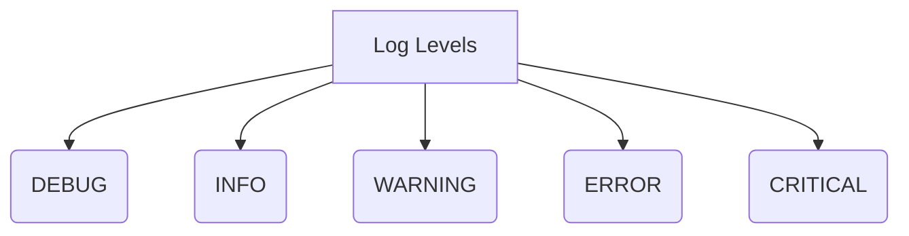
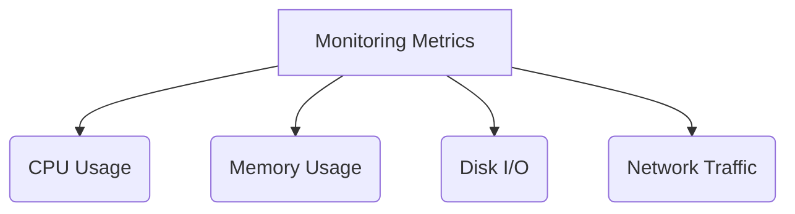
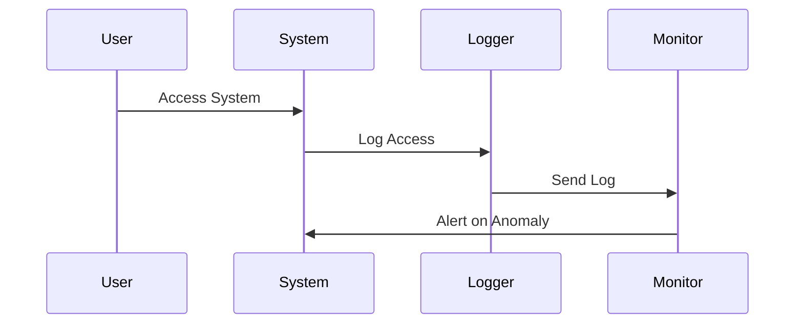
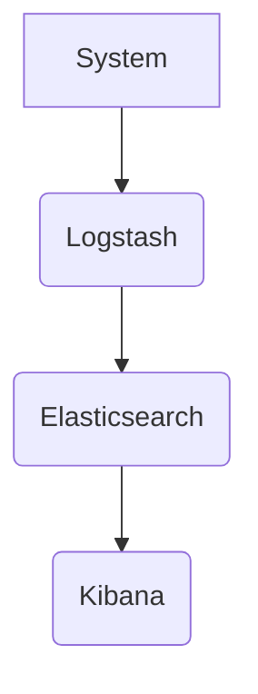
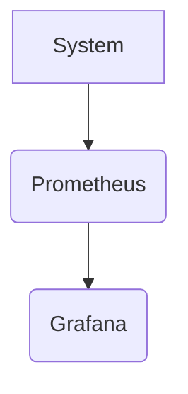

## Introduction to Logging and Monitoring for Security in DevSecOps

Congratulations on completing the first major part of the DevSecOps Bootcamp! You have covered a wide range of concepts and tools, learning not only how to work with them but also the underlying principles and reasons for their usage. This foundational knowledge is crucial as you move forward into more advanced topics.

### Overview of Logging and Monitoring

Logging and monitoring are critical components of DevSecOps. They enable teams to track system behavior, identify anomalies, and respond to security incidents promptly. Effective logging and monitoring practices ensure that systems are secure, reliable, and performant.

#### What is Logging?

Logging is the process of recording events that occur during the operation of a system. Logs provide a detailed record of activities, errors, and other significant events. These logs are essential for troubleshooting, auditing, and security analysis.

**Why is Logging Important?**

- **Troubleshooting:** Logs help in diagnosing issues by providing a chronological record of events leading up to a problem.
- **Auditing:** Logs are used to verify compliance with regulations and internal policies.
- **Security Analysis:** Logs can reveal unauthorized access attempts, malicious activities, and other security incidents.

#### What is Monitoring?

Monitoring involves continuously observing the state of a system to ensure it operates as intended. Monitoring tools collect data from various sources and alert administrators when predefined conditions are met.

**Why is Monitoring Important?**

- **Performance Optimization:** Monitoring helps identify bottlenecks and performance issues.
- **Proactive Maintenance:** By detecting anomalies early, monitoring allows for proactive maintenance to prevent system failures.
- **Security Incident Detection:** Monitoring can detect unusual patterns that may indicate a security breach.

### Key Concepts in Logging and Monitoring

#### Log Levels

Logs are typically categorized into levels based on their severity. Common log levels include:

- **DEBUG:** Detailed information useful for diagnosing problems.
- **INFO:** General operational messages.
- **WARNING:** Indication of unexpected or potentially harmful situations.
- **ERROR:** Errors that affect functionality.
- **CRITICAL:** Severe errors that cause system failure.

#### Log Aggregation

Log aggregation involves collecting logs from multiple sources into a centralized location. This simplifies log management and analysis.

**Why is Log Aggregation Important?**

- **Centralized Management:** Simplifies log management by consolidating logs from various sources.
- **Unified Analysis:** Enables comprehensive analysis across different systems and services.
- **Improved Troubleshooting:** Facilitates quicker identification and resolution of issues.

#### Monitoring Metrics

Monitoring metrics are quantitative measures used to assess system performance and health. Common metrics include:

- **CPU Usage:** Percentage of CPU time used.
- **Memory Usage:** Amount of memory consumed.
- **Disk I/O:** Input/output operations per second.
- **Network Traffic:** Volume of data transmitted and received.

### Real-World Examples and Recent Breaches

#### Example: Equifax Data Breach (CVE-2017-5638)

In 2017, Equifax suffered a massive data breach due to a vulnerability in Apache Struts. The breach exposed sensitive personal information of millions of customers. Proper logging and monitoring could have helped detect and mitigate the breach earlier.

**What Went Wrong?**

- **Insufficient Logging:** Equifax did not have adequate logging mechanisms to detect the initial breach.
- **Delayed Response:** Lack of real-time monitoring led to a delayed response, allowing the attackers to remain undetected for weeks.

**How to Prevent / Defend**

- **Implement Centralized Logging:** Use tools like ELK Stack (Elasticsearch, Logstash, Kibana) to centralize and analyze logs.
- **Real-Time Monitoring:** Deploy monitoring solutions like Prometheus and Grafana to detect anomalies in real-time.
- **Secure Configuration:** Ensure that all systems are configured securely, following best practices such as the CIS Benchmarks.

### Tools and Technologies

#### Logging Tools

- **ELK Stack (Elasticsearch, Logstash, Kibana):**
  - **Elasticsearch:** A distributed search and analytics engine.
  - **Logstash:** A server-side data processing pipeline that ingests data from various sources, transforms it, and then sends it to a "stash" like Elasticsearch.
  - **Kibana:** A visualization tool that provides a user interface for searching, viewing, and interacting with data stored in Elasticsearch.

#### Monitoring Tools

- **Prometheus:**
  - A powerful open-source monitoring solution that collects and stores metrics from configured targets at regular intervals and provides a flexible query language to access and aggregate these metrics.
  
- **Grafana:**
  - A visualization platform that allows users to create, explore, and share dashboards for visualizing data from Prometheus and other data sources.

### Hands-On Labs

To gain practical experience with logging and monitoring, consider the following labs:

- **PortSwigger Web Security Academy:** Offers modules on logging and monitoring for web applications.
- **OWASP Juice Shop:** A deliberately insecure web application for security training. It includes features to demonstrate logging and monitoring vulnerabilities.
- **DVWA (Damn Vulnerable Web Application):** Another intentionally vulnerable web app for security practice. It can be used to learn about logging and monitoring in a controlled environment.

### Conclusion

Congratulations on reaching this stage of the DevSecOps Bootcamp! You have learned about the importance of logging and monitoring in ensuring system security and reliability. By understanding the key concepts, tools, and real-world examples, you are well-equipped to implement effective logging and monitoring practices in your DevSecOps workflow.

Feel free to reach out to us via the communication channels provided in the lecture description. We would love to hear your success stories and how the bootcamp is helping you in your engineering career. Let's continue to the amazing and exciting second part of this bootcamp!

---
<!-- nav -->
[[DevSecOps/DevSecOps Bootcamp/08-Logging & Incident Response/04-Logging & Monitoring for Security/01-Complete Bootcamp Part 1 Next Steps/00-Overview|Overview]] | [[DevSecOps/DevSecOps Bootcamp/08-Logging & Incident Response/04-Logging & Monitoring for Security/01-Complete Bootcamp Part 1 Next Steps/02-Practice Questions & Answers|Practice Questions & Answers]]
