## Introduction to CloudTrail and CloudWatch

In the realm of DevSecOps, logging and monitoring are critical components for ensuring the security and integrity of cloud-based systems. AWS provides several services for monitoring, logging, tracing, and alerting, among which CloudTrail and CloudWatch stand out as essential tools for maintaining visibility and control over AWS resources. This chapter will delve into the details of these services, their functionalities, and how they can be effectively utilized to enhance security and operational efficiency.

### What is CloudTrail?

CloudTrail is a service provided by AWS that enables continuous monitoring and auditing of all API calls made within an AWS account. Essentially, it creates a detailed record of actions taken within your AWS environment, providing a comprehensive audit trail. This includes actions performed through the AWS Management Console, AWS SDKs, command-line tools, and higher-level AWS services.

#### Why Use CloudTrail?

CloudTrail serves several crucial purposes:

1. **Audit and Compliance**: By recording all API calls, CloudTrail helps organizations meet regulatory requirements and internal compliance standards. It ensures that all actions are traceable and accountable.
   
2. **Security Monitoring**: CloudTrail can detect unauthorized or unusual activity within your AWS environment. This is particularly useful for identifying potential security breaches or insider threats.

3. **Operational Insights**: The detailed logs generated by CloudTrail provide valuable insights into how your AWS resources are being used, helping you optimize resource allocation and identify inefficiencies.

#### How Does CloudTrail Work?

When enabled, CloudTrail captures every API call made to your AWS account and records the following information:

- **Event Time**: The timestamp of when the event occurred.
- **Event Source**: The AWS service that generated the event.
- **Event Name**: The specific API action performed.
- **Request Parameters**: The parameters passed to the API call.
- **Response Elements**: The response data returned by the API call.
- **User Identity**: Information about the user or role that initiated the API call.

This data is then stored in an S3 bucket, which can be configured to retain logs for a specified period. Additionally, CloudTrail can forward this data to CloudWatch Logs for further analysis and alerting.

#### Example Configuration

To enable CloudTrail, you can follow these steps:

1. **Create a Trail**:
    - Navigate to the CloudTrail console.
    - Click on "Create trail".
    - Provide a name for the trail and select the S3 bucket where logs will be stored.
    - Optionally, enable additional features such as logging all global services and enabling log file validation.

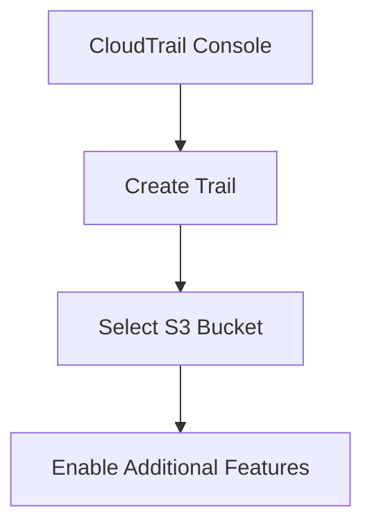

2. **Configure Log File Validation**:
    - Enable log file validation to ensure the integrity of the log files.
    - This generates a daily digest file that contains a list of all log files created during the previous day.

3. **Set Up Notifications**:
    - Configure notifications to receive alerts when new log files are delivered to the S3 bucket.
    - This can be done via Amazon SNS (Simple Notification Service).

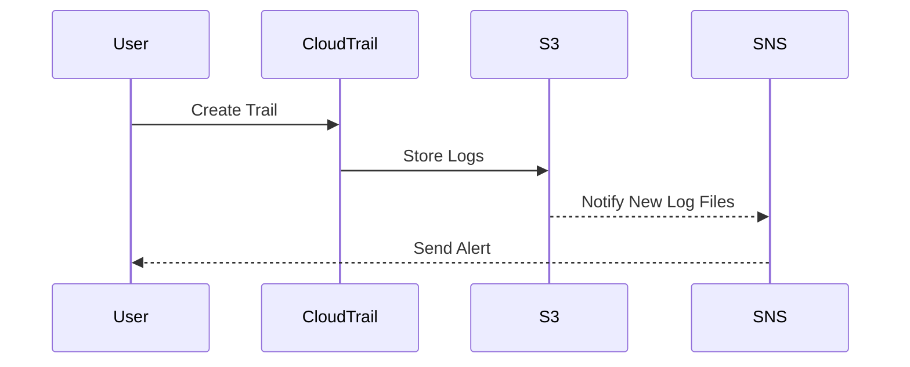

### What is CloudWatch?

CloudWatch is a monitoring and management service provided by AWS. It collects and tracks metrics and events related to various AWS resources, including EC2 instances, RDS databases, and custom applications. CloudWatch can be used to monitor the health and performance of your AWS infrastructure, as well as to set up alarms and trigger automated actions based on specific conditions.

#### Why Use CloudWatch?

CloudWatch offers several key benefits:

1. **Real-Time Monitoring**: CloudWatch provides real-time monitoring of AWS resources, allowing you to quickly identify and respond to issues.
   
2. **Custom Metrics**: You can define custom metrics to track application-specific data, providing deeper insights into your system's performance.

3. **Alarms and Automated Actions**: CloudWatch allows you to set up alarms based on specific thresholds and trigger automated actions, such as scaling resources or sending notifications.

4. **Log Analysis**: CloudWatch Logs can be used to store and analyze log data from various sources, including CloudTrail.

#### How Does CloudWatch Work?

CloudWatch collects and stores metrics from various AWS resources, which can be visualized and analyzed using the CloudWatch console or APIs. These metrics include CPU usage, disk space, network traffic, and more. Additionally, CloudWatch can collect and store custom metrics defined by users.

1. **Metrics Collection**:
    - CloudWatch automatically collects metrics from supported AWS services.
    - Custom metrics can be published using the CloudWatch API or SDKs.

2. **Dashboards and Visualizations**:
    - Metrics can be visualized using CloudWatch dashboards, which provide a high-level overview of your AWS environment.
    - Dashboards can be shared with team members and customized to display specific metrics.

3. **Alarms and Automated Actions**:
    - Alarms can be created based on specific metric thresholds.
    - When an alarm is triggered, CloudWatch can execute automated actions, such as sending notifications or invoking Lambda functions.

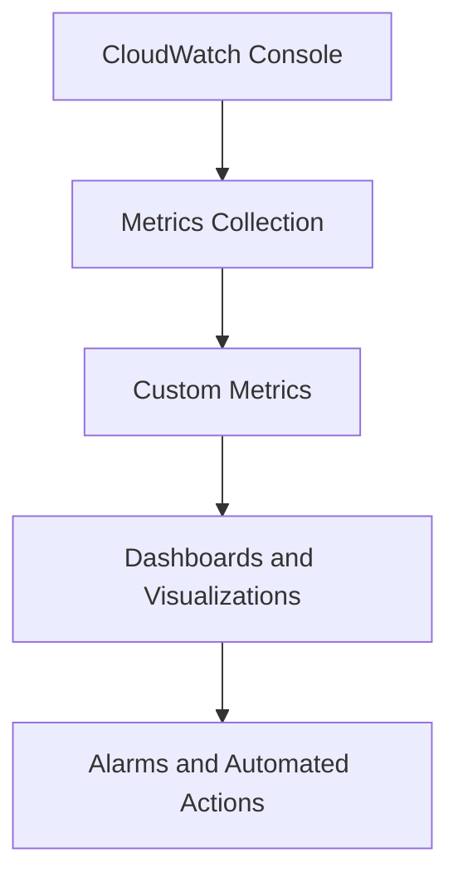

#### Example Configuration

To set up CloudWatch for monitoring and alerting, you can follow these steps:

1. **Collect Metrics**:
    - Ensure that CloudWatch is enabled for the AWS resources you want to monitor.
    - For custom metrics, use the CloudWatch API or SDKs to publish data.

```python
import boto3

cloudwatch = boto3.client('cloudwatch')

response = cloudwatch.put_metric_data(
    Namespace='MyApp/Metrics',
    MetricData=[
        {
            'MetricName': 'RequestsPerSecond',
            'Dimensions': [
                {
                    'Name': 'InstanceId',
                    'Value': 'i-1234567890abcdef0'
                },
            ],
            'Value': 100,
            'Unit': 'Count/Second'
        },
    ]
)
```

2. **Create Dashboards**:
    - Navigate to the CloudWatch console and create a new dashboard.
    - Add widgets to display specific metrics and customize the layout.

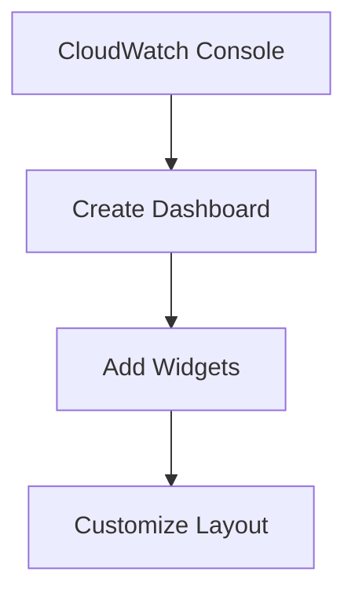

3. **Set Up Alarms**:
    - Define alarms based on specific metric thresholds.
    - Specify actions to be taken when an alarm is triggered, such as sending notifications or invoking Lambda functions.

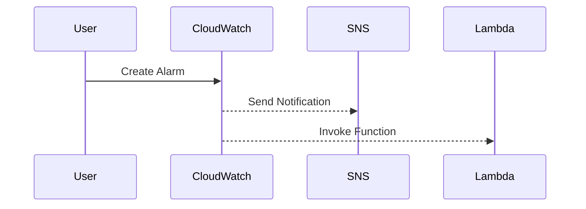

### Integrating CloudTrail and CloudWatch

By integrating CloudTrail and CloudWatch, you can create a robust logging and monitoring solution for your AWS environment. CloudTrail logs can be forwarded to CloudWatch Logs, where they can be analyzed and used to trigger alarms and automated actions.

#### Example Integration

To integrate CloudTrail and CloudWatch, you can follow these steps:

1. **Forward CloudTrail Logs to CloudWatch**:
    - In the CloudTrail console, enable the option to forward logs to CloudWatch Logs.
    - This will create a log group in CloudWatch Logs where CloudTrail logs will be stored.

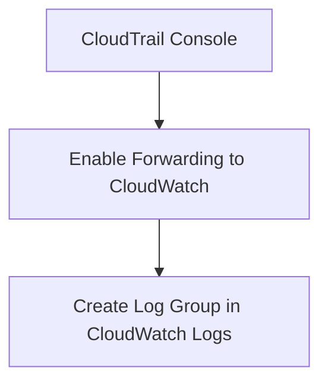

2. **Analyze Logs in CloudWatch**:
    - Use CloudWatch Logs Insights to query and analyze CloudTrail logs.
    - Create queries to identify specific patterns or anomalies in the logs.

```sql
fields @timestamp, eventSource, eventName, userIdentity.type, userIdentity.principalId
| filter eventSource = "ec2.amazonaws.com"
| sort @timestamp desc
| limit 10
```

3. **Set Up Alarms Based on Logs**:
    - Create alarms in CloudWatch based on specific log patterns.
    - Trigger automated actions when the alarms are triggered.

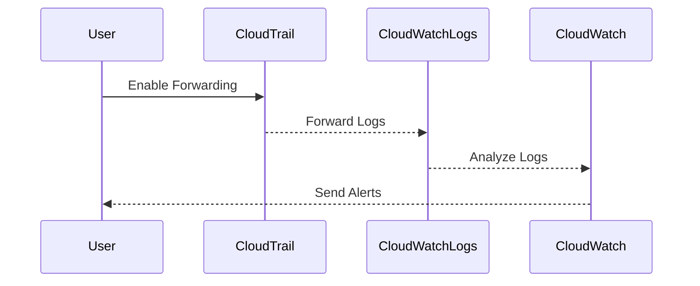

### Real-World Examples and Recent Breaches

Recent breaches and vulnerabilities have highlighted the importance of effective logging and monitoring practices. For instance, the Capital One breach in 2019 involved unauthorized access to sensitive customer data due to misconfigured AWS S3 buckets. Proper use of CloudTrail and CloudWatch could have helped detect and mitigate such issues earlier.

#### Example: Capital One Breach

In the Capital One breach, an attacker exploited a misconfigured AWS WAF rule to gain unauthorized access to S3 buckets containing sensitive customer data. Had CloudTrail been properly configured, it would have recorded the unauthorized API calls and alerted the security team.

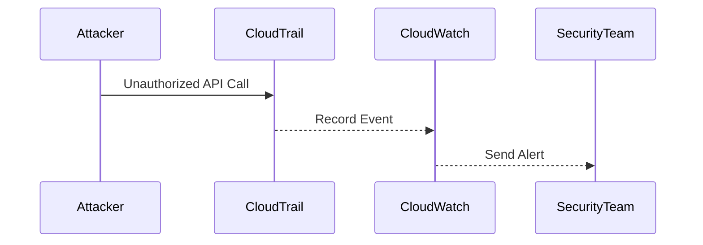

### How to Prevent / Defend

To effectively utilize CloudTrail and CloudWatch for security, it is crucial to implement proper configurations and best practices.

#### Secure Configuration

1. **Enable CloudTrail**:
    - Ensure that CloudTrail is enabled for all regions and accounts.
    - Configure CloudTrail to log all API calls and store logs in an S3 bucket.

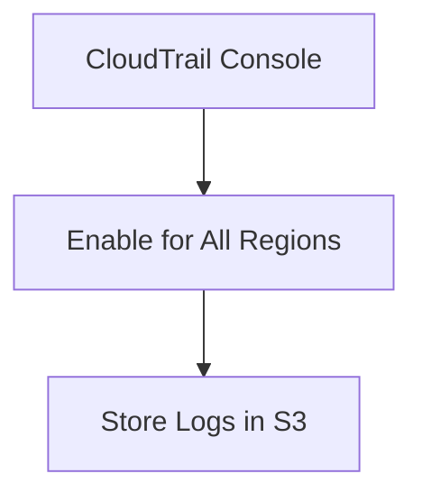

2. **Enable Log File Validation**:
    - Enable log file validation to ensure the integrity of the log files.
    - This generates a daily digest file that contains a list of all log files created during the previous day.

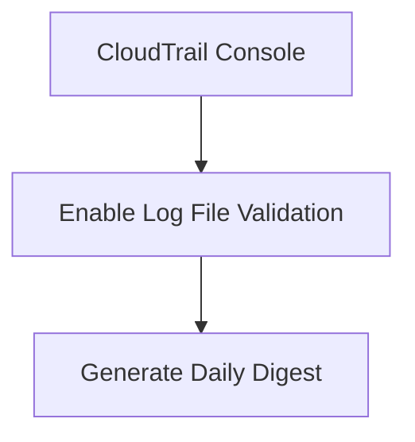

3. **Forward Logs to CloudWatch**:
    - Enable the option to forward CloudTrail logs to CloudWatch Logs.
    - This allows for easier analysis and alerting based on log data.

```mer
graph TD
    A[CloudTrail Console] --> B[Enable Forwarding to CloudWatch]
    B --> C[Create Log Group in CloudWatch Logs]
```

#### Best Practices

1. **Regularly Review Logs**:
    - Regularly review CloudTrail logs to identify any suspicious activity.
    - Use CloudWatch Logs Insights to query and analyze logs for specific patterns.

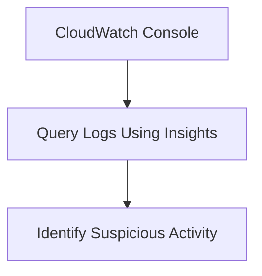

2. **Set Up Alarms and Automated Actions**:
    - Create alarms based on specific metric thresholds and log patterns.
    - Trigger automated actions, such as sending notifications or invoking Lambda functions, when alarms are triggered.


3. **Implement Least Privilege Access**:
    - Ensure that IAM roles and policies are configured to grant least privilege access.
    - Regularly review and update IAM policies to minimize exposure.

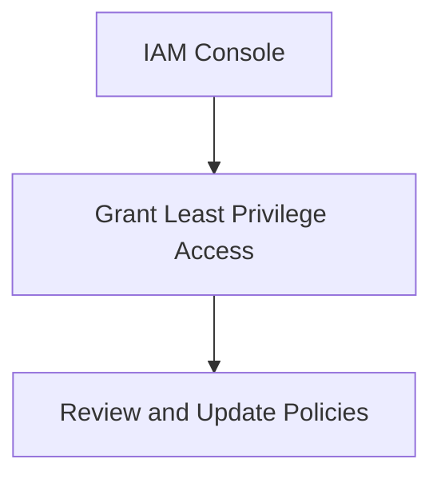

### Conclusion

CloudTrail and CloudWatch are powerful tools for logging and monitoring AWS environments. By leveraging these services, organizations can enhance their security posture, meet compliance requirements, and gain valuable insights into their AWS resources. Proper configuration and best practices are essential for maximizing the effectiveness of these services.

### Practice Labs

For hands-on experience with CloudTrail and CloudWatch, consider the following labs:

- **CloudGoat**: A cloud security training platform that includes exercises for setting up and configuring CloudTrail and CloudWatch.
- **flaws.cloud**: A cloud security lab that provides scenarios for detecting and responding to security incidents using CloudTrail and CloudWatch.

These labs offer practical, real-world scenarios that can help you master the use of CloudTrail and CloudWatch for security monitoring and logging.

---
<!-- nav -->
[[DevSecOps/DevSecOps Bootcamp/08-Logging & Incident Response/04-Logging & Monitoring for Security/02-Introduction to CloudTrail and CloudWatch/00-Overview|Overview]] | [[DevSecOps/DevSecOps Bootcamp/08-Logging & Incident Response/04-Logging & Monitoring for Security/02-Introduction to CloudTrail and CloudWatch/02-Practice Questions & Answers|Practice Questions & Answers]]
