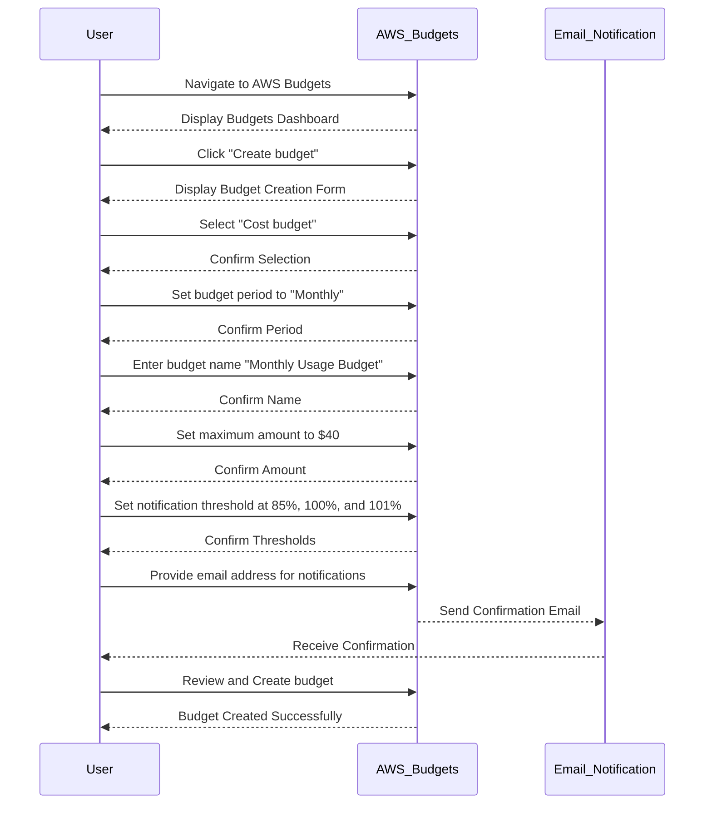

## Introduction to AWS Budgets for Monthly Usage Costs

In the realm of DevSecOps, effective logging and monitoring are critical for maintaining system integrity and ensuring that operational costs remain within budget. One key aspect of this is setting up budgets to monitor and control AWS usage costs. This chapter will delve into configuring AWS Budgets for monthly usage costs, explaining the underlying concepts, providing detailed steps, and offering practical examples and defenses.

### What Are AWS Budgets?

AWS Budgets allow you to define custom budgets to track your spending and usage across various AWS services. These budgets help you manage your costs by sending alerts when your usage approaches or exceeds predefined thresholds. By setting up budgets, you can:

- Monitor your AWS spending in real-time.
- Receive notifications when your usage exceeds certain limits.
- Take proactive measures to avoid unexpected charges.

### Why Use AWS Budgets?

Using AWS Budgets is essential for several reasons:

- **Cost Control**: Helps you stay within your financial constraints.
- **Proactive Management**: Allows you to take corrective actions before exceeding your budget.
- **Visibility**: Provides insights into your AWS usage patterns.

### How AWS Budgets Work

AWS Budgets work by tracking your AWS usage against predefined budgets. You can set up different types of budgets, including:

- **Cost Budgets**: Track your spending against a specified amount.
- **Usage Budgets**: Track the usage of specific AWS services.
- **Forecasted Cost Budgets**: Predict future spending based on current trends.

When your usage approaches or exceeds the defined thresholds, AWS sends notifications via email or integrates with other notification systems like Amazon SNS.

### Setting Up AWS Budgets for Monthly Usage Costs

To configure AWS Budgets for monthly usage costs, follow these steps:

1. **Navigate to AWS Budgets**:
    - Log in to the AWS Management Console.
    - Go to the "Billing & Cost Management" section.
    - Click on "Budgets".

2. **Create a New Budget**:
    - Click on "Create budget".
    - Choose "Cost budget" for tracking overall spending.

3. **Configure the Budget**:
    - Set the budget period to "Monthly".
    - Enter a budget name (e.g., "Monthly Usage Budget").
    - Define the maximum amount you want to spend (e.g., $40 or $50).

4. **Set Notification Thresholds**:
    - Specify the notification threshold (e.g., 85%, 100%, and 101%).
    - Provide an email address to receive notifications.

5. **Review and Create**:
    - Review the settings and click "Create budget".

### Detailed Configuration Example

Here’s a step-by-step example of creating an AWS Budget for monthly usage costs:



### Full Raw HTTP Message Example

Below is an example of the full HTTP request and response for creating an AWS Budget using the AWS SDK:

#### Request

```http
POST /budgets/v1/budgets HTTP/1.1
Host: budgets.amazonaws.com
Content-Type: application/json
Authorization: Bearer <YOUR_ACCESS_TOKEN>

{
  "Budget": {
    "BudgetName": "Monthly Usage Budget",
    "BudgetLimit": {
      "Amount": "40",
      "Unit": "USD"
    },
    "TimePeriod": {
      "Start": "2023-10-01T00:00:00Z",
      "End": "2023-10-31T23:59:59Z"
    },
    "NotificationsWithSubscribers": [
      {
        "Notification": {
          "ComparisonOperator": "GREATER_THAN",
          "Threshold": 85,
          "ThresholdType": "PERCENTAGE"
        },
        "Subscribers": [
          {
            "SubscriptionType": "EMAIL",
            "Address": "user@example.com"
          }
        ]
      },
      {
        "Notification": {
          "ComparisonOperator": "EQUAL_TO",
          "Threshold": 100,
          "ThresholdType": "PERCENTAGE"
        },
        "Subscribers": [
          {
            "SubscriptionType": "EMAIL",
            "Address": "user@example.com"
          }
        ]
      },
      {
        "Notification": {
          "ComparisonOperator": "GREATER_THAN",
          "Threshold": 101,
          "ThresholdType": "PERCENTAGE"
        },
        "Subscribers": [
          {
            "SubscriptionType": "EMAIL",
            "Address": "user@example.com"
          }
        ]
      }
    ],
    "TimeUnit": "MONTHLY"
  }
}
```

#### Response

```http
HTTP/1.1 200 OK
Content-Type: application/json

{
  "Budget": {
    "BudgetName": "Monthly Usage Budget",
    "BudgetLimit": {
      "Amount": "40",
      "Unit": "USD"
    },
    "TimePeriod": {
      "Start": "2023-10-01T00:00:00Z",
      "End": "2023-10-31T23:59:59Z"
    },
    "NotificationsWithSubscribers": [
      {
        "Notification": {
          "ComparisonOperator": "GREATER_THAN",
          "Threshold": 85,
          "ThresholdType": "PERCENTAGE"
        },
        "Subscribers": [
          {
            "SubscriptionType": "EMAIL",
            "Address": "user@example.com"
          }
        ]
      },
      {
        "Notification": {
          "ComparisonOperator": "EQUAL_TO",
          "Threshold": 100,
          "ThresholdType": "PERCENTAGE"
        },
        "Subscribers": [
          {
            "SubscriptionType": "EMAIL",
            "Address": "user@example.com"
          }
        ]
      },
      {
        "Notification": {
          "ComparisonOperator": "GREATER_THAN",
          "Threshold": 101,
          "ThresholdType": "PERCENTAGE"
        },
        "Subscribers": [
          {
            "SubscriptionType": "EMAIL",
            "Address": "user@example.com"
          }
        ]
      }
    ],
    "TimeUnit": "MONTHLY"
  }
}
```

### Common Pitfalls and Best Practices

#### Pitfall: Overlooking Notification Thresholds

One common mistake is not setting appropriate notification thresholds. Without proper thresholds, you might miss critical alerts about impending budget overruns.

#### Best Practice: Set Multiple Notification Thresholds

To ensure timely alerts, set multiple notification thresholds. For example, notify at 85%, 100%, and 101% of the budget limit.

### Real-World Example: AWS Budgets in Action

Consider a recent breach where a company inadvertently left an EC2 instance running, leading to unexpected charges. By setting up AWS Budgets, the company could have received notifications when their spending approached the budget limit, allowing them to take corrective action.

### How to Prevent / Defend

#### Detection

- **Monitor Budget Alerts**: Regularly check budget alerts and notifications.
- **Use AWS Cost Explorer**: Analyze spending trends and identify anomalies.

#### Prevention

- **Automate Budget Creation**: Use scripts or tools to automatically create and update budgets.
- **Implement Cost Controls**: Set strict budget limits and enforce them through policies.

#### Secure-Coding Fixes

Compare the vulnerable and secure versions of budget creation:

##### Vulnerable Code

```python
import boto3

client = boto3.client('budgets')

response = client.create_budget(
    AccountId='123456789012',
    Budget={
        'BudgetName': 'Monthly Usage Budget',
        'BudgetLimit': {
            'Amount': '40',
            'Unit': 'USD'
        },
        'TimePeriod': {
            'Start': '2023-10-01T00:00:00Z',
            'End': '2023-10-31T23:59:59Z'
        },
        'NotificationsWithSubscribers': []
    }
)
```

##### Secure Code

```python
import boto3

client = boto3.client('budgets')

response = client.create_budget(
    AccountId='123456789012',
    Budget={
        'BudgetName': 'Monthly Usage Budget',
        'BudgetLimit': {
            'Amount': '40',
            'Unit': 'USD'
        },
        'TimePeriod': {
            'Start': '2023-10-01T00:00:00Z',
            'End': '2023-10-31T23:59:59Z'
        },
        'NotificationsWithSubscribers': [
            {
                'Notification': {
                    'ComparisonOperator': 'GREATER_THAN',
                    'Threshold': 85,
                    'ThresholdType': 'PERCENTAGE'
                },
                'Subscribers': [
                    {
                        'SubscriptionType': 'EMAIL',
                        'Address': 'user@example.com'
                    }
                ]
            },
            {
                'Notification': {
                    'ComparisonOperator': 'EQUAL_TO',
                    'Threshold': 100,
                    'ThresholdType': 'PERCENTAGE'
                },
                'Subscribers': [
                    {
                        'SubscriptionType': 'EMAIL',
                        'Address': 'user@example.com'
                    }
                ]
            },
            {
                'Notification': {
                    'ComparisonOperator': 'GREATER_THAN',
                    'Threshold': 101,
                    'ThresholdType': 'PERCENTAGE'
                },
                'Subscribers': [
                    {
                        'SubscriptionType': 'EMAIL',
                        'Address': 'user@example.com'
                    }
                ]
            }
        ]
    }
)
```

### Conclusion

Setting up AWS Budgets for monthly usage costs is a crucial step in managing your AWS expenses effectively. By following the detailed steps and best practices outlined in this chapter, you can ensure that your AWS usage remains within budget and that you receive timely notifications to take corrective actions.

---
<!-- nav -->
[[DevSecOps/DevSecOps Bootcamp/08-Logging & Incident Response/04-Logging & Monitoring for Security/04-Configure AWS Budgets for Monthly Usage Costs/00-Overview|Overview]] | [[02-Introduction to Logging and Monitoring for Security in AWS|Introduction to Logging and Monitoring for Security in AWS]]
