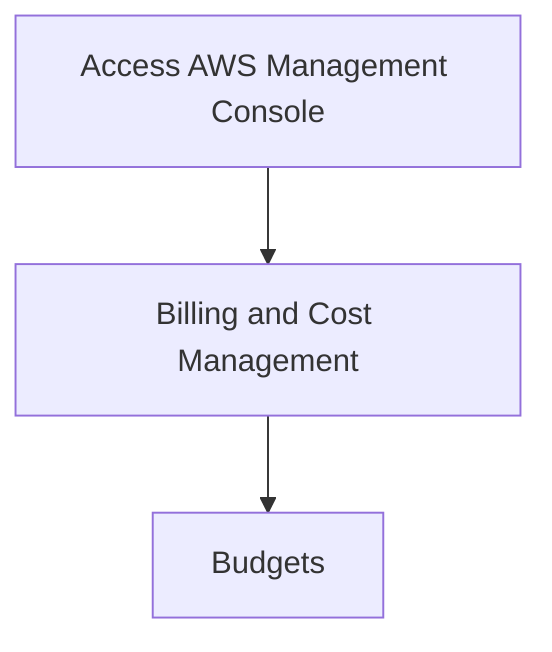
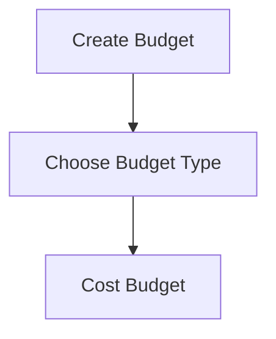
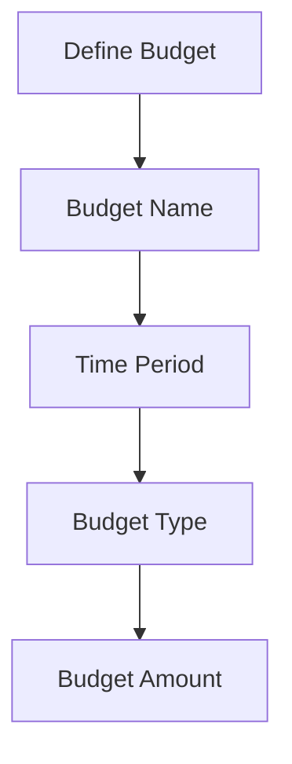
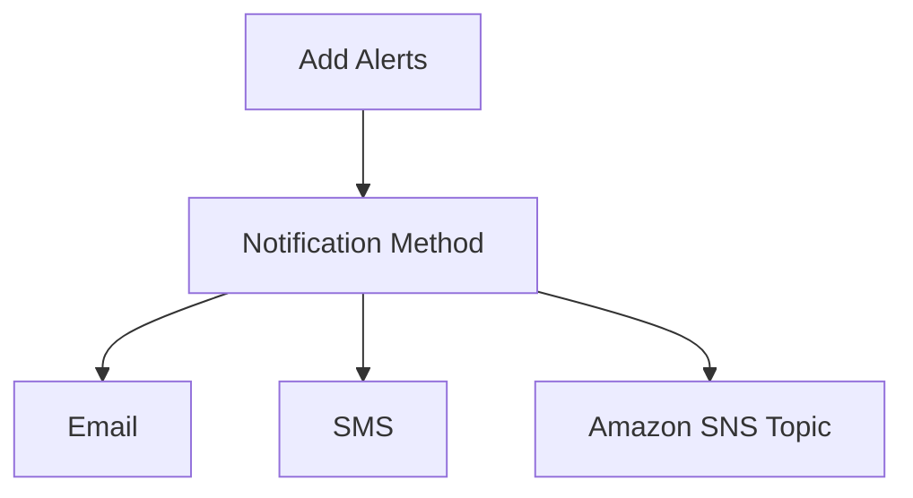
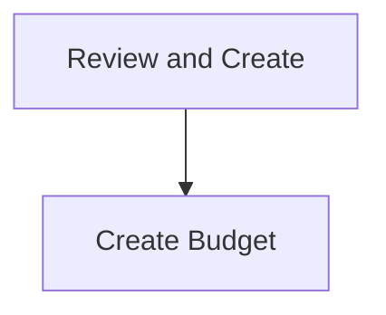

## Introduction to Logging and Monitoring for Security in AWS

In the realm of DevSecOps, logging and monitoring play a critical role in ensuring the security and operational efficiency of cloud environments. One key aspect of this is configuring budget alerts for monthly usage costs in AWS. This ensures that unexpected spikes in usage, which can indicate potential security issues such as unauthorized access or malicious activity, are promptly detected and addressed.

### Why Monitor Billing?

Monitoring your AWS billing is essential for several reasons:

1. **Cost Control**: Unexpected increases in costs can quickly drain your budget. By setting up budget alerts, you can ensure that you are aware of any significant changes in your spending.
2. **Security Awareness**: Unauthorized access to your AWS account can lead to the creation of new resources or the scaling up of existing ones, resulting in higher costs. Monitoring your billing can help you detect such activities early.
3. **Compliance**: Many organizations have strict financial controls and compliance requirements. Regular monitoring helps ensure that you stay within budgetary limits and comply with internal policies.

### Setting Up AWS Budgets

AWS provides a robust mechanism for setting up budgets and alerts. Here’s a step-by-step guide to configuring budget alerts for monthly usage costs.

#### Step 1: Access AWS Budgets

To set up a budget, navigate to the AWS Management Console and go to the "Billing and Cost Management" section. From there, select "Budgets."



#### Step 2: Create a New Budget

Click on "Create budget." You will be prompted to choose between a cost budget or a usage budget. For this scenario, we will focus on a cost budget.



#### Step 3: Define the Budget

- **Budget Name**: Provide a descriptive name for your budget, such as "Monthly Usage Cost."
- **Time Period**: Select the time period for your budget. Typically, you would choose a monthly period.
- **Budget Type**: Choose "Cost."
- **Budget Amount**: Set the threshold amount for your budget. This should be based on your typical monthly spending.



#### Step 4: Add Alerts

Once you have defined the budget, you can add alerts to notify you when the budget threshold is exceeded. You can choose to receive notifications via email, SMS, or through an Amazon SNS topic.



#### Step 5: Review and Create

Review the details of your budget and alerts. Once you are satisfied, click "Create budget."



### Example Configuration

Here is a complete example of setting up a budget alert using the AWS CLI:

```bash
aws budgets create-budget \
--account-id <your-account-id> \
--budget-name "Monthly Usage Cost" \
--budgetType COST \
--timePeriodStart "2023-01-01" \
--timeUnit MONTHLY \
--budgetLimit '{"Amount":"1000","Unit":"USD"}' \
--notificationsWithSubscribers '[{"Notification":{"Type":"ACTUAL","ComparisonOperator":"GREATER_THAN","Threshold":100,"ThresholdType":"PERCENTAGE","EvaluationPeriods":1},"Subscribers":[{"SubscriptionType":"EMAIL","Address":"user@example.com"},{"SubscriptionType":"SNS","Address":"arn:aws:sns:us-east-1:<your-account-id>:MySNSTopic"}]}]'
```

### Real-World Examples and Recent Breaches

Recent breaches and CVEs highlight the importance of monitoring AWS usage costs:

- **CVE-2021-20225**: This vulnerability allowed attackers to gain unauthorized access to AWS accounts and create new resources, leading to unexpected charges. Monitoring your billing helped affected organizations detect and mitigate the issue.
- **2022 AWS Account Compromise**: In a notable incident, hackers gained access to an AWS account and used it to launch cryptocurrency mining operations, resulting in significant cost overruns. Regular monitoring of billing alerts would have alerted the organization to this activity.

### How to Prevent / Defend

#### Detection

Regularly review your AWS billing reports and set up budget alerts to detect any unusual activity. Use AWS Trusted Advisor to identify potential security risks and cost optimization opportunities.

#### Prevention

- **IAM Policies**: Implement strong IAM policies to restrict access to sensitive resources and limit the ability to create new resources.
- **Multi-Factor Authentication (MFA)**: Enable MFA for all IAM users to add an extra layer of security.
- **Resource Tags**: Use tags to track and manage resources, making it easier to identify and clean up unused resources.

#### Secure Coding Fixes

Compare the insecure and secure versions of IAM policies:

**Insecure Policy:**
```json
{
    "Version": "2012-10-17",
    "Statement": [
        {
            "Effect": "Allow",
            "Action": "*",
            "Resource": "*"
        }
    ]
}
```

**Secure Policy:**
```json
{
    "Version": "2012-10-17",
    "Statement": [
        {
            "Effect": "Allow",
            "Action": [
                "ec2:RunInstances",
                "ec2:TerminateInstances"
            ],
            "Resource": "*"
        }
    ]
}
```

### Conclusion

Monitoring your AWS billing is a crucial component of DevSecOps practices. By setting up budget alerts and regularly reviewing your usage, you can detect and prevent unauthorized access and cost overruns. This ensures both financial control and enhanced security for your cloud environment.

### Practice Labs

For hands-on experience with AWS budgeting and monitoring, consider the following labs:

- **CloudGoat**: Provides a series of challenges and scenarios to practice securing AWS environments.
- **flaws.cloud**: Offers real-world scenarios to test your skills in detecting and preventing security issues in AWS.

By mastering these concepts and practicing with real-world tools, you can significantly enhance the security and operational efficiency of your AWS environment.

---
<!-- nav -->
[[01-Introduction to AWS Budgets for Monthly Usage Costs|Introduction to AWS Budgets for Monthly Usage Costs]] | [[DevSecOps/DevSecOps Bootcamp/08-Logging & Incident Response/04-Logging & Monitoring for Security/04-Configure AWS Budgets for Monthly Usage Costs/00-Overview|Overview]] | [[03-Introduction to Logging and Monitoring for Security in DevSecOps|Introduction to Logging and Monitoring for Security in DevSecOps]]
