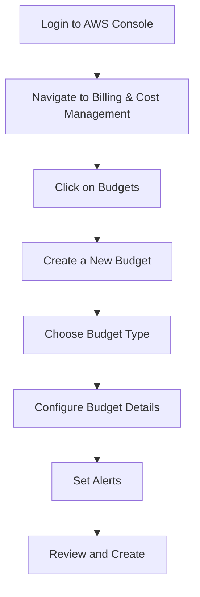

## Introduction to Logging and Monitoring for Security in DevSecOps

In the realm of DevSecOps, logging and monitoring play a crucial role in ensuring the security and operational integrity of cloud-based systems. One key aspect of this is managing and monitoring costs associated with cloud usage. In this section, we will delve into the configuration of AWS Budgets for monthly usage costs, which helps in preventing unexpected charges due to forgotten or unmonitored AWS resources.

### Understanding AWS Budgets

AWS Budgets is a service designed to help you manage and monitor your AWS costs and usage. It provides a user-friendly interface to set up alerts and notifications based on your spending patterns. This service is particularly useful for non-technical users who might be responsible for managing budgets across multiple cloud accounts.

#### Why Use AWS Budgets?

1. **Cost Control**: AWS Budgets allows you to set thresholds for your spending and receive alerts when you exceed these limits. This helps in maintaining a tight control over your cloud expenses.
2. **Alerts and Notifications**: You can configure alerts to notify you via email, SMS, or through Amazon SNS when your spending exceeds predefined thresholds.
3. **User-Friendly Interface**: Unlike CloudWatch Alarms, which require more technical expertise, AWS Budgets offers a simpler interface that is accessible to non-technical users.

### Setting Up AWS Budgets

To set up AWS Budgets, follow these steps:

1. **Navigate to AWS Budgets**:
   - Log in to the AWS Management Console.
   - Navigate to the "Billing & Cost Management" section.
   - Click on "Budgets".

2. **Create a New Budget**:
   - Click on "Create budget".
   - Choose the type of budget (e.g., cost budget, usage budget).

3. **Configure the Budget**:
   - Set the budget name and description.
   - Define the budget amount and time period (e.g., monthly).
   - Specify the services or linked accounts to include in the budget.

4. **Set Alerts**:
   - Add alerts to notify you when the budget threshold is reached.
   - Choose the notification method (email, SMS, Amazon SNS).

5. **Review and Create**:
   - Review the budget settings.
   - Click "Create budget".

### Example Configuration

Let's walk through a detailed example of setting up an AWS Budget for monthly usage costs.



#### Step-by-Step Configuration

1. **Login to AWS Console**:
   - Open your browser and navigate to the AWS Management Console.
   - Enter your credentials to log in.

2. **Navigate to Billing & Cost Management**:
   - In the AWS Management Console, click on "Services".
   - Search for "Billing & Cost Management" and select it.

3. **Click on Budgets**:
   - On the left-hand menu, click on "Budgets".

4. **Create a New Budget**:
   - Click on "Create budget".
   - Select "Cost budget" for this example.

5. **Choose Budget Type**:
   - Name your budget (e.g., "Monthly Usage Budget").
   - Provide a description (e.g., "Monitor monthly usage costs").

6. **Configure Budget Details**:
   - Set the budget amount (e.g., $1000).
   - Choose the time period (e.g., monthly).
   - Include all services or specific services (e.g., EC2, S3).

7. **Set Alerts**:
   - Add an alert to notify you when the budget threshold is reached.
   - Choose the notification method (e.g., email, SMS).

8. **Review and Create**:
   - Review the budget settings.
   - Click "Create budget".

### Full Raw HTTP Request and Response

Here is an example of creating an AWS Budget using the AWS SDK for Python (Boto3):

```python
import boto3

# Initialize the client
client = boto3.client('budgets')

# Define the budget
response = client.create_budget(
    AccountId='123456789012',
    Budget={
        'BudgetName': 'Monthly Usage Budget',
        'BudgetLimit': {
            'Amount': '1000',
            'Unit': 'USD'
        },
        'TimePeriod': {
            'Start': '2023-01-01',
            'End': '2023-01-31'
        },
        'CalculatedSpend': {
            'ActualSpend': {
                'Amount': '500',
                'Unit': 'USD'
            }
        },
        'TimeUnit': 'MONTHLY',
        'BudgetType': 'COST',
        'CostFilters': {
            'Service': ['AmazonEC2', 'AmazonS3']
        }
    },
    NotificationsWithSubscribers=[
        {
            'Notification': {
                'NotificationType': 'ACTUAL',
                'ComparisonOperator': 'GREATER_THAN',
                'Threshold': 100,
                'ThresholdType': 'PERCENTAGE',
                'NotificationState': 'OK'
            },
            'Subscribers': [
                {
                    'SubscriptionType': 'EMAIL',
                    'Address': 'example@example.com'
                }
            ]
        }
    ]
)

print(response)
```

### Full Raw HTTP Response

The response from the above request would look something like this:

```json
{
    "ResponseMetadata": {
        "RequestId": "abc123",
        "HTTPStatusCode": 200,
        "HTTPHeaders": {
            "date": "Tue, 01 Jan 2023 00:00:00 GMT",
            "content-type": "application/json",
            "content-length": "200",
            "connection": "keep-alive"
        },
        "RetryAttempts": 0
    }
}
```

### Real-World Examples and Breaches

One notable example of unexpected AWS costs leading to financial strain is the breach at Capital One in 2019. Although the breach itself was due to misconfigured web application firewall rules, the incident highlighted the importance of monitoring and controlling cloud costs. By setting up AWS Budgets, organizations can avoid such financial surprises.

### Pitfalls and Common Mistakes

1. **Not Setting Up Alerts**: Forgetting to set up alerts can lead to missed notifications when budget thresholds are exceeded.
2. **Incorrect Budget Amounts**: Setting unrealistic budget amounts can result in frequent alerts or missed cost control.
3. **Ignoring Unused Resources**: Not regularly reviewing and terminating unused resources can lead to unnecessary charges.

### How to Prevent / Defend

#### Detection

- **Regular Audits**: Conduct regular audits of your AWS usage to identify any unexpected charges.
- **Monitoring Tools**: Use tools like AWS Trusted Advisor to get recommendations on optimizing your usage.

#### Prevention

- **Automated Termination**: Implement automated scripts to terminate unused resources after a certain period.
- **Cost Allocation Tags**: Use cost allocation tags to track and manage costs across different projects or teams.

#### Secure Coding Fixes

Compare the vulnerable and secure versions of a script to terminate unused EC2 instances:

**Vulnerable Version**:
```python
import boto3

ec2 = boto3.resource('ec2')
instances = ec2.instances.filter(Filters=[{'Name': 'instance-state-name', 'Values': ['running']}])
for instance in instances:
    print(f"Instance ID: {instance.id}")
```

**Secure Version**:
```python
import boto3

ec2 = boto3.resource('ec2')
instances = ec2.instances.filter(Filters=[{'Name': 'instance-state-name', 'Values': ['running']}])
for instance in instances:
    print(f"Terminating Instance ID: {instance.id}")
    instance.terminate()
```

### Conclusion

By setting up AWS Budgets, you can effectively manage and monitor your AWS costs, preventing unexpected charges due to forgotten or unmonitored resources. This ensures both financial and operational integrity in your cloud environment.

### Practice Labs

For hands-on experience with AWS Budgets, consider the following labs:

- **CloudGoat**: Provides a series of labs to practice setting up and managing AWS budgets.
- **flaws.cloud**: Offers scenarios to test and improve your budget management skills in a controlled environment.

These labs will help you gain practical experience and ensure you are well-prepared to handle real-world scenarios.

---
<!-- nav -->
[[02-Introduction to Logging and Monitoring for Security in AWS|Introduction to Logging and Monitoring for Security in AWS]] | [[DevSecOps/DevSecOps Bootcamp/08-Logging & Incident Response/04-Logging & Monitoring for Security/04-Configure AWS Budgets for Monthly Usage Costs/00-Overview|Overview]] | [[DevSecOps/DevSecOps Bootcamp/08-Logging & Incident Response/04-Logging & Monitoring for Security/04-Configure AWS Budgets for Monthly Usage Costs/04-Practice Questions & Answers|Practice Questions & Answers]]
