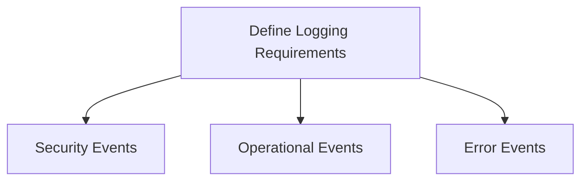
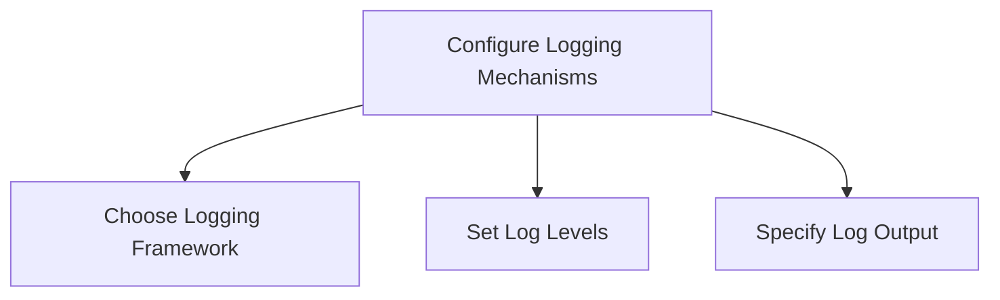
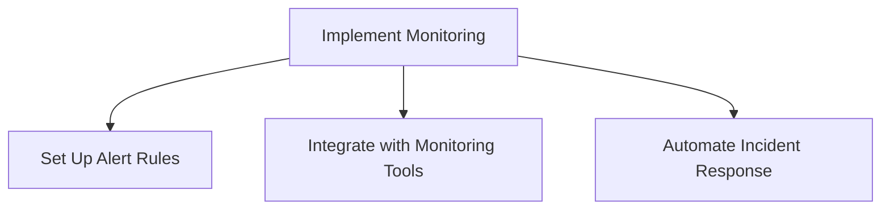
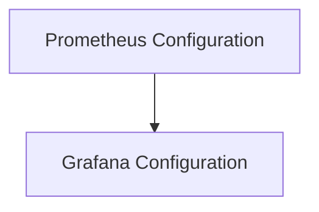

## Understanding the Need for Logging and Monitoring in Security

In the realm of DevSecOps, ensuring the security of your infrastructure is paramount. With the shift towards infrastructure as code (IaC), organizations have significantly reduced their attack surfaces by automating and standardizing their configurations. However, even with robust security measures in place, vulnerabilities can still exist. This is where logging and monitoring play a critical role in maintaining the integrity and security of your systems.

### What is Logging?

Logging is the process of recording events that occur within a system. These logs provide a detailed record of actions taken, errors encountered, and other significant events. Think of logging as having cameras installed throughout a secured building. Just as cameras capture footage of activities within the building, logs capture the activities within your system.

#### Why is Logging Important?

Logging is essential because it allows you to:

- **Identify Security Weaknesses**: By reviewing logs, you can pinpoint areas where security measures may be lacking. For example, if you notice repeated failed login attempts from a specific IP address, it might indicate a brute-force attack.
- **Detect Infiltrators**: Logs can help you identify who accessed your system and what actions they performed. This information can be crucial in creating a profile of the attacker, such as their IP address, user agent, and other identifying details.
- **Incident Response**: In the event of a security breach, logs provide a historical record that can be used to understand the timeline of events and the extent of the damage. This information is vital for conducting a thorough post-incident analysis and improving future security measures.

### What is Monitoring?

Monitoring involves actively watching for specific conditions or events within a system and triggering alerts when those conditions are met. Think of monitoring as an alarm system that goes off when an unauthorized person enters a secured area.

#### Why is Monitoring Important?

Monitoring is crucial because it allows you to:

- **Proactively Detect Threats**: By setting up alerts for suspicious activities, you can be notified in real-time when something unusual occurs. This enables you to respond quickly and mitigate potential threats before they cause significant damage.
- **Ensure Compliance**: Many regulatory requirements mandate continuous monitoring of systems to ensure compliance with security standards. Monitoring helps you maintain a high level of security and meet these compliance requirements.
- **Optimize System Performance**: Monitoring can also help you identify performance issues and optimize your system’s resources. For example, if you notice a sudden spike in CPU usage, you can investigate the cause and take corrective action.

### Recent Real-World Examples

Let's look at some recent real-world examples where logging and monitoring played a critical role in detecting and responding to security incidents.

#### Example 1: Capital One Data Breach (CVE-2019-11510)

In July 2019, Capital One announced a data breach that exposed sensitive information of approximately 100 million customers. The breach was caused by a misconfigured web application firewall (WAF) that allowed unauthorized access to the company's servers.

**Logging and Monitoring Role:**
- **Logs Revealed the Attack**: The breach was detected through logs that showed unusual activity on the server. The logs indicated that an unauthorized user had accessed sensitive files.
- **Alerts Triggered Incident Response**: Once the logs were reviewed, alerts were triggered, and the incident response team was notified. This allowed them to take immediate action to contain the breach and prevent further damage.

#### Example 2: Twitter Hack (CVE-2020-14720)

In July 2020, a group of hackers gained access to high-profile Twitter accounts, including those of Barack Obama, Elon Musk, and Bill Gates. The hackers used the compromised accounts to promote a Bitcoin scam, resulting in significant financial losses.

**Logging and Monitoring Role:**
- **Logs Identified the Attack Vector**: The breach was initially detected through logs that showed unauthorized access to internal Twitter systems. The logs revealed that the attackers had exploited a vulnerability in the company's customer support tools.
- **Real-Time Alerts Facilitated Rapid Response**: Once the logs were reviewed, real-time alerts were triggered, and the incident response team was immediately notified. This allowed them to quickly isolate the affected systems and prevent further damage.

### How to Implement Logging and Monitoring

To effectively implement logging and monitoring, you need to follow a structured approach that includes both theoretical understanding and practical implementation.

#### Step 1: Define Logging Requirements

Before implementing logging, you need to define what types of events you want to log. This includes:

- **Security Events**: Log all security-related events, such as authentication attempts, access control decisions, and policy violations.
- **Operational Events**: Log operational events, such as system startups, shutdowns, and configuration changes.
- **Error Events**: Log error events, such as exceptions, failures, and warnings.



#### Step 2: Configure Logging Mechanisms

Once you have defined your logging requirements, you need to configure the logging mechanisms in your system. This typically involves:

- **Choosing a Logging Framework**: Select a logging framework that suits your needs. Popular choices include Log4j, Serilog, and Winston.
- **Configuring Log Levels**: Set appropriate log levels for different components of your system. Common log levels include DEBUG, INFO, WARN, ERROR, and FATAL.
- **Specifying Log Output**: Determine where the logs should be stored. This could be a local file, a remote server, or a centralized logging service.



#### Step 3: Implement Monitoring

After configuring logging, you need to set up monitoring to detect and respond to suspicious activities. This involves:

- **Setting Up Alert Rules**: Define rules that trigger alerts based on specific conditions. For example, you might set up an alert to notify you if there are more than five failed login attempts within a minute.
- **Integrating with Monitoring Tools**: Use monitoring tools such as Prometheus, Grafana, or Splunk to visualize and analyze your logs. These tools can help you identify patterns and trends that might indicate a security threat.
- **Automating Incident Response**: Automate the incident response process by integrating your monitoring tools with incident management systems. This allows you to automatically trigger predefined actions when certain conditions are met.



### Complete Example: Setting Up Logging and Monitoring

Let's walk through a complete example of setting up logging and monitoring using a popular logging framework and monitoring tool.

#### Step 1: Choose a Logging Framework

For this example, we will use Log4j, a widely-used logging framework for Java applications.

```java
import org.apache.logging.log4j.LogManager;
import org.apache.logging.log4j.Logger;

public class MyApp {
    private static final Logger logger = LogManager.getLogger(MyApp.class);

    public static void main(String[] args) {
        logger.info("Application started");
        // Your application logic here
        logger.error("An error occurred", new Exception("Sample exception"));
    }
}
```

#### Step 2: Configure Log Levels and Output

Next, we need to configure the log levels and specify where the logs should be stored. This is done through the `log4j2.xml` configuration file.

```xml
<?xml version="1.0" encoding="UTF-8"?>
<Configuration status="WARN">
    <Appenders>
        <Console name="Console" target="SYSTEM_OUT">
            <PatternLayout pattern="%d{HH:mm:ss.SSS} [%t] %-5level %logger{36} - %msg%n"/>
        </Console>
        <File name="File" fileName="app.log">
            <PatternLayout pattern="%d{HH:mm:ss.SSS} [%t] %-5level %logger{36} - %msg%n"/>
        </File>
    </Appenders>
    <Loggers>
        <Root level="info">
            <AppenderRef ref="Console"/>
            <AppenderRef ref="File"/>
        </Root>
    </Loggers>
</Configuration>
```

#### Step 3: Set Up Monitoring

Now, let's set up monitoring using Prometheus and Grafana.

##### Prometheus Configuration

First, we need to configure Prometheus to scrape metrics from our application. This is done through the `prometheus.yml` configuration file.

```yaml
scrape_configs:
  - job_name: 'myapp'
    static_configs:
      - targets: ['localhost:8080']
```

##### Grafana Configuration

Next, we need to set up Grafana to visualize the metrics collected by Prometheus. This involves creating a new dashboard and adding panels to display the metrics.



### Common Pitfalls and Best Practices

When implementing logging and monitoring, there are several common pitfalls to avoid:

- **Over-logging**: Avoid logging too much information, as this can lead to performance issues and make it difficult to identify important events.
- **Under-logging**: Ensure that you log enough information to identify security threats and troubleshoot issues.
- **Ignoring Alerts**: Make sure to review and act on alerts promptly to prevent potential security threats from causing significant damage.

### How to Prevent / Defend

To defend against security threats, you need to implement a comprehensive strategy that includes both detection and prevention measures.

#### Detection

- **Use Centralized Logging**: Centralize your logs in a single location to make it easier to review and analyze them.
- **Enable Real-Time Alerts**: Set up real-time alerts to notify you of suspicious activities as soon as they occur.
- **Regularly Review Logs**: Regularly review your logs to identify patterns and trends that might indicate a security threat.

#### Prevention

- **Implement Access Controls**: Enforce strict access controls to ensure that only authorized users can access sensitive information.
- **Use Encryption**: Encrypt sensitive data both at rest and in transit to protect it from unauthorized access.
- **Patch and Update Regularly**: Keep your systems up-to-date with the latest security patches and updates to prevent known vulnerabilities from being exploited.

### Secure Coding Fixes

Here is an example of a vulnerable code snippet and its secure counterpart:

#### Vulnerable Code

```java
import java.io.File;
import java.io.FileWriter;

public class MyApp {
    public static void main(String[] args) {
        try {
            File file = new File("/path/to/log/file");
            FileWriter writer = new FileWriter(file);
            writer.write("This is a log entry");
            writer.close();
        } catch (Exception e) {
            e.printStackTrace();
        }
    }
}
```

#### Secure Code

```java
import org.apache.logging.log4j.LogManager;
import org.apache.logging.log4j.Logger;

public class MyApp {
    private static final Logger logger = LogManager.getLogger(MyApp.class);

    public static void main(String[] args) {
        logger.info("This is a log entry");
    }
}
```

### Lab Exercises

To gain hands-on experience with logging and monitoring, you can use the following labs:

- **PortSwigger Web Security Academy**: This lab provides a series of exercises that cover various aspects of web security, including logging and monitoring.
- **OWASP Juice Shop**: This lab is a deliberately insecure web application that you can use to practice identifying and mitigating security threats.
- **DVWA (Damn Vulnerable Web Application)**: This lab is another deliberately insecure web application that you can use to practice identifying and mitigating security threats.

By following these steps and practicing with real-world examples, you can gain a deep understanding of how to effectively implement logging and monitoring in your DevSecOps environment.

---
<!-- nav -->
[[DevSecOps/DevSecOps Bootcamp/08-Logging & Incident Response/04-Logging & Monitoring for Security/09-Understand Need for Logging and Monitoring in Security/00-Overview|Overview]] | [[DevSecOps/DevSecOps Bootcamp/08-Logging & Incident Response/04-Logging & Monitoring for Security/09-Understand Need for Logging and Monitoring in Security/02-Practice Questions & Answers|Practice Questions & Answers]]
