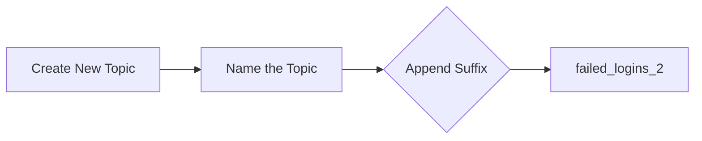
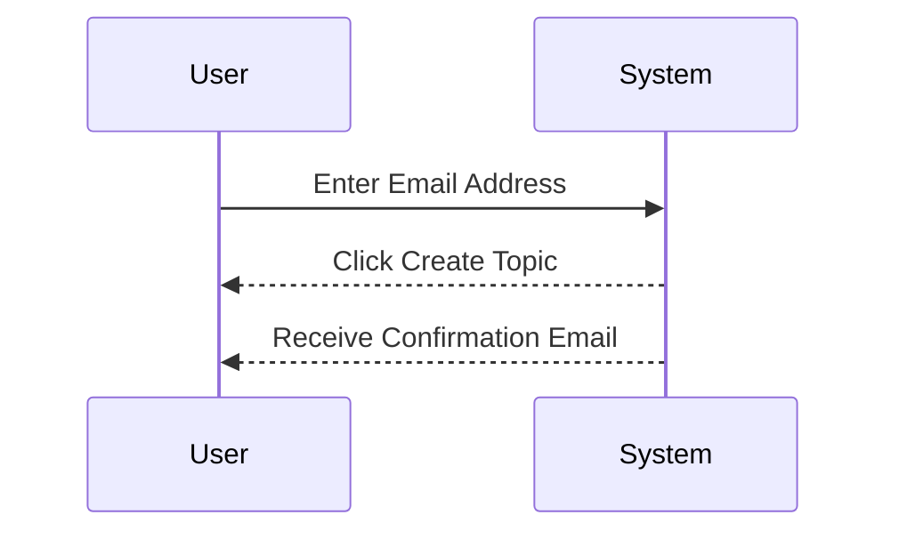
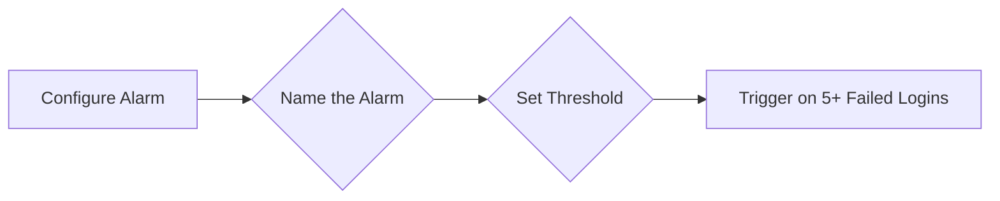
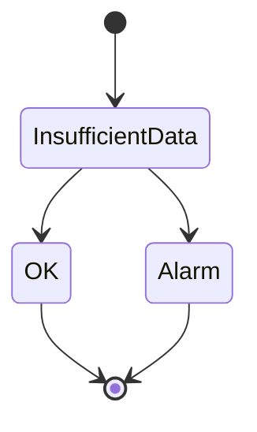
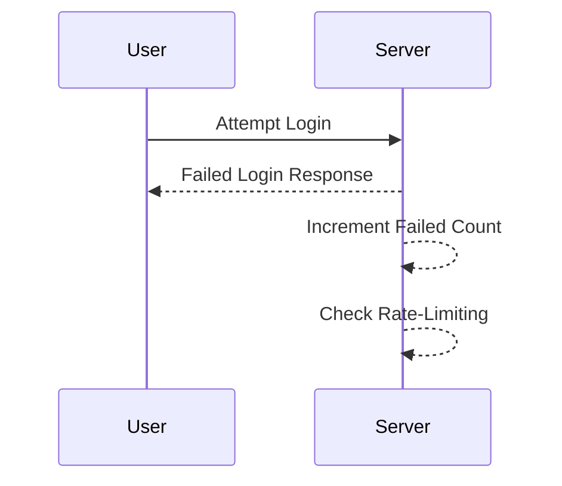

## Introduction to Logging and Monitoring for Security

Logging and monitoring are fundamental components of a robust security strategy in DevSecOps environments. They enable organizations to detect and respond to security incidents promptly, ensuring the integrity and confidentiality of their systems. In this chapter, we will delve into configuring alarms for failed login attempts, a critical aspect of proactive security management.

### What is Logging and Monitoring?

**Logging** refers to the process of recording events that occur within a system. These logs can provide valuable insights into the behavior of applications, servers, and networks. **Monitoring**, on the other hand, involves continuously observing these logs and other system metrics to identify anomalies or potential security threats.

#### Why is Logging and Monitoring Important?

- **Incident Detection**: Logs help in identifying unusual activities that could indicate a security breach.
- **Compliance**: Many regulatory requirements mandate logging and monitoring to ensure compliance.
- **Troubleshooting**: Logs provide detailed information that can help in diagnosing and resolving issues.
- **Auditing**: Logs serve as a historical record that can be used for auditing purposes.

### Configuring Alarms for Failed Login Attempts

Failed login attempts are a common indicator of brute-force attacks or unauthorized access attempts. By setting up alarms for these events, you can quickly respond to potential security threats.

#### Step-by-Step Configuration

Let's walk through the process of configuring an alarm for failed login attempts using a hypothetical cloud-based monitoring service.

1. **Create a New Topic**
    - A **topic** is a communication channel used to distribute notifications. In our scenario, we will create a new topic to receive alerts about failed login attempts.
    - Suppose we already have a topic named `failed_logins`. To avoid conflicts, we will append a suffix to the name, e.g., `failed_logins_2`.



2. **Subscribe to the Topic**
    - Next, we need to subscribe to the newly created topic. This involves providing an email address to receive notifications.
    - After entering the email address, click on the `Create Topic` button to finalize the setup.



3. **Confirm Subscription**
    - Upon clicking the `Create Topic` button, you will receive an email to confirm the subscription. Ensure to check your inbox and follow the confirmation link.

4. **Configure the Alarm**
    - Now, let's configure the alarm itself. Name the alarm something descriptive, such as `multiple_failed_logins`.
    - Set the threshold for triggering the alarm. For instance, if there are more than five failed login attempts within a specific time frame, the alarm should be triggered.



5. **Initial State and Data Gathering**
    - Initially, the alarm will be in an `insufficient data` state. This means the system is gathering data to determine whether the threshold has been met.
    - Once sufficient data is collected, the alarm will either remain in the `OK` state or transition to the `alarm` state if the threshold is exceeded.



### Real-World Example: Recent Breaches

Consider the case of the **Capital One breach** in 2019, where a hacker accessed sensitive customer data by exploiting a misconfigured server. Proper logging and monitoring could have alerted the security team to the unauthorized access attempts, potentially preventing the breach.

#### How to Prevent / Defend

1. **Detection**
    - Implement real-time monitoring tools to detect failed login attempts.
    - Use intrusion detection systems (IDS) to flag suspicious activities.

2. **Prevention**
    - Enforce strong password policies and multi-factor authentication (MFA).
    - Limit the number of allowed failed login attempts before locking the account.

3. **Secure Coding Fixes**
    - Ensure that login mechanisms are properly implemented to handle failed attempts securely.
    - Use rate-limiting techniques to prevent brute-force attacks.



### Complete Example: Full HTTP Request and Response

Let's illustrate the process with a complete example involving an HTTP request and response.

#### HTTP Request

```http
POST /login HTTP/1.1
Host: example.com
Content-Type: application/json
Content-Length: 36

{
    "username": "user",
    "password": "wrongpassword"
}
```

#### HTTP Response

```http
HTTP/1.1 401 Unauthorized
Date: Mon, 20 Mar 2023 12:00:00 GMT
Content-Type: application/json
Content-Length: 42

{
    "error": "Unauthorized",
    "message": "Invalid credentials"
}
```

### Common Pitfalls and Best Practices

#### Common Pitfalls

- **Ignoring Failed Login Attempts**: Not monitoring failed login attempts can lead to undetected security breaches.
- **Insufficient Data Collection**: Failing to collect sufficient data can result in false negatives or positives.

#### Best Practices

- **Regular Audits**: Conduct regular audits of logs to ensure they are being monitored effectively.
- **Automated Alerts**: Use automated alerting mechanisms to notify security teams of potential threats.

### Hands-On Labs

For practical experience, consider the following labs:

- **PortSwigger Web Security Academy**: Offers exercises on detecting and responding to failed login attempts.
- **OWASP Juice Shop**: Provides a vulnerable web application for practicing security monitoring.

By thoroughly understanding and implementing logging and monitoring practices, organizations can significantly enhance their security posture and respond effectively to potential threats.

---
<!-- nav -->
[[DevSecOps/DevSecOps Bootcamp/08-Logging & Incident Response/04-Logging & Monitoring for Security/Configure Alarm for Failed Login Attempts/00-Overview|Overview]] | [[02-Introduction to Logging and Monitoring for Security Part 2|Introduction to Logging and Monitoring for Security Part 2]]
