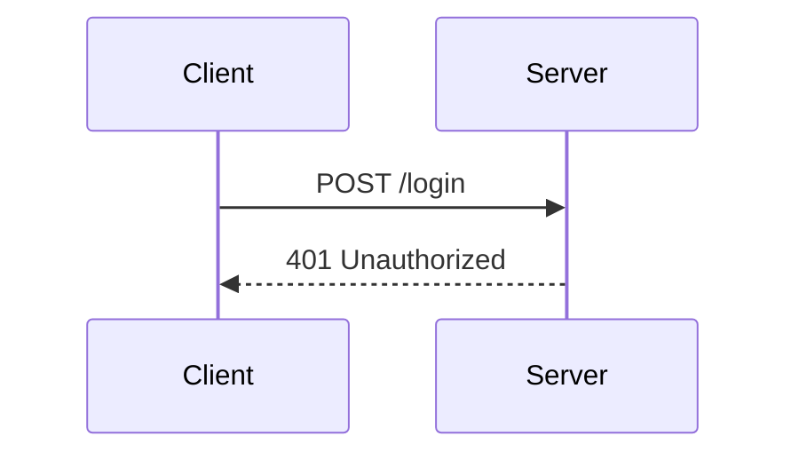
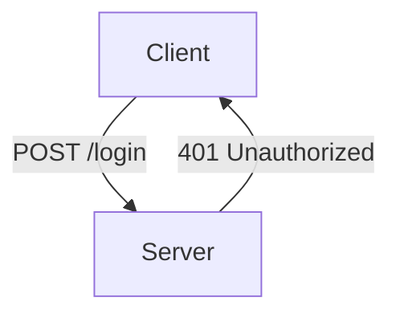

## Introduction to Logging and Monitoring for Security

Logging and monitoring are critical components of DevSecOps, providing visibility into the operational health and security posture of applications and infrastructure. Effective logging and monitoring enable teams to detect and respond to security incidents promptly, ensuring the integrity and confidentiality of data. In this chapter, we will delve into configuring alarms for failed login attempts, a common security practice that helps identify potential brute-force attacks or unauthorized access attempts.

### Importance of Monitoring Failed Login Attempts

Failed login attempts are often indicative of malicious activity, such as brute-force attacks or credential stuffing. By monitoring these events, organizations can quickly detect and mitigate threats, preventing unauthorized access to sensitive systems and data. This chapter will cover the theoretical foundations, practical implementation, and best practices for setting up alarms for failed login attempts.

### Theoretical Background

#### Metrics and Thresholds

Metrics are quantitative measurements used to assess the performance or behavior of a system. In the context of security, metrics can include the number of failed login attempts, successful logins, and other relevant events. Thresholds define the conditions under which an alarm is triggered. For example, if the number of failed login attempts exceeds a certain threshold within a specified time frame, an alarm is generated.

#### Time Intervals and Aggregation

Time intervals determine the frequency at which metrics are evaluated. In the given scenario, metrics are checked every five minutes. Aggregation involves combining multiple data points over a specified time interval to derive meaningful insights. For instance, the total number of failed login attempts within a five-minute window can be aggregated to determine whether an alarm should be triggered.

### Configuring Alarms for Failed Login Attempts

#### Setting Up the Metric

To configure an alarm for failed login attempts, we first need to define the metric. In this case, the metric is the number of failed login attempts within a five-minute period. The following steps outline the process:

1. **Identify the Source of Data**: Determine where the login attempt data is stored. This could be in a database, a log file, or a centralized logging service.
2. **Define the Metric**: Create a metric that counts the number of failed login attempts. This can be done using a monitoring tool or a custom script.
3. **Set the Threshold**: Define the threshold value that triggers the alarm. For example, if the number of failed login attempts exceeds seven within a five-minute period, an alarm is generated.

#### Example Configuration

Let's assume we are using a monitoring tool like Prometheus to track failed login attempts. Here’s how you might set up the metric and threshold:

```yaml
# prometheus.yml
scrape_configs:
  - job_name: 'login_attempts'
    static_configs:
      - targets: ['localhost:9100']

# metrics.py
from prometheus_client import Counter, start_http_server

failed_login_counter = Counter('failed_login_attempts', 'Number of failed login attempts')

def record_failed_login():
    failed_login_counter.inc()

start_http_server(9100)
```

In this example, `metrics.py` increments the `failed_login_attempts` counter each time a failed login occurs. Prometheus scrapes this metric every five minutes.

#### Creating the Alarm

Once the metric is defined, we need to create an alarm that triggers when the threshold is exceeded. This can be done using a monitoring tool like Grafana or a custom script.

```yaml
# grafana_alert_rule.yml
alert: HighFailedLoginAttempts
expr: failed_login_attempts > 7
for: 5m
labels:
  severity: critical
annotations:
  summary: "High number of failed login attempts"
  description: "The number of failed login attempts has exceeded the threshold."
```

In this example, the alert rule checks if the `failed_login_attempts` metric exceeds seven within a five-minute period. If the condition is met, an alert is triggered.

### Real-World Examples and Recent Breaches

#### Real-World Example: Brute-Force Attack on WordPress

In 2021, a series of brute-force attacks targeted WordPress sites, attempting to gain unauthorized access through repeated login attempts. By monitoring failed login attempts, site administrators were able to detect and mitigate these attacks promptly.

#### Recent Breach: Capital One Data Breach

In 2019, Capital One suffered a significant data breach due to a misconfigured firewall, which allowed an attacker to access customer data. While this breach was not directly related to failed login attempts, monitoring and logging played a crucial role in identifying and responding to the incident.

### Pitfalls and Common Mistakes

#### Overlooking Time Intervals

One common mistake is not considering the time intervals at which metrics are evaluated. If the time interval is too long, critical events may be missed. Conversely, if the interval is too short, false positives may occur.

#### Incorrect Threshold Values

Setting incorrect threshold values can lead to either missed alerts or excessive false positives. It is essential to carefully evaluate historical data to determine appropriate threshold values.

### How to Prevent / Defend

#### Detection

To detect failed login attempts effectively, implement the following measures:

1. **Centralized Logging**: Use a centralized logging solution to aggregate and analyze login attempt data.
2. **Real-Time Monitoring**: Implement real-time monitoring to detect and respond to high volumes of failed login attempts promptly.

#### Prevention

To prevent unauthorized access, consider the following strategies:

1. **Rate Limiting**: Implement rate limiting to restrict the number of login attempts from a single IP address within a specified time frame.
2. **Account Lockout Policies**: Enforce account lockout policies that temporarily disable accounts after a certain number of failed login attempts.

#### Secure Coding Fixes

Here’s an example of how to implement rate limiting in a Python application:

```python
from flask import Flask, request
from flask_limiter import Limiter

app = Flask(__name__)
limiter = Limiter(app, key_func=lambda: request.remote_addr)

@app.route('/login', methods=['POST'])
@limiter.limit("5 per minute")
def login():
    username = request.form['username']
    password = request.form['password']
    # Perform login validation
    return "Login successful"

if __name__ == '__main__':
    app.run()
```

In this example, the `flask_limiter` library is used to limit login attempts to five per minute per IP address.

#### Configuration Hardening

To harden the configuration, ensure that the following settings are in place:

1. **Secure Logging**: Ensure that logs are securely stored and protected from unauthorized access.
2. **Alert Notifications**: Configure alert notifications to be sent via email, SMS, or other communication channels.

### Complete Example

#### Full HTTP Request and Response

Here’s an example of a full HTTP request and response for a failed login attempt:

```http
POST /login HTTP/1.1
Host: example.com
Content-Type: application/x-www-form-urlencoded
Content-Length: 29

username=admin&password=wrongpassword
```

```http
HTTP/1.1 401 Unauthorized
Date: Mon, 20 Mar 2023 12:00:00 GMT
Server: Apache/2.4.41 (Ubuntu)
Content-Length: 28
Content-Type: application/json

{"error": "Invalid credentials"}
```

#### Event History Analysis

By analyzing the event history, you can gather additional details about the failed login attempts, such as the user agent, IP address, and timestamp.

```json
{
  "timestamp": "2023-03-20T12:00:00Z",
  "event_type": "failed_login_attempt",
  "username": "admin",
  "ip_address": "192.168.1.100",
  "user_agent": "Mozilla/5.0 (Windows NT 10.0; Win64; x64) AppleWebKit/537.36 (KHTML, like Gecko) Chrome/90.0.4430.212 Safari/537.36",
  "response_code": 401
}
```

### Mermaid Diagrams

#### Sequence Diagram

A sequence diagram can help visualize the interaction between the client and server during a failed login attempt.



#### Network Topology

A network topology diagram can illustrate the flow of data between different components of the system.



### Hands-On Labs

For hands-on practice, consider the following labs:

- **PortSwigger Web Security Academy**: Offers interactive labs to practice detecting and mitigating brute-force attacks.
- **OWASP Juice Shop**: Provides a vulnerable web application to practice security monitoring and logging.

### Conclusion

Effective logging and monitoring are essential for maintaining the security of applications and infrastructure. By configuring alarms for failed login attempts, organizations can quickly detect and respond to potential threats, ensuring the integrity and confidentiality of their systems. This chapter has provided a comprehensive guide to setting up and managing these alarms, including theoretical foundations, practical implementation, and best practices.

---
<!-- nav -->
[[01-Introduction to Logging and Monitoring for Security Part 1|Introduction to Logging and Monitoring for Security Part 1]] | [[DevSecOps/DevSecOps Bootcamp/08-Logging & Incident Response/04-Logging & Monitoring for Security/Configure Alarm for Failed Login Attempts/00-Overview|Overview]] | [[03-Introduction to Logging and Monitoring for Security Part 3|Introduction to Logging and Monitoring for Security Part 3]]
