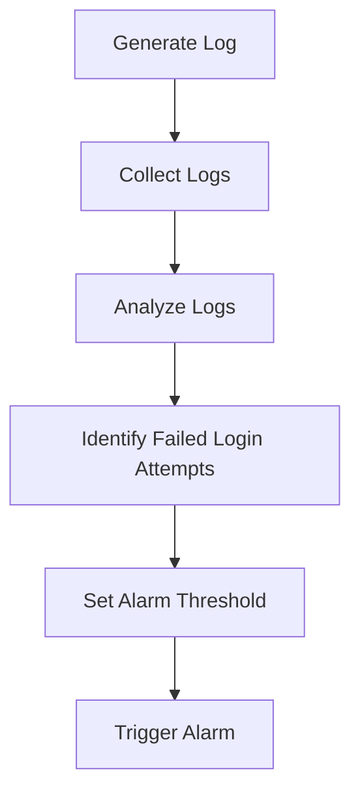

## Introduction to Logging and Monitoring for Security

Logging and monitoring are critical components of a robust security strategy in DevSecOps environments. They enable organizations to detect, respond to, and mitigate security threats effectively. In this chapter, we will delve into configuring alarms for failed login attempts, which is a key aspect of proactive security monitoring.

### What is Logging and Monitoring?

**Logging** refers to the process of recording events that occur within a system. These logs can provide valuable insights into the behavior of the system, including errors, warnings, and security-related events. **Monitoring**, on the other hand, involves continuously observing these logs and other system metrics to identify anomalies and potential security issues.

### Why is Logging and Monitoring Important?

Effective logging and monitoring are essential for several reasons:

1. **Detection**: Logs help in identifying suspicious activities and potential security breaches.
2. **Response**: Real-time alerts allow for quick action to mitigate threats.
3. **Compliance**: Many regulatory requirements mandate logging and monitoring practices.
4. **Forensics**: Detailed logs are crucial for post-incident analysis and understanding the root cause of security incidents.

### How Does Logging and Monitoring Work?

At a high level, logging and monitoring involve the following steps:

1. **Log Generation**: Systems generate logs based on predefined rules and events.
2. **Log Collection**: Logs are collected from various sources and centralized for easier analysis.
3. **Log Analysis**: Tools analyze logs to identify patterns and anomalies.
4. **Alerting**: Based on the analysis, alerts are generated to notify security teams of potential issues.

### Configuring Alarms for Failed Login Attempts

One of the most common security-related events to monitor is failed login attempts. By setting up alarms for these events, organizations can quickly respond to potential brute-force attacks or unauthorized access attempts.

#### Background Theory

Failed login attempts are often indicative of malicious activity. An attacker might attempt to guess passwords through repeated login attempts. By monitoring and alerting on these events, organizations can take preventive measures before a breach occurs.

#### Setting Up the Alarm

Let's walk through the process of configuring an alarm for failed login attempts using a hypothetical monitoring tool.

1. **Define the Metric**: Identify the metric that represents failed login attempts. This could be a count of failed login attempts per minute or per hour.
2. **Set the Threshold**: Define the threshold at which the alarm should trigger. For example, if there are more than 7 failed login attempts within a 5-minute period, the alarm should be triggered.
3. **Configure the Alarm**: Set up the alarm to monitor the defined metric and trigger based on the specified threshold.



### Example Configuration

Let's consider a specific example using a popular monitoring tool like Prometheus and Alertmanager.

#### Step 1: Define the Metric

First, we need to define the metric that represents failed login attempts. This can be done using a custom metric in Prometheus.

```yaml
# prometheus.yml
scrape_configs:
  - job_name: 'failed_login_attempts'
    static_configs:
      - targets: ['localhost:9100']
```

#### Step 2: Collect Logs

Next, we need to collect the logs and push them to Prometheus. This can be done using a log exporter like `promtail`.

```yaml
# promtail-config.yaml
server:
  http_listen_port: 9080
  grpc_listen_port: 0

positions:
  filename: /tmp/positions.yaml

clients:
  - url: http://localhost:9090/api/v1/write?tenant=public

scrape_configs:
  - job_name: system
    static_configs:
      - targets:
          - localhost
        labels:
          job: varlogs
          __path__: /var/log/*.log
```

#### Step 3: Analyze Logs

Prometheus will collect the metrics and store them. We can then use Grafana to visualize these metrics.

```json
{
  "title": "Failed Login Attempts",
  "type": "timeseries",
  "datasource": "Prometheus",
  "targets": [
    {
      "expr": "rate(failed_login_attempts_total[5m]) > 7",
      "legendFormat": "{{instance}}",
      "refId": "A"
    }
  ],
  "yaxes": [
    {
      "label": "Failed Login Attempts",
      "format": "short"
    },
    {
      "label": null,
      "format": "short"
    }
  ]
}
```

#### Step 4: Set Alarm Threshold

We can configure Alertmanager to send alerts based on the defined threshold.

```yaml
# alertmanager.yml
route:
  group_by: ['alertname']
  group_wait: 30s
  group_interval: 5m
  repeat_interval: 1h
  receiver: 'webhook'

receivers:
  - name: 'webhook'
    webhook_configs:
      - url: 'http://localhost:5000/alert'
```

#### Step 5: Trigger Alarm

When the threshold is exceeded, Alertmanager will trigger the alarm and send notifications.

### Handling Missing Data

In the given transcript, the alarm is configured to handle missing data. This is important because the absence of failed login attempts can also indicate a healthy state.

#### Additional Configuration

To handle missing data, we can configure the alarm to treat missing data as not breaching the threshold.

```yaml
# alertmanager.yml
route:
  group_by: ['alertname']
  group_wait: 30s
  group_interval: 5m
  repeat_interval: 1h
  receiver: 'webhook'
  matchers:
    - alertname = 'FailedLoginAttempts'
  routes:
    - match:
        alertname: 'FailedLoginAttempts'
      receiver: 'webhook'
      continue: true
    - match_re:
        alertname: '.*'
      receiver: 'default'
```

### Real-World Examples

#### Recent Breaches and CVEs

Several recent breaches have highlighted the importance of monitoring failed login attempts. For example, the 2021 SolarWinds breach involved attackers gaining access through compromised credentials. Effective monitoring of failed login attempts could have alerted the organization to the unauthorized access attempts.

#### Real-World Configuration

Here is a complete example of a monitoring setup using Prometheus and Alertmanager.

##### Prometheus Configuration

```yaml
# prometheus.yml
scrape_configs:
  - job_name: 'failed_login_attempts'
    static_configs:
      - targets: ['localhost:9100']
```

##### Alertmanager Configuration

```yaml
# alertmanager.yml
route:
  group_by: ['alertname']
  group_wait: 30s
  group_interval: 5m
  repeat_interval: 1h
  receiver: 'webhook'

receivers:
  - name: 'webhook'
    webhook_configs:
      - url: 'http://localhost:5000/alert'
```

##### Grafana Dashboard

```json
{
  "title": "Failed Login Attempts",
  "type": "timeseries",
  "datasource": "Prometheus",
  "targets": [
    {
      "expr": "rate(failed_login_attempts_total[5m]) > 7",
      "legendFormat": "{{instance}}",
      "refId": "A"
    }
  ],
  "yaxes": [
    {
      "label": "Failed Login Attempts",
      "format": "short"
    },
    {
      "label": null,
      "format": "short"
    }
  ]
}
```

### Common Pitfalls

1. **Threshold Tuning**: Incorrectly setting the threshold can lead to false positives or missed alerts.
2. **Data Loss**: Missing data can be misinterpreted as a healthy state, leading to delayed detection of issues.
3. **Notification Overload**: Too many alerts can overwhelm the security team, leading to alert fatigue.

### How to Prevent / Defend

#### Detection

To detect failed login attempts effectively, ensure that your monitoring solution is configured to capture and analyze these events in real-time.

#### Prevention

Implement strong authentication mechanisms such as multi-factor authentication (MFA) to reduce the likelihood of successful brute-force attacks.

#### Secure Coding Fixes

Compare the vulnerable and secure versions of code to understand the necessary changes.

**Vulnerable Code**

```python
def authenticate(username, password):
    user = get_user_from_db(username)
    if user and user.password == password:
        return True
    return False
```

**Secure Code**

```python
import bcrypt

def authenticate(username, password):
    user = get_user_from_db(username)
    if user and bcrypt.checkpw(password.encode('utf-8'), user.password_hash):
        return True
    return False
```

#### Configuration Hardening

Ensure that your monitoring and alerting configurations are hardened against potential attacks.

```yaml
# alertmanager.yml
route:
  group_by: ['alertname']
  group_wait: 30s
  group_interval: 5m
  repeat_interval: 1h
  receiver: 'webhook'
  matchers:
    - alertname = 'FailedLoginAttempts'
  routes:
    - match:
        alertname: 'FailedLoginAttempts'
      receiver: 'webhook'
      continue: true
    - match_re:
        alertname: '.*'
      receiver: 'default'
```

### Conclusion

Configuring alarms for failed login attempts is a critical component of a comprehensive security strategy. By effectively monitoring and responding to these events, organizations can significantly enhance their security posture. The detailed steps and configurations provided in this chapter should serve as a comprehensive guide for implementing robust logging and monitoring practices.

### Practice Labs

For hands-on experience with logging and monitoring, consider the following labs:

- **PortSwigger Web Security Academy**: Offers interactive labs on web application security, including logging and monitoring.
- **OWASP Juice Shop**: A deliberately insecure web application for practicing security testing and monitoring.
- **DVWA (Damn Vulnerable Web Application)**: Another web application for learning about web vulnerabilities and security practices.

These labs provide practical experience in setting up and managing logging and monitoring systems, helping to solidify the concepts covered in this chapter.

---
<!-- nav -->
[[03-Introduction to Logging and Monitoring for Security Part 3|Introduction to Logging and Monitoring for Security Part 3]] | [[DevSecOps/DevSecOps Bootcamp/08-Logging & Incident Response/04-Logging & Monitoring for Security/Configure Alarm for Failed Login Attempts/00-Overview|Overview]] | [[05-Introduction to Logging and Monitoring for Security Part 5|Introduction to Logging and Monitoring for Security Part 5]]
