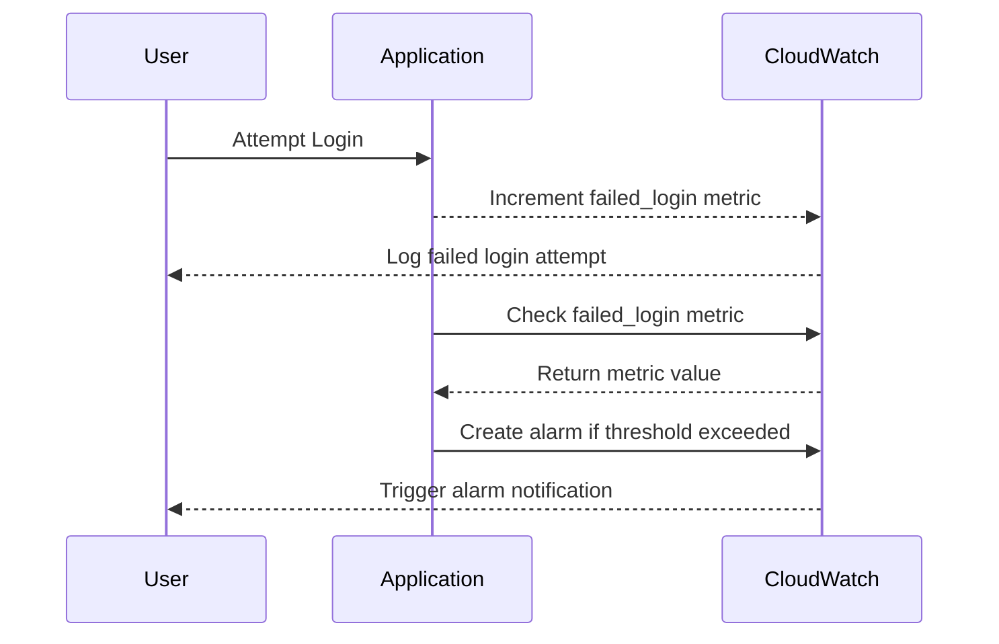

## Introduction to Logging and Monitoring for Security

Logging and monitoring are critical components of a robust security strategy in DevSecOps environments. They enable organizations to detect and respond to security incidents promptly, ensuring the integrity and confidentiality of their systems. In this chapter, we will delve into configuring alarms for failed login attempts, a common security practice that helps identify potential brute-force attacks and unauthorized access attempts.

### What is Logging and Monitoring?

**Logging** refers to the process of recording events that occur within a system. These logs can provide valuable insights into the behavior of applications, servers, and networks. **Monitoring**, on the other hand, involves continuously observing these logs and other system metrics to detect anomalies and potential security threats.

### Why is Logging and Monitoring Important?

Effective logging and monitoring are essential for several reasons:

1. **Incident Detection**: Logs help identify unusual activities that could indicate a security breach.
2. **Compliance**: Many regulatory frameworks require detailed logging and monitoring to ensure compliance.
3. **Troubleshooting**: Logs provide a historical record that can be used to diagnose issues and understand system behavior.
4. **Forensic Analysis**: Detailed logs are crucial for post-incident analysis to understand the scope and impact of a security event.

### How Does Logging and Monitoring Work?

At a high level, logging and monitoring involve the following steps:

1. **Log Generation**: Applications, servers, and network devices generate logs that capture various events.
2. **Log Collection**: Logs are collected from different sources and centralized for easier analysis.
3. **Log Analysis**: Tools analyze logs to detect patterns and anomalies.
4. **Alerting**: When suspicious activity is detected, alerts are generated to notify security teams.

### Real-World Example: Brute-Force Attacks

Brute-force attacks are a common type of security threat where attackers systematically try different combinations of usernames and passwords to gain unauthorized access. A recent example is the **CVE-2021-3129** vulnerability in Microsoft Exchange Server, where attackers exploited vulnerabilities to gain initial access and then used brute-force techniques to escalate privileges.

### Configuring Alarms for Failed Login Attempts

In this section, we will focus on configuring alarms for failed login attempts using AWS CloudWatch. This involves setting up custom metrics and configuring alarms to trigger when a certain threshold is exceeded.

#### Step-by-Step Guide

1. **Create Custom Metrics**
2. **Configure Alarms**
3. **Set Thresholds**

### Creating Custom Metrics

Custom metrics allow you to track specific events that are important to your organization. In this case, we will create a custom metric to track failed login attempts.

#### Namespace and Metric Name

- **Namespace**: `login`
- **Metric Name**: `failed_login`

#### Incrementing the Metric

Each time a failed login attempt occurs, the metric value should be incremented by one. This can be done programmatically within your application logic.

```python
import boto3

cloudwatch = boto3.client('cloudwatch')

def increment_failed_login():
    cloudwatch.put_metric_data(
        Namespace='login',
        MetricData=[
            {
                'MetricName': 'failed_login',
                'Value': 1,
                'Unit': 'Count'
            },
        ]
    )
```

### Configuring Alarms

Once the custom metric is created, you can configure an alarm to trigger when the number of failed login attempts exceeds a specified threshold.

#### Setting Up the Alarm

1. **Select Metric**: Choose the custom metric `failed_login` from the `login` namespace.
2. **Statistic**: Choose the appropriate statistic (`average` or `sum`).
3. **Period**: Set the period for evaluating the metric (e.g., 5 minutes).
4. **Threshold**: Define the threshold value (e.g., 7 failed attempts).

#### Example Configuration

```python
cloudwatch.put_metric_alarm(
    AlarmName='FailedLoginAlarm',
    ComparisonOperator='GreaterThanThreshold',
    EvaluationPeriods=1,
    MetricName='failed_login',
    Namespace='login',
    Period=300,  # 5 minutes
    Statistic='Sum',
    Threshold=7,
    ActionsEnabled=True,
    AlarmActions=['arn:aws:sns:us-east-1:123456789012:MyTopic']
)
```

### Setting Thresholds

The threshold determines the number of failed login attempts that will trigger the alarm. In this example, we set the threshold to 7, meaning the alarm will be triggered if there are more than 7 failed login attempts within a 5-minute period.

### Full HTTP Request and Response

Here is an example of the full HTTP request and response for creating the alarm:

```http
POST / HTTP/1.1
Host: monitoring.amazonaws.com
Content-Type: application/x-amz-json-1.1
X-Amz-Target: Monitron.CreateAlarm

{
  "AlarmName": "FailedLoginAlarm",
  "ComparisonOperator": "GreaterThanThreshold",
  "EvaluationPeriods": 1,
  "MetricName": "failed_login",
  "Namespace": "login",
  "Period": 300,
  "Statistic": "Sum",
  "Threshold": 7,
  "ActionsEnabled": true,
  "AlarmActions": ["arn:aws:sns:us-east-1:123456789012:MyTopic"]
}
```

```http
HTTP/1.1 200 OK
Content-Type: application/x-amz-json-1.1

{
  "ResponseMetadata": {
    "RequestId": "12345678-1234-1234-1234-123456789012"
  }
}
```

### Mermaid Diagram: Alarm Configuration Flow



### Common Pitfalls and Best Practices

#### Common Pitfalls

1. **Incorrect Threshold Settings**: Setting thresholds too low can result in frequent false positives, while setting them too high can delay detection of actual threats.
2. **Insufficient Logging**: Not logging all necessary events can lead to incomplete data for analysis.
3. **Ignoring Historical Data**: Failing to consider historical data can make it difficult to establish normal baselines.

#### Best Practices

1. **Regularly Review Logs**: Regularly review logs to identify patterns and anomalies.
2. **Use Centralized Logging**: Centralize logs to simplify analysis and improve visibility.
3. **Automate Alerting**: Automate alerting to ensure timely notifications of potential threats.

### How to Prevent / Defend

#### Detection

To detect failed login attempts, monitor the custom metric `failed_login` and set up alarms to trigger when the threshold is exceeded.

#### Prevention

1. **Rate Limiting**: Implement rate limiting to restrict the number of login attempts from a single IP address.
2. **Account Lockout Policies**: Enforce account lockout policies after a certain number of failed login attempts.
3. **Multi-Factor Authentication (MFA)**: Require MFA to add an additional layer of security.

#### Secure Coding Fixes

Here is an example of how to implement rate limiting in Python:

```python
from flask import Flask, request
from flask_limiter import Limiter

app = Flask(__name__)
limiter = Limiter(app, key_func=lambda: request.remote_addr)

@app.route('/login', methods=['POST'])
@limiter.limit("5 per minute")
def login():
    username = request.form['username']
    password = request.form['password']
    # Perform authentication logic
    return "Login successful"

if __name__ == '__main__':
    app.run()
```

#### Hardening Configuration

Ensure that your server configurations are hardened to prevent unauthorized access. Here is an example of an Nginx configuration to limit login attempts:

```nginx
server {
    listen 80;
    server_name example.com;

    location /login {
        limit_req zone=login burst=5 nodelay;
        proxy_pass http://backend;
    }

    limit_req_zone $binary_remote_addr zone=login:10m rate=5r/m;
}
```

### Conclusion

Configuring alarms for failed login attempts is a crucial step in enhancing the security of your DevSecOps environment. By setting up custom metrics and configuring alarms, you can effectively detect and respond to potential security threats. Regularly reviewing logs and implementing best practices will further strengthen your security posture.

### Practice Labs

For hands-on experience with logging and monitoring, consider the following labs:

- **PortSwigger Web Security Academy**: Offers interactive labs to practice detecting and responding to security threats.
- **OWASP Juice Shop**: A deliberately insecure web application for practicing web security skills.
- **DVWA (Damn Vulnerable Web Application)**: Another intentionally vulnerable web application for learning web security.

By completing these labs, you can gain practical experience in configuring and managing logging and monitoring systems.

---
<!-- nav -->
[[05-Introduction to Logging and Monitoring for Security Part 5|Introduction to Logging and Monitoring for Security Part 5]] | [[DevSecOps/DevSecOps Bootcamp/08-Logging & Incident Response/04-Logging & Monitoring for Security/Configure Alarm for Failed Login Attempts/00-Overview|Overview]] | [[DevSecOps/DevSecOps Bootcamp/08-Logging & Incident Response/04-Logging & Monitoring for Security/Configure Alarm for Failed Login Attempts/07-Practice Questions & Answers|Practice Questions & Answers]]
