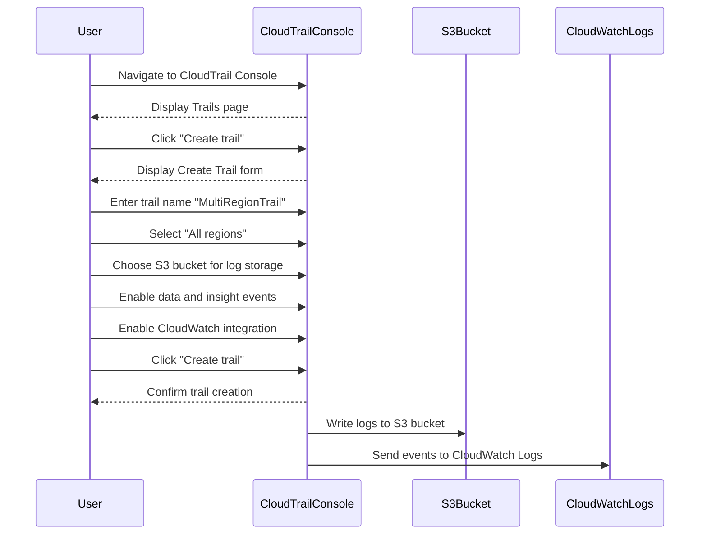

## Introduction to Logging and Monitoring for Security in DevSecOps

In the realm of DevSecOps, logging and monitoring play a critical role in ensuring the security and integrity of systems. One of the key services provided by Amazon Web Services (AWS) for this purpose is AWS CloudTrail. CloudTrail provides a detailed record of API calls made within an AWS account, including who made the call, when it was made, and from which IP address. This information is invaluable for auditing, compliance, and security purposes.

### Understanding CloudTrail

CloudTrail is designed to track and log API calls made to AWS services. By default, CloudTrail is enabled, but it has certain limitations that need to be addressed for comprehensive security and compliance. Let's delve deeper into these limitations and how to overcome them.

#### Limitations of Default CloudTrail Configuration

1. **Temporary Storage**: The default event history stored by CloudTrail disappears after 90 days. This means that if you need to retain logs for longer periods (such as for compliance reasons), you need to store them in a more permanent location, such as an Amazon S3 bucket.

2. **Limited Event Types**: CloudTrail by default captures only management events. There are three types of events:
   - **Management Events**: These are API calls that control access to resources, such as creating or deleting an EC2 instance.
   - **Data Events**: These are API calls that read or write data, such as accessing an S3 bucket.
   - **Insight Events**: These provide additional context about the environment, such as the number of instances running.

   To capture all event types, you need to explicitly configure CloudTrail to include data and insight events.

3. **Region-Specific Data**: The default event history is limited to the AWS region where you are signed in. This means that if you have resources spread across multiple regions, you won't get a complete picture unless you configure multi-region trails.

4. **Proactive Monitoring**: While CloudTrail logs events, it doesn't automatically trigger actions based on these events. To achieve proactive monitoring, you need to forward these events to CloudWatch, which can then trigger alerts and actions based on specific conditions.

### Configuring Multi-Region Trails in CloudTrail

To overcome the limitations mentioned above, you can configure a multi-region trail in CloudTrail. This ensures that all API calls across all regions are logged and retained for the desired period. Here’s a step-by-step guide to setting up a multi-region trail:

#### Step 1: Create a Multi-Region Trail

1. **Navigate to CloudTrail Console**:
   - Open the AWS Management Console and navigate to the CloudTrail service.
   - Click on "Trails" in the left-hand menu.

2. **Create a New Trail**:
   - Click on "Create trail".
   - Enter a name for your trail, such as `MultiRegionTrail`.
   - Select "All regions" to ensure that the trail captures events from all AWS regions.

3. **Configure Log Storage**:
   - Choose an S3 bucket where the logs will be stored. Ensure that the bucket has the necessary permissions to receive logs from CloudTrail.
   - Optionally, enable logging for data events and insight events by selecting the appropriate checkboxes.

4. **Enable CloudWatch Integration**:
   - Check the box to "Send trail events to CloudWatch Logs". This will forward the events to CloudWatch, allowing you to set up alerts and triggers based on specific conditions.

5. **Review and Create**:
   - Review the settings and click "Create trail".

#### Step 2: Verify Trail Configuration

After creating the trail, verify that it is configured correctly:

1. **Check Trail Status**:
   - Navigate back to the "Trails" section in the CloudTrail console.
   - Ensure that the trail is active and that it is set to capture events from all regions.

2. **Verify S3 Bucket Permissions**:
   - Go to the S3 console and check the bucket policy to ensure that it allows CloudTrail to write logs to the bucket.

3. **Check CloudWatch Integration**:
   - Navigate to the CloudWatch console and verify that the trail is sending events to CloudWatch Logs.

### Example Configuration

Here is a complete example of configuring a multi-region trail using the AWS Management Console:



### Real-World Examples and Recent Breaches

Recent breaches and vulnerabilities have highlighted the importance of comprehensive logging and monitoring. For example, the Capital One breach in 2019 involved unauthorized access to customer data. In this case, proper logging and monitoring could have helped detect the unauthorized access earlier, potentially mitigating the damage.

Another example is the AWS S3 bucket misconfiguration issue, where sensitive data was exposed due to improper bucket policies. Comprehensive logging and monitoring could have alerted the organization to the misconfiguration, allowing them to correct it before data was compromised.

### How to Prevent / Defend

To ensure robust logging and monitoring, follow these best practices:

1. **Enable Multi-Region Trails**: Always enable multi-region trails to capture events across all regions.
2. **Store Logs Permanently**: Store logs in a permanent location, such as an S3 bucket, to ensure long-term retention.
3. **Capture All Event Types**: Explicitly configure CloudTrail to capture management, data, and insight events.
4. **Integrate with CloudWatch**: Forward events to CloudWatch to enable proactive monitoring and alerting.
5. **Regular Audits**: Regularly review logs and audit configurations to identify and mitigate potential issues.

### Secure Coding Fixes

Here is an example of how to securely configure CloudTrail using the AWS CLI:

#### Vulnerable Code

```bash
aws cloudtrail create-trail --name MyTrail --s3-bucket-name my-bucket
```

#### Secure Code

```bash
aws cloudtrail create-trail \
    --name MultiRegionTrail \
    --s3-bucket-name my-bucket \
    --include-global-service-events \
    --is-multi-region-trail \
    --enable-log-file-validation \
    --cloud-watch-logs-log-group-arn arn:aws:logs:us-east-1:123456789012:log-group:/aws/cloudtrail/MyTrail:* \
    --cloud-watch-logs-role-arn arn:aws:iam::123456789012:role/CloudTrailRole
```

### Conclusion

By configuring multi-region trails in CloudTrail and integrating with CloudWatch, you can ensure comprehensive logging and monitoring for your AWS environment. This setup helps in detecting and responding to security incidents proactively, thereby enhancing the overall security posture of your systems.

### Hands-On Labs

For practical experience, consider the following labs:

- **PortSwigger Web Security Academy**: Offers hands-on labs to understand and practice web application security.
- **OWASP Juice Shop**: A deliberately insecure web application for practicing security skills.
- **DVWA (Damn Vulnerable Web Application)**: A PHP/MySQL web application that is riddled with vulnerabilities for educational purposes.
- **WebGoat**: An interactive, gamified training application for learning about web application security.

These labs provide a practical way to apply the concepts learned in this chapter and gain hands-on experience with logging and monitoring in a DevSecOps environment.

---
<!-- nav -->
[[04-Introduction to Logging and Monitoring for Security in DevSecOps Part 4|Introduction to Logging and Monitoring for Security in DevSecOps Part 4]] | [[DevSecOps/DevSecOps Bootcamp/08-Logging & Incident Response/04-Logging & Monitoring for Security/Configure Multi Region Trail in CloudTrail Forward Logs to CloudWatch/00-Overview|Overview]] | [[06-Introduction to Logging and Monitoring for Security Part 1|Introduction to Logging and Monitoring for Security Part 1]]
