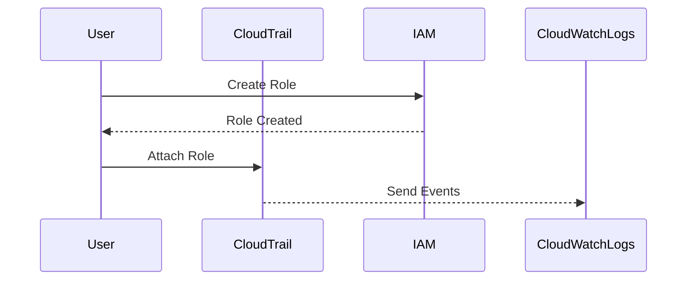
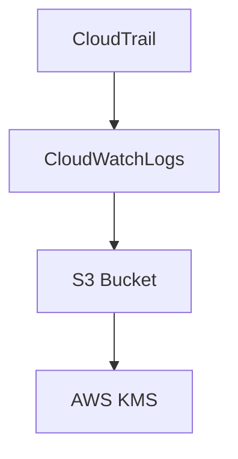

## Introduction to Logging and Monitoring for Security

In the realm of DevSecOps, logging and monitoring are critical components for maintaining the security and integrity of your systems. One of the most effective ways to achieve this in an AWS environment is through the use of AWS CloudTrail and CloudWatch. These services work together to provide comprehensive logging and monitoring capabilities, enabling you to track and analyze activities across your AWS resources.

### What is AWS CloudTrail?

AWS CloudTrail is a service that enables governance, compliance, operational auditing, and risk auditing of your AWS account. It provides visibility of who is doing what within your AWS environment, including actions taken through the AWS Management Console, AWS SDKs, command-line tools, and other AWS services.

#### Why Use CloudTrail?

- **Compliance**: CloudTrail helps you meet regulatory requirements by providing a detailed record of API calls made to your AWS account.
- **Auditing**: It enables you to audit actions taken by users, roles, and AWS services, helping you understand the changes made to your environment.
- **Security**: By tracking API calls, you can detect unauthorized access or suspicious activity, allowing you to respond quickly to potential threats.

### What is AWS CloudWatch?

AWS CloudWatch is a monitoring and observability service that provides you with data and actionable insights to monitor your applications, respond to system-wide performance changes, optimize resource utilization, and get a unified view of operational health.

#### Why Use CloudWatch?

- **Monitoring**: CloudWatch allows you to monitor your AWS resources and applications in real-time, providing metrics and alarms to help you maintain optimal performance.
- **Logging**: It can collect and store logs from various sources, including EC2 instances, Lambda functions, and custom applications, making it easier to troubleshoot issues.
- **Integration**: CloudWatch integrates seamlessly with other AWS services, such as CloudTrail, to provide a comprehensive monitoring solution.

### Configuring Multi-Region Trail in CloudTrail

To set up a multi-region trail in CloudTrail, you need to configure CloudTrail to send events to CloudWatch Logs and store them in an S3 bucket. This setup ensures that you have a centralized location for your logs, which can be monitored and analyzed for security purposes.

#### Step-by-Step Configuration

1. **Create a Role for CloudTrail**
   - CloudTrail assumes this role to send CloudTrail events to CloudWatch Logs.
   - The role should be named something like `CloudTrailRoleForCloudWatchLogs`.



2. **Policy Document for the Role**
   - The policy document is automatically created by AWS, but you can expand it to see the permissions granted.
   - The policy allows log stream creation and sending logs to CloudWatch Logs.

```json
{
    "Version": "2012-10-17",
    "Statement": [
        {
            "Sid": "AllowCloudWatchLogsActions",
            "Effect": "Allow",
            "Action": [
                "logs:CreateLogStream",
                "logs:PutLogEvents"
            ],
            "Resource": "arn:aws:logs:*:*:log-group:/aws/cloudtrail/*:*"
        }
    ]
}
```

3. **Attach the Role to CloudTrail**
   - The role is attached to the CloudTrail resource to enable communication with CloudWatch Logs.

4. **Configure AWS KMS Key**
   - AWS KMS (Key Management Service) is used to encrypt the logs stored in the S3 bucket.
   - You can name the key something like `CloudTrailKMSKey` for easy reference.



5. **Select Management Events**
   - Choose to capture management events, which include API calls made to your AWS account.
   - You can also add data events and internal events for more granular logging.

6. **Review and Create Trail**
   - Review the settings and create the trail.
   - The trail will be free of additional charges, as mentioned in the transcript.

### Complete Example

Here’s a complete example of setting up a multi-region trail:

1. **Create the Role**

```bash
aws iam create-role --role-name CloudTrailRoleForCloudWatchLogs --assume-role-policy-document file://trust-policy.json
```

**trust-policy.json:**

```json
{
    "Version": "2012-10-17",
    "Statement": [
        {
            "Effect": "Allow",
            "Principal": {
                "Service": "cloudtrail.amazonaws.com"
            },
            "Action": "sts:AssumeRole"
        }
    ]
}
```

2. **Attach the Policy**

```bash
aws iam put-role-policy --role-name CloudTrailRoleForCloudWatchLogs --policy-name CloudTrailPolicy --policy-document file://policy-document.json
```

**policy-document.json:**

```json
{
    "Version": "2012-10-17",
    "Statement": [
        {
            "Sid": "AllowCloudWatchLogsActions",
            "Effect": "Allow",
            "Action": [
                "logs:CreateLogStream",
                "logs:PutLogEvents"
            ],
            "Resource": "arn:aws:logs:*:*:log-group:/aws/cloudtrail/*:*"
        }
    ]
}
```

3. **Create the KMS Key**

```bash
aws kms create-key --description "CloudTrail KMS Key"
```

4. **Configure CloudTrail**

```bash
aws cloudtrail create-trail --name MyMultiRegionTrail --s3-bucket-name my-bucket --s3-key-prefix logs --include-global-service-events --is-multi-region-trail --cloud-watch-logs-log-group-arn arn:aws:logs:us-east-1:123456789012:log-group:/aws/cloudtrail/MyMultiRegionTrail:* --cloud-watch-logs-role-arn arn:aws:iam::123456789012:role/CloudTrailRoleForCloudWatchLogs --kms-key-id arn:aws:kms:us-east-1:123456789012:key/abcd1234-abcd-1234-abcd-1234abcd1234
```

### Real-World Examples

Recent breaches and CVEs have highlighted the importance of robust logging and monitoring practices. For instance, the SolarWinds breach (CVE-2020-1014) demonstrated how attackers can leverage weak logging and monitoring to remain undetected for extended periods. By implementing comprehensive logging and monitoring solutions like CloudTrail and CloudWatch, organizations can better detect and respond to such threats.

### Pitfalls and Common Mistakes

- **Incomplete Logging**: Not capturing all necessary events can leave gaps in your security posture.
- **Insufficient Permissions**: Incorrectly configured roles and policies can prevent CloudTrail from functioning properly.
- **Lack of Encryption**: Storing logs without encryption can expose sensitive data to unauthorized access.

### How to Prevent / Defend

#### Detection

- **Monitor CloudTrail Events**: Regularly review CloudTrail logs for unusual activity.
- **Set Up Alarms**: Use CloudWatch to set up alarms for specific events, such as failed login attempts.

#### Prevention

- **Secure IAM Roles**: Ensure that IAM roles have the minimum necessary permissions.
- **Enable Encryption**: Always enable encryption for logs stored in S3 using AWS KMS.

#### Secure-Coding Fixes

**Vulnerable Code:**

```json
{
    "Version": "2012-10-17",
    "Statement": [
        {
            "Sid": "AllowCloudWatchLogsActions",
            "Effect": "Allow",
            "Action": [
                "logs:CreateLogStream",
                "logs:PutLogEvents"
            ],
            "Resource": "*"
        }
    ]
}
```

**Fixed Code:**

```json
{
    "Version": "2012-10-17",
    "Statement": [
        {
            "Sid": "AllowCloudWatchLogsActions",
            "Effect": "Allow",
            "Action": [
                "logs:CreateLogStream",
                "logs:PutLogEvents"
            ],
            "Resource": "arn:aws:logs:*:*:log-group:/aws/cloudtrail/*:*"
        }
    ]
}
```

### Conclusion

By configuring a multi-region trail in CloudTrail and forwarding logs to CloudWatch, you can significantly enhance your logging and monitoring capabilities. This setup provides a robust foundation for detecting and responding to security threats, ensuring the integrity and security of your AWS environment.

### Hands-On Labs

For practical experience, consider the following labs:

- **PortSwigger Web Security Academy**: Focuses on web application security but includes sections on logging and monitoring.
- **CloudGoat**: Provides scenarios for learning AWS security practices, including CloudTrail and CloudWatch configurations.

These labs will help you gain hands-on experience with the concepts covered in this chapter.

---
<!-- nav -->
[[05-Introduction to Logging and Monitoring for Security in DevSecOps|Introduction to Logging and Monitoring for Security in DevSecOps]] | [[DevSecOps/DevSecOps Bootcamp/08-Logging & Incident Response/04-Logging & Monitoring for Security/Configure Multi Region Trail in CloudTrail Forward Logs to CloudWatch/00-Overview|Overview]] | [[07-Introduction to Logging and Monitoring for Security Part 2|Introduction to Logging and Monitoring for Security Part 2]]
