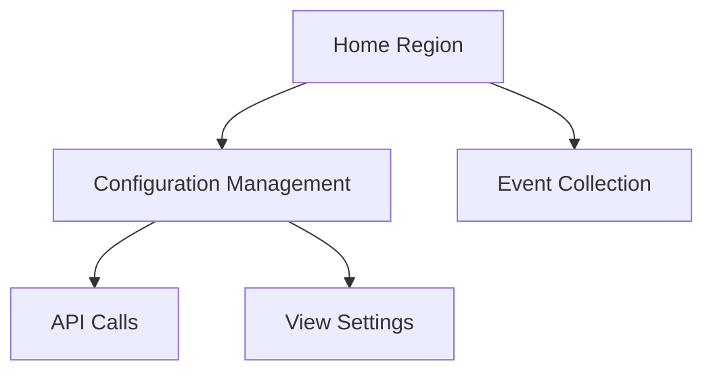
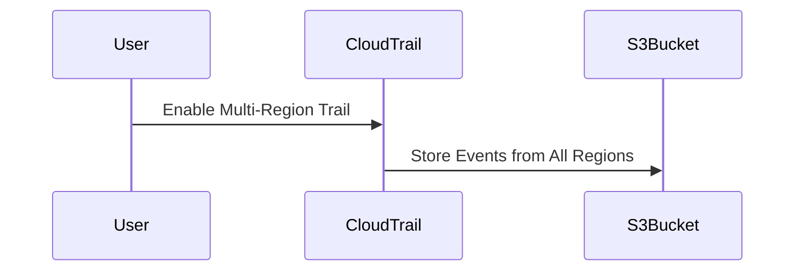

## Introduction to Logging and Monitoring for Security

Logging and monitoring are fundamental components of a robust DevSecOps strategy. They enable organizations to track system activities, detect anomalies, and respond to security incidents promptly. In the context of cloud environments, tools like AWS CloudTrail and CloudWatch play pivotal roles in providing comprehensive logging and monitoring capabilities.

### What is CloudTrail?

CloudTrail is a service provided by Amazon Web Services (AWS) that enables you to log, continuously monitor, and retain account activity related to actions across your AWS infrastructure. These actions include API calls made through the AWS Management Console, AWS SDKs, command-line tools, and other AWS services.

#### Home Region in CloudTrail

When configuring CloudTrail, you must specify a **home region**. This is the primary region where you create and manage the trail. All administrative actions, such as changing configurations or viewing settings, are performed within this home region. For instance, if you choose Paris (eu-west-3) as your home region, all management tasks related to the trail will be conducted from this region.



### Multi-Region Trailing

One of the key features of CloudTrail is the ability to configure a **multi-region trail**. This feature ensures that event logs from all regions are collected and stored centrally. For example, if you create instances in Ireland (eu-west-1) or Canada (ca-central-1), these events will be captured by the trail configured in Paris.

#### Why Multi-Region Trailing Matters

Multi-region trailing is crucial for several reasons:

1. **Comprehensive Visibility**: It provides a holistic view of all activities across different regions, ensuring no blind spots.
2. **Centralized Management**: Simplifies management by allowing you to handle all trails from a single region.
3. **Compliance**: Helps meet regulatory requirements that mandate centralized logging and auditing.

#### How Multi-Region Trailing Works

When you enable multi-region trailing, CloudTrail automatically captures and stores events from all regions in the specified S3 bucket. This ensures that all actions, regardless of their originating region, are logged and available for analysis.



### Trail Bucket Configuration

The trail bucket is an S3 bucket where CloudTrail stores the event logs. This bucket is created during the trail setup process and is used to persist the logs indefinitely unless explicitly deleted.

#### Example of Creating a Trail Bucket

To create a trail bucket, you can use the AWS Management Console or the AWS CLI. Here’s an example using the AWS CLI:

```bash
aws s3api create-bucket --bucket my-cloudtrail-bucket --region eu-west-3 --create-bucket-configuration LocationConstraint=eu-west-3
```

This command creates an S3 bucket named `my-cloudtrail-bucket` in the Paris region.

### Forwarding Logs to CloudWatch

In addition to storing logs in an S3 bucket, you can also forward these logs to CloudWatch. CloudWatch is a monitoring service that provides data points and metrics about your AWS resources and applications.

#### Configuring Log Forwarding

To configure log forwarding, you need to set up a CloudWatch Logs subscription filter on the S3 bucket. This filter reads the log files and forwards them to CloudWatch.

```bash
aws cloudtrail update-trail --name MyTrail --include-global-service-events --is-multi-region-trail --cloud-watch-logs-log-group-arn arn:aws:logs:eu-west-3:123456789012:log-group:/aws/cloudtrail/MyTrail:* --cloud-watch-logs-role-arn arn:aws:iam::123456789012:role/CloudTrailCloudWatchLogsRole
```

This command updates the trail to include global service events, enable multi-region trailing, and specify the CloudWatch Logs log group and role ARNs.

### Complete Example of Setting Up a Multi-Region Trail

Here’s a complete example of setting up a multi-region trail, including creating the S3 bucket, enabling multi-region trailing, and forwarding logs to CloudWatch.

#### Step 1: Create the S3 Bucket

```bash
aws s3api create-bucket --bucket my-cloudtrail-bucket --region eu-west-3 --create-bucket-configuration LocationConstraint=eu-west-3
```

#### Step 2: Create the CloudTrail Trail

```bash
aws cloudtrail create-trail --name MyTrail --s3-bucket-name my-cloudtrail-bucket --is-multi-region-trail --include-global-service-events
```

#### Step 3: Configure CloudWatch Logs Subscription Filter

```bash
aws cloudtrail update-trail --name MyTrail --cloud-watch-logs-log-group-arn arn:aws:logs:eu-west-3:123456789012:log-group:/aws/cloudtrail/MyTrail:* --cloud-watch-logs-role-arn arn:
```

### Real-World Examples and Breaches

Recent breaches have highlighted the importance of comprehensive logging and monitoring. For example, the Capital One breach in 2019 involved unauthorized access to customer data. Proper logging and monitoring could have helped detect and mitigate the breach earlier.

#### CVE Example: CVE-2020-1472

CVE-2020-1472, also known as Zerologon, is a critical vulnerability in Microsoft Windows Server that allows attackers to gain administrative access to a domain controller. Comprehensive logging and monitoring would have helped detect unusual login attempts and alert administrators to potential attacks.

### Common Pitfalls and Best Practices

#### Pitfall: Insufficient Logging

One common pitfall is insufficient logging. Organizations may not log all necessary events, leading to gaps in visibility. To avoid this, ensure that all critical actions are logged, including API calls, user activities, and system changes.

#### Best Practice: Centralized Logging

Centralizing logs in a single location, such as an S3 bucket, simplifies management and analysis. Ensure that the bucket is properly secured with appropriate permissions and encryption.

### How to Prevent / Defend

#### Detection

Regularly review logs for suspicious activities. Use tools like AWS CloudTrail Insights to automatically detect and alert on unusual patterns.

#### Prevention

Implement strict access controls and least privilege principles. Regularly audit and review permissions to ensure that only authorized users have access to sensitive resources.

#### Secure Coding Fixes

Show the vulnerable pattern and the corrected secure version side by side.

**Vulnerable Pattern:**

```python
# Vulnerable Code
import boto3

def create_trail(bucket_name):
    client = boto3.client('cloudtrail')
    response = client.create_trail(
        Name='MyTrail',
        S3BucketName=bucket_name,
        IsMultiRegionTrail=False
    )
    return response
```

**Secure Pattern:**

```python
# Secure Code
import boto3

def create_trail(bucket_name):
    client = boto3.client('cloudtrail')
    response = client.create_trail(
        Name='MyTrail',
        S3BucketName=bucket_name,
        IsMultiRegionTrail=True,
        IncludeGlobalServiceEvents=True
    )
    return response
```

### Conclusion

Proper configuration of CloudTrail and CloudWatch is essential for effective logging and monitoring in a DevSecOps environment. By enabling multi-region trailing and centralizing logs, organizations can achieve comprehensive visibility and better protect their systems against security threats.

### Hands-On Labs

For practical experience, consider the following labs:

- **PortSwigger Web Security Academy**: Offers interactive labs on web application security.
- **OWASP Juice Shop**: A deliberately insecure web application for security training.
- **DVWA (Damn Vulnerable Web Application)**: Another popular web application for security testing.

These labs provide real-world scenarios to practice and reinforce the concepts learned.

---
<!-- nav -->
[[06-Introduction to Logging and Monitoring for Security Part 1|Introduction to Logging and Monitoring for Security Part 1]] | [[DevSecOps/DevSecOps Bootcamp/08-Logging & Incident Response/04-Logging & Monitoring for Security/Configure Multi Region Trail in CloudTrail Forward Logs to CloudWatch/00-Overview|Overview]] | [[08-Introduction to Logging and Monitoring for Security Part 3|Introduction to Logging and Monitoring for Security Part 3]]
