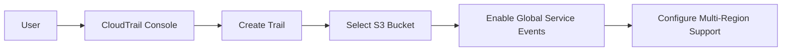
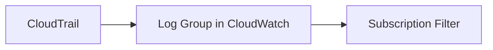
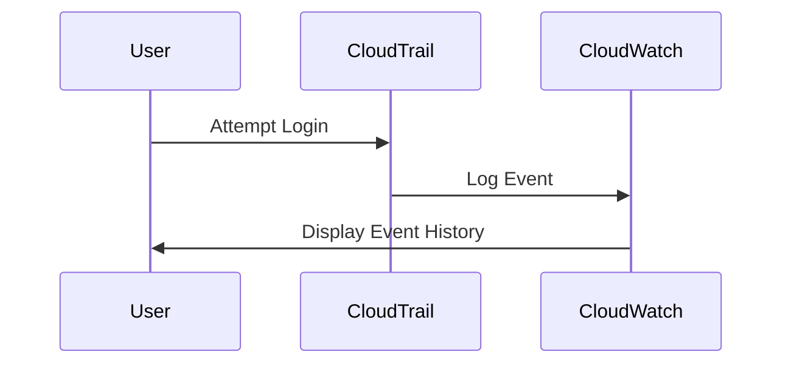

## Introduction to Logging and Monitoring for Security

In the realm of DevSecOps, logging and monitoring are critical components that help ensure the security and integrity of systems. This chapter will delve into the configuration of multi-region trails in AWS CloudTrail and the forwarding of these logs to CloudWatch. We will cover the theoretical foundations, practical configurations, and real-world implications of these practices.

### What is CloudTrail?

CloudTrail is an AWS service that enables governance, compliance, operational auditing, and risk auditing of your AWS account. It provides a history of AWS API calls made within your account, including API calls made via the AWS Management Console, AWS SDKs, command-line tools, and other AWS services.

#### Why Use CloudTrail?

- **Audit**: Provides a detailed record of actions taken by users, roles, or AWS services in your account.
- **Compliance**: Helps meet regulatory requirements by maintaining a comprehensive log of all activities.
- **Security**: Detects unauthorized activity and helps in forensic analysis during security incidents.

### What is CloudWatch?

Amazon CloudWatch is a monitoring and observability service provided by AWS. It collects and tracks metrics, collects and monitors log files, and responds to system-wide performance changes.

#### Why Use CloudWatch?

- **Monitoring**: Tracks metrics and logs to monitor the health and performance of applications.
- **Alerting**: Sends notifications based on custom rules and thresholds.
- **Logging**: Aggregates logs from various sources for centralized management and analysis.

### Multi-Region Trails in CloudTrail

A multi-region trail in CloudTrail captures API activity across multiple regions. This is particularly useful for organizations that operate in multiple AWS regions.

#### Configuration Steps

1. **Create a Trail**:
    - Navigate to the CloudTrail console.
    - Click on "Create trail".
    - Provide a name for the trail.
    - Select the S3 bucket where the logs will be stored.
    - Enable "Include global service events" to capture events from all regions.

2. **Enable Multi-Region Support**:
    - Ensure that the trail is configured to log events from all regions.
    - This can be done by selecting the appropriate regions in the CloudTrail console.



### Forwarding Logs to CloudWatch

Once the logs are collected in CloudTrail, they can be forwarded to CloudWatch for further processing and monitoring.

#### Configuration Steps

1. **Create a Log Group**:
    - Navigate to the CloudWatch console.
    - Click on "Logs" and then "Create log group".
    - Provide a name for the log group.

2. **Configure Subscription Filter**:
    - In the CloudTrail console, navigate to the trail you created.
    - Under "Event History", select "Send to CloudWatch Logs".
    - Choose the log group you created.



### Example: Failed Login Attempts

Let's consider a scenario where we want to monitor failed login attempts. This is crucial for detecting potential security threats such as brute-force attacks.

#### Step-by-Step Example

1. **Sign Out and Attempt Login**:
    - Sign out of the AWS console.
    - Attempt to log in with an incorrect password.

2. **Wait for Event History**:
    - Wait for the failed login attempt to appear in the event history.

3. **Filter on Console Login Events**:
    - Navigate to the CloudTrail event history.
    - Filter on `ConsoleLogin` events.

4. **Check Multi-Region Logs**:
    - Verify that the failed login attempts are captured in the appropriate region's log files.



### Real-World Examples and Breaches

Recent breaches have highlighted the importance of robust logging and monitoring practices. For instance:

- **CVE-2021-20225**: A vulnerability in AWS IAM allowed unauthorized access to resources. Proper logging and monitoring could have helped detect and mitigate this issue.
- **SolarWinds Supply Chain Attack**: This attack involved the compromise of SolarWinds Orion software. Comprehensive logging and monitoring could have alerted organizations to unusual activity.

### Common Pitfalls and How to Avoid Them

#### Pitfall 1: Insufficient Logging

- **Issue**: Not logging enough information can make it difficult to trace and analyze security incidents.
- **Solution**: Ensure that all relevant API calls and events are logged, including failed login attempts.

#### Pitfall 2: Lack of Centralized Monitoring

- **Issue**: Without centralized monitoring, it can be challenging to correlate events across different services and regions.
- **Solution**: Use CloudWatch to aggregate and monitor logs from multiple sources.

### How to Prevent / Defend

#### Detection

- **Monitor Failed Login Attempts**: Set up alerts for failed login attempts using CloudWatch.
- **Analyze Logs**: Regularly review logs for suspicious activity.

#### Prevention

- **Secure Access Keys**: Rotate access keys regularly and limit their permissions.
- **Use MFA**: Require multi-factor authentication (MFA) for all users.

#### Secure Coding Fixes

**Vulnerable Code**:
```python
# Vulnerable code snippet
def authenticate_user(username, password):
    if check_password(username, password):
        return True
    else:
        return False
```

**Fixed Code**:
```python
# Fixed code snippet
def authenticate_user(username, password):
    if check_password(username, password):
        log_event("Successful login", username)
        return True
    else:
        log_event("Failed login attempt", username)
        return False
```

### Hands-On Labs

For practical experience, consider the following labs:

- **PortSwigger Web Security Academy**: Offers exercises on logging and monitoring.
- **OWASP Juice Shop**: Provides a vulnerable application for testing logging mechanisms.
- **DVWA**: Another vulnerable application for practicing security measures.

### Conclusion

Proper logging and monitoring are essential for maintaining the security and integrity of AWS environments. By configuring multi-region trails in CloudTrail and forwarding logs to CloudWatch, organizations can gain valuable insights into their system activities and respond effectively to security threats.

---
<!-- nav -->
[[08-Introduction to Logging and Monitoring for Security Part 3|Introduction to Logging and Monitoring for Security Part 3]] | [[DevSecOps/DevSecOps Bootcamp/08-Logging & Incident Response/04-Logging & Monitoring for Security/Configure Multi Region Trail in CloudTrail Forward Logs to CloudWatch/00-Overview|Overview]] | [[10-Introduction to Logging and Monitoring for Security Part 5|Introduction to Logging and Monitoring for Security Part 5]]
