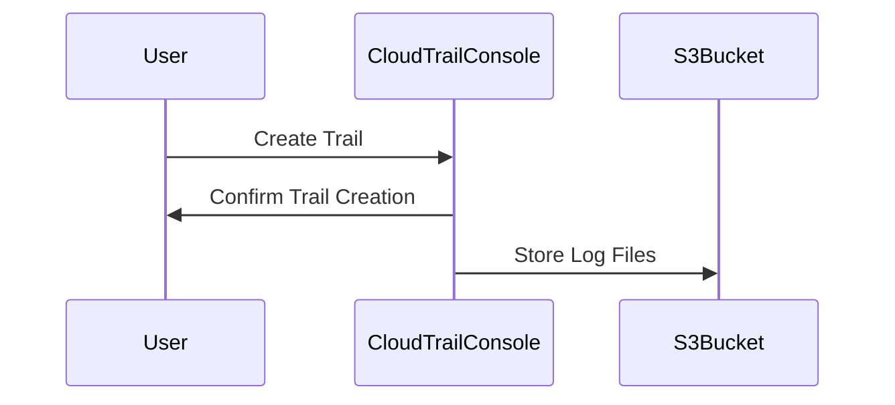
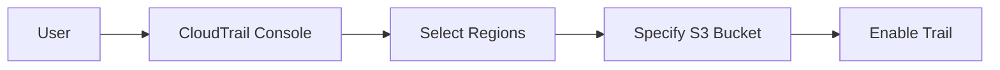
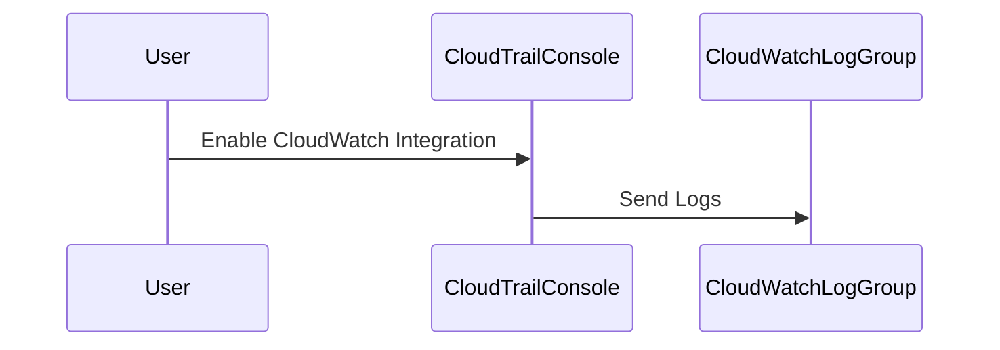
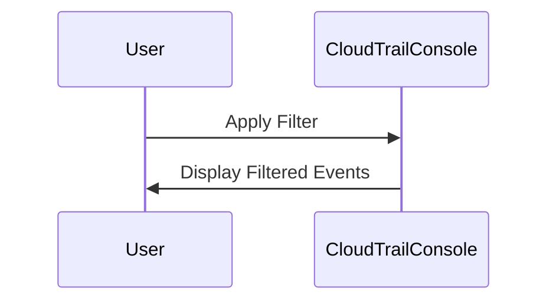
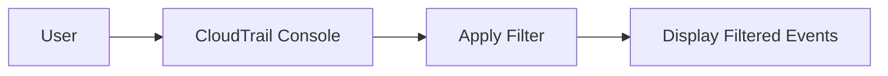
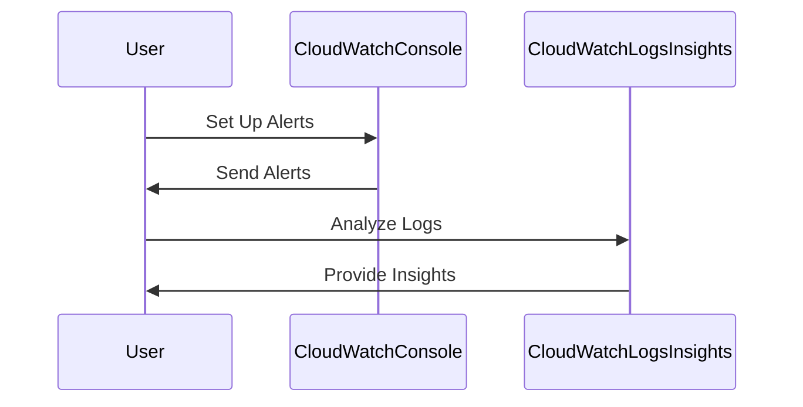
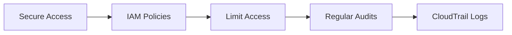

## Introduction to Logging and Monitoring for Security

Logging and monitoring are critical components of a robust security strategy in DevSecOps environments. They provide visibility into system activities, help identify anomalies, and enable timely response to potential threats. In this chapter, we will delve into configuring multi-region trails in AWS CloudTrail and forwarding logs to CloudWatch, which are essential practices for maintaining comprehensive security logging and monitoring.

### Background Theory

#### What is CloudTrail?

AWS CloudTrail is a service that enables governance, compliance, operational auditing, and risk auditing of your AWS account. It provides a history of API calls made within your AWS account and tracks changes to resources. CloudTrail captures API calls, both from the AWS Management Console and from AWS SDKs and command-line tools.

#### Why Use CloudTrail?

CloudTrail helps you understand and track activity across your AWS account. By logging API calls, you can:

- **Audit**: Track who performed an action, when it was done, and from which IP address.
- **Compliance**: Meet regulatory requirements by providing a detailed audit trail.
- **Security**: Detect unauthorized access or unusual behavior that could indicate a security breach.

#### What is CloudWatch?

Amazon CloudWatch is a monitoring and observability service provided by AWS. It collects and tracks metrics, collects and monitors log files, and responds to system-wide performance changes. CloudWatch allows you to monitor AWS resources, applications, and custom metrics.

#### Why Use CloudWatch?

CloudWatch provides real-time monitoring of your AWS resources and applications. By integrating CloudTrail with CloudWatch, you can:

- **Centralize Logs**: Consolidate logs from multiple sources into a single location.
- **Real-Time Alerts**: Set up alerts based on specific conditions or thresholds.
- **Analyze Data**: Use CloudWatch Logs Insights to query and analyze log data.

### Configuring Multi-Region Trails in CloudTrail

A multi-region trail in CloudTrail captures API calls made in multiple regions and stores them in a specified S3 bucket. This ensures that you have a comprehensive view of activity across all regions.

#### Step-by-Step Configuration

1. **Create a Trail**:
    - Log in to the AWS Management Console.
    - Navigate to the CloudTrail console.
    - Click on "Create trail".
    - Provide a name for the trail.
    - Select the S3 bucket where you want to store the log files.
    - Choose the regions where you want to enable the trail.



2. **Enable Multi-Region Support**:
    - Ensure that the trail is enabled in all desired regions.
    - Specify the S3 bucket and prefix for storing log files.



3. **Configure CloudWatch Integration**:
    - In the CloudTrail console, navigate to the trail you created.
    - Under the "Logs" section, enable CloudWatch integration.
    - Specify the CloudWatch log group where you want to send the logs.



### Filtering Events in CloudTrail

Filtering events in CloudTrail allows you to focus on specific types of activity, such as events from a particular region or involving certain resources.

#### Syntax for Filtering

The filtering syntax in CloudTrail uses a combination of curly braces `{}` and attribute names prefixed with `$`.

```mermaid
graph LR
    A[Filter Syntax] --> B[{Curly Braces}]
    B --> C[$Attribute Name]
    C --> D[Value]
```

For example, to filter events by region:

```plaintext
{$.awsRegion='us-east-1'}
```

To filter by event name:

```plaintext
{$.eventName='DescribeInstances'}
```

#### Example: Filtering Events by Region

Let's walk through an example where we filter events by the `us-east-1` region.

1. **Navigate to CloudTrail Console**:
    - Go to the CloudTrail console.
    - Select the trail you want to filter.

2. **Apply Filter**:
    - In the "Events" section, apply the filter using the syntax above.



3. **View Filtered Events**:
    - The console will display events that match the filter criteria.



### Real-World Examples and Recent Breaches

#### Example: AWS S3 Bucket Exposure

In 2020, a major breach occurred due to misconfigured S3 buckets. Proper logging and monitoring could have helped detect and mitigate the issue earlier.

- **Scenario**: An organization had several S3 buckets exposed due to incorrect permissions.
- **Impact**: Sensitive data was accessible to the public.
- **Mitigation**: Using CloudTrail to log S3 bucket access and CloudWatch to monitor for unusual activity could have alerted the organization to the misconfiguration.

#### Example: Unauthorized API Calls

Another example involves unauthorized API calls leading to resource manipulation.

- **Scenario**: An attacker gained access to an AWS account and made unauthorized API calls to create and terminate EC2 instances.
- **Impact**: Financial loss and potential data exposure.
- **Mitigation**: CloudTrail logs would capture these API calls, and CloudWatch alerts could notify the organization of suspicious activity.

### Common Pitfalls and Best Practices

#### Common Pitfalls

1. **Incomplete Logging**: Not logging all necessary API calls can lead to blind spots.
2. **Insufficient Monitoring**: Lack of real-time monitoring can delay detection of malicious activity.
3. **Misconfigured Filters**: Incorrect filters can result in missing important events.

#### Best Practices

1. **Enable Comprehensive Logging**: Ensure all critical API calls are logged.
2. **Regular Monitoring**: Continuously monitor logs for unusual activity.
3. **Proper Filter Configuration**: Use filters effectively to focus on relevant events.

### How to Prevent / Defend

#### Detection

1. **Set Up Alerts**: Configure CloudWatch to send alerts based on specific conditions.
2. **Use CloudWatch Logs Insights**: Query and analyze log data to identify patterns and anomalies.



#### Prevention

1. **Secure Access**: Implement strict IAM policies to limit access to sensitive resources.
2. **Regular Audits**: Conduct regular audits of CloudTrail logs to ensure compliance and detect unauthorized activity.



#### Secure Coding Fixes

Compare the insecure and secure versions of IAM policies:

**Insecure Policy**:
```json
{
    "Version": "2012-10-17",
    "Statement": [
        {
            "Effect": "Allow",
            "Action": "*",
            "Resource": "*"
        }
    ]
}
```

**Secure Policy**:
```json
{
    "Version": "2012-10-17",
    "Statement": [
        {
            "Effect": "Allow",
            "Action": [
                "ec2:DescribeInstances",
                "s3:GetObject"
            ],
            "Resource": [
                "arn:aws:ec2:*:*:instance/*",
                "arn:aws:s3:::my-bucket/*"
            ]
        }
    ]
}
```

### Complete Example: Full HTTP Request and Response

Here’s a complete example of setting up a multi-region trail and forwarding logs to CloudWatch:

#### HTTP Request

```http
POST /cloudtrail/trail HTTP/1.1
Host: cloudtrail.amazonaws.com
Content-Type: application/json

{
    "Name": "MyMultiRegionTrail",
    "S3BucketName": "my-trail-bucket",
    "IncludeGlobalServiceEvents": true,
    "IsMultiRegionTrail": true,
    "LogFileValidationEnabled": true,
    "CloudWatchLogsLogGroupArn": "arn:aws:logs:us-east-1:123456789012:log-group:/aws/cloudtrail/MyMultiRegionTrail:*"
}
```

#### HTTP Response

```http
HTTP/1.1 200 OK
Content-Type: application/json

{
    "Name": "MyMultiRegionTrail",
    "S3BucketName": "my-trail-bucket",
    "IncludeGlobalServiceEvents": true,
    "IsMultiRegionTrail": true,
    "LogFileValidationEnabled": true,
    "CloudWatchLogsLogGroupArn": "arn:aws:logs:us-east-1:123456789012:log-group:/aws/cloudtrail/MyMultiRegionTrail:*"
}
```

### Hands-On Labs

#### Recommended Labs

- **PortSwigger Web Security Academy**: Focuses on web application security but can be adapted for learning about logging and monitoring.
- **OWASP Juice Shop**: A deliberately insecure web application for practicing security skills.
- **DVWA (Damn Vulnerable Web Application)**: Another insecure web app for security training.

These labs provide practical experience in setting up and managing logging and monitoring systems.

### Conclusion

Configuring multi-region trails in CloudTrail and forwarding logs to CloudWatch is crucial for maintaining comprehensive security logging and monitoring in DevSecOps environments. By following the steps outlined in this chapter, you can ensure that your AWS environment is well-monitored and secure. Regular audits and proper configuration of filters will help you detect and respond to potential threats promptly.

---
<!-- nav -->
[[09-Introduction to Logging and Monitoring for Security Part 4|Introduction to Logging and Monitoring for Security Part 4]] | [[DevSecOps/DevSecOps Bootcamp/08-Logging & Incident Response/04-Logging & Monitoring for Security/Configure Multi Region Trail in CloudTrail Forward Logs to CloudWatch/00-Overview|Overview]] | [[DevSecOps/DevSecOps Bootcamp/08-Logging & Incident Response/04-Logging & Monitoring for Security/Configure Multi Region Trail in CloudTrail Forward Logs to CloudWatch/11-Introduction to Logging and Monitoring for Security|Introduction to Logging and Monitoring for Security]]
