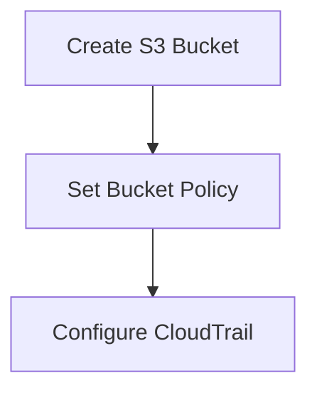
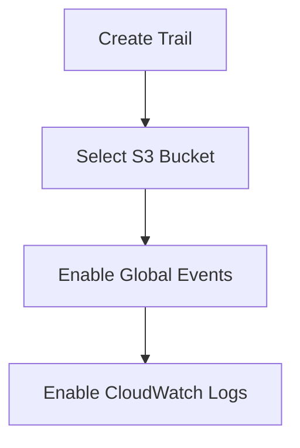

## Configuring Multi-Region Trail in CloudTrail

To ensure comprehensive logging across multiple AWS regions, you can configure a multi-region trail in CloudTrail. This setup ensures that all API calls made to your AWS account are logged and stored in an S3 bucket.

### Step-by-Step Configuration

1. **Create an S3 Bucket**:
    - Navigate to the S3 console.
    - Create a new bucket with a unique name.
    - Ensure the bucket has appropriate permissions to store CloudTrail logs.



2. **Set Bucket Policy**:
    - Attach a bucket policy to allow CloudTrail to write logs to the bucket.

```json
{
  "Version": "2012-10-17",
  "Statement": [
    {
      "Sid": "AWSCloudTrailAclCheck20150319",
      "Effect": "Allow",
      "Principal": { "Service": "cloudtrail.amazonaws.com" },
      "Action": "s3:GetBucketAcl",
      "Resource": "arn:aws:s3:::<your-bucket-name>"
    },
    {
      "Sid": "AWSCloudTrailWrite20150319",
      "Effect": "Allow",
      "Principal": { "Service": "cloudtrail.amazonaws.com" },
      "Action": "s3:PutObject",
      "Resource": "arn:aws:s3:::<your-bucket-name>/AWSLogs/<your-account-id>/*",
      "Condition": {
        "StringEquals": {
          "s3:x-amz-acl": "bucket-owner-full-control"
        }
      }
    }
  ]
}
```

3. **Configure CloudTrail**:
    - Navigate to the CloudTrail console.
    - Click on "Create trail".
    - Provide a name for the trail.
    - Select the S3 bucket created earlier.
    - Enable "Include global service events" to capture events from all regions.
    - Enable "Send to CloudWatch Logs" to forward logs to CloudWatch.



### Example of a Multi-Region Trail Configuration

Here’s a more detailed example of configuring a multi-region trail using the AWS Management Console:

1. **Navigate to CloudTrail Console**:
    - Open the AWS Management Console.
    - Navigate to the CloudTrail service.

2. **Create a New Trail**:
    - Click on "Create trail".
    - Enter a name for the trail (e.g., `MyMultiRegionTrail`).

3. **Select S3 Bucket**:
    - Choose the S3 bucket you created earlier.
    - Ensure the bucket policy is correctly set.

4. **Enable Global Service Events**:
    - Check the box for "Include global service events".

5. **Enable CloudWatch Logs**:
    - Check the box for "Send to CloudWatch Logs".
    - Specify the log group name (e.g., `/aws/cloudtrail/MyMultiRegionTrail`).

6. **Review and Create**:
    - Review the settings and click "Create trail".

### Raw HTTP Request and Response Example

When creating a trail programmatically using the AWS CLI, the following commands can be used:

```sh
# Create the S3 bucket
aws s3api create-bucket --bucket my-cloudtrail-bucket --region us-east-1

# Set the bucket policy
aws s3api put-bucket-policy --bucket my-cloudtrail-bucket --policy file://bucket-policy.json

# Create the CloudTrail trail
aws cloudtrail create-trail --name MyMultiRegionTrail --s3-bucket-name my-cloudtrail-bucket --include-global-service-events --is-multi-region-trail --cloud-watch-logs-log-group-arn arn:aws:logs:us-east-1:<account-id>:log-group:/aws/cloudtrail/MyMultiRegionTrail:* --cloud-watch-logs-role-arn arn:aws:iam::<account-id>:role/CloudTrailRole
```

### Expected Result

After executing the above commands, the trail will be created, and logs will start being forwarded to both the S3 bucket and CloudWatch Logs.

---
<!-- nav -->
[[DevSecOps/DevSecOps Bootcamp/08-Logging & Incident Response/04-Logging & Monitoring for Security/Configure Multi Region Trail in CloudTrail Forward Logs to CloudWatch/11-Introduction to Logging and Monitoring for Security|Introduction to Logging and Monitoring for Security]] | [[DevSecOps/DevSecOps Bootcamp/08-Logging & Incident Response/04-Logging & Monitoring for Security/Configure Multi Region Trail in CloudTrail Forward Logs to CloudWatch/00-Overview|Overview]] | [[13-How to Prevent  Defend|How to Prevent  Defend]]
