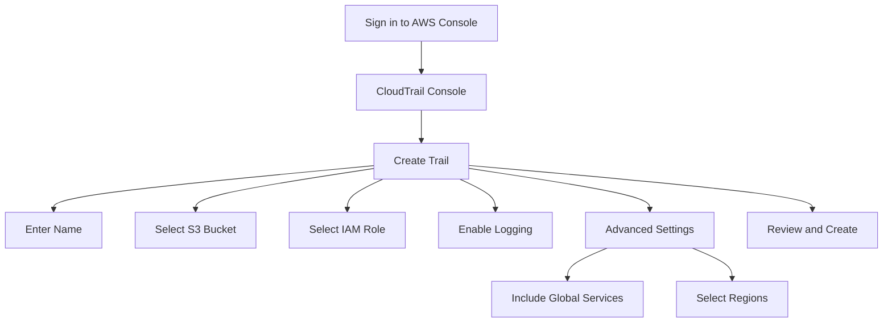
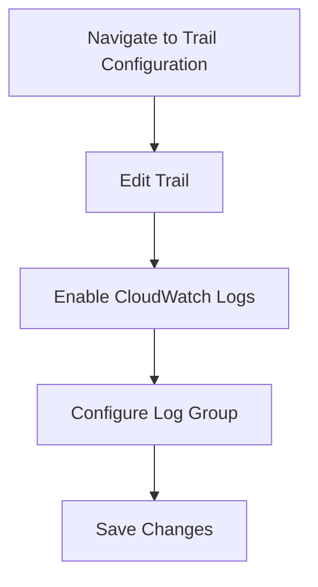
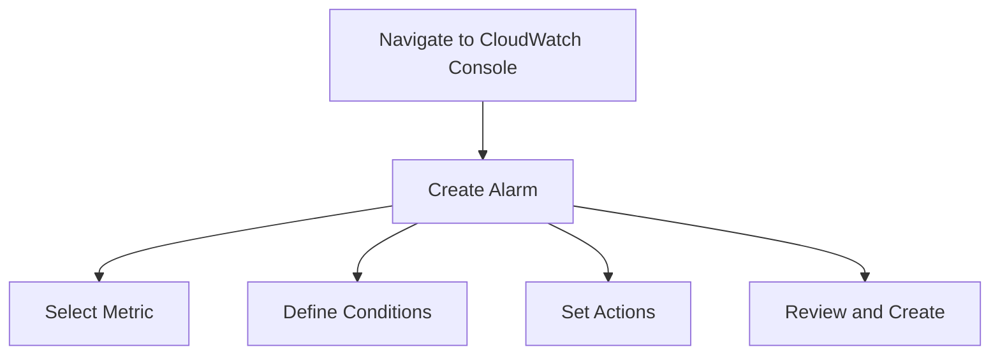

## Logging & Monitoring for Security: Configuring Multi-Region Trail in CloudTrail and Forwarding Logs to CloudWatch

### Introduction to Logging and Monitoring in DevSecOps

Logging and monitoring are critical components of DevSecOps, enabling teams to track system behavior, detect anomalies, and respond to security incidents promptly. In the context of AWS, CloudTrail and CloudWatch are two essential services that work together to provide comprehensive logging and monitoring capabilities.

#### What is CloudTrail?

CloudTrail is an AWS service that enables governance, compliance, operational auditing, and risk auditing of your AWS account. It provides a history of API calls made within your AWS account, including API calls made via the AWS Management Console, AWS SDKs, command-line tools, and other AWS services. This history includes both successful and unsuccessful requests.

**Why CloudTrail Matters:**
- **Compliance:** CloudTrail helps organizations meet regulatory requirements by providing a detailed audit trail of actions taken within their AWS environment.
- **Security:** By tracking API calls, CloudTrail can help detect unauthorized access attempts and potential security breaches.
- **Operational Auditing:** CloudTrail logs can be used to investigate operational issues and understand how resources are being used.

**How CloudTrail Works:**
CloudTrail captures API calls made to your AWS account and delivers log files to an Amazon S3 bucket. These log files contain detailed information about each API call, such as the identity of the caller, the time of the request, the source IP address, and the request parameters.

#### What is CloudWatch?

Amazon CloudWatch is a monitoring and observability service provided by AWS. It collects and tracks metrics, collects and monitors log files, and responds to changes in your AWS resources. CloudWatch allows you to monitor your applications, understand their behavior, and react accordingly.

**Why CloudWatch Matters:**
- **Real-Time Monitoring:** CloudWatch provides real-time visibility into the performance and health of your AWS resources.
- **Alerting:** You can set up alerts based on specific conditions, allowing you to take action when certain thresholds are met.
- **Log Analysis:** CloudWatch Logs allow you to store and analyze log data from various sources, including CloudTrail.

**How CloudWatch Works:**
CloudWatch collects metrics from AWS resources and custom applications. These metrics are then stored and can be visualized in the CloudWatch console. Additionally, CloudWatch Logs can collect and store log data from various sources, including CloudTrail.

### Configuring Multi-Region Trail in CloudTrail

A Multi-Region Trail in CloudTrail captures API activity across multiple regions and stores the resulting log files in a specified S3 bucket. This setup ensures that you have a centralized view of API activity across your entire AWS environment.

#### Steps to Configure Multi-Region Trail

1. **Sign in to the AWS Management Console:**
   Navigate to the CloudTrail console at https://console.aws.amazon.com/cloudtrail/.

2. **Create a New Trail:**
   Click on "Create trail" and follow these steps:
   - **Name:** Enter a name for your trail.
   - **S3 Bucket:** Select an existing S3 bucket or create a new one to store the log files.
   - **IAM Role:** Select an existing IAM role or create a new one with the necessary permissions to write to the S3 bucket.
   - **Enable logging:** Ensure that logging is enabled for all regions.

3. **Configure Advanced Settings:**
   - **Include global services:** Check this option to include API activity from global services like IAM.
   - **Select regions:** Choose the regions where you want to enable logging.

4. **Review and Create:**
   Review the settings and click "Create trail."



### Forwarding CloudTrail Logs to CloudWatch

Once you have configured a Multi-Region Trail, you can forward the log files to CloudWatch for further analysis and alerting.

#### Steps to Forward Logs to CloudWatch

1. **Navigate to the Trail Configuration:**
   In the CloudTrail console, select the trail you created and click on "Edit trail."

2. **Enable CloudWatch Logs:**
   Under the "Advanced settings" section, check the box to "Send trail to CloudWatch Logs."

3. **Configure Log Group:**
   Specify the log group where the CloudTrail logs will be sent. You can either use an existing log group or create a new one.

4. **Save Changes:**
   Click "Save" to apply the changes.



### Creating Alarms Based on CloudTrail Events

With CloudTrail logs forwarded to CloudWatch, you can now create alarms based on specific events or patterns in the logs.

#### Steps to Create Alarms

1. **Navigate to CloudWatch Console:**
   Go to the CloudWatch console at https://console.aws.amazon.com/cloudwatch/.

2. **Create a New Alarm:**
   Click on "Alarms" and then "Create alarm."

3. **Select Metric:**
   Choose the metric that corresponds to the CloudTrail log group you configured earlier.

4. **Define Conditions:**
   Set the conditions under which the alarm should trigger. For example, you might want to trigger an alarm if there are more than 10 failed login attempts in a minute.

5. **Set Actions:**
   Define the actions to be taken when the alarm triggers. This could include sending an email notification or triggering an AWS Lambda function.

6. **Review and Create:**
   Review the settings and click "Create alarm."



### Real-World Examples and Recent Breaches

#### Example 1: AWS IAM Policy Changes

In a recent breach, an attacker gained unauthorized access to an AWS account and modified IAM policies to grant themselves elevated privileges. By monitoring CloudTrail logs for changes to IAM policies, this breach could have been detected and mitigated more quickly.

**Detection:**
- Monitor for `UpdatePolicy` or `AttachRolePolicy` API calls.
- Set up an alarm to notify when these events occur.

**Prevention:**
- Implement least privilege access principles.
- Regularly review IAM policies for unnecessary permissions.

#### Example 2: Unauthorized Access Attempts

Another breach involved unauthorized access attempts to sensitive resources. By setting up CloudWatch alarms to detect failed login attempts, the organization could have been alerted to the breach sooner.

**Detection:**
- Monitor for `FailedAuthentication` events.
- Set up an alarm to notify when there are multiple failed authentication attempts.

**Prevention:**
- Enable multi-factor authentication (MFA) for all users.
- Implement rate limiting on login attempts.

### How to Prevent / Defend

#### Detection

To effectively detect security incidents, you need to monitor for specific events and patterns in your CloudTrail logs. Here are some key events to watch for:

- **IAM Policy Changes:** Monitor for `UpdatePolicy`, `AttachRolePolicy`, and `DetachRolePolicy` API calls.
- **Unauthorized Access Attempts:** Monitor for `FailedAuthentication` events.
- **Resource Creation:** Monitor for `CreateInstance`, `CreateBucket`, and other resource creation events.

#### Prevention

To prevent security incidents, implement the following best practices:

- **Least Privilege Access:** Grant users only the permissions they need to perform their job functions.
- **Multi-Factor Authentication (MFA):** Require MFA for all users, especially those with administrative privileges.
- **Rate Limiting:** Implement rate limiting on login attempts to prevent brute-force attacks.
- **Regular Audits:** Regularly review IAM policies and CloudTrail logs to identify and mitigate potential security risks.

#### Secure Coding Fixes

Here is an example of how to implement secure coding practices to prevent unauthorized access attempts:

**Vulnerable Code:**
```python
def authenticate_user(username, password):
    # Check if the user exists and the password is correct
    if user_exists(username) and check_password(username, password):
        return True
    else:
        return False
```

**Secure Code:**
```python
def authenticate_user(username, password):
    # Check if the user exists and the password is correct
    if user_exists(username) and check_password(username, password):
        return True
    else:
        # Increment failed login attempts counter
        increment_failed_login_attempts(username)
        # Check if the failed login attempts exceed the threshold
        if check_threshold_exceeded(username):
            # Lock the user account
            lock_user_account(username)
            # Send an alert
            send_alert("Unauthorized access attempt", username)
        return False
```

### Complete Example: Full HTTP Request and Response

Here is a complete example of how to configure CloudWatch alarms based on CloudTrail events:

**HTTP Request:**
```http
POST /cloudwatch/alarm HTTP/1.1
Host: cloudwatch.amazonaws.com
Content-Type: application/json

{
  "AlarmName": "UnauthorizedAccessAttempt",
  "MetricName": "FailedAuthentication",
  "Namespace": "AWS/CloudTrail",
  "Statistic": "Sum",
  "ComparisonOperator": "GreaterThanThreshold",
  "Threshold": 5,
  "EvaluationPeriods": 1,
  "Period": 60,
  "ActionsEnabled": true,
  "AlarmActions": [
    "arn:aws:sns:us-east-1:123456789012:security-alerts"
  ]
}
```

**HTTP Response:**
```http
HTTP/1.1 200 OK
Content-Type: application/json

{
  "AlarmArn": "arn:aws:cloudwatch:us-east-1:123456789012:alarm:UnauthorizedAccessAttempt"
}
```

### Cost Considerations

While CloudWatch Logs provide valuable monitoring and alerting capabilities, it is important to be aware of the associated costs. CloudWatch Logs is not a free service, and you may incur charges for storing and processing log data beyond the free tier.

**Cost Calculation:**
- **Storage:** $0.50 per GB per month.
- **Data Retention:** $0.025 per GB per day.
- **Querying:** $0.005 per GB queried.

**Best Practices:**
- **Optimize Storage:** Regularly clean up old log data to reduce storage costs.
- **Monitor Usage:** Use CloudWatch billing metrics to monitor your usage and avoid unexpected charges.

### Hands-On Labs

To practice configuring CloudTrail and CloudWatch, consider the following hands-on labs:

- **PortSwigger Web Security Academy:** Offers a series of labs focused on web application security, including logging and monitoring.
- **OWASP Juice Shop:** A deliberately insecure web application for practicing security testing and logging.
- **CloudGoat:** A series of labs focused on AWS security, including CloudTrail and CloudWatch configurations.

By following these steps and best practices, you can effectively configure CloudTrail and CloudWatch to monitor and alert on security incidents in your AWS environment.

---
<!-- nav -->
[[13-How to Prevent  Defend|How to Prevent  Defend]] | [[DevSecOps/DevSecOps Bootcamp/08-Logging & Incident Response/04-Logging & Monitoring for Security/Configure Multi Region Trail in CloudTrail Forward Logs to CloudWatch/00-Overview|Overview]] | [[15-Logging and Monitoring for Security in DevSecOps|Logging and Monitoring for Security in DevSecOps]]
