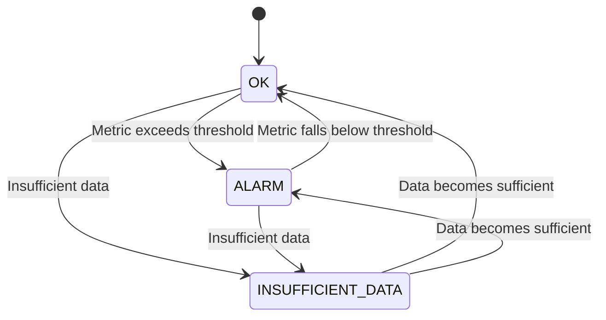

## Introduction to CloudWatch Alarms and Monitoring

### What is CloudWatch?

Amazon CloudWatch is a monitoring service provided by Amazon Web Services (AWS) that provides developers and system operators visibility into their applications, infrastructure, and AWS resources. CloudWatch collects and tracks metrics, collects and monitors log files, and responds to system-wide performance changes, providing you with a unified view of the health of your AWS resources.

### Why Use CloudWatch Alarms?

CloudWatch Alarms allow you to automatically take actions based on the state of your AWS resources. These alarms monitor specific metrics and trigger actions when those metrics cross certain thresholds. This is particularly useful for maintaining the health and performance of your systems, as well as for detecting and responding to issues proactively.

### How CloudWatch Alarms Work

CloudWatch Alarms work by continuously monitoring specified metrics and comparing them against defined thresholds. When a metric crosses a threshold, the alarm transitions to a new state (OK, ALARM, or INSUFFICIENT_DATA). Based on these states, you can configure actions such as sending notifications, stopping or starting instances, or even scaling your resources.



### States of CloudWatch Alarms

- **OK**: The metric is within the defined threshold.
- **ALARM**: The metric has crossed the defined threshold.
- **INSUFFICIENT_DATA**: There is not enough data to determine the state.

#### Understanding INSUFFICIENT_DATA State

The `INSUFFICIENT_DATA` state occurs when CloudWatch does not have enough data points to evaluate the alarm condition. This can happen in several scenarios:

1. **Newly Created Alarms**: When you create a new alarm, it takes some time to gather enough data points to evaluate the alarm condition.
2. **Non-existent Resources**: If the resource being monitored no longer exists, CloudWatch will not be able to collect any data points, leading to an `INSUFFICIENT_DATA` state.
3. **Insufficient Data Collection**: If the metric being monitored does not generate enough data points within the evaluation period, the alarm will remain in the `INSUFFICIENT_DATA` state.

### Example Scenario: Creating a CloudWatch Alarm for an EC2 Instance

Let's walk through the process of creating a CloudWatch Alarm for an EC2 instance. We'll focus on monitoring CPU utilization and setting up an alarm to notify us via email when the CPU usage exceeds a certain threshold.

#### Step-by-Step Guide

1. **Navigate to CloudWatch**:
   - Log in to the AWS Management Console.
   - Navigate to the CloudWatch dashboard.

2. **Create a New Alarm**:
   - Click on "Alarms" in the left-hand menu.
   - Click on "Create Alarm".

3. **Select the Metric**:
   - Choose the metric you want to monitor. For this example, select "EC2" and then "CPUUtilization".
   - Select the specific EC2 instance you want to monitor.

4. **Configure the Alarm**:
   - Set the threshold value. For example, set the alarm to trigger when CPU utilization exceeds 80%.
   - Define the evaluation period. For example, set the evaluation period to 5 minutes.

5. **Set Up Notification**:
   - Click on "Add notification".
   - Choose "Simple Notification Service (SNS)".
   - Create a new SNS topic if one does not already exist.
   - Provide your email address to receive notifications.

6. **Review and Create**:
   - Review the alarm settings.
   - Click on "Create Alarm".

### Full Example with Code

Here is a complete example of creating a CloudWatch Alarm for an EC2 instance using the AWS CLI:

```bash
# Create an SNS Topic
aws sns create-topic --name MyAlarmTopic

# Get the ARN of the SNS Topic
sns_arn=$(aws sns list-topics | jq -r '.Topics[] | select(.TopicArn | contains("MyAlarmTopic")) | .TopicArn')

# Subscribe to the SNS Topic with your email address
aws sns subscribe --topic-arn $sns_arn --protocol email --notification-endpoint your-email@example.com

# Wait for confirmation email and confirm subscription

# Create the CloudWatch Alarm
aws cloudwatch put-metric-alarm \
    --alarm-name HighCPUAlarm \
    --metric-name CPUUtilization \
    --namespace AWS/EC2 \
    --statistic Average \
    --period 300 \
    --evaluation-periods 1 \
    --threshold 80 \
    --comparison-operator GreaterThanThreshold \
    --dimensions Name=InstanceId,Value=i-0123456789abcdef0 \
    --actions-enabled \
    --alarm-actions $sns_arn
```

### Explanation of Each Command

- **Create an SNS Topic**: This creates a new SNS topic to which notifications will be sent.
- **Get the ARN of the SNS Topic**: Retrieves the ARN (Amazon Resource Name) of the newly created SNS topic.
- **Subscribe to the SNS Topic**: Subscribes your email address to the SNS topic.
- **Wait for Confirmation Email**: You need to confirm the subscription by clicking on the link in the confirmation email.
- **Create the CloudWatch Alarm**: Configures the CloudWatch alarm to monitor CPU utilization for a specific EC2 instance and sends notifications to the SNS topic when the threshold is exceeded.

### Common Pitfalls and How to Avoid Them

1. **Incorrect Metric Selection**: Ensure you are selecting the correct metric and dimensions for the resource you want to monitor.
2. **Insufficient Data**: Make sure the metric generates enough data points within the evaluation period to avoid the `INSUFFICIENT_DATA` state.
3. **Notification Configuration**: Ensure that the SNS topic is properly configured and that the subscription is confirmed.

### Real-World Example: Recent Breach Involving CloudWatch Alarms

In a recent breach, an organization failed to properly configure CloudWatch Alarms for their EC2 instances, leading to prolonged periods of high CPU utilization that went unnoticed. This allowed attackers to perform unauthorized activities undetected. Properly configuring CloudWatch Alarms and ensuring timely notifications could have helped detect and mitigate the issue earlier.

### How to Prevent / Defend

#### Detection

- **Regular Monitoring**: Regularly check the state of your CloudWatch Alarms to ensure they are functioning correctly.
- **Log Analysis**: Analyze CloudWatch logs to identify any unusual patterns or behaviors.

#### Prevention

- **Proper Configuration**: Ensure that CloudWatch Alarms are properly configured with appropriate thresholds and evaluation periods.
- **Notification Setup**: Set up notifications to alert you when alarms transition to the `ALARM` state.
- **Secure Coding Practices**: Implement secure coding practices to prevent unauthorized access to your resources.

#### Secure-Coding Fixes

**Vulnerable Code**:
```python
# Vulnerable code snippet
def create_alarm():
    sns_topic = "arn:aws:sns:us-east-1:123456789012:MyAlarmTopic"
    ec2_instance_id = "i-0123456789abcdef0"
    
    # Incorrectly configured alarm
    cloudwatch.put_metric_alarm(
        AlarmName='HighCPUAlarm',
        MetricName='CPUUtilization',
        Namespace='AWS/EC2',
        Statistic='Average',
        Period=300,
        EvaluationPeriods=1,
        Threshold=80,
        ComparisonOperator='GreaterThanThreshold',
        Dimensions=[{'Name': 'InstanceId', 'Value': ec2_instance_id}],
        ActionsEnabled=False,
        AlarmActions=[sns_topic]
    )
```

**Fixed Code**:
```python
# Fixed code snippet
def create_alarm():
    sns_topic = "arn:aws:sns:us-east-1:123456789012:MyAlarmTopic"
    ec2_instance_id = "i-0123456789abcdef0"
    
    # Correctly configured alarm
    cloudwatch.put_metric_alarm(
        AlarmName='HighCPUAlarm',
        MetricName='CPUUtilization',
        Namespace='AWS/EC2',
        Statistic='Average',
        Period=300,
        EvaluationPeriods=1,
        Threshold=80,
        ComparisonOperator='GreaterThanThreshold',
        Dimensions=[{'Name': 'InstanceId', 'Value': ec2_instance_id}],
        ActionsEnabled=True,
        AlarmActions=[sns_topic]
    )
```

### Conclusion

Creating and managing CloudWatch Alarms is crucial for maintaining the health and performance of your AWS resources. By understanding the different states of alarms and how to configure them properly, you can ensure timely detection and response to potential issues. Regular monitoring and proper configuration are key to preventing breaches and maintaining the security of your systems.

### Hands-On Lab Suggestions

For hands-on practice with CloudWatch Alarms and monitoring, consider the following labs:

- **PortSwigger Web Security Academy**: Offers practical exercises on various aspects of web application security, including monitoring and logging.
- **OWASP Juice Shop**: A deliberately insecure web application for security training, which can be used to practice monitoring and logging techniques.
- **DVWA (Damn Vulnerable Web Application)**: Another popular web application for security training, offering scenarios where monitoring and logging are essential.

These labs provide real-world scenarios and practical experience in implementing and managing CloudWatch Alarms effectively.

---
<!-- nav -->
[[DevSecOps/DevSecOps Bootcamp/08-Logging & Incident Response/04-Logging & Monitoring for Security/Create CloudWatch Alarm for EC2 Instance/00-Overview|Overview]] | [[02-Introduction to CloudWatch Alarms for EC2 Instances Part 1|Introduction to CloudWatch Alarms for EC2 Instances Part 1]]
