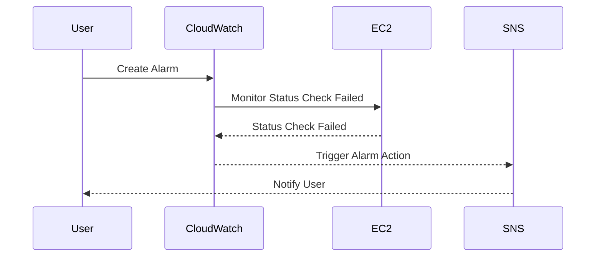

## Introduction to CloudWatch Alarms for EC2 Instances

In the realm of DevSecOps, logging and monitoring are critical components for maintaining the health and security of your infrastructure. One of the key services provided by Amazon Web Services (AWS) for this purpose is Amazon CloudWatch. CloudWatch offers comprehensive monitoring capabilities, including the ability to create alarms based on specific metrics, such as the status of EC2 instances.

### What is CloudWatch?

Amazon CloudWatch is a monitoring service that provides visibility into your AWS resources and applications. You can use CloudWatch to collect and track metrics, gather and inspect log files, and monitor the health and performance of your AWS resources.

#### Key Features of CloudWatch

- **Metrics**: CloudWatch collects and tracks metrics about your AWS resources and the applications you run on AWS.
- **Logs**: CloudWatch Logs enables you to centralize and monitor log data from multiple sources.
- **Alarms**: CloudWatch Alarms enable you to automatically trigger actions based on custom rules when certain conditions are met.

### Why Monitor EC2 Instances?

Monitoring EC2 instances is crucial because it helps you ensure that your instances are running smoothly and securely. By setting up alarms, you can be notified immediately when an issue arises, allowing you to take corrective action before it affects your users or business operations.

#### Common Metrics for EC2 Instances

- **CPU Utilization**: Measures the percentage of CPU time used by the instance.
- **Network In/Out**: Tracks the amount of data transferred over the network.
- **Disk Read/Write**: Monitors the amount of data read from or written to disk.
- **Status Check Failed**: Indicates whether the instance is responsive and accessible.

### Creating a CloudWatch Alarm for EC2 Instance Status Check Failed

Let's walk through the process of creating a CloudWatch alarm specifically for the `status check failed` metric, which indicates that an EC2 instance is not responsive or accessible.

#### Step-by-Step Guide

1. **Identify the Metric**:
   - The metric we are interested in is `status check failed`, which indicates that the instance is not responding to status checks.

2. **Select the Instance**:
   - Choose the EC2 instance ID and name that you want to monitor.

3. **Configure the Alarm**:
   - Set up the alarm with appropriate thresholds and conditions.

#### Detailed Configuration Steps

1. **Navigate to CloudWatch**:
   - Log in to the AWS Management Console and navigate to the CloudWatch dashboard.

2. **Create an Alarm**:
   - Click on "Alarms" in the left-hand menu and then click "Create alarm".

3. **Choose the Metric**:
   - Select the EC2 instance ID and the `status check failed` metric.

4. **Set Conditions**:
   - Define the threshold and period for the alarm. For example, you might set the alarm to trigger if the instance fails status checks for more than 5 minutes.

5. **Configure Actions**:
   - Specify what actions should be taken when the alarm triggers, such as sending an email notification or triggering an automated recovery process.

### Example Code for Creating a CloudWatch Alarm

Here is an example using the AWS CLI to create a CloudWatch alarm for an EC2 instance:

```bash
aws cloudwatch put-metric-alarm \
--alarm-name "EC2InstanceDownAlarm" \
--metric-name "StatusCheckFailed" \
--namespace "AWS/EC2" \
--statistic "Minimum" \
--period 300 \
--threshold 1 \
--comparison-operator GreaterThanThreshold \
--dimensions Name=InstanceId,Value=i-0123456789abcdef0 \
--evaluation-periods 2 \
--alarm-actions arn:aws:sns:us-east-1:123456789012:my-topic
```

### Explanation of Each Parameter

- **--alarm-name**: The name of the alarm.
- **--metric-name**: The metric to monitor (`StatusCheckFailed`).
- **--namespace**: The namespace for the metric (`AWS/EC2`).
- **--statistic**: The statistic to apply to the metric (`Minimum`).
- **--period**: The period over which to evaluate the metric (in seconds, e.g., 300 seconds = 5 minutes).
- **--threshold**: The value at which the alarm should trigger.
- **--comparison-operator**: The comparison operator to use (`GreaterThanThreshold`).
- **--dimensions**: The dimensions for the metric (instance ID).
- **--evaluation-periods**: The number of periods over which the alarm should be evaluated.
- **--alarm-actions**: The actions to take when the alarm triggers (e.g., an SNS topic).

### Mermaid Diagram for CloudWatch Alarm Flow



### Real-World Examples and Recent Breaches

Recent breaches often involve misconfigured or unmonitored EC2 instances. For example, in a breach involving a large financial institution, an unmonitored EC2 instance was exploited due to a lack of proper monitoring and alerting mechanisms. This led to unauthorized access and data exfiltration.

### How to Prevent / Defend

#### Detection

- **Regular Monitoring**: Continuously monitor the status of your EC2 instances using CloudWatch.
- **Automated Alerts**: Set up automated alerts for critical metrics like `status check failed`.

#### Prevention

- **Secure Configurations**: Ensure that your EC2 instances are configured securely, with proper IAM roles and security groups.
- **Regular Audits**: Conduct regular audits of your EC2 instances to identify and mitigate potential vulnerabilities.

#### Secure Coding Fixes

**Vulnerable Code Example**:
```yaml
Resources:
  MyEC2Instance:
    Type: "AWS::EC2::Instance"
    Properties:
      ImageId: "ami-0c55b159cbfafe1f0"
      InstanceType: "t2.micro"
      SecurityGroupIds:
        - "sg-0123456789abcdef0"
```

**Secure Code Example**:
```yaml
Resources:
  MyEC2Instance:
    Type: "AWS::EC2::Instance"
    Properties:
      ImageId: "ami-0c55b159cbfafe1f0"
      InstanceType: "t2.micro"
      SecurityGroupIds:
        - "sg-0123456789abcdef0"
      Tags:
        - Key: "Name", Value: "MySecureInstance"
      Monitoring: true
```

### Conclusion

Creating a CloudWatch alarm for EC2 instance status checks is a fundamental step in ensuring the health and security of your AWS infrastructure. By following the steps outlined above and implementing robust monitoring and alerting mechanisms, you can proactively manage and protect your EC2 instances.

### Practice Labs

For hands-on practice with CloudWatch and EC2 monitoring, consider the following labs:

- **CloudGoat**: A series of labs designed to help you understand and secure various AWS services, including CloudWatch and EC2.
- **flaws.cloud**: A platform that simulates real-world security scenarios, including monitoring and alerting for EC2 instances.

By engaging with these labs, you can gain practical experience and deepen your understanding of how to effectively monitor and secure your AWS infrastructure.

---
<!-- nav -->
[[02-Introduction to CloudWatch Alarms for EC2 Instances Part 1|Introduction to CloudWatch Alarms for EC2 Instances Part 1]] | [[DevSecOps/DevSecOps Bootcamp/08-Logging & Incident Response/04-Logging & Monitoring for Security/Create CloudWatch Alarm for EC2 Instance/00-Overview|Overview]] | [[04-Introduction to CloudWatch and Metrics|Introduction to CloudWatch and Metrics]]
