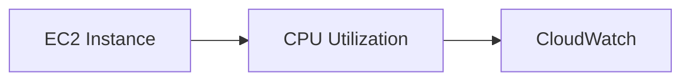
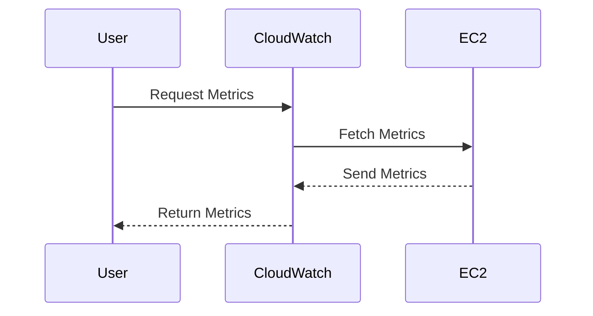
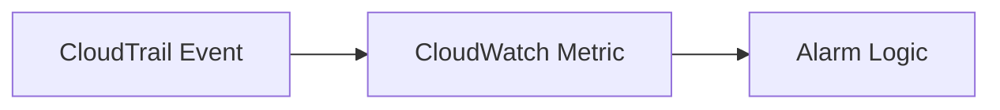
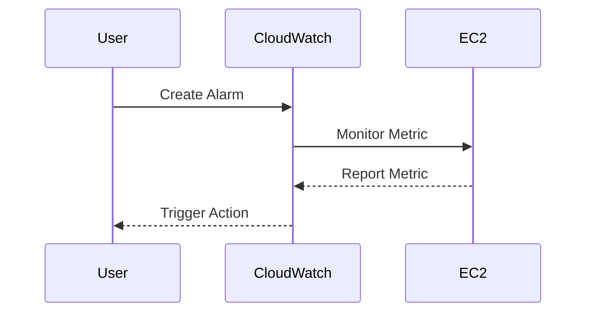
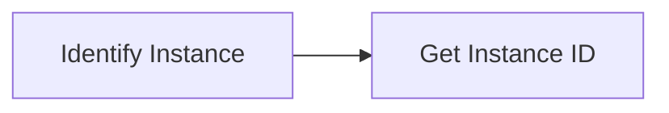
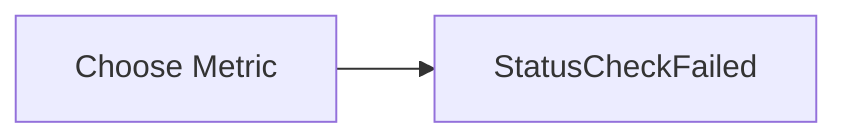
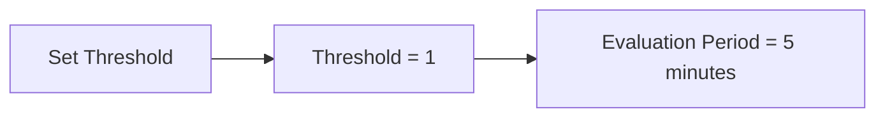
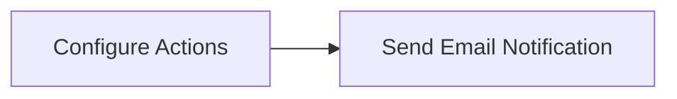
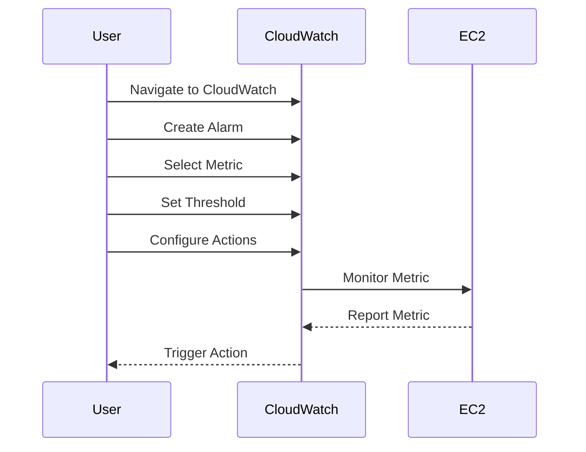

## Introduction to CloudWatch and Metrics

CloudWatch is a monitoring service provided by Amazon Web Services (AWS) that collects and tracks metrics, and enables alarms and notifications. It is essential for maintaining the health and performance of your AWS resources. One of the key concepts in CloudWatch is **metrics**. Metrics are numerical values that represent the state of a system at a particular time. They are used to monitor various aspects of your AWS resources, such as CPU usage, disk space, network traffic, and more.

### What Are Metrics?

Metrics are quantitative measurements that describe the behavior of a system. In the context of CloudWatch, metrics are collected from various AWS services and custom sources. These metrics can be used to monitor the performance and health of your resources, and to trigger actions based on predefined conditions.

#### Example: CPU Utilization Metric

Consider the CPU utilization metric for an EC2 instance. This metric measures the percentage of CPU time that the instance is using. By monitoring this metric, you can ensure that your instance is not overloaded and is performing optimally.



### Why Metrics Matter

Metrics are crucial for several reasons:

1. **Performance Monitoring**: Metrics help you understand the performance of your resources. For example, high CPU utilization might indicate that your instance needs more processing power.
   
2. **Health Monitoring**: Metrics can also indicate the health of your resources. For instance, a sudden spike in error rates might signal a problem with your application.

3. **Troubleshooting**: Metrics provide valuable data for troubleshooting issues. By analyzing metrics, you can identify the root cause of problems and take corrective action.

4. **Automation**: Metrics can be used to automate actions. For example, you can set up an alarm to automatically scale up your instances when CPU utilization exceeds a certain threshold.

### How Metrics Work

Metrics are collected by CloudWatch from various sources, including AWS services and custom applications. Each metric has a name, dimensions, and a timestamp. Dimensions are key-value pairs that provide additional information about the metric. For example, the `InstanceId` dimension identifies the specific EC2 instance associated with a metric.

#### Example: Collecting Metrics

When an EC2 instance is running, CloudWatch continuously collects metrics such as CPU utilization, network traffic, and disk usage. These metrics are stored in CloudWatch and can be accessed via the AWS Management Console, CLI, or SDKs.



### CloudWatch vs. CloudTrail

While both CloudWatch and CloudTrail are monitoring services, they serve different purposes:

- **CloudWatch**: Focuses on metrics and alarms. It provides real-time monitoring of AWS resources and can trigger actions based on predefined conditions.
  
- **CloudTrail**: Focuses on logging API calls. It records API calls made to AWS services and provides a history of user activity, resource changes, and security events.

### Events vs. Metrics

In CloudTrail, events are recorded API calls. These events provide a detailed log of actions performed on AWS resources. In contrast, metrics in CloudWatch are numerical values that represent the state of a system at a particular time.

#### Example: Event to Metric Conversion

When CloudTrail records an event, such as a change in the state of an EC2 instance, CloudWatch can convert this event into a metric. For example, the event "Instance stopped" can be converted into a metric indicating that the instance is no longer running.



### Creating Alarms Based on Metrics

Alarms in CloudWatch are triggered when a metric crosses a specified threshold. You can define the threshold, the period over which the metric is evaluated, and the actions to be taken when the alarm is triggered.

#### Example: Creating an Alarm for EC2 Instance Down

To create an alarm for an EC2 instance being down, follow these steps:

1. **Select the Instance**: Identify the EC2 instance for which you want to create the alarm.
2. **Choose the Metric**: Select the appropriate metric, such as `StatusCheckFailed`.
3. **Set the Threshold**: Define the threshold value and the evaluation period.
4. **Configure Actions**: Specify the actions to be taken when the alarm is triggered, such as sending an email notification.



### Full Example: Creating an Alarm for EC2 Instance Down

Let's walk through the process of creating an alarm for an EC2 instance being down.

#### Step 1: Identify the Instance

First, identify the EC2 instance for which you want to create the alarm. You can find the instance ID in the AWS Management Console.



#### Step 2: Choose the Metric

Next, choose the appropriate metric. For an EC2 instance being down, you can use the `StatusCheckFailed` metric.



#### Step 3: Set the Threshold

Define the threshold value and the evaluation period. For example, you might set the threshold to 1 and the evaluation period to 5 minutes.



#### Step  4: Configure Actions

Specify the actions to be taken when the alarm is triggered. For example, you might configure the alarm to send an email notification.



#### Complete Example

Here is a complete example of creating an alarm for an EC2 instance being down using the AWS Management Console:

1. **Navigate to CloudWatch**: Open the AWS Management Console and navigate to the CloudWatch dashboard.
2. **Create Alarm**: Click on "Alarms" and then "Create Alarm".
3. **Select Metric**: Choose the `StatusCheckFailed` metric for the EC2 instance.
4. **Set Threshold**: Set the threshold to 1 and the evaluation period to 5 minutes.
5. **Configure Actions**: Add an action to send an email notification when the alarm is triggered.



### Real-World Examples

Real-world examples can help illustrate the importance of monitoring and alarming in CloudWatch. Consider the following scenarios:

#### Example 1: High CPU Utilization

A company noticed that their EC2 instances were experiencing high CPU utilization during peak hours. By setting up an alarm for high CPU utilization, they were able to automatically scale up their instances to handle the increased load.

#### Example 2: Instance Down

Another company experienced unexpected downtime due to an EC2 instance failing. By setting up an alarm for the `StatusCheckFailed` metric, they were notified immediately and were able to quickly recover the instance.

### Common Pitfalls

When working with CloudWatch and metrics, there are several common pitfalls to avoid:

1. **Incorrect Thresholds**: Setting incorrect thresholds can lead to false positives or false negatives. Ensure that your thresholds accurately reflect the desired behavior.
   
2. **Insufficient Monitoring**: Relying solely on CloudWatch for monitoring can leave gaps in your visibility. Consider integrating other monitoring tools to get a comprehensive view of your environment.
   
3. **Action Configuration**: Failing to properly configure actions can result in missed alerts. Ensure that your actions are correctly configured to notify the appropriate stakeholders.

### How to Prevent / Defend

To effectively use CloudWatch and metrics for security, follow these best practices:

1. **Regularly Review Metrics**: Regularly review your metrics to ensure that your resources are performing optimally and to identify potential issues.
   
2. **Properly Configure Alarms**: Properly configure alarms to ensure that you are notified of critical events. Test your alarms regularly to ensure that they are functioning as expected.
   
3. **Integrate with Other Tools**: Integrate CloudWatch with other monitoring and alerting tools to get a comprehensive view of your environment. This can help you identify and respond to issues more quickly.

### Secure Coding Fixes

Here is an example of a secure coding fix for setting up an alarm in CloudWatch:

#### Vulnerable Code

```python
import boto3

cloudwatch = boto3.client('cloudwatch')
response = cloudwatch.put_metric_alarm(
    AlarmName='HighCPUUtilization',
    ComparisonOperator='GreaterThanThreshold',
    EvaluationPeriods=1,
    MetricName='CPUUtilization',
    Namespace='AWS/EC2',
    Period=60,
    Statistic='Average',
    Threshold=70.0,
    ActionsEnabled=False,
    AlarmActions=['arn:aws:sns:us-east-1:123456789012:my-topic'],
    OKActions=[],
    TreatMissingData='notBreaching',
)
```

#### Fixed Code

```python
import boto3

cloudwatch = boto3.client('cloudwatch')
response = cloudwatch.put_metric_alarm(
    AlarmName='HighCPUUtilization',
    ComparisonOperator='GreaterThanThreshold',
    EvaluationPeriods=1,
    MetricName='CPUUtilization',
    Namespace='AWS/EC2',
    Period=60,
    Statistic='Average',
    Threshold=70.0,
    ActionsEnabled=True,
    AlarmActions=['arn:aws:sns:us-east-1:123456789012:my-topic'],
    OKActions=[],
    TreatMissingData='breaching',
)
```

### Conclusion

Logging and monitoring are essential components of DevSecOps. By using CloudWatch and metrics, you can effectively monitor the performance and health of your AWS resources and take proactive actions to ensure their availability and security. By following best practices and avoiding common pitfalls, you can build a robust monitoring and alerting system that helps you maintain the integrity of your environment.

### Practice Labs

For hands-on practice with CloudWatch and metrics, consider the following labs:

- **PortSwigger Web Security Academy**: Offers interactive labs for learning web security concepts.
- **OWASP Juice Shop**: A deliberately insecure web application for practicing web security skills.
- **DVWA (Damn Vulnerable Web Application)**: A PHP/MySQL web application that demonstrates web application vulnerabilities.
- **WebGoat**: An interactive, gamified training application for learning web security.

These labs provide practical experience with monitoring and alerting in a controlled environment, helping you to apply the concepts learned in this chapter.

---
<!-- nav -->
[[03-Introduction to CloudWatch Alarms for EC2 Instances|Introduction to CloudWatch Alarms for EC2 Instances]] | [[DevSecOps/DevSecOps Bootcamp/08-Logging & Incident Response/04-Logging & Monitoring for Security/Create CloudWatch Alarm for EC2 Instance/00-Overview|Overview]] | [[05-Introduction to Logging and Monitoring for Security in DevSecOps Part 1|Introduction to Logging and Monitoring for Security in DevSecOps Part 1]]
