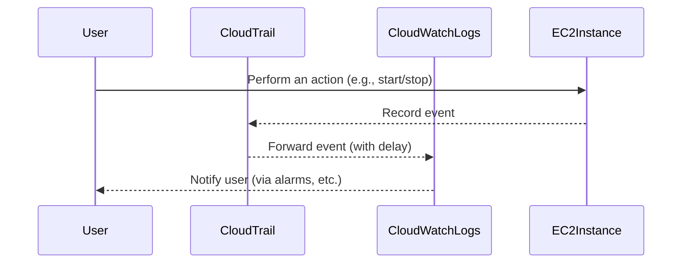

## Introduction to Logging and Monitoring for Security in DevSecOps

In the realm of DevSecOps, logging and monitoring are critical components for ensuring the security and reliability of your systems. This chapter will delve into the specifics of creating CloudWatch Alarms for EC2 instances, covering the underlying concepts, mechanisms, and practical applications. We'll explore how to set up effective logging and monitoring, understand the delays and forwarding processes involved, and learn how to detect and prevent potential security issues.

### Understanding CloudTrail and CloudWatch Logs

**CloudTrail** is a service that enables governance, compliance, operational auditing, and risk auditing of your AWS account. It provides a history of API calls made within your AWS account, including API calls made via the AWS Management Console, AWS SDKs, command-line tools, and other AWS services. 

**CloudWatch Logs** is a fully managed service that enables you to monitor, store, and access log files from your Amazon EC2 instances, AWS CloudTrail, and other sources. CloudWatch Logs makes it easy to centralize and analyze log data to meet the needs of security analysis, operational troubleshooting, monitoring, and compliance.

#### How CloudTrail Events Are Forwarded to CloudWatch Logs

When an event occurs in your AWS environment, CloudTrail captures it and stores it in a log file. These log files are then forwarded to CloudWatch Logs, where they can be monitored and analyzed. However, there is a delay between when an event occurs and when it is recorded in CloudWatch Logs. This delay can range from a few seconds to several minutes, depending on various factors such as network latency and processing times.



### Delays in Event Recording and Forwarding

The delay in recording and forwarding events can be attributed to several factors:

1. **Network Latency**: The time it takes for the event to travel from the EC2 instance to the CloudTrail service.
2. **Processing Time**: The time required for CloudTrail to process and record the event.
3. **Forwarding Time**: The time taken for CloudTrail to forward the event to CloudWatch Logs.

These delays are important to understand because they can affect the timeliness of your monitoring and alerting mechanisms. For example, if you rely on CloudWatch Alarms to notify you of critical events, you need to account for these delays to ensure timely responses.

### Setting Up CloudWatch Alarms for EC2 Instances

To effectively monitor your EC2 instances using CloudWatch Alarms, you need to set up the necessary configurations. Here’s a step-by-step guide:

1. **Enable CloudWatch Metrics for EC2 Instances**:
   Ensure that CloudWatch metrics are enabled for your EC2 instances. This allows CloudWatch to collect and monitor various metrics related to your instances.

2. **Create a CloudWatch Log Group**:
   A CloudWatch Log Group is a collection of log streams that share the same retention, monitoring, and access control settings. You can create a log group specifically for your EC2 instances.

3. **Configure CloudWatch Alarms**:
   Set up CloudWatch Alarms to trigger based on specific conditions. For example, you might want to receive an alarm when the CPU utilization of an EC2 instance exceeds a certain threshold.

Here’s an example of how to create a CloudWatch Alarm for CPU utilization:

```yaml
# Example CloudFormation template for creating a CloudWatch Alarm
Resources:
  EC2InstanceCPUAlarm:
    Type: 'AWS::CloudWatch::Alarm'
    Properties:
      AlarmName: 'HighCPUUtilization'
      ComparisonOperator: 'GreaterThanThreshold'
      EvaluationPeriods: '1'
      MetricName: 'CPUUtilization'
      Namespace: 'AWS/EC2'
      Period: '300'
      Statistic: 'Average'
      Threshold: '70'
      ActionsEnabled: 'true'
      AlarmActions:
        - !Ref SNSAlarmTopic
      Dimensions:
        - Name: 'InstanceId'
          Value: !Ref EC2Instance
```

### Monitoring and Analyzing CloudWatch Logs

Once your CloudWatch Logs are set up, you can monitor and analyze the logs to gain insights into the behavior of your EC2 instances. Here’s how you can do it:

1. **View Log Streams**:
   In the CloudWatch console, navigate to the log group associated with your EC2 instances. You can view individual log streams to see the events recorded by CloudTrail.

2. **Query Logs Using CloudWatch Logs Insights**:
   CloudWatch Logs Insights allows you to query and analyze your log data using a SQL-like syntax. This can help you identify patterns and anomalies in your log data.

Here’s an example of a CloudWatch Logs Insights query:

```sql
fields @timestamp, @message
| sort @timestamp desc
| limit 20
```

This query retrieves the latest 20 log entries and sorts them by timestamp in descending order.

### Detecting and Preventing Security Issues

#### Common Pitfalls and Security Risks

1. **Delayed Alerts**: Due to the inherent delays in event recording and forwarding, there may be a lag between when an issue occurs and when you are alerted about it.
2. **Incomplete Log Data**: If log forwarding fails or is delayed, you may miss critical events, leading to incomplete visibility into your system’s behavior.
3. **Misconfigured Alarms**: Incorrectly configured CloudWatch Alarms can lead to false positives or missed alerts, compromising your ability to respond to security incidents.

#### How to Prevent / Defend

1. **Ensure Timely Logging and Forwarding**:
   Regularly check the status of your CloudTrail events and CloudWatch Logs to ensure that events are being recorded and forwarded in a timely manner. Use CloudWatch Alarms to monitor the health of your logging infrastructure.

2. **Secure Configuration**:
   Securely configure your CloudWatch Alarms and CloudTrail settings to minimize the risk of misconfiguration. Use IAM roles and policies to restrict access to sensitive information.

3. **Regular Audits and Reviews**:
   Conduct regular audits and reviews of your logging and monitoring configurations to ensure they remain effective and up-to-date. Use tools like AWS Config to automate compliance checks.

Here’s an example of a secure configuration for CloudTrail:

```json
{
  "Version": "2012-10-17",
  "Statement": [
    {
      "Sid": "AllowCloudTrailAccess",
      "Effect": "Allow",
      "Action": [
        "cloudtrail:GetTrailStatus",
        "cloudtrail:LookupEvents"
      ],
      "Resource": "*"
    }
  ]
}
```

This policy grants the necessary permissions to access CloudTrail events while restricting access to other actions.

### Real-World Examples and Recent Breaches

Recent breaches and vulnerabilities often highlight the importance of effective logging and monitoring. For example, the Capital One breach in 2019 exposed sensitive customer data due to a misconfigured web application firewall. Effective logging and monitoring could have helped detect and mitigate the breach earlier.

### Hands-On Practice Labs

For hands-on practice, consider the following labs:

- **PortSwigger Web Security Academy**: Offers a comprehensive set of labs for learning web security concepts, including logging and monitoring.
- **OWASP Juice Shop**: A deliberately insecure web application for practicing web security skills.
- **DVWA (Damn Vulnerable Web Application)**: Another popular web application for learning web security.

These labs provide practical experience in setting up and managing logging and monitoring systems, helping you apply the concepts learned in this chapter.

### Conclusion

Effective logging and monitoring are crucial for maintaining the security and reliability of your systems in a DevSecOps environment. By understanding the underlying concepts, mechanisms, and practical applications, you can set up robust logging and monitoring systems that help you detect and respond to security incidents in a timely manner.

---
<!-- nav -->
[[04-Introduction to CloudWatch and Metrics|Introduction to CloudWatch and Metrics]] | [[DevSecOps/DevSecOps Bootcamp/08-Logging & Incident Response/04-Logging & Monitoring for Security/Create CloudWatch Alarm for EC2 Instance/00-Overview|Overview]] | [[06-Introduction to Logging and Monitoring for Security in DevSecOps|Introduction to Logging and Monitoring for Security in DevSecOps]]
