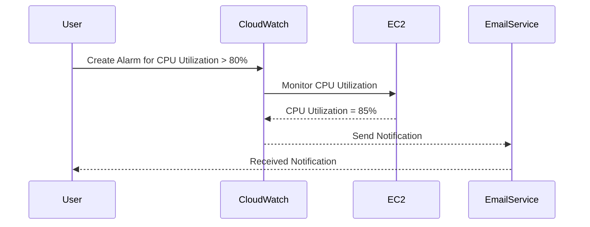

## Introduction to Logging and Monitoring for Security in DevSecOps

In the realm of DevSecOps, logging and monitoring are critical components for ensuring the security and reliability of applications and infrastructure. One specific use case within this domain is creating CloudWatch Alarms for Amazon EC2 instances. This setup allows for proactive management and automated responses to potential issues, thereby enhancing both operational efficiency and security.

### Background Theory

#### What is CloudWatch?

Amazon CloudWatch is a monitoring service provided by AWS that collects and tracks metrics, collects and monitors log files, and responds to system-wide performance changes. It enables users to gain visibility into their AWS resources and applications, and helps them maintain and troubleshoot their systems.

#### Why Use CloudWatch Alarms?

CloudWatch Alarms monitor CloudWatch metrics and notify you when those metrics exceed the thresholds you define. They can also automatically adjust your resources based on predefined actions. This is particularly useful for maintaining the availability and performance of your applications.

### Configuring a CloudWatch Alarm for an EC2 Instance

Let's delve into the process of setting up a CloudWatch Alarm for an EC2 instance. This involves several steps, including defining the metric, setting the threshold, configuring notifications, and optionally automating actions.

#### Step-by-Step Configuration

1. **Define the Metric**: The first step is to choose the metric that you want to monitor. Common metrics for EC2 instances include CPU utilization, network traffic, disk usage, etc.

2. **Set the Threshold**: Next, you need to set the threshold value that triggers the alarm. This value should be chosen based on the normal operating parameters of your instance.

3. **Configure Notifications**: Once the threshold is exceeded, you can configure CloudWatch to send notifications via email, SMS, or other methods. This allows you to be alerted immediately when an issue arises.

4. **Automate Actions**: Optionally, you can configure CloudWatch to perform automated actions when the alarm is triggered. These actions could include restarting the instance, recreating it, or executing custom scripts.

### Detailed Example: Creating a CloudWatch Alarm for an EC2 Instance

#### Setting Up the Alarm

To create a CloudWatch Alarm for an EC2 instance, follow these detailed steps:

1. **Log into the AWS Management Console**:
    - Navigate to the CloudWatch dashboard.
    - Click on "Alarms" in the left-hand menu.

2. **Create a New Alarm**:
    - Click on "Create Alarm".
    - Choose the metric you want to monitor. For this example, let's choose "CPU Utilization".

3. **Configure the Alarm Settings**:
    - Set the threshold value. For instance, you might set the threshold to trigger when CPU utilization exceeds 80%.
    - Define the evaluation period and the number of data points that must be breaching the threshold to trigger the alarm.

4. **Add Notification Actions**:
    - Add a notification action to send an email to a specified address when the alarm is triggered.
    - Optionally, you can add additional actions such as sending an SMS or triggering an SNS topic.

5. **Review and Create**:
    - Review the settings and click "Create Alarm".



### Real-World Examples and Recent Breaches

#### Example: AWS EC2 Instance Outage

In a recent incident, a company experienced an unexpected outage of one of its EC2 instances due to high CPU utilization. Without proper monitoring and alarms, the issue went unnoticed until customers started reporting problems. By implementing CloudWatch Alarms, the company could have been alerted immediately and taken corrective action, minimizing downtime and customer impact.

### Pitfalls and Common Mistakes

1. **Incorrect Threshold Values**: Setting thresholds too low or too high can lead to false positives or missed alerts.
2. **Insufficient Data Points**: Not having enough data points to evaluate the threshold can result in inaccurate alarms.
3. **Overlooking Automated Actions**: Relying solely on notifications without setting up automated actions can delay resolution of issues.

### How to Prevent / Defend

#### Detection

- **Regularly Review Alarms**: Ensure that all configured alarms are functioning correctly and that thresholds are appropriate.
- **Use CloudTrail**: Enable AWS CloudTrail to log API calls and user activity, which can help in detecting unauthorized access or suspicious activities.

#### Prevention

- **Secure Access**: Use IAM roles and policies to restrict access to CloudWatch and EC2 resources.
- **Automated Recovery**: Configure automated actions to recover from common issues like high CPU utilization or disk space exhaustion.

#### Secure Coding Fixes

Here’s an example of how to configure a CloudWatch Alarm using the AWS SDK for Python (Boto3):

```python
import boto3

cloudwatch = boto3.client('cloudwatch')

response = cloudwatch.put_metric_alarm(
    AlarmName='EC2InstanceDown',
    ComparisonOperator='GreaterThanThreshold',
    EvaluationPeriods=1,
    MetricName='CPUUtilization',
    Namespace='AWS/EC2',
    Period=60,
    Statistic='Average',
    Threshold=80.0,
    ActionsEnabled=True,
    AlarmActions=[
        'arn:aws:sns:us-east-1:123456789012:MyTopic'
    ],
    OKActions=[
        'arn:aws:sns:us-east-1:123456789012:MyTopic'
    ],
    InsufficientDataActions=[
        'arn:aws:sns:us-east-1:123456789012:MyTopic'
    ],
    Dimensions=[
        {
            'Name': 'InstanceId',
            'Value': 'i-0abcdef1234567890'
        },
    ]
)

print(response)
```

#### Configuration Hardening

- **IAM Policies**: Restrict access to CloudWatch and EC2 resources using IAM policies.
- **Security Groups**: Ensure that security groups are properly configured to allow only necessary traffic.

### Conclusion

By setting up CloudWatch Alarms for EC2 instances, you can proactively manage and respond to potential issues, enhancing both the reliability and security of your applications. Proper configuration, regular reviews, and automated recovery actions are key to effective monitoring and management.

### Practice Labs

For hands-on practice, consider the following labs:

- **PortSwigger Web Security Academy**: Offers practical exercises related to web application security.
- **OWASP Juice Shop**: A deliberately insecure web application for practicing security skills.
- **DVWA (Damn Vulnerable Web Application)**: Another popular platform for learning web security.

These labs provide a comprehensive environment to apply the concepts learned in this chapter.

---
<!-- nav -->
[[05-Introduction to Logging and Monitoring for Security in DevSecOps Part 1|Introduction to Logging and Monitoring for Security in DevSecOps Part 1]] | [[DevSecOps/DevSecOps Bootcamp/08-Logging & Incident Response/04-Logging & Monitoring for Security/Create CloudWatch Alarm for EC2 Instance/00-Overview|Overview]] | [[07-Introduction to Logging and Monitoring for Security Part 1|Introduction to Logging and Monitoring for Security Part 1]]
