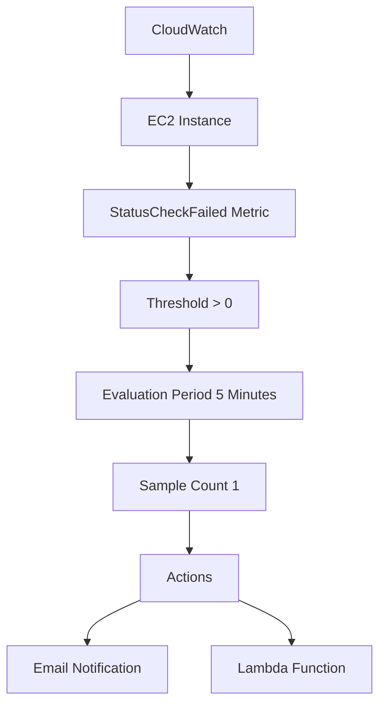

## Introduction to Logging and Monitoring for Security

Logging and monitoring are critical components of DevSecOps, enabling teams to detect and respond to security incidents promptly. One of the key tools in the AWS ecosystem for monitoring is Amazon CloudWatch, which provides comprehensive logging and monitoring capabilities for AWS resources, including EC2 instances. This chapter focuses on creating a CloudWatch alarm for an EC2 instance, explaining the underlying concepts, configurations, and practical applications.

### Background Theory

Before diving into the specifics of setting up a CloudWatch alarm, it’s essential to understand the fundamental concepts of logging and monitoring:

#### Logging
Logging involves recording events that occur within a system. These logs provide valuable insights into the behavior of the system, helping diagnose issues and track security incidents. Logs can be categorized into different types:

- **Application Logs**: Logs generated by applications, such as errors, warnings, and informational messages.
- **System Logs**: Logs generated by the operating system, including boot-up sequences, kernel messages, and user activities.
- **Security Logs**: Logs related to security events, such as authentication attempts, access control violations, and intrusion attempts.

#### Monitoring
Monitoring involves continuously observing and analyzing the performance and health of a system. Key aspects of monitoring include:

- **Metrics**: Quantitative data points that represent the state of a system, such as CPU usage, memory consumption, and network traffic.
- **Alarms**: Automated notifications triggered when specific conditions are met, such as exceeding a threshold or detecting an anomaly.

### Amazon CloudWatch Overview

Amazon CloudWatch is a monitoring service provided by AWS that collects and tracks metrics, collects and monitors log files, and responds to system-wide performance changes. CloudWatch provides the following features:

- **Metric Collection**: Collects and stores metrics from AWS services, applications, and custom sources.
- **Log Management**: Manages and analyzes log files from various sources.
- **Alarm Configuration**: Configures alarms based on specific conditions and triggers actions when those conditions are met.

### Setting Up a CloudWatch Alarm for an EC2 Instance

In this section, we will walk through the process of creating a CloudWatch alarm for an EC2 instance, specifically focusing on the `Status Check Failed` metric.

#### Step-by-Step Configuration

1. **Identify the Metric**:
   - The `Status Check Failed` metric indicates that the instance is experiencing issues. This metric can be further broken down into two types:
     - **Instance Status Check**: Checks the health of the instance itself.
     - **System Status Check**: Checks the health of the underlying hardware.

2. **Define the Threshold**:
   - The threshold defines the condition that triggers the alarm. For the `Status Check Failed` metric, we typically set the threshold to `greater than zero`, meaning the alarm should trigger if the instance fails any status checks.

3. **Configure Evaluation Periods**:
   - Evaluation periods determine how often CloudWatch checks the metric against the threshold. For example, setting the evaluation period to `5 minutes` means CloudWatch will check the metric every 5 minutes.

4. **Set the Sample Count**:
   - The sample count specifies the number of data points that must meet the threshold within the evaluation period. For instance, if the sample count is set to `1`, the alarm will trigger if the instance fails any status checks at least once during the evaluation period.

5. **Configure Actions**:
   - Actions define what happens when the alarm is triggered. Common actions include sending notifications via email, SMS, or SNS topics, and executing Lambda functions.

#### Detailed Configuration Example

Let's go through a detailed example of configuring a CloudWatch alarm for an EC2 instance using the AWS Management Console.

1. **Navigate to CloudWatch**:
   - Log in to the AWS Management Console and navigate to the CloudWatch dashboard.

2. **Create an Alarm**:
   - Click on `Alarms` in the left-hand menu and then click on `Create Alarm`.

3. **Select the Metric**:
   - Choose the `EC2` namespace and select the `StatusCheckFailed` metric.
   - Select the specific EC2 instance you want to monitor.

4. **Define the Threshold**:
   - Set the threshold to `greater than zero`.
   - Set the evaluation period to `5 minutes`.
   - Set the sample count to `1`.

5. **Configure Actions**:
   - Define the actions to take when the alarm is triggered. For example, you can send an email notification or execute a Lambda function.

6. **Review and Create**:
   - Review the configuration details and click on `Create Alarm`.

#### Complete Configuration Code Example

Here is a complete example of configuring a CloudWatch alarm using the AWS CLI:

```bash
aws cloudwatch put-metric-alarm \
--alarm-name "EC2-StatusCheckFailed-Alarm" \
--metric-name StatusCheckFailed \
--namespace AWS/EC2 \
--statistic Sum \
--period 300 \
--threshold 1 \
--comparison-operator GreaterThanThreshold \
--dimensions Name=InstanceId,Value=i-0123456789abcdef0 \
--evaluation-periods 1 \
--alarm-actions arn:aws:sns:us-west-2:123456789012:my-topic
```

### Diagramming the Configuration

To better visualize the configuration, let's use a Mermaid diagram:



### Real-World Examples and Recent Breaches

Recent breaches and vulnerabilities often involve misconfigured monitoring systems, leading to delayed detection of security incidents. For example, the Capital One breach in 2019 was partly due to inadequate monitoring and logging practices. Ensuring proper monitoring and logging configurations can help detect and mitigate such incidents.

### Pitfalls and Common Mistakes

When setting up CloudWatch alarms, common pitfalls include:

- **Incorrect Threshold Values**: Setting thresholds too high or too low can lead to false positives or missed alerts.
- **Insufficient Evaluation Periods**: Short evaluation periods can result in frequent false alarms, while long periods can delay detection.
- **Missing Actions**: Not defining appropriate actions can render the alarm ineffective.

### How to Prevent / Defend

To ensure robust monitoring and logging, follow these best practices:

1. **Regularly Review Alarms**:
   - Periodically review and update your CloudWatch alarms to ensure they remain effective.
   
2. **Use Centralized Logging**:
   - Centralize logs using services like AWS CloudTrail and AWS CloudWatch Logs to gain a holistic view of your environment.
   
3. **Implement Secure Configurations**:
   - Use secure configurations for your CloudWatch alarms, ensuring that sensitive information is protected.
   
4. **Automate Responses**:
   - Automate responses to alarms using Lambda functions or other automated tools to quickly address issues.

### Secure Coding Fixes

Here is an example of a vulnerable configuration and its secure counterpart:

#### Vulnerable Configuration

```yaml
# Vulnerable CloudWatch Alarm Configuration
---
Resources:
  EC2StatusCheckFailedAlarm:
    Type: 'AWS::CloudWatch::Alarm'
    Properties:
      AlarmName: 'EC2-StatusCheckFailed-Alarm'
      ComparisonOperator: 'GreaterThanThreshold'
      EvaluationPeriods: '1'
      MetricName: 'StatusCheckFailed'
      Namespace: 'AWS/EC2'
      Period: '300'
      Statistic: 'Sum'
      Threshold: '1'
      Dimensions:
        - Name: 'InstanceId'
          Value: 'i-0123456789abcdef0'
      AlarmActions:
        - 'arn:aws:sns:us-west-2:123456789012:my-topic'
```

#### Secure Configuration

```yaml
# Secure CloudWatch Alarm Configuration
---
Resources:
  EC2StatusCheckFailedAlarm:
    Type: 'AWS::CloudWatch::Alarm'
    Properties:
      AlarmName: 'EC2-StatusCheckFailed-Alarm'
      ComparisonOperator: 'GreaterThanThreshold'
      EvaluationPeriods: '2'
      MetricName: 'StatusCheckFailed'
      Namespace: 'AWS/EC2'
      Period: '300'
      Statistic: 'Sum'
      Threshold: '1'
      Dimensions:
        - Name: 'InstanceId'
          Value: 'i-0123456789abcdef0'
      AlarmActions:
        - 'arn:aws:sns:us-west-2:123456789012:my-topic'
      InsufficientDataActions:
        - 'arn:aws:sns:us-west-2:123456789012:my-topic'
      OKActions:
        - 'arn:aws:sns:us-west-2:123456789012:my-topic'
```

### Hands-On Labs

For hands-on practice, consider the following labs:

- **PortSwigger Web Security Academy**: Offers a variety of labs focused on web application security, including logging and monitoring.
- **OWASP Juice Shop**: Provides a vulnerable web application for practicing security testing and monitoring.
- **CloudGoat**: A cloud security training platform that includes exercises for setting up and securing CloudWatch alarms.

By thoroughly understanding and implementing these concepts, you can significantly enhance the security posture of your DevSecOps environment.

---
<!-- nav -->
[[06-Introduction to Logging and Monitoring for Security in DevSecOps|Introduction to Logging and Monitoring for Security in DevSecOps]] | [[DevSecOps/DevSecOps Bootcamp/08-Logging & Incident Response/04-Logging & Monitoring for Security/Create CloudWatch Alarm for EC2 Instance/00-Overview|Overview]] | [[08-Introduction to Logging and Monitoring for Security Part 2|Introduction to Logging and Monitoring for Security Part 2]]
