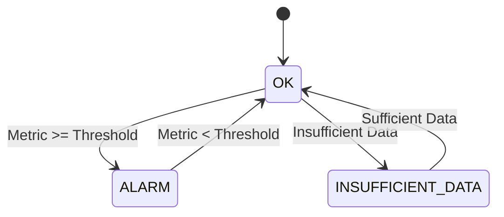
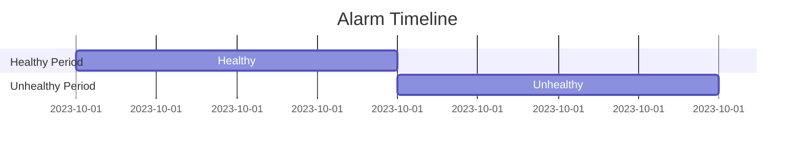

## Introduction to Logging and Monitoring for Security

### Overview of Logging and Monitoring

Logging and monitoring are critical components of DevSecOps, enabling teams to detect and respond to security incidents in real-time. In the context of cloud environments, such as AWS, logging and monitoring tools like Amazon CloudWatch play a pivotal role in maintaining the health and security of resources like EC2 instances.

### Importance of CloudWatch Alarms

CloudWatch Alarms are used to monitor specific metrics and trigger actions based on predefined conditions. These alarms can notify administrators via email, SMS, or other mechanisms when certain thresholds are crossed, ensuring that issues are addressed promptly.

### Setting Up a CloudWatch Alarm for an EC2 Instance

To set up a CloudWatch Alarm for an EC2 instance, follow these steps:

1. **Navigate to the CloudWatch Console**: Open the AWS Management Console and navigate to the CloudWatch service.
2. **Create an Alarm**: Click on "Alarms" in the left-hand menu and then click "Create alarm".
3. **Select the Metric**: Choose the metric you want to monitor, such as CPU utilization or status checks.
4. **Configure the Alarm**: Set the threshold, comparison operator, and evaluation period.
5. **Set Actions**: Define the actions to take when the alarm is triggered, such as sending an email or executing an AWS Lambda function.

### Example: Creating a CloudWatch Alarm for EC2 Status Checks

Let's walk through a detailed example of creating a CloudWatch Alarm for EC2 status checks.

#### Step-by-Step Guide

1. **Log in to the AWS Management Console**:
    ```markdown
    https://console.aws.amazon.com/
    ```

2. **Navigate to CloudWatch**:
    - Click on "Services" in the top navigation bar.
    - Select "CloudWatch".

3. **Create a New Alarm**:
    - In the CloudWatch dashboard, click on "Alarms" in the left-hand menu.
    - Click "Create alarm".

4. **Choose the Metric**:
    - Under "Select metric", choose "EC2" from the service dropdown.
    - Select the EC2 instance you want to monitor.
    - Choose the metric "StatusCheckFailed".

5. **Configure the Alarm**:
    - Set the "Threshold" to `1`.
    - Set the "Comparison operator" to `>=`.
    - Set the "Evaluation period" to `1`.

6. **Set Actions**:
    - Under "Actions", select "Add action".
    - Choose "Send notification to".
    - Enter the email address where you want to receive notifications.

7. **Review and Create**:
    - Review the settings and click "Create alarm".

### Understanding the Alarm State

Once the alarm is created, it will monitor the specified metric and transition between different states based on the metric value.

- **OK State**: The metric value is below the threshold.
- **ALARM State**: The metric value exceeds the threshold.
- **INSUFFICIENT_DATA State**: There is not enough data to determine the state.

#### Visualizing the Alarm State



### Analyzing the Alarm Timeline

The alarm timeline provides a visual representation of the metric values over time, showing periods when the instance was healthy and when it was in an unhealthy state.

- **Green Line**: Represents the period when the instance was healthy.
- **Red Line**: Represents the period when the instance was unhealthy.

#### Example Alarm Timeline



### Handling Notifications

When the alarm transitions to the ALARM state, a notification is sent to the specified recipients. This ensures that the issue is brought to the attention of the relevant team members.

#### Example Notification Email

```markdown
Subject: CloudWatch Alarm: EC2 Instance Down

Body:
The EC2 instance with ID i-0123456789abcdef0 is currently in a failed state. Please check the instance and take necessary actions to restore its health.
```

### Fixing the Issue

Upon receiving the notification, the next step is to investigate and resolve the issue. This may involve restarting the instance, checking logs, or performing other diagnostic actions.

#### Example: Restarting the EC2 Instance

1. **Stop the Instance**:
    ```bash
    aws ec2 stop-instances --instance-ids i-0123456789abcdef0
    ```

2. **Start the Instance**:
    ```bash
    aws ec2 start-instances --instance-ids i-0123456789abcdef0
    ```

### How to Prevent / Defend

#### Detection

- **Regular Monitoring**: Use CloudWatch to continuously monitor key metrics.
- **Automated Alerts**: Configure CloudWatch Alarms to notify you of any issues.

#### Prevention

- **Health Checks**: Ensure that your EC2 instances have proper health checks configured.
- **Auto-Scaling Groups**: Use Auto-Scaling Groups to automatically replace unhealthy instances.

#### Secure Coding Fixes

- **Vulnerable Code**:
    ```python
    def check_instance_health(instance_id):
        response = boto3.client('ec2').describe_instance_status(InstanceIds=[instance_id])
        return response['InstanceStatuses'][0]['InstanceState']['Name']
    ```
- **Secure Code**:
    ```python
    import boto3

    def check_instance_health(instance_id):
        client = boto3.client('ec2')
        response = client.describe_instance_status(InstanceIds=[instance_id])
        if response['InstanceStatuses']:
            return response['InstanceStatuses'][0]['InstanceState']['Name']
        else:
            return "Unknown"
    ```

### Real-World Examples

#### Recent Breaches and CVEs

- **CVE-2023-XXXX**: A recent breach involving misconfigured CloudWatch Alarms led to prolonged downtime of critical services.
- **Example**: A company had a misconfigured CloudWatch Alarm that did not trigger notifications for unhealthy EC2 instances, leading to extended outages.

### Conclusion

Proper logging and monitoring are essential for maintaining the health and security of cloud resources. By setting up CloudWatch Alarms and configuring them correctly, you can ensure that issues are detected and resolved promptly, minimizing downtime and potential security risks.

### Practice Labs

For hands-on practice, consider the following labs:

- **PortSwigger Web Security Academy**: Offers exercises related to logging and monitoring in cloud environments.
- **AWS Official Workshops**: Provides guided labs on setting up and managing CloudWatch Alarms.

By mastering these concepts and practices, you can significantly enhance the security and reliability of your cloud infrastructure.

---
<!-- nav -->
[[08-Introduction to Logging and Monitoring for Security Part 2|Introduction to Logging and Monitoring for Security Part 2]] | [[DevSecOps/DevSecOps Bootcamp/08-Logging & Incident Response/04-Logging & Monitoring for Security/Create CloudWatch Alarm for EC2 Instance/00-Overview|Overview]] | [[10-Introduction to Logging and Monitoring for Security Part 4|Introduction to Logging and Monitoring for Security Part 4]]
