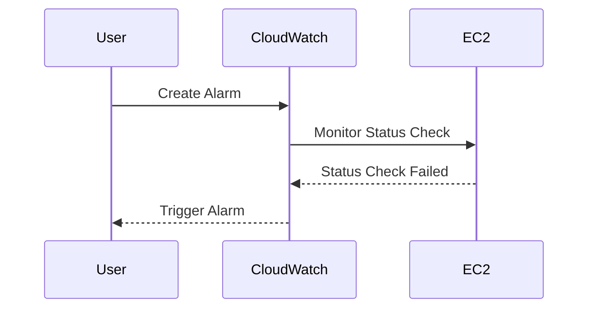

## Introduction to Logging and Monitoring for Security

### Overview of Logging and Monitoring

Logging and monitoring are critical components of DevSecOps practices. They enable teams to track system behavior, detect anomalies, and respond to security incidents promptly. In the context of cloud environments, such as Amazon Web Services (AWS), logging and monitoring tools like CloudWatch provide essential insights into the health and performance of resources.

### Importance of CloudWatch Alarms

CloudWatch Alarms are a key feature of AWS CloudWatch that allows users to set up notifications based on specific metrics. These alarms can trigger actions when certain conditions are met, such as sending an email or invoking an AWS Lambda function. By setting up alarms, you can ensure that your team is alerted immediately when issues arise, allowing for rapid response and mitigation.

### Setting Up a CloudWatch Alarm for an EC2 Instance

To illustrate the process of creating a CloudWatch Alarm for an EC2 instance, let's walk through the steps involved, including the necessary background theory and practical examples.

#### Background Theory

**EC2 Instances**: Elastic Compute Cloud (EC2) instances are virtual servers provided by AWS. They can run various operating systems and applications, making them a fundamental component of cloud infrastructure.

**CloudWatch Metrics**: CloudWatch collects and tracks metrics from AWS resources and custom sources. These metrics provide valuable data points that can be used to monitor the health and performance of your resources.

**Alarms**: CloudWatch Alarms are rules that watch over one or more CloudWatch metrics. When the metric value meets the specified threshold, the alarm enters the `ALARM` state and triggers the configured actions.

#### Step-by-Step Process

1. **Launch an EC2 Instance**: First, launch an EC2 instance using the AWS Management Console or the AWS CLI. Ensure that the instance is configured correctly and is running in a healthy state.

2. **Enable Detailed Monitoring**: By default, EC2 instances are monitored at a 5-minute interval. To enable detailed monitoring, which provides 1-minute intervals, you need to modify the instance settings.

3. **Create a CloudWatch Alarm**: Once the instance is running, you can create a CloudWatch Alarm to monitor specific metrics, such as CPU utilization or status checks.

#### Example: Creating a CloudWatch Alarm for Status Check Failed

Let's create a CloudWatch Alarm that triggers when the status check fails for an EC2 instance.



#### Code Example

Here’s how you can create a CloudWatch Alarm using the AWS CLI:

```bash
aws cloudwatch put-metric-alarm \
    --alarm-name "EC2StatusCheckFailed" \
    --metric-name StatusCheckFailed \
    --namespace AWS/EC2 \
    --statistic Average \
    --period 300 \
    --threshold 1 \
    --comparison-operator GreaterThanThreshold \
    --evaluation-periods 1 \
    --alarm-actions arn:aws:sns:us-east-1:123456789012:my-topic \
    --dimensions Name=InstanceId,Value=i-0123456789abcdef0
```

### Understanding the Alarm History

When an alarm is triggered, CloudWatch records the history of the alarm state transitions. This history is crucial for troubleshooting and understanding the sequence of events leading to the alarm.

#### Example Alarm History

Suppose the EC2 instance experienced a status check failure. The alarm history might look like this:

```plaintext
Time                State Transition
-------------------------------------------------
2023-10-01T12:00:00Z OK -> ALARM
2023-10-01T12:05:00Z ALARM -> OK
```

This indicates that the instance was in an `OK` state until 12:00 PM, when the status check failed, triggering the alarm. At 12:05 PM, the instance recovered, and the alarm transitioned back to the `OK` state.

### Timing Considerations

One important aspect to consider is the timing delay between when an event occurs and when it is recorded in CloudWatch. This delay can vary depending on the type of event and the monitoring interval.

#### Example: Event Logging Delay

For instance, if you create an EC2 instance and then stop and restart it, there will be a delay before these events are recorded in CloudWatch. This delay can range from a few seconds to several minutes, depending on the specific circumstances.

### Real-World Examples and Recent Breaches

Recent breaches and vulnerabilities often highlight the importance of robust logging and monitoring practices. For example, the SolarWinds breach in 2020 demonstrated the critical role of monitoring and alerting in detecting and responding to security incidents.

#### SolarWinds Breach

In the SolarWinds breach, attackers compromised the update mechanism for SolarWinds Orion software, injecting malicious code into legitimate updates. This allowed them to gain access to numerous organizations' networks. Effective logging and monitoring could have helped detect unusual activity and alert security teams to the breach earlier.

### How to Prevent / Defend

#### Detection

To effectively detect issues, ensure that you have comprehensive logging and monitoring in place. Use tools like CloudWatch to monitor key metrics and set up alarms for critical events.

#### Prevention

Preventative measures include configuring detailed monitoring for your EC2 instances and setting up appropriate alarms. Regularly review the logs and alarm histories to identify potential issues before they become critical.

#### Secure Coding Fixes

Compare the vulnerable and secure versions of your code to ensure that you are implementing best practices. For example, ensure that your CloudWatch configurations are correctly set up to monitor and alert on critical metrics.

#### Configuration Hardening

Harden your CloudWatch configurations by ensuring that only authorized users can create and manage alarms. Use IAM policies to restrict permissions and limit exposure to sensitive information.

### Conclusion

By understanding and implementing effective logging and monitoring practices, you can significantly enhance the security and reliability of your cloud infrastructure. CloudWatch Alarms provide a powerful tool for detecting and responding to issues in real-time, helping to maintain the health and performance of your EC2 instances.

### Practice Labs

For hands-on experience with CloudWatch Alarms and EC2 instances, consider the following labs:

- **PortSwigger Web Security Academy**: Offers exercises on securing cloud environments.
- **CloudGoat**: Provides scenarios for practicing cloud security configurations.
- **AWS Official Workshops**: Includes detailed guides and labs for setting up and managing CloudWatch Alarms.

These labs will help you gain practical experience and deepen your understanding of logging and monitoring for security in DevSecOps.

---
<!-- nav -->
[[09-Introduction to Logging and Monitoring for Security Part 3|Introduction to Logging and Monitoring for Security Part 3]] | [[DevSecOps/DevSecOps Bootcamp/08-Logging & Incident Response/04-Logging & Monitoring for Security/Create CloudWatch Alarm for EC2 Instance/00-Overview|Overview]] | [[DevSecOps/DevSecOps Bootcamp/08-Logging & Incident Response/04-Logging & Monitoring for Security/Create CloudWatch Alarm for EC2 Instance/11-Introduction to Logging and Monitoring for Security|Introduction to Logging and Monitoring for Security]]
