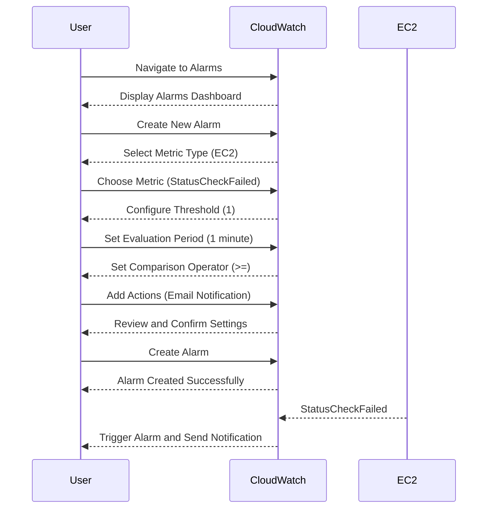

## Introduction to Logging and Monitoring for Security

Logging and monitoring are fundamental practices in DevSecOps that help ensure the security, reliability, and performance of your applications and infrastructure. In the context of cloud environments, such as AWS, these practices become even more critical due to the dynamic nature of cloud resources. One key aspect of monitoring is setting up alarms to notify you when certain conditions occur, such as an EC2 instance going down. This chapter will delve into creating a CloudWatch alarm for an EC2 instance, explaining the concepts, steps, and best practices involved.

### What is CloudWatch?

Amazon CloudWatch is a monitoring service provided by AWS that collects and tracks metrics, collects and monitors log files, and responds to system-wide changes, including changes made to AWS resources and applications. CloudWatch provides you with data and actionable insights to monitor your applications, understand and respond to system-wide performance changes, optimize resource utilization, and get a unified view of operational health.

#### Key Components of CloudWatch

- **Metrics**: Numerical values that are measured over time. Metrics are used to track the performance and health of your resources.
- **Logs**: Detailed records of events that occur within your resources. Logs provide valuable information about the behavior of your applications and services.
- **Alarms**: Automated notifications that trigger when a metric exceeds a specified threshold. Alarms can be configured to send notifications via email, SMS, or other means.

### Why Monitor EC2 Instances?

Monitoring EC2 instances is crucial for several reasons:

- **Availability**: Ensuring that your instances are up and running is essential for maintaining the availability of your applications.
- **Performance**: Monitoring CPU usage, memory usage, and network traffic can help you identify performance bottlenecks and optimize resource allocation.
- **Security**: Monitoring can help detect unauthorized access attempts, unusual activity, and potential security breaches.

### Creating a CloudWatch Alarm for an EC2 Instance

In this section, we will walk through the process of creating a CloudWatch alarm that triggers when an EC2 instance goes down. We will cover the conceptual understanding, step-by-step instructions, and practical examples.

#### Conceptual Understanding

When an EC2 instance goes down, it could be due to various reasons such as:

- **Termination**: The instance was intentionally terminated by an authorized user.
- **Crash**: The instance experienced a hardware or software failure.
- **Deletion**: The instance was deleted accidentally or maliciously.

To proactively manage these situations, we can set up a CloudWatch alarm that notifies us when an EC2 instance is down. This alarm will help us quickly identify and address the issue, ensuring minimal downtime and maintaining the availability of our applications.

#### Step-by-Step Instructions

1. **Navigate to CloudWatch Alarms**:
   - Log in to the AWS Management Console.
   - Navigate to the CloudWatch service.
   - Click on "Alarms" in the left-hand menu.

2. **Create a New Alarm**:
   - Click on the "Create alarm" button.
   - Select the metric type. For EC2 instances, we typically use the "EC2" namespace.
   - Choose the specific metric. For instance availability, we can use the "StatusCheckFailed" metric.

3. **Configure the Alarm**:
   - Set the threshold value. For instance availability, we typically set the threshold to 1, meaning the alarm triggers when the instance is down.
   - Set the evaluation period. This is the duration over which the metric is evaluated. A common value is 1 minute.
   - Set the comparison operator. For instance availability, we typically use "Greater than or equal to".

4. **Add Actions**:
   - Specify the actions to take when the alarm is triggered. This can include sending notifications via email, SMS, or other means.
   - Optionally, you can configure the alarm to trigger additional actions, such as starting a new instance or scaling up the number of instances.

5. **Review and Create**:
   - Review the alarm settings to ensure they meet your requirements.
   - Click on the "Create alarm" button to finalize the setup.

#### Example Configuration

Let's walk through a complete example of creating a CloudWatch alarm for an EC2 instance named `app-server`.



### Full Raw HTTP Message Example

Here is an example of the full HTTP request and response for creating a CloudWatch alarm using the AWS SDK:

```http
POST / HTTP/1.1
Host: monitoring.amazonaws.com
Content-Type: application/x-amz-json-1.1
X-Amz-Target: MonitorControl.CreateAlarm

{
  "AlarmName": "AppServerDown",
  "ComparisonOperator": "GreaterThanThreshold",
  "EvaluationPeriods": 1,
  "MetricName": "StatusCheckFailed",
  "Namespace": "AWS/EC2",
  "Period": 60,
  "Statistic": "SampleCount",
  "Threshold": 1,
  "ActionsEnabled": true,
  "AlarmActions": [
    "arn:aws:sns:us-west-2:123456789012:AppServerDown"
  ],
  "AlarmDescription": "Triggered when the app server EC2 instance is down.",
  "Dimensions": [
    {
      "Name": "InstanceId",
      "Value": "i-0123456789abcdef0"
    }
  ]
}
```

```http
HTTP/1.1 200 OK
Content-Type: application/x-amz-json-1.1

{
  "AlarmArn": "arn:aws:cloudwatch:us-west-2:123456789012:alarm:AppServerDown"
}
```

### How to Prevent / Defend

While CloudWatch alarms are useful for detecting issues, it is also important to implement preventive measures to avoid instances going down in the first place. Here are some best practices:

1. **Automated Backups**: Regularly back up your EC2 instances to prevent data loss in case of a failure.
2. **Auto Scaling Groups**: Use auto-scaling groups to automatically replace unhealthy instances.
3. **Health Checks**: Implement health checks to monitor the status of your instances and automatically terminate unhealthy ones.
4. **Security Policies**: Enforce strict security policies to prevent unauthorized access and accidental deletion of instances.

#### Secure Coding Fixes

Here is an example of how to implement these preventive measures in your infrastructure:

```yaml
# Example CloudFormation Template for Auto Scaling Group
Resources:
  AppServerAutoScalingGroup:
    Type: 'AWS::AutoScaling::AutoScalingGroup'
    Properties:
      LaunchTemplate:
        LaunchTemplateName: !Ref AppServerLaunchTemplate
        Version: '$Latest'
      MinSize: 1
      MaxSize: 3
      DesiredCapacity: 1
      HealthCheckType: 'EC2'
      HealthCheckGracePeriod: 300
      VPCZoneIdentifier:
        - subnet-0123456789abcdef0
        - subnet-0123456789abcdef1
```

### Real-World Examples

Recent breaches and vulnerabilities often highlight the importance of proper logging and monitoring. For example, the Capital One breach in 2019 exposed sensitive customer data due to misconfigured AWS S3 buckets. Proper monitoring and logging could have helped detect and mitigate such issues earlier.

### Common Pitfalls

- **Incorrect Thresholds**: Setting incorrect thresholds can lead to false positives or missed alerts.
- **Insufficient Actions**: Not specifying appropriate actions can result in delayed response times.
- **Overlooking Health Checks**: Failing to implement health checks can lead to prolonged downtime.

### Conclusion

Creating a CloudWatch alarm for an EC2 instance is a crucial step in ensuring the availability and security of your applications. By following the steps outlined in this chapter, you can effectively monitor your instances and proactively manage any issues that arise. Remember to implement preventive measures and regularly review your logging and monitoring configurations to maintain optimal performance and security.

### Practice Labs

For hands-on practice, consider the following labs:

- **CloudGoat**: A series of labs designed to teach cloud security principles using AWS.
- **flaws.cloud**: A platform for learning cloud security by exploiting vulnerabilities in simulated environments.

These labs provide real-world scenarios and challenges to help you master the skills covered in this chapter.

---
<!-- nav -->
[[10-Introduction to Logging and Monitoring for Security Part 4|Introduction to Logging and Monitoring for Security Part 4]] | [[DevSecOps/DevSecOps Bootcamp/08-Logging & Incident Response/04-Logging & Monitoring for Security/Create CloudWatch Alarm for EC2 Instance/00-Overview|Overview]] | [[DevSecOps/DevSecOps Bootcamp/08-Logging & Incident Response/04-Logging & Monitoring for Security/Create CloudWatch Alarm for EC2 Instance/12-Practice Questions & Answers|Practice Questions & Answers]]
