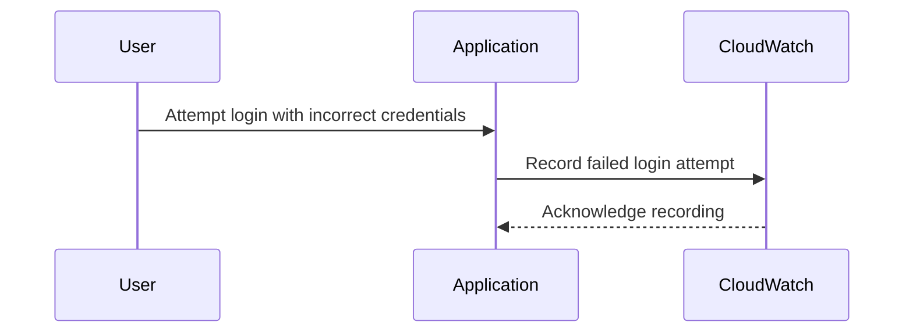
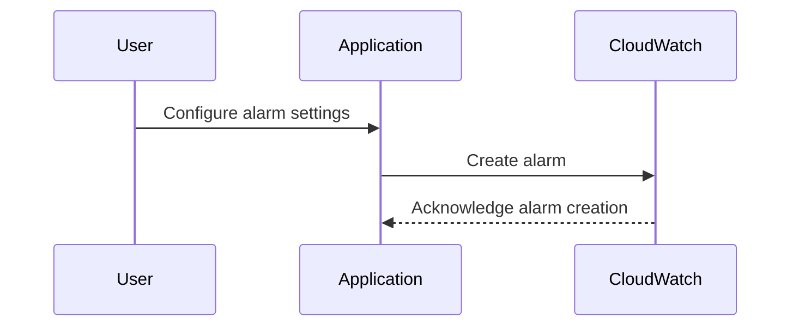

## Introduction to Logging & Monitoring for Security

In the realm of DevSecOps, logging and monitoring play a critical role in ensuring the security and reliability of applications and systems. One specific aspect of this is the creation of custom metric filters for tracking security-related events, such as failed login attempts. This chapter delves into the process of creating a custom metric filter for failed login metrics, explaining the underlying concepts, practical steps, and security implications.

### What Are Custom Metric Filters?

Custom metric filters allow you to define specific criteria for collecting and analyzing data points from your system. In the context of security, these metrics can help identify patterns and anomalies that may indicate malicious activity or system vulnerabilities. For instance, tracking failed login attempts can provide insights into potential brute-force attacks or unauthorized access attempts.

#### Why Track Failed Login Metrics?

Failed login metrics are crucial because they can serve as an early warning system for security incidents. By monitoring these metrics, you can:

- Detect brute-force attacks.
- Identify unauthorized access attempts.
- Monitor user behavior for suspicious activities.
- Implement automated alerts and responses based on threshold violations.

### Creating a Custom Metric Namespace

To begin, you need to create a custom metric namespace. A metric namespace is a container for related metrics. In AWS CloudWatch, for example, you can create a custom namespace to group all your security-related metrics together.

#### Steps to Create a Custom Metric Namespace

1. **Define the Namespace**: Choose a descriptive name for your namespace, such as `LoginMetrics`.
2. **Create the Metric**: Within the namespace, define the specific metric you want to track, such as `FailedLogins`.

Here’s how you can create a custom metric namespace using AWS CloudWatch:

```python
import boto3

cloudwatch = boto3.client('cloudwatch')

# Define the namespace and metric
namespace = 'LoginMetrics'
metric_name = 'FailedLogins'

# Put the custom metric
response = cloudwatch.put_metric_data(
    Namespace=namespace,
    MetricData=[
        {
            'MetricName': metric_name,
            'Dimensions': [
                {
                    'Name': 'User',
                    'Value': 'example_user'
                },
            ],
            'Unit': 'Count',
            'Value': 1
        },
    ]
)
```

### Understanding the Metric Namespace Behavior

When you create a custom metric namespace and metric, it does not automatically appear in the list of available metrics until the metric is actually recorded. This means that you need to generate at least one data point for the metric to become visible.

#### Example Scenario

Let’s say you have created a custom metric namespace `LoginMetrics` and a metric `FailedLogins`. To make this metric visible, you need to record a failed login attempt. Here’s how you can simulate this:

1. **Sign Out from the Account**.
2. **Attempt a Failed Login**: Try to log in with incorrect credentials.
3. **Record the Metric**: Use the `put_metric_data` API call to record the failed login attempt.

```python
# Simulate a failed login attempt
response = cloudwatch.put_metric_data(
    Namespace='LoginMetrics',
    MetricData=[
        {
            'MetricName': 'FailedLogins',
            'Dimensions': [
                {
                    'Name': 'User',
                    'Value': 'example_user'
                },
            ],
            'Unit': 'Count',
            'Value': 1
        },
    ]
)
```

### Viewing the Custom Metric in CloudWatch

Once you have recorded a failed login attempt, you can view the custom metric in the CloudWatch console.

1. **Navigate to CloudWatch**: Go to the AWS Management Console and select CloudWatch.
2. **Select Metrics**: Click on “Metrics” in the left-hand menu.
3. **Filter by Namespace**: Use the search bar to filter by your custom namespace (`LoginMetrics`).

### Creating Alarms Based on Custom Metrics

Alarms in CloudWatch allow you to set up notifications based on specific conditions. You can create an alarm that triggers when the number of failed login attempts exceeds a certain threshold.

#### Steps to Create an Alarm

1. **Define the Alarm**: Set the threshold and the period for the alarm.
2. **Configure Notifications**: Specify the actions to take when the alarm is triggered.

Here’s how you can create an alarm for failed login attempts:

```python
# Create an alarm for failed login attempts
alarm_name = 'HighFailedLoginsAlarm'
alarm_description = 'Triggered when the number of failed login attempts exceeds 5 in 1 minute.'
threshold = 5
period = 60

response = cloudwatch.put_metric_alarm(
    AlarmName=alarm_name,
    ComparisonOperator='GreaterThanThreshold',
    EvaluationPeriods=1,
    MetricName='FailedLogins',
    Namespace='LoginMetrics',
    Period=period,
    Statistic='Sum',
    Threshold=threshold,
    ActionsEnabled=True,
    AlarmActions=['arn:aws:sns:region:account-id:topic-name'],
    Dimensions=[
        {
            'Name': 'User',
            'Value': 'example_user'
        },
    ]
)
```

### Mermaid Diagrams for Visualization

To better understand the flow of creating and monitoring custom metrics, consider the following mermaid diagrams:

#### Sequence Diagram for Recording Metrics



#### Sequence Diagram for Creating Alarms



### Real-World Examples and Recent Breaches

Recent breaches often highlight the importance of monitoring failed login attempts. For instance, the 2021 SolarWinds breach involved attackers leveraging stolen credentials to gain unauthorized access. By monitoring failed login attempts, organizations could have detected and responded to such threats more effectively.

### Common Pitfalls and Best Practices

#### Common Pitfalls

- **Not Recording Initial Data Points**: Remember that custom metrics do not appear until they are recorded at least once.
- **Incorrect Alarm Configuration**: Ensure that alarms are configured with appropriate thresholds and notification actions.
- **Ignoring Dimensionality**: Use dimensions effectively to segment and analyze metrics.

#### Best Practices

- **Regularly Review Metrics**: Continuously monitor and review your metrics to ensure they are capturing the necessary data.
- **Automate Alerting**: Set up automated alerts to respond to threshold violations promptly.
- **Secure Access**: Ensure that only authorized personnel have access to configure and monitor metrics.

### How to Prevent / Defend

#### Detection

- **Monitor Failed Logins**: Regularly check for failed login attempts and investigate any unusual patterns.
- **Use Automated Tools**: Utilize tools like AWS CloudWatch to automate the monitoring and alerting process.

#### Prevention

- **Implement Rate Limiting**: Limit the number of login attempts from a single IP address within a given time frame.
- **Use Multi-Factor Authentication (MFA)**: Require users to provide additional authentication factors to reduce the risk of unauthorized access.

#### Secure Coding Fixes

##### Vulnerable Code Example

```python
def login(user, password):
    if user == 'admin' and password == 'password':
        return True
    else:
        return False
```

##### Secure Code Example

```python
def login(user, password):
    if user == 'admin' and password == 'password':
        return True
    else:
        record_failed_login_attempt(user)
        return False
```

### Conclusion

Creating custom metric filters for failed login metrics is a crucial step in enhancing the security posture of your application. By understanding the underlying concepts, following best practices, and utilizing tools like AWS CloudWatch, you can effectively monitor and respond to security threats.

### Practice Labs

For hands-on experience with logging and monitoring for security, consider the following practice labs:

- **PortSwigger Web Security Academy**: Offers interactive labs to practice web security techniques.
- **OWASP Juice Shop**: A deliberately insecure web app for practicing security testing.
- **AWS CloudGoat**: Provides scenarios for learning AWS security best practices.

By engaging with these resources, you can deepen your understanding and proficiency in logging and monitoring for security.

---
<!-- nav -->
[[DevSecOps/DevSecOps Bootcamp/08-Logging & Incident Response/04-Logging & Monitoring for Security/Create Custom Metric Filter for Failed Login Metrics/00-Overview|Overview]] | [[02-Introduction to Logging and Monitoring for Security Part 1|Introduction to Logging and Monitoring for Security Part 1]]
