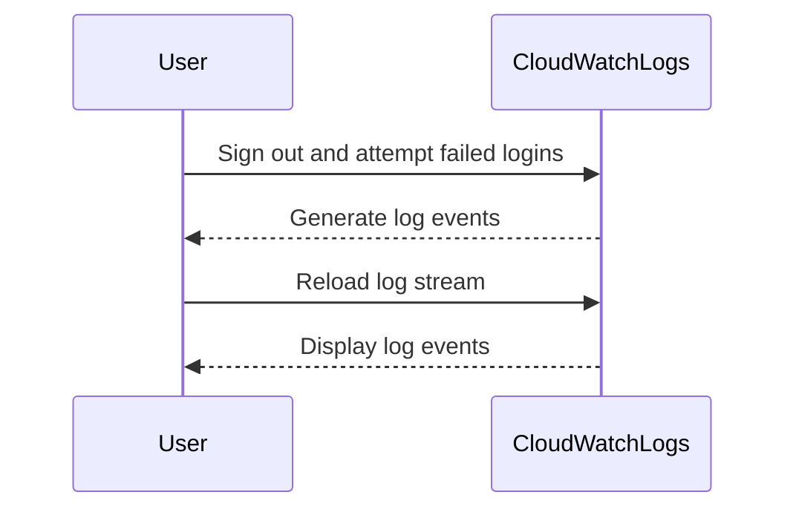

## Introduction to Logging and Monitoring for Security

Logging and monitoring are critical components of a robust DevSecOps strategy. They provide visibility into system behavior, help detect anomalies, and enable timely response to security incidents. In this section, we will delve into creating custom metric filters for failed login metrics, a crucial aspect of securing your infrastructure.

### Background Theory

#### What is Logging?
Logging is the process of recording events that occur during the operation of a system. These logs can contain information about various activities such as user actions, system errors, and security events. Logs are essential for troubleshooting, auditing, and forensic analysis.

#### What is Monitoring?
Monitoring involves continuously observing and analyzing system performance and behavior. This includes tracking key metrics, setting up alerts for abnormal behavior, and ensuring that systems remain operational and secure.

#### Why is Logging and Monitoring Important for Security?
- **Detection**: Logs and monitoring help detect unauthorized access attempts, suspicious activities, and potential security breaches.
- **Incident Response**: Detailed logs provide the necessary data to investigate and respond to security incidents effectively.
- **Compliance**: Many regulatory requirements mandate logging and monitoring to ensure compliance with industry standards.

### Creating Custom Metric Filters for Failed Login Metrics

In this section, we will walk through the process of creating a custom metric filter for failed login metrics using AWS CloudWatch Logs. This example will cover the theoretical background, practical steps, and real-world applications.

#### Step-by-Step Guide

1. **Identify the Log Stream**:
   - First, identify the log stream that contains the login events. In this case, we are looking at the log stream for the last 12 hours.

2. **Create a Filter Pattern**:
   - A filter pattern is used to search for specific events within the log stream. We will create a filter pattern to match failed login events.

3. **Sign Out and Cause Failed Logins**:
   - To test the filter, sign out and attempt several failed login attempts. This will generate the necessary log events.

4. **Reload and Check Events**:
   - After causing the failed logins, reload the log stream to check for the new events.

5. **Filter Only Console Login Events with Failure Messages**:
   - Use a filter pattern to extract only the console login events that contain failure messages.

6. **Create a Metric Filter**:
   - Once the filter pattern is defined, create a metric filter using the identified pattern.

### Detailed Example Using AWS CloudWatch Logs

#### Setting Up the Environment

To set up the environment, ensure you have an AWS account and access to CloudWatch Logs. Here’s a step-by-step guide:

1. **Navigate to CloudWatch Logs**:
   - Go to the AWS Management Console and navigate to CloudWatch Logs.

2. **Select the Log Group**:
   - Choose the log group that contains the login events.

3. **View Log Streams**:
   - Select the log stream for the last 12 hours.

#### Creating the Filter Pattern

The filter pattern is crucial for identifying failed login events. Here’s how to create it:



#### Filtering Console Login Events with Failure Messages

To filter only the console login events with failure messages, use the following filter pattern:

```mermaid
graph TD
    A[Log Stream] --> B[Filter Pattern]
    B --> C{Condition}
    C -->|Error Message = "Failed Authentication"| D[Filtered Events]
    C -->|No Match| E[Discarded Events]
```

The filter pattern in CloudWatch Logs would look like this:

```json
{
    "filterPattern": "{ $.userIdentity.type = \"IAMUser\" && $.errorCode = \"InvalidClientTokenId\" }"
}
```

This pattern matches events where the `userIdentity.type` is `IAMUser` and the `errorCode` is `InvalidClientTokenId`, indicating a failed authentication attempt.

#### Creating the Metric Filter

Once the filter pattern is defined, create a metric filter:

1. **Define the Filter Pattern**:
   - Use the filter pattern created above.

2. **Create the Metric Filter**:
   - Click on the “Create Metric Filter” button in CloudWatch Logs.

3. **Name the Filter**:
   - Provide a descriptive name for the filter, such as `FailedLoginAttempts`.

### Real-World Examples and Recent Breaches

#### Example: CVE-2021-21972

CVE-2021-21972 is a critical vulnerability in the Apache Log4j library that allows remote code execution. Proper logging and monitoring could have helped detect and mitigate this vulnerability earlier.

#### Example: SolarWinds Supply Chain Attack

The SolarWinds supply chain attack involved the compromise of software updates, leading to widespread breaches. Effective logging and monitoring could have alerted organizations to unusual activity and prevented further damage.

### Common Pitfalls and How to Avoid Them

#### Pitfall 1: Insufficient Logging

**Problem**: Not logging enough information can make it difficult to diagnose issues and detect security threats.

**Solution**: Ensure comprehensive logging of all critical events, including user actions, system errors, and security events.

#### Pitfall 2: Overloading Log Files

**Problem**: Excessive logging can lead to large log files, making it difficult to manage and analyze the data.

**Solution**: Implement log rotation and archiving to manage log file sizes effectively.

#### Pitfall 3: Lack of Centralized Logging

**Problem**: Without centralized logging, it becomes challenging to correlate events across different systems and services.

**Solution**: Use a centralized logging solution like ELK Stack (Elasticsearch, Logstash, Kibana) or Splunk to aggregate and analyze logs from multiple sources.

### How to Prevent / Defend

#### Detection

- **Real-time Alerts**: Set up real-time alerts for suspicious activities, such as multiple failed login attempts.
- **Anomaly Detection**: Use machine learning algorithms to detect anomalous behavior that may indicate a security threat.

#### Prevention

- **Strong Authentication**: Implement multi-factor authentication (MFA) to prevent unauthorized access.
- **Access Controls**: Enforce strict access controls and least privilege principles to minimize the risk of unauthorized access.

#### Secure Coding Fixes

Here’s an example of a vulnerable code snippet and its secure counterpart:

**Vulnerable Code**:
```python
def authenticate_user(username, password):
    if username == "admin" and password == "password":
        return True
    return False
```

**Secure Code**:
```python
import hashlib

def authenticate_user(username, password):
    stored_password_hash = get_stored_password_hash(username)
    input_password_hash = hashlib.sha256(password.encode()).hexdigest()
    if stored_password_hash == input_password_hash:
        return True
    return False
```

#### Configuration Hardening

Ensure that your logging and monitoring configurations are hardened against attacks:

**Example Configuration**:
```yaml
logging:
  level: INFO
  format: "%(asctime)s - %(name)s - %(levelname)s - %(message)s"
  handlers:
    - type: file
      filename: /var/log/app.log
      maxBytes: 10485760
      backupCount: 5
```

### Conclusion

Creating custom metric filters for failed login metrics is a vital part of maintaining a secure DevSecOps environment. By understanding the theoretical background, following detailed steps, and implementing best practices, you can effectively monitor and detect security threats. Regularly review and update your logging and monitoring strategies to stay ahead of emerging threats.

### Practice Labs

For hands-on practice, consider the following labs:

- **PortSwigger Web Security Academy**: Offers interactive labs to practice web application security.
- **OWASP Juice Shop**: A deliberately insecure web application for practicing security testing.
- **DVWA (Damn Vulnerable Web Application)**: A PHP/MySQL web application that is riddled with vulnerabilities for educational purposes.

These labs provide real-world scenarios to apply the concepts learned in this chapter.

---
<!-- nav -->
[[02-Introduction to Logging and Monitoring for Security Part 1|Introduction to Logging and Monitoring for Security Part 1]] | [[DevSecOps/DevSecOps Bootcamp/08-Logging & Incident Response/04-Logging & Monitoring for Security/Create Custom Metric Filter for Failed Login Metrics/00-Overview|Overview]] | [[04-Introduction to Logging and Monitoring for Security Part 3|Introduction to Logging and Monitoring for Security Part 3]]
